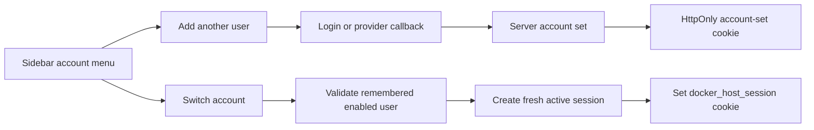

# Browser Account Switching

Browser account switching lets one browser remember multiple authenticated Host users and switch the active Host session from the sidebar account menu.

This feature switches between Host users that already exist or are provisioned by an authentication provider. It does not create additional local users and does not merge multiple external identities into one person.

## Business Logic

Different real-world accounts are represented as different Host users:

```text
personal@example.com -> host.admin
work@example.com     -> host.user
```

Only one Host user is active for a request. The selected Host session determines Host navigation, Host API permissions, gateway authorization, and the `sub`, email, display name, and Host role included in module identity tokens.

When the active account changes, the browser receives a fresh Host session for the selected user. Switching to an administrator account does not satisfy recent reauthentication; sensitive administrator actions still require the existing reauthentication flow.

## Account Set

Remembered browser accounts are stored in a server-side account set. The browser stores only the HttpOnly `docker_host_accounts` cookie. The cookie uses `SameSite=Lax`, path `/`, and the same secure-cookie rules as the active Host session cookie. The Host stores only the account-set token hash in `/data/auth/state.json`.

Each account set stores:

- account-set id;
- token hash;
- remembered user ids;
- `addedAt` and `lastUsedAt` timestamps for each remembered user;
- account-set `createdAt`, `updatedAt`, and `expiresAt` timestamps;
- optional `revokedAt` timestamp.

Raw Host session tokens and raw account-set tokens are never persisted in auth state. Account sets use the same 14-day absolute lifetime as browser sessions.

Expired or revoked account sets are ignored. Disabled users are omitted from account listings and cannot be activated.

## Auth Flow

Successful browser authentication adds the authenticated Host user to the current browser account set or creates a new account set when none exists.

The supported flows are:

- local password login;
- first administrator setup;
- administrator recovery;
- development auto-login;
- generic OIDC callback.

Browser account switching remembers existing Host users in the current browser account set so they can be selected without re-entering credentials.

OIDC login stores the resulting Host user in the browser account set after provider validation, explicit role mapping, and Host user provisioning or update.

Trusted proxy deployments do not use local browser account switching because the upstream proxy owns browser identity selection.



## Sidebar Behavior

The sidebar account menu loads remembered accounts from `GET /api/auth/accounts`.

The menu shows:

- the active account first;
- inactive remembered accounts as switch targets;
- `Add another user`, which opens `/login?mode=add-account&redirectTo=<current-path>`;
- `Log out current account`;
- `Log out all accounts`.

Switching accounts calls `POST /api/auth/accounts/switch` with the target user id. The Host validates the account-set cookie, confirms that the target user is remembered and enabled, creates a fresh session, and returns the selected account's default shell path:

- `host.admin` opens `/`;
- `host.user` opens `/apps`.

The browser navigates after a successful switch so a `host.user` account does not keep stale administrator navigation from the previous account. In compact sidebar mode, the active account avatar remains visible and opens the same account menu.

## Logout Behavior

`Log out current account` removes the active Host user from the current browser account set and revokes the active session. Other remembered accounts remain available in the same browser.

`Log out all accounts` revokes the browser account set and the active session, then clears both Host auth cookies.

The legacy `POST /api/auth/logout` endpoint revokes only the active Host session.

## API Surface

Account switching is exposed through browser-authenticated Host API endpoints:

- `GET /api/auth/accounts` returns the active user and remembered account summaries for the current browser.
- `POST /api/auth/accounts/switch` accepts `{ "userId": "..." }`, creates a fresh active session for a remembered enabled user, and returns the default shell path for that user.
- `DELETE /api/auth/accounts/{userId}` removes one remembered account from the current browser. If that account is active, the endpoint also revokes the active session and clears the session cookie.
- `DELETE /api/auth/accounts` revokes the current browser account set and active session, then clears the session and account-set cookies.

Mutating account endpoints require an authenticated browser session and the existing Host same-origin protections.

## Gateway And Shell App Hygiene

The active Host session cookie remains the only browser credential used by gateway authorization. The account-set cookie is a browser account-selection credential and is not forwarded to modules.

After switching accounts, gateway and shell App access is recalculated from the new active Host session. `host.admin` remains allowed through assigned-only module access for bootstrap and configuration. `host.user` follows `loginRequired` and assignment rules.

Gateway proxying strips:

- `docker_host_session`;
- `docker_host_accounts`;
- inbound `X-Docker-Host-*` headers;
- client-supplied forwarding headers;
- trusted proxy assertion headers.

Shell Apps run in direct-origin iframes, so Host cookies are not forwarded to the module origin. Modules receive Host identity only through Host-signed module identity tokens: gateway traffic can receive the token as `X-Docker-Host-Identity`, while shell iframe traffic receives it through the Host `postMessage` identity bridge.

The Host shell remounts an open module iframe and sends a fresh identity token when the active Host principal id or role changes. Same-user profile changes and token refreshes are delivered silently without remounting. A module that stores the bridge token in its own module-origin cookie must treat an incoming token with a different Host user identity as an immediate session replacement, then reload server-rendered views that were produced from the old module cookie.

## Audit Events

Account switching writes structured audit events for:

- account added to a browser account set;
- account switched;
- account removed from a browser account set;
- account set cleared.

Audit event details include safe identifiers and request metadata. Raw cookies, passwords, bearer tokens, OIDC tokens, and account-set tokens are not written to the audit log.
