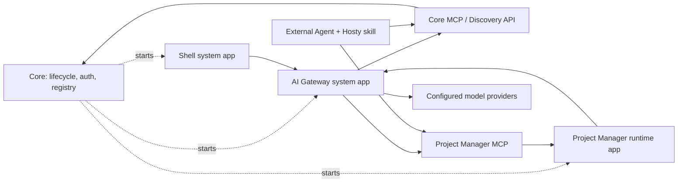

# Feature: AI Agent Bridge

Status: Draft.

## Goal

Hosty should provide an AI agent integration model that lets an authenticated user work with runtime apps and app source through chat or voice without giving the model direct credentials, unrestricted application access, or hidden Core privileges.

The feature has two related but separate product surfaces:

- Development Agent Bridge: create, inspect, and modify runtime app source through repository-backed branches, pull requests, generated channels, and validation flows.
- Runtime App Action Bridge: execute or schedule approved domain actions in already installed runtime apps, such as tracking work time, querying task history, queuing a media item, checking long-running status, or creating a backup. Runtime apps should own this action surface, usually through an app-owned MCP endpoint and optional app-owned skills/instructions, while Core remains the default identity and token authority for Hosty-aware apps.

Both surfaces should feel like one Hosty assistant to the user, but they must remain separate in architecture because they mutate different resources and carry different risks.

## Non-goals

- Do not give the model raw Core session cookies, app identity tokens, OAuth refresh tokens, service tokens, or filesystem secrets.
- Do not let the model call arbitrary app HTTP endpoints, arbitrary MCP tools, shell commands, or database writes.
- Do not use browser/UI automation as the primary integration path for Hosty-aware runtime apps.
- Do not edit live runtime app data as part of development/code-change workflows.
- Do not make Hosty Core the owner of runtime app domain actions. Runtime apps own their MCP endpoints, tools, domain permission checks, and domain behavior.
- Do not require app-owned MCP endpoints to be local-only or Shell-only. A runtime app may expose the same MCP surface on its public origin for external MCP clients with Core-issued tokens.
- Do not require every Hosty-aware runtime app to implement a separate full authorization system for MCP. Core should remain the default source of authenticated Hosty user identity and externally usable agent tokens.
- Do not optimize the first design around fully independent standalone runtime apps. Loose coupling is desirable, but Hosty-aware runtime apps are the primary target.
- Do not implement multi-agent orchestration as the first version unless single-agent evals prove it is required.
- Do not treat every installed app as agent-action-capable by default. Apps must explicitly declare the supported action surface.

## Current Behavior

Hosty currently has these relevant foundations:

- Shell is a Core-managed runtime app and calls Core APIs with an authenticated Core browser session.
- Core owns Host users, sessions, roles, app assignments, runtime lifecycle, source state, backups, audit records, and app identity issuance.
- Runtime apps authenticate browser users through Core-issued app authorization codes and app-local sessions.
- Runtime apps can read a scoped app user directory with `HOSTY_APP_SERVICE_TOKEN`.
- Runtime app manifests expose lifecycle `capabilities`, but they do not yet expose domain-level AI actions.
- The deferred Agent Bridge planning document describes a future source-editing flow based on Shell annotations, source checkouts, branches, pull requests, PR channels, and validation.

## Proposed Behavior

Hosty should introduce an agent integration model where Core remains a runtime kernel, identity authority, and interface registry. Core starts and supervises system apps and runtime apps, but it should not become the AI orchestrator or a proxy for runtime app domain actions.

Runtime apps own their own domain MCP surface. The same app-owned MCP endpoint should be usable by replaceable agent clients, including a Hosty AI Gateway system app, Codex with a Hosty skill, or another authorized MCP-capable client. Agent clients discover apps and endpoints through Core APIs or a future Core MCP surface, then call app-owned MCP endpoints directly with Core-issued tokens.

AI integration is bidirectional:

- agent-to-app: an agent client uses Core discovery/Core MCP to find an app and then calls the app-owned MCP endpoint;
- app-to-model: a Hosty-aware runtime app discovers an installed AI Gateway interface and calls that gateway directly for model output needed by app-local features, such as generating a task checklist from a task description.

Core remains responsible for:

- runtime lifecycle for system apps and user runtime apps;
- app manifest/state storage;
- auth, user identity, app assignment, and token issuance;
- interface discovery/registry;
- optional Core MCP tools for agent-readable discovery and platform control;
- audit primitives and token revocation primitives.

Core should not call Shell, AI Gateway, or app-owned MCP APIs for normal domain workflows. Arrows from Core to system apps and runtime apps are lifecycle ownership, not runtime request orchestration.

The model or agent client should receive typed tool contracts and sanitized context, not credentials. When an agent client calls a runtime app MCP endpoint, the app should receive a Core-issued delegated identity or user agent token scoped to that app and MCP surface, not Shell cookies.



## User/API Scenarios

- A user asks Shell, "Track one hour today on task ABC-123." Shell sends the text to the installed AI Gateway system app. AI Gateway uses Core MCP/discovery to find the user's Project Manager app and its MCP endpoint, then calls that app MCP endpoint with a Core-issued delegated token.
- A user asks Codex with a Hosty skill to track time. Codex uses Core MCP/discovery directly, finds the same Project Manager MCP endpoint, and performs the same operation without using Hosty AI Gateway.
- A Project Manager app needs a task checklist. It discovers the installed AI Gateway interface through Core registry/config, calls the AI Gateway API directly, and disables the checklist feature when no AI Gateway interface is available.
- A user asks, "What did I work on last Friday?" The selected agent client calls read-only project app MCP tools and returns a summarized answer with source references.
- A user asks, "Queue this item and tell me when it is ready." The selected agent client confirms the side effect, invokes the app MCP tool, and either tracks status itself or delegates durable monitoring to an installed system component when such a component exists.
- A user annotates a runtime app UI and asks for a code change. The selected development agent client uses Core discovery/source workflows to create or use a source checkout, produce a branch or pull request, and validate a PR channel before promotion.
- An administrator asks, "Create a new runtime app for this service." The selected agent client treats this as Development Agent Bridge work, not Runtime App Action Bridge work.

## Technical Design

### Development Agent Bridge

Development Agent Bridge is the source-changing layer. It should build on the existing deferred plan in `docs/planning/agent-bridge-workflow.md`.

Primary flow:

1. Shell or another UI client captures app id, route, selected runtime profile, selected channel, optional DOM target, optional screenshot reference, and user note.
2. The selected development agent client creates an agent request with authorization and audit records.
3. The agent client uses Core discovery/source APIs or Core MCP to resolve source metadata and a safe checkout.
4. The agent client creates changes in an isolated branch or pull request.
5. Hosty publishes or consumes a PR-specific channel.
6. The user validates the generated runtime channel against normal Hosty app data and lifecycle controls.
7. Promotion or merge remains a separate explicit step.

Development actions should not mutate production app data. Validation should use normal runtime update/channel plans, backups, copied data, or controlled mounts.

### Runtime App Action Bridge

Runtime App Action Bridge is the existing-app action layer. Its domain action surface should be owned by the runtime app, not by Hosty Core. The preferred portable contract is an app-owned MCP endpoint. Any authorized agent client can discover and call that MCP endpoint when the app supports Core-issued delegated or user agent tokens on its MCP endpoint. This is still a Hosty-aware app model, not a requirement to support a fully independent standalone app.

The runtime app is responsible for:

- exposing MCP tools that represent its domain actions and reads;
- describing tool schemas and tool behavior through MCP;
- resolving the Hosty user identity supplied by Core-issued tokens;
- mapping that Hosty identity to app-local principals, roles, teams, projects, or permissions;
- enforcing domain permissions for each identity and resource;
- filtering `list_tools` results by identity when appropriate;
- rejecting `call_tool` requests that are not allowed for the current user, token, resource, or app state;
- optionally shipping an app-specific skill or instruction bundle that explains how agents should use the app MCP tools.

Hosty should not require the app to duplicate every MCP tool schema in the Hosty manifest. The manifest should describe discovery and Hosty integration metadata, while concrete tool schemas come from the app-owned MCP server.

For simple Hosty-only apps, a narrower Hosty App Actions HTTP contract may still be useful later. It should be optional, not the primary assumption for portable agent integration.

When the Shell chat feature is used, Shell should send the user request to the installed `ai.gateway` interface. The AI Gateway then uses Core MCP/discovery and app-owned MCP endpoints. Hosty clients should preserve MCP semantics and avoid rewriting app-owned tool behavior.

### Manifest Interfaces And Registry

The draft should prefer explicit manifest interfaces over a vague generic "AI capability" flag. Core can derive a registry from installed app manifests and runtime state.

Examples:

- `ui`: the app has Shell-readable navigation entries and app pages.
- `mcp`: the app exposes an agent/action MCP endpoint.
- `ai.gateway`: a system app exposes a model gateway API.
- future interfaces may include notifications, scheduler, search, media index, or other replaceable platform modules.

The `ui` interface tells Shell what user-facing pages are available. The `mcp` interface tells agent clients that the app can participate in agent workflows. If an app does not declare `mcp`, agent clients should not treat it as a target for domain actions. If no installed system app declares `ai.gateway`, Shell should hide or disable built-in chat/agent features and runtime apps should disable app-to-model features.

Potential manifest shape:

```json
{
  "interfaces": {
    "mcp": [
      {
        "key": "main",
        "endpoint": "http",
        "path": "/mcp",
        "auth": ["hostyDelegatedToken", "hostyAgentToken"],
        "skills": ["./agents/project-manager.md"]
      }
    ],
    "ai.gateway": [
      {
        "key": "default",
        "endpoint": "http",
        "path": "/api/ai"
      }
    ]
  }
}
```

This draft keeps `ui` as the existing Shell integration surface, while considering whether `mcp` and `ai.gateway` should live under a new `interfaces` object or under narrower top-level sections. Core should expose the resolved interface registry to authorized clients without hardcoding module-specific behavior beyond validation and lifecycle state.

### MCP Integration

MCP should be treated as the portable app-owned agent contract for runtime app actions.

A runtime app or external service may expose MCP tools. The runtime app decides what those tools mean and what each identity can do. Agent clients decide how to use those tools after discovering them through Core registry/Core MCP and receiving appropriate Core-issued tokens.

Recommended model:

- Runtime apps may expose MCP on the same public origin as the app, such as `/mcp`.
- Runtime apps may also support local development origins or internal endpoints, but Hosty should not require MCP to be local-only.
- Core may issue user-controlled agent tokens for external MCP clients. These tokens should be scoped by user, app, MCP endpoint, tools or scopes, expiry, and optional client label.
- The selected agent client connects as an MCP client.
- The selected agent client passes a Core-issued delegated identity token to the MCP endpoint.
- The app MCP server resolves the Hosty identity and enforces domain permissions for that identity.
- The agent client records or reports tool calls according to the selected audit model.
- Shell/AI Gateway can apply user-facing approvals for calls initiated through Shell. External agent clients need a defined equivalent approval and audit policy.

This means an app can intentionally expose only a limited MCP surface to agents. The app should not expose its full internal API unless that API is safe, typed, scoped, and permissioned for agent use.

The app may expose different capabilities depending on the token:

- a Hosty delegated token for the current Shell user;
- a Core-issued Hosty agent token for an external MCP client;
- a Core-issued or administrator-issued token with broader Hosty-approved scopes;
- a read-only Hosty agent token for reporting and summarization.

### Core MCP

Core should expose an agent-readable MCP surface or equivalent discovery API. This surface should be narrow and platform-oriented. It should help agent clients discover apps, interfaces, and user context, but it should not perform app-domain work that belongs to runtime apps.

Initial Core MCP tools could include:

- `get_current_user`
- `list_apps`
- `find_apps`
- `get_app_interfaces`
- `get_app_mcp_endpoint`
- `get_system_interfaces`
- `request_delegated_token`

Administrative or development tools can be added later behind stronger authorization, such as source checkout discovery, branch/PR workflow creation, channel validation, lifecycle planning, or update review. Those tools should remain explicit and approval-gated.

### Agent Clients And AI Gateway

An agent client is any authorized component that can use Core discovery/Core MCP and app-owned MCP endpoints. Examples:

- `hosty.ai-gateway`, a Core-managed system app that Shell can call for chat/voice agent workflows;
- Codex with a Hosty skill;
- another desktop, mobile, or web assistant;
- a future hosted or local agent service.

`hosty.ai-gateway` is optional and replaceable. It can use Vercel AI SDK, OpenAI Agents SDK, direct Responses API calls, local providers, or another provider stack internally. Core should treat it like any other system runtime app: install, start, stop, update, inspect health/logs, and expose its declared interfaces. Core should not need to know its prompt logic, model routing, provider configuration, or app-domain orchestration logic.

Shell can discover an installed `ai.gateway` interface and send user chat/voice input directly to that system app. If no `ai.gateway` interface is installed and available, Shell should hide or disable the agent/chat mode. A different UI client could use the same discovery mechanism.

### Runtime App AI Gateway

Hosty-aware runtime apps may need to call an AI model for app-local features. For example, a Project Manager app may generate a checklist from a task description. That path is app-to-model, not agent-to-app.

An installed AI Gateway system app should provide a unified model gateway or broker for Hosty-aware apps:

- The AI Gateway owns provider configuration, model profiles, secrets, credentials, local endpoint URLs, and provider-specific adapters.
- Runtime apps discover the AI Gateway interface through Core registry/config and call the AI Gateway directly with Hosty-issued app identity.
- The AI Gateway can route requests to LM Studio, OpenAI-compatible servers, hosted providers, Vercel AI SDK providers, or future local model runtimes.
- Runtime apps should request capabilities or model profiles, not hard-code a specific provider. Examples: `fastText`, `structuredJson`, `longContext`, `localOnly`.
- The AI Gateway should support result limits, timeouts, streaming where needed, audit metadata, and per-app policy.
- The AI Gateway should avoid exposing provider credentials or raw provider configuration to runtime apps.

This keeps app code portable across local and hosted model providers. It also avoids configuring the same model endpoint separately in every runtime app. The first design should not require app-local fallback provider configuration; Hosty-aware apps should use the discovered AI Gateway interface when it is installed and disable app-to-model features when it is absent.

Potential API shape:

```text
POST {AI_GATEWAY_ORIGIN}/api/ai/generate
Authorization: Bearer <Hosty-issued app or delegated token>
```

The request should be provider-neutral and capability-oriented rather than a direct copy of one provider's full API. A future OpenAI-compatible passthrough may be useful for compatibility, but the stable Hosty contract should hide provider differences where practical.

### Authorization And Delegation

Shell session authorization establishes who the actor is when Shell calls an AI Gateway system app. It should not become the credential used by the agent or the app.

Core should issue signed delegated identity tokens for agent-client-to-app calls. A token should include at least:

- actor user id
- app id
- MCP endpoint or action/tool scope
- request id
- optional job id
- approved scopes
- approval id when applicable
- expiry

Runtime apps must validate the token and still enforce domain permissions. For example, the project app receives a Hosty user identity from Core, maps it to the app's internal user or member record, and then decides whether that mapped user can track time on a specific task.

For external MCP use with Hosty-aware apps, Core may provide user-created agent tokens. For example, a user may open Hosty or the Project Manager app, create a Core-issued agent token scoped to `read_tasks` and `track_time` for that installed app, and configure that token in an external MCP client such as a chatbot or coding assistant. The MCP call can go directly to the app public origin, but the app still validates the Core-issued token and resolves the Hosty user before applying app-domain permissions.

For background work, Core should store durable delegation grants instead of reusing a browser session. The actual job runner can be an AI Gateway system app, another system module, or an external authorized agent client:

- who approved the delegation
- which app/action scopes are allowed
- what resource scope applies
- expiry or revoke condition
- maximum run budget
- audit reference

### Permission Model

Each action should have a risk class. Initial classes:

- `read_only`
- `draft_only`
- `write_internal`
- `write_external`
- `communication`
- `financial`
- `destructive`
- `privileged_admin`

Default policy:

- Read-only app queries may run when the user has app access.
- Draft actions may run automatically.
- Internal writes should be approval-gated by default, then later allowlisted for low-risk repeated actions.
- External communication, financial, destructive, privileged, and identity/access actions require explicit approval and stronger policy controls.
- Unknown tools, unknown action arguments, stale approvals, and oversized tool results are denied or returned as structured errors.

For direct external MCP clients using Core-issued tokens, Core owns token issuance and coarse scopes, while the runtime app owns domain permission checks at execution time. If Core is not in the per-tool request path, fine-grained approval UX and audit must either be delegated to the app or reported back to Core through a future audit callback contract.

### Agent Client Loop

The first AI Gateway implementation should start with a single agent loop. The same conceptual loop can also be used by external agent clients such as Codex with a Hosty skill:

1. Receive user message from Shell or another client surface.
2. Resolve actor through Shell session, Core-issued token, or another approved Hosty identity flow.
3. Build context from stable system instructions, current task, app summaries, scoped MCP tool contracts, and relevant memory.
4. Ask the model for a final answer or typed tool call.
5. Validate tool arguments.
6. Evaluate client-side approvals and Core-issued token scopes.
7. Execute through the selected agent client's MCP client against Core MCP or app-owned MCP endpoints.
8. Return structured observations to the model.
9. Stop on final answer, budget exhaustion, approval pause, or failure.

Every proposed tool call must receive a structured result, including denied, timed out, invalid, or approval-required results.

### Durable Jobs And Notifications

Some requests outlive a Shell session. Core should own durable delegation grants and token revocation, but the durable job runner can be a replaceable system app or authorized agent client.

Possible long-running work:

- monitor until complete
- scheduled summary
- retryable app action
- long-running media queue or import
- development branch/PR status tracking

Jobs must store their delegation scope, budget, status, last observation, next check time, and audit references. User notification delivery can be a later feature, but the job model should leave room for it.

## Data Model / API Changes

Likely new or changed contracts:

- `app.0.1` or successor manifest extension for explicit app interfaces such as `mcp` and `ai.gateway`.
- Optional app-owned agent skill or instruction descriptor references.
- Core app record storage for resolved interface metadata and digests.
- Core MCP or equivalent discovery API for agent clients.
- AI Gateway system app manifest and runtime contract.
- Agent client request/session records owned by the selected agent client, not necessarily Core.
- Core durable delegation grant records.
- Core approval records.
- Core-issued external agent token records for app MCP access.
- AI Gateway provider and model profile configuration.
- AI Gateway request policy, per-app access rules, and audit metadata.
- Audit/reporting contracts for agent messages, tool calls, approvals, delegated app invocations, job transitions, and denied actions.
- Shell-to-AI-Gateway API for chat/voice agent messages when an AI Gateway interface is installed.
- Approval review/apply API owned by the selected agent client or system module, with Core-issued token checks where needed.
- Optional control API for diagnostics and test fixtures.
- Runtime app MCP endpoint contract and identity expectations.
- Optional Core token introspection or revalidation endpoint for app MCP servers.
- Runtime app AI Gateway interface contract for app-to-model features.
- Optional Hosty App Actions HTTP contract for simple Hosty-only integrations.

This draft does not choose whether these records live in the current JSON stores, a new Core store, or a future database.

## Edge Cases

- The user loses app assignment between planning and execution.
- The user's Host role changes while a durable job is pending.
- The runtime app MCP discovery metadata or tool schema changes after the model proposes a tool call.
- The app is stopped, unhealthy, updating, removed, or switched to a runtime profile that does not expose the MCP endpoint.
- The app denies the action because app-domain permissions differ from Host app assignment.
- The app returns too much data for model context.
- The model proposes a destructive or external action without sufficient approval.
- A retrieved task description, media title, webpage, or app response contains prompt-injection text.
- The same user request is retried and might duplicate an action such as time tracking or queue insertion.
- A background job continues after the Shell session expires.
- A connector or MCP server changes its tool schema.
- A public app MCP endpoint is reachable by external clients with previously issued Core tokens while Hosty Core is not running or not reachable for token revalidation.
- An external MCP client performs an app-authorized action that does not appear in Hosty audit because the request did not pass through Core and neither the app nor the client reported it back.
- A Core-issued agent token is valid, but the app-local mapped user has lost access to the target project, task, media library, or domain resource.
- A runtime app needs model output while the configured provider is offline, slow, incompatible, or missing a requested capability.
- A runtime app sends sensitive app data to a non-local model provider without clear policy.
- A model provider supports a feature that the stable AI Gateway contract does not expose yet.
- Development Agent Bridge and Runtime App Action Bridge are both plausible for a request; the selected agent client must route explicitly and may ask the user to confirm.
- Two installed runtime apps match a user's natural-language target, and only one exposes `mcp`.
- An app declares an `mcp` interface but its runtime endpoint is unhealthy, disabled, or not visible to the current user.
- No installed system app declares `ai.gateway`, so Shell and runtime apps must disable model-backed features cleanly.
- Core MCP exposes too much platform control to a general-purpose agent client.

## Testing Plan

Future implementation should test the old features and the new agent surface together:

- Existing Shell auth, app assignment, and app launch flows still work.
- Existing runtime app lifecycle, update, backup, restore, source, and channel plan behavior still works.
- AI Gateway and app MCP endpoints reject unauthenticated, disabled-user, expired-token, and unassigned-app requests.
- Core MCP exposes only apps and interfaces visible to the actor.
- Read-only actions cannot mutate app state.
- Write actions pause for approval when policy requires it.
- Delegated identity or action tokens expire and cannot be reused outside their scope.
- Runtime apps can deny actions through app-domain permissions.
- Runtime app MCP endpoints can filter `list_tools` and reject `call_tool` based on Hosty delegated identity.
- Runtime app MCP endpoints can support external Core-issued agent tokens without requiring Shell or the built-in Hosty assistant in the request path.
- Hosty-aware runtime apps can call the discovered AI Gateway interface for app-local model features without direct provider credentials.
- AI Gateway policy blocks provider use when the app, provider, data class, or requested capability is not allowed.
- Durable jobs stop or pause when delegation expires, app assignment is removed, or action contracts change.
- For the Shell-agent path, AI Gateway cannot expose tools outside Hosty policy and app MCP permissions.
- Development Agent Bridge does not mutate live app data.
- Audit events omit raw tokens, cookies, and secrets.

## Rollout / Migration Notes

This is a large multi-stage feature and should be rolled out incrementally:

1. Document the shared concept and boundaries.
2. Add manifest interface discovery metadata design without model execution.
3. Add one demo app MCP interface, preferably a project/task/time-tracking domain.
4. Add Core MCP or equivalent discovery API for interface-aware agent clients.
5. Add `hosty.ai-gateway` as an optional system app that declares `ai.gateway`.
6. Replace one app-local model integration, such as an LM Studio checklist generator, with discovered AI Gateway usage.
7. Build Shell-to-AI-Gateway chat flow and AI-Gateway-to-Core-MCP discovery.
8. Add approval-gated writes through AI Gateway and app-owned MCP.
9. Add external Core-issued MCP agent token documentation and validation.
10. Add durable delegation/job runner design and notifications.
11. Expand Development Agent Bridge through source checkout, PR, channel, and validation workflows.

Backward compatibility should be preserved. Apps without an `mcp` interface remain normal runtime apps and should not show app-action agent controls.

## Open Questions

- Question: Should app interfaces such as `mcp` and `ai.gateway` be added to `app.0.1` as optional extensions or wait for `app.0.2`?
  Answer: The current manifest can likely tolerate an optional draft extension only if Core validation explicitly supports it.
  Recommendation: Treat interface metadata as a draft extension first, then formalize it in the next manifest version when the contract stabilizes.

- Question: Should Hosty-aware apps use app-owned MCP, Hosty-specific HTTP action endpoints, or both?
  Answer: Both can work, but app-owned MCP is the more portable default because it can be used by Hosty's built-in assistant and by external MCP clients with Core-issued tokens.
  Recommendation: Make app-owned MCP the primary runtime action contract and keep Hosty-specific HTTP actions optional for simple or tightly integrated apps.

- Question: Can each runtime app limit what the agent can do through MCP?
  Answer: Yes. The app MCP server can filter `list_tools` and reject `call_tool` after resolving the Core-issued identity. AI Gateway or another agent client may also apply user-facing approvals before invoking the app MCP server.
  Recommendation: Let Core own Hosty identity and token issuance, let runtime apps own domain permission decisions, and let each agent client own its user interaction/approval UX.

- Question: Should app MCP endpoints be internal-only?
  Answer: No. Some apps may choose internal-only endpoints, but external MCP clients with Core-issued tokens are a valid product scenario.
  Recommendation: Support same-origin public MCP endpoints with Core-issued Hosty agent tokens for Hosty-aware apps, plus local development origins where appropriate.

- Question: Should Core trust Host app assignment as enough authorization for actions?
  Answer: No. Host app assignment says the user can access the app; it does not prove the user can perform every domain action inside that app.
  Recommendation: Core enforces Host-level access and action policy, then the runtime app enforces app-domain permissions after resolving the Core-issued identity.

- Question: Should runtime apps call model providers directly or through an AI Gateway system app?
  Answer: Hosty-aware apps should call a discovered AI Gateway interface by default. Direct provider calls duplicate configuration, expose provider details to every app, and make policy/audit harder.
  Recommendation: Add an optional `hosty.ai-gateway` system app for app-to-model features and do not require app-local direct provider configuration in the first design.

- Question: Should the AI Gateway expose a provider-native API or a Hosty API?
  Answer: A provider-native passthrough is useful for compatibility, but it leaks provider differences into apps.
  Recommendation: Start with a small provider-neutral Hosty API for common app-local tasks, then add optional compatibility shims only when needed.

- Question: Should Core expose discovery through normal HTTP APIs, MCP, or both?
  Answer: HTTP APIs are already natural for Shell and runtime apps, while MCP is more agent-legible for AI Gateway, Codex, and other agent clients.
  Recommendation: Keep the registry source of truth in Core and expose both a normal API and a narrow Core MCP facade over the same data.

- Question: Should Core know about `hosty.ai-gateway` specifically?
  Answer: Only as an installed system app and declared interface provider, not as a hardcoded module with special runtime calls.
  Recommendation: Use generic interface discovery, such as `ai.gateway`, so future system modules can follow the same pattern.

- Question: Who owns audit for direct agent-client-to-app MCP calls?
  Answer: Core can audit token issuance and revocation, but it may not see every direct MCP call unless the client or app reports it.
  Recommendation: Define an audit callback/reporting contract for app MCP servers and agent clients before allowing high-risk external actions.

- Question: How should an agent choose between multiple matching apps?
  Answer: Core can expose names, descriptions, interfaces, assignments, and health, but the final route may still be ambiguous.
  Recommendation: Agent clients should prefer apps with declared `mcp` interfaces and ask the user when more than one visible app is plausible.

- Question: How much platform control should Core MCP expose?
  Answer: Read-only discovery is low risk; lifecycle, source, PR, channel, and user-management tools are high risk.
  Recommendation: Start with read-only discovery tools and add mutation tools only behind explicit scopes, approvals, and admin authorization.

- Question: Should low-risk writes always require confirmation?
  Answer: For the first version, yes, because the trust and audit model will still be new.
  Recommendation: Start approval-gated, then add explicit allowlists for repeated low-risk actions such as time tracking under user-configured policy.

- Question: Should voice be part of the first implementation?
  Answer: Voice is a useful input mode but not a core authorization or action-execution primitive.
  Recommendation: Design the Core agent API around text messages first; add speech-to-text and text-to-speech as Shell input/output adapters later.

- Question: Should Hosty build multi-agent flows from the start?
  Answer: Not unless single-agent orchestration fails measurable evals.
  Recommendation: Start with one agent-client loop and add specialized planner/verifier/background workers only after concrete failure cases appear.

- Question: How should agent memory work?
  Answer: Chat history alone is not durable enough and raw logs are too large for context.
  Recommendation: Store durable summaries, approved preferences, job state, and app-specific references outside the prompt; retrieve only relevant scoped context per request.

- Question: How should Development Agent Bridge and Runtime App Action Bridge route ambiguous requests?
  Answer: Requests that change app behavior or UI belong to Development Agent Bridge; requests that operate existing business data belong to Runtime App Action Bridge.
  Recommendation: The selected agent client should classify the request and ask for confirmation when both routes are plausible.
