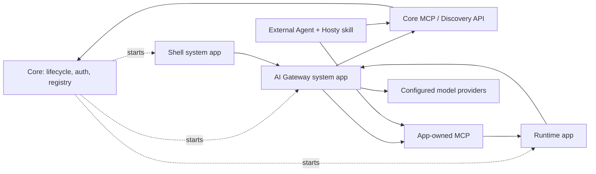

# AI Agent Bridge

Created: 2026-08-14
Updated: 2026-08-14

The umbrella for Hosty's AI integration: how an authenticated user works with runtime apps and app
source through an agent, without the model ever holding credentials, unrestricted application access,
or hidden Core privileges.

This document owns the **shared model** — component boundaries, execution profiles, the interface
registry, token mechanics, approval posture — and the decisions that produced it. It owns no
deliverables of its own. Each step of the rollout is built under its own feature and described there;
the remaining steps live in [plan.md](plan.md).

Constituent features, in the order they landed:
[access-tokens](../access-tokens/feature.md) ·
[core-mcp](../core-mcp/feature.md) ·
[app-mcp](../app-mcp/feature.md) ·
[ai-gateway](../ai-gateway/feature.md).

## Component Boundaries

Core is a runtime kernel, identity authority and interface registry. It is **not** the AI
orchestrator and **not** a proxy for app domain actions: it starts and supervises system apps and
runtime apps, but normal agent traffic does not pass through it.



Arrows from Core to system apps and runtime apps are lifecycle ownership, not request orchestration.

Core is responsible for runtime lifecycle, manifest and app-state storage, user identity, app
assignment and token issuance, interface discovery, read-only control-plane MCP tools, and audit and
revocation primitives. Everything else belongs to an app.

The `Ext` path is reachable today — the endpoints exist and were driven live over HTTP — but no stock
MCP client has connected to either endpoint yet. That gap is rollout step 6, tracked in
[plan.md](plan.md).

## Execution Profiles

A chat session runs in one of two execution profiles, and the actor's Host role selects it. Roles
never filter tools inside a shared full-access agent: an agent that has shell and filesystem access
cannot be constrained by an MCP allowlist or a prompt, so the enforcement boundary is the execution
environment plus the credentials it holds.

**Operator profile (admin only)** — shipped. A host-resident CLI agent harness supervised by the
gateway, with shell and filesystem access on the host: it reads live logs and telemetry, diagnoses
failures, edits app source through the existing dev-mode and source workflows, and calls Core MCP and
app MCP endpoints like any other client. Every write pauses for approval. See
[ai-gateway](../ai-gateway/feature.md) for the harnesses, the approval mechanics and the Shell
surface.

**User profile (non-admin)** — not built. Designed in [plan.md](plan.md) as rollout step 9: an agent
loop with no shell and no file tools, MCP-only over HTTP, every call carrying a Core-issued delegated
token for the acting user, enforced server-side by token audience plus app-domain permission checks.

The first shipped assistant is admin-only because every scenario driving the feature — realtime
diagnosis, log investigation, app fixes, update installation — is an operator scenario.

### Accepted risk

The operator profile is often justified on the grounds that it grants no privilege an administrator
does not already have over SSH. **That equivalence does not settle the matter, and the claim is
recorded here so it is not reconstructed from silence later.** The SSH comparison assumes the
administrator decides what runs; an operator session's input includes live logs and app data, which
are untrusted content that can carry instructions. The approval gate is then the only boundary, and
it rests on a human reading a proposed command rather than its consequences — behind an approved
shell call the `hosty` CLI has unconditional host-operator power over the local control channel, with
no second rubric. Restricting the assistant to administrators does not move this: the risk lives
inside the admin's own session.

Containment — a docker runtime profile by default with `localCommand` as an explicit opt-in — is the
fix. It is designed in [ai-gateway/plan.md](../ai-gateway/plan.md) and deliberately deferred: an
accepted risk, not an absent one.

## Manifest Interfaces And Registry

Apps declare what they offer through named interfaces rather than a vague generic "AI capability"
flag, and Core derives a registry from installed manifests plus runtime state.

| Interface | Meaning |
| --- | --- |
| `ui` | The app has Shell-readable navigation entries and app pages. |
| `mcp` | The app exposes an agent/action MCP endpoint. |
| `ai-gateway` | A system app exposes an assistant and a model gateway API. |

```json
"interfaces": { "mcp": [{ "key": "default", "endpoint": "api", "path": "/api/mcp" }] }
```

- An optional top-level `interfaces` map is a **draft extension under `app.0.1`**, formalized in the
  next manifest revision once the contract stabilizes. Validation is shape-only and mirrors
  `provides` — kebab names, keys unique within an interface ("default" when omitted), absolute paths
  — and unknown interface names are inert and forward-compatible.
- Declarations are normalized onto the app record at install/update and resolved to ready-to-call
  URLs from the app's endpoints, so consumers never assemble origins themselves. Core projects them
  onto `AppSummary` for Shell and onto the app-directory roster for apps
  ([app-mcp](../app-mcp/feature.md)).
- Discovery must resolve app origins from the caller's vantage point — external ingress origins for
  remote clients, internal origins for on-host clients. If an app is browser-reachable from a client
  machine, its MCP endpoint is too.
- Absence is a first-class answer. If no installed app declares `ai-gateway`, Shell hides every
  assistant surface and the platform runs with no AI at all. If an app does not declare `mcp`, agent
  clients do not treat it as a target for domain actions and it shows no agent controls.
- Core exposes the resolved registry to authorized clients without hardcoding module-specific
  behavior beyond validation and lifecycle state. It knows `hosty.ai-gateway` only as an installed
  system app declaring an interface, never as a special module.

Hosty does not require an app to restate its MCP tool schemas in the manifest: the manifest carries
discovery metadata, and concrete schemas come from the app-owned MCP server.

## Token Mechanics

The platform-wide rule, shared with [observability](../observability/feature.md):

- Admin-only **and** low-volume **and** request/response **and** already living in Core → a thin Core
  proxy twin is acceptable.
- Per-user, **or** streaming, **or** high-volume, **or** externally reachable → direct endpoint plus a
  short-lived Core-issued token validated by the receiver. All agent-bridge traffic is in this class.

Core stays the sole identity and registry authority while staying out of the request path: it injects
the token verification key into app environments the same way it injects
`OTEL_EXPORTER_OTLP_ENDPOINT`, so the control plane remains Core-owned and only data-plane bytes go
direct.

| Token | Validator | Mechanics |
| --- | --- | --- |
| CLI login and external agent tokens presented to Core | Core itself | Opaque value plus a server-side record; instant revocation, no signing. [access-tokens](../access-tokens/feature.md) |
| Browser app identity tokens presented to Core for revalidation | Core itself | Opaque app session grant plus a server-side record. |
| Delegated tokens presented to apps and system apps | The receiving app, locally | Signed ECDSA P-256, 5-minute TTL, public half injected as `HOSTY_DELEGATED_TOKEN_PUBLIC_KEY`. [ai-gateway](../ai-gateway/feature.md) |

Shell's Core session cookie never leaves the browser↔Core pair. When a UI client needs a system app it
exchanges its session for a delegated token with that app as audience and calls the app directly.
Every issue re-runs the full identity access policy, so revocation propagates within one TTL and
refresh is simply calling again.

**Core has no token scopes.** An access token carries its approver's full role, which is why Core MCP
requires an admin credential and ships read-only tools only. Every scoped-token idea in
[plan.md](plan.md) — discovery-only connector credentials, read-only monitoring, per-tool agent
scopes — depends on scopes existing first.

### Core authenticates, the app authorizes

The division is the whole point of the contract and easy to get backwards. Core signs a short-TTL
delegated token; the app validates it locally and then re-runs **its own** permission model for the
delegated actor, using the same model its HTTP routes use rather than a parallel one written for
agents. Host app assignment says a user may reach an app; it never proves they may perform a
particular domain action inside it. An MCP surface that skipped the second half would be an
unauthenticated remote API wearing a protocol.

The audience claim is what stops one app's token working on another, so validation always passes the
expected app id and fails closed when the id or the key is missing.

## Approval Posture

In v1 **every write is approval-gated, with no exceptions and no session-scoped blanket approvals.**
The trust model is new and the operator profile touches the host. Read-only tools are auto-allowed.
Per-session allowlists for repeated low-risk actions are a later iteration informed by real usage.

Operator sessions enforce this through the harness permission callback. Client-side layers are UX;
the hard limit for any client is app-side domain permissions plus Core-issued token audience — which
is why external MCP clients receive no write scopes until an audit callback contract exists, and the
external path stays read-only by scope, audited through token-issuance records and app logs.

## Access Paths

- **Local control channel.** The CLI's trusted channel (`/control/v1`, discovered via `control.json`,
  no authentication — possession of the local discovery file plus loopback access is the
  authorization) is unchanged and has two permanent roles: bootstrap, for managing Core before any
  user or token exists, and recovery, so SSH to the host keeps working when all tokens are lost or
  auth is misconfigured. It is never exposed to the network.
- **Remote.** `hosty login --host` runs a device-code flow approved in a Shell session and stores the
  credential in the OS keychain; `--token` is the headless fallback. Several hosts are held as named
  contexts (`--name`, `--list`, `--use`), and remote calls go to Core's normal web API with
  `Authorization: Bearer`. Unlike the local channel's unconditional power, the credential is bound to
  a Host user and role.

## Standing Constraints

These bound every step of the rollout, built or not:

- No raw Core session cookies, app identity tokens, OAuth refresh tokens, service tokens or
  filesystem secrets in model context. (An operator session can read secrets from disk through its
  shell access; that is admin-equivalent by design and does not license handing credentials to the
  model.)
- Non-admin sessions get no shell, no file tools, no arbitrary HTTP and no database writes — MCP with
  the acting user's delegated tokens is their entire tool surface.
- Browser and UI automation is not the integration path for Hosty-aware apps.
- Development work never edits live runtime app data.
- Core never owns runtime app domain actions; apps own their MCP endpoints, tools, permission checks
  and behavior.
- App MCP endpoints are not required to be local-only or Shell-only, and apps are never required to
  build a second authorization system to have one.
- No app is agent-action-capable by default; the surface must be declared.
- No platform-level multi-agent orchestration until single-agent orchestration fails concrete
  measurable scenarios.

## Decision Log

Recorded with dates because several of these passed over the cheaper option, and a later reader will
wonder why.

- **Risk domains, not product surfaces** (2026-08-08). Development and runtime-action work share one
  assistant chat; what separates them is the execution profile, never a tool filter inside one shared
  full-access agent.
- **The assistant lives outside Core** (2026-08-08). Core stays registry, identity, token issuance
  and lifecycle; the gateway owns sessions, transcripts, approvals and harness supervision. This also
  keeps the assistant optional and removable like any other system app.
- **Core MCP is embedded in Core** (2026-07-11), a route over registry data Core already owns rather
  than a separate service, which would only add runtime cost and a second source of truth. The same
  placement applies to apps: an app MCP endpoint is a route on the app's own origin.
- **Core MCP is control-plane only** (2026-07-11). First batch is read-only discovery plus
  admin-scoped read-only observability; no mutation tools, because a mutation reachable by any
  credential-holding client would bypass the harness approval gate entirely.
- **App-owned MCP is the only v1 action contract** (2026-08-08) — stronger than the original
  recommendation. An optional Hosty HTTP action contract is not designed or built until a concrete
  app asks for it.
- **Public app MCP endpoints are legitimate** (2026-08-08). Same-origin `/mcp` with Core-issued
  tokens; external MCP clients are a first-class permanent scenario, not a bootstrap phase.
- **Apps may limit what agents can do** (2026-08-08). An app filters `tools/list` and rejects
  `tools/call` after resolving the Core-issued identity; agent clients own their own approval UX.
- **Interfaces ship as a draft extension** (2026-08-08) under `app.0.1` with explicit Core validation,
  formalized in the next manifest revision once stable.
- **Generic interface discovery only** (2026-08-08). Core knows no module by name.
- **Both HTTP and MCP for discovery** (2026-07-11), one registry behind them.
- **Every write is approval-gated in v1** (2026-08-08), with allowlists deferred to a second
  iteration.
- **External clients get no write scopes** (2026-08-08) until an audit callback/reporting contract
  exists.
- **Ambiguous app targets are not a platform mechanism** (2026-08-08). The rule — prefer apps
  declaring `mcp`, ask the user when several are plausible — lives in the Hosty skill.
- **No voice in the first implementation** (2026-08-08). The session API is text-first; speech
  adapters arrive later in Shell and nothing in the design blocks them.
- **Hosty-level agent memory is deferred** (2026-08-08). The operator profile uses the harness's own
  memory; durable memory is designed together with the user profile.
- **Harness credentials are the harness's own** (2026-08-08). Hosty never proxies vendor credentials.
  Correction, found during implementation: the Claude Agent SDK does not read an interactive
  `claude login`, so the gateway stores an operator-entered environment credential as an ordinary app
  secret — "never in Core config, never proxied" rather than "never stored".
- **Transcripts live in the gateway's data directory** (2026-08-08) with an explicit retention
  setting; Core audit records session lifecycle and approved actions only, never transcript content.
- **Isolated validation stays out of scope** (2026-08-08). After the execution-profile decision it
  blocks only non-interactive one-shot jobs; an administrator validates interactively through
  existing dev-mode workflows.
- **Development requests from non-admins are declined** (2026-08-08) and pointed at an administrator;
  the user profile has no development surface at all.

## Testing Expectations

Each constituent feature carries its own coverage; the expectations here are the cross-cutting
invariants that no single one of them owns.

- Existing Shell auth, app assignment and app launch still work, as do runtime app lifecycle, update,
  backup, restore, source and feed selection — the agent surface is additive.
- Core MCP exposes only apps and interfaces visible to the actor, and refuses anonymous, non-admin and
  invalid-bearer callers in all three shapes.
- Delegated tokens expire and cannot be reused outside their audience; an app validates locally and
  still refuses on its own domain permissions.
- App MCP endpoints filter `tools/list` and reject `tools/call` per delegated identity, and accept
  external Core-issued credentials without Shell or the assistant in the request path.
- An authorization change is never verified by refusal alone: an endpoint that rejects everything is
  indistinguishable from a working gate. Confirm that the allowed case still performs the action —
  the audience check was verified this way, with a correctly signed token for a *different* app
  refused moments after an identically shaped one succeeded.
- Read-only tools cannot mutate app state; writes pause for approval where policy requires it.
- Audit events omit raw tokens, cookies and secrets.
- Apps without an `mcp` interface show no agent controls anywhere.
