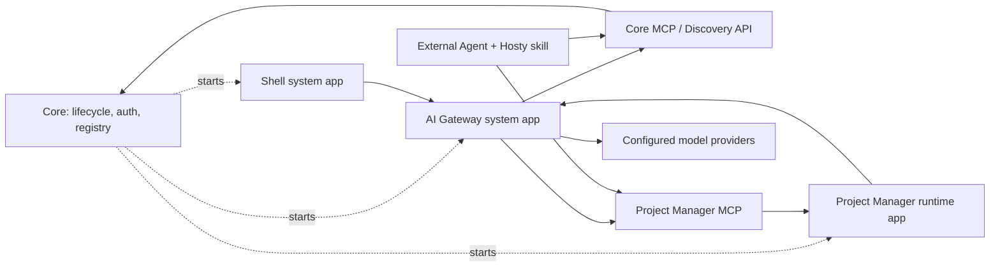

# AI Agent Bridge

Status: Draft
Created: 2026-06-09
Updated: 2026-08-08

Key decisions were recorded on 2026-07-11 and 2026-08-08 and are marked "Decided" below.

## Goal

Hosty should provide an AI agent integration model that lets an authenticated user work with runtime apps and app source through chat or voice without giving the model direct credentials, unrestricted application access, or hidden Core privileges.

The feature covers two related work domains:

- Development Agent Bridge: create, inspect, and modify runtime app source through repository-backed branches, pull requests, and a separately designed isolated-validation flow.
- Runtime App Action Bridge: execute or schedule approved domain actions in already installed runtime apps, such as tracking work time, querying task history, queuing a media item, checking long-running status, or creating a backup. Runtime apps should own this action surface, usually through an app-owned MCP endpoint and optional app-owned skills/instructions, while Core remains the default identity and token authority for Hosty-aware apps.

Decided (2026-08-08): these are risk domains, not separate product surfaces. The product surface is one Hosty assistant chat. What separates the domains architecturally is the execution profile of a chat session (see Execution Profiles below): the actor's role selects the environment the agent runs in, and that environment — together with the credentials it holds — is the enforcement boundary, never a tool filter inside one shared full-access agent.

## Non-goals

- Do not place raw Core session cookies, app identity tokens, OAuth refresh tokens, service tokens, or filesystem secrets in model context. (An operator-profile session could read secrets from disk through its shell access; that is admin-equivalent by design and does not license handing credentials to the model.)
- Do not let non-admin sessions call arbitrary app HTTP endpoints, arbitrary MCP tools, shell commands, or database writes — the user profile's only tool surface is MCP with the acting user's delegated tokens. Shell and filesystem access exist only in the admin-only operator profile.
- Do not use browser/UI automation as the primary integration path for Hosty-aware runtime apps.
- Do not edit live runtime app data as part of development/code-change workflows.
- Do not make Hosty Core the owner of runtime app domain actions. Runtime apps own their MCP endpoints, tools, domain permission checks, and domain behavior.
- Do not require app-owned MCP endpoints to be local-only or Shell-only. A runtime app may expose the same MCP surface on its public origin for external MCP clients with Core-issued tokens.
- Do not require every Hosty-aware runtime app to implement a separate full authorization system for MCP. Core should remain the default source of authenticated Hosty user identity and externally usable agent tokens.
- Do not optimize the first design around fully independent standalone runtime apps. Loose coupling is desirable, but Hosty-aware runtime apps are the primary target.
- Do not implement multi-agent orchestration as the first version unless single-agent evals prove it is required.
- Do not treat every installed app as agent-action-capable by default. Apps must explicitly declare the supported action surface.

## Current Behavior

Hosty currently has these relevant foundations:

- Shell is a Core-managed runtime app and calls Core APIs with an authenticated Core browser session.
- Core owns Host users, sessions, roles, app assignments, runtime lifecycle, source state, backups, audit records, and app identity issuance.
- Runtime apps authenticate browser users through Core-issued app authorization codes and app-local sessions.
- Runtime apps can read a scoped app user directory with `HOSTY_APP_SERVICE_TOKEN`.
- Runtime app manifests expose lifecycle `capabilities`, but they do not yet expose domain-level AI actions.
- The deferred Agent Bridge idea describes a future source-editing flow based on Shell annotations, source checkouts, branches, pull requests, and isolated validation. The isolation mechanism is not implemented or selected.

## Proposed Behavior

Hosty should introduce an agent integration model where Core remains a runtime kernel, identity authority, and interface registry. Core starts and supervises system apps and runtime apps, but it should not become the AI orchestrator or a proxy for runtime app domain actions.

Decided (2026-08-08): the assistant itself — session API, chat state, harness supervision — lives in the `hosty.ai-gateway` system app, not in Core. Shell renders the assistant UI contextually (a chat panel plus per-page entry points) wherever it is useful, gated on discovery of the installed `ai-gateway` interface, and calls the gateway directly with short-lived Core-issued delegated tokens. A system app therefore does not force a separate web UI, and Core placement is not needed for contextual UI. When no `ai-gateway` interface is installed, Shell hides all assistant UI and the platform runs without any AI surface.

Runtime apps own their own domain MCP surface. The same app-owned MCP endpoint should be usable by replaceable agent clients, including a Hosty AI Gateway system app, Codex with a Hosty skill, or another authorized MCP-capable client. Agent clients discover apps and endpoints through Core APIs or a future Core MCP surface, then call app-owned MCP endpoints directly with Core-issued tokens.

AI integration is bidirectional:

- agent-to-app: an agent client uses Core discovery/Core MCP to find an app and then calls the app-owned MCP endpoint;
- app-to-model: a Hosty-aware runtime app discovers an installed AI Gateway interface and calls that gateway directly for model output needed by app-local features, such as generating a task checklist from a task description.

Core remains responsible for:

- runtime lifecycle for system apps and user runtime apps;
- app manifest/state storage;
- auth, user identity, app assignment, and token issuance;
- interface discovery/registry;
- optional Core MCP tools for agent-readable discovery and platform control;
- audit primitives and token revocation primitives.

Core should not call Shell, AI Gateway, or app-owned MCP APIs for normal domain workflows. Arrows from Core to system apps and runtime apps are lifecycle ownership, not runtime request orchestration.

The model or agent client should receive typed tool contracts and sanitized context, not credentials. When an agent client calls a runtime app MCP endpoint, the app should receive a Core-issued delegated identity or user agent token scoped to that app and MCP surface, not Shell cookies.



## User/API Scenarios

- A user asks Shell, "Track one hour today on task ABC-123." Shell sends the text to the installed AI Gateway system app. AI Gateway uses Core MCP/discovery to find the user's Project Manager app and its MCP endpoint, then calls that app MCP endpoint with a Core-issued delegated token.
- A user asks Codex with a Hosty skill to track time. Codex uses Core MCP/discovery directly, finds the same Project Manager MCP endpoint, and performs the same operation without using Hosty AI Gateway.
- A Project Manager app needs a task checklist. It discovers the installed AI Gateway interface through Core registry/config, calls the AI Gateway API directly, and disables the checklist feature when no AI Gateway interface is available.
- A user asks, "What did I work on last Friday?" The selected agent client calls read-only project app MCP tools and returns a summarized answer with source references.
- A user asks, "Queue this item and tell me when it is ready." The selected agent client confirms the side effect, invokes the app MCP tool, and either tracks status itself or delegates durable monitoring to an installed system component when such a component exists.
- A user annotates a runtime app UI and asks for a code change. The selected development agent client uses Core discovery/source workflows to create or use a source checkout and produce a branch or pull request. Validation requires a future isolated environment and is not modeled as a runtime app feed.
- An administrator asks, "Create a new runtime app for this service." The selected agent client treats this as Development Agent Bridge work, not Runtime App Action Bridge work.
- An administrator opens an app's page in Shell and asks, "This app has been failing since last night — investigate." Shell opens an operator chat session with page context (app id, route). The host-resident operator agent reads live logs and telemetry, inspects the app checkout, and proposes a fix; file edits and lifecycle actions pause for approval.
- An administrator on the apps page asks, "Install the pending updates." The operator session plans the updates through Core APIs/MCP and applies them after approval.

## Technical Design

### Execution Profiles

Decided (2026-08-08). A chat session runs in one of two execution profiles, and the actor's Host role selects the profile. Roles never filter tools inside a shared full-access agent: an agent that has shell and filesystem access cannot be constrained by an MCP allowlist or a prompt, so the enforcement boundary is the execution environment plus the credentials it holds.

- **Operator profile (admin only).** A host-resident CLI agent harness (Claude Code CLI or an equivalent) supervised by the gateway. It has shell and filesystem access on the host: it reads live logs and telemetry, diagnoses failures, edits app source through the existing dev-mode and source workflows, and calls Core MCP and app MCP endpoints like any other client. This grants no privilege an administrator does not already have over SSH — that equivalence is the justification for the profile, not a mitigation to be improved later. Live logs and app data are untrusted model input, so operator sessions still approval-gate writes through the harness permission callback, exactly as an administrator running Claude Code by hand would.
- **User profile (non-admin; deferred).** An agent loop with no shell and no file tools — MCP-only over HTTP, where every tool call carries a Core-issued delegated token for the acting user. Enforcement is server-side: token scopes plus app-domain permission checks (the token-not-proxy rule). A fully prompt-injected session still cannot exceed what the user could do personally. Optional hardening when this profile is built: run the loop in a container with no host mounts and network access limited to Core and app MCP origins — machinery Hosty already has.

The first shipped assistant is admin-only. Every scenario driving the feature today — realtime diagnosis, log investigation, app fixes, update installation — is an operator scenario; the user profile arrives later on the same chat surface and session API. The operator milestone is extracted to its own feature: [ai-gateway](../ai-gateway/feature.md).

### Development Agent Bridge

Development Agent Bridge is the source-changing layer. It should build on the existing deferred plan in [Agent Bridge Workflow](../../ideas/agent-bridge-workflow.md).

Decided (2026-08-08): in the operator profile this work is interactive — the admin's host-resident session edits source directly through existing dev-mode and source workflows, with approval-gated writes, and the isolated-validation flow below is not a prerequisite for it. The sandboxed one-shot job model (isolated worktree, draft-only PR output) remains the contract for non-interactive runs and any future lower-trust automation.

Primary flow:

1. Shell or another UI client captures app id, route, selected runtime profile, followed feed, optional DOM target, optional screenshot reference, and user note.
2. The selected development agent client creates an agent request with authorization and audit records.
3. The agent client uses Core discovery/source APIs or Core MCP to resolve source metadata and a safe checkout.
4. The agent client creates changes in an isolated branch or pull request.
5. A separately designed validation service prepares a disposable environment without changing the installed app's feed or lifecycle state.
6. The user reviews validation results produced with synthetic, copied, or otherwise isolated data.
7. Promotion or merge remains a separate explicit step.

Development actions should not mutate production app data or repoint the installed app's feed. The exact disposable-runtime and data-isolation contract remains an open question and must be resolved before this surface is implemented.

### Runtime App Action Bridge

Runtime App Action Bridge is the existing-app action layer. Its domain action surface should be owned by the runtime app, not by Hosty Core. The preferred portable contract is an app-owned MCP endpoint. Any authorized agent client can discover and call that MCP endpoint when the app supports Core-issued delegated or user agent tokens on its MCP endpoint. This is still a Hosty-aware app model, not a requirement to support a fully independent standalone app.

The runtime app is responsible for:

- exposing MCP tools that represent its domain actions and reads;
- describing tool schemas and tool behavior through MCP;
- resolving the Hosty user identity supplied by Core-issued tokens;
- mapping that Hosty identity to app-local principals, roles, teams, projects, or permissions;
- enforcing domain permissions for each identity and resource;
- filtering `list_tools` results by identity when appropriate;
- rejecting `call_tool` requests that are not allowed for the current user, token, resource, or app state;
- optionally shipping an app-specific skill or instruction bundle that explains how agents should use the app MCP tools.

Hosty should not require the app to duplicate every MCP tool schema in the Hosty manifest. The manifest should describe discovery and Hosty integration metadata, while concrete tool schemas come from the app-owned MCP server.

For simple Hosty-only apps, a narrower Hosty App Actions HTTP contract may still be useful later. It should be optional, not the primary assumption for portable agent integration.

When the Shell chat feature is used, Shell should send the user request to the installed `ai-gateway` interface. The AI Gateway then uses Core MCP/discovery and app-owned MCP endpoints. Hosty clients should preserve MCP semantics and avoid rewriting app-owned tool behavior.

### Manifest Interfaces And Registry

The draft should prefer explicit manifest interfaces over a vague generic "AI capability" flag. Core can derive a registry from installed app manifests and runtime state.

Examples:

- `ui`: the app has Shell-readable navigation entries and app pages.
- `mcp`: the app exposes an agent/action MCP endpoint.
- `ai-gateway`: a system app exposes a model gateway API.
- future interfaces may include notifications, scheduler, search, media index, or other replaceable platform modules.

The `ui` interface tells Shell what user-facing pages are available. The `mcp` interface tells agent clients that the app can participate in agent workflows. If an app does not declare `mcp`, agent clients should not treat it as a target for domain actions. If no installed system app declares `ai-gateway`, Shell should hide or disable built-in chat/agent features and runtime apps should disable app-to-model features.

Potential manifest shape:

```json
{
  "interfaces": {
    "mcp": [
      {
        "key": "main",
        "endpoint": "http",
        "path": "/mcp",
        "auth": ["hostyDelegatedToken", "hostyAgentToken"],
        "skills": ["./agents/project-manager.md"]
      }
    ],
    "ai-gateway": [
      {
        "key": "default",
        "endpoint": "http",
        "path": "/api/ai"
      }
    ]
  }
}
```

This draft keeps `ui` as the existing Shell integration surface, while considering whether `mcp` and `ai-gateway` should live under a new `interfaces` object or under narrower top-level sections. Core should expose the resolved interface registry to authorized clients without hardcoding module-specific behavior beyond validation and lifecycle state.

### MCP Integration

MCP should be treated as the portable app-owned agent contract for runtime app actions.

A runtime app or external service may expose MCP tools. The runtime app decides what those tools mean and what each identity can do. Agent clients decide how to use those tools after discovering them through Core registry/Core MCP and receiving appropriate Core-issued tokens.

Recommended model:

- Runtime apps may expose MCP on the same public origin as the app, such as `/mcp`.
- Runtime apps may also support local development origins or internal endpoints, but Hosty should not require MCP to be local-only.
- Core may issue user-controlled agent tokens for external MCP clients. These tokens should be scoped by user, app, MCP endpoint, tools or scopes, expiry, and optional client label.
- The selected agent client connects as an MCP client.
- The selected agent client passes a Core-issued delegated identity token to the MCP endpoint.
- The app MCP server resolves the Hosty identity and enforces domain permissions for that identity.
- The agent client records or reports tool calls according to the selected audit model.
- Shell/AI Gateway can apply user-facing approvals for calls initiated through Shell. External agent clients need a defined equivalent approval and audit policy.

This means an app can intentionally expose only a limited MCP surface to agents. The app should not expose its full internal API unless that API is safe, typed, scoped, and permissioned for agent use.

The app may expose different capabilities depending on the token:

- a Hosty delegated token for the current Shell user;
- a Core-issued Hosty agent token for an external MCP client;
- a Core-issued or administrator-issued token with broader Hosty-approved scopes;
- a read-only Hosty agent token for reporting and summarization.

### Core MCP

Decided (2026-07-11): Core MCP is embedded in Core — an additional HTTP route (for example `/mcp`, Streamable HTTP) over the registry and identity data Core already owns, not a separate system app or process. A separate MCP service would only add runtime cost and a second source of truth. The same placement applies to apps: an app MCP endpoint is a route on the app's own origin.

Core MCP stays control-plane only. It should help agent clients discover apps, interfaces, and user context, but it must not perform or proxy app-domain work that belongs to runtime apps.

Initial Core MCP tools could include:

- `get_current_user`
- `list_apps`
- `find_apps`
- `get_app_interfaces`
- `get_app_mcp_endpoint`
- `get_system_interfaces`
- `request_delegated_token`

Discovery responses must resolve app MCP origins from the caller's vantage point: external ingress/host-published origins for remote clients, internal origins for on-host clients — the same resolution browser login already performs. If an app is browser-reachable from a client machine, its `/mcp` must be reachable too.

Read-only observability tools (`query_logs`, `get_trace`, health surfaced in `list_apps`) are a good early addition behind admin-scoped tokens: they enable the diagnostic-agent scenario (investigate an unhealthy host from chat, zero approvals) before any write surface exists. The telemetry backend system app ([observability](../observability/feature.md)) can declare its own `mcp` interface and own those query tools like any other app — the connector aggregates it automatically.

Administrative or development tools can be added later behind stronger authorization, such as source checkout discovery, branch/PR workflow creation, isolated-validation coordination, lifecycle planning, or update review. Those tools should remain explicit and approval-gated.

Implementation note: Core is Native AOT. Verify the MCP C# SDK (`ModelContextProtocol`) is AOT/trimming-clean before adopting it; if it is not, the required surface (`initialize`, `tools/list`, `tools/call`, a handful of read-only tools) is small enough to hand-roll as JSON-RPC on the existing source-generated System.Text.Json setup with no new dependency.

### Agent Clients And AI Gateway

An agent client is any authorized component that can use Core discovery/Core MCP and app-owned MCP endpoints. Examples:

- `hosty.ai-gateway`, a Core-managed system app that Shell can call for chat/voice agent workflows;
- Codex with a Hosty skill;
- another desktop, mobile, or web assistant;
- a future hosted or local agent service.

`hosty.ai-gateway` is optional and replaceable. It can use Vercel AI SDK, OpenAI Agents SDK, direct Responses API calls, local providers, or another provider stack internally. Core should treat it like any other system runtime app: install, start, stop, update, inspect health/logs, and expose its declared interfaces. Core should not need to know its prompt logic, model routing, provider configuration, or app-domain orchestration logic.

Shell can discover an installed `ai-gateway` interface and send user chat/voice input directly to that system app. If no `ai-gateway` interface is installed and available, Shell should hide or disable the agent/chat mode. A different UI client could use the same discovery mechanism.

Decided (2026-07-11): `hosty.ai-gateway` is a separate system app and is deferred — none of the first milestones need it. The platform contract (manifest interfaces, app-owned MCP, embedded Core MCP, Core-issued tokens) is validated first with stock external agent clients (Claude Code / Codex plus a Hosty skill), and the external-client path stays a first-class scenario permanently, not just a bootstrap phase.

Decided (2026-08-08): the placement question is settled — the assistant stays out of Core. Core remains registry, identity, token issuance, and lifecycle; the gateway owns sessions, transcripts, approvals, and harness supervision. The agent-loop capability is no longer deferred: it is the operator-profile milestone (admin-only assistant in Shell), extracted to its own feature ([ai-gateway](../ai-gateway/feature.md)), while the `/api/ai/generate` broker capability stays deferred. Because operator sessions supervise host-resident CLI harnesses, the gateway runs with a localCommand runtime profile rather than a container. Which harness CLIs exist on the host, whose accounts and API keys they use, and which model providers are configured is gateway app config, not Core config. This also keeps the assistant optional and removable, like any other system app.

The gateway has two independent capabilities behind one interface, and only the first needs an agent harness:

- Agent loop (Shell chat and actions): built on a replaceable headless harness behind an internal adapter (start/stream/approve/resume/cancel), with pinned harness versions. The adapter serves both execution profiles: operator sessions drive an installed CLI harness with full host tools, user sessions run MCP-only. The Claude Agent SDK (or the Claude Code CLI in headless streaming mode) is the preferred first adapter because its permission callback (`canUseTool`) can pause a proposed tool call for a Shell-side approval; `codex exec` is headless-first and cannot pause per call, which fits sandboxed one-shot development jobs (draft-only PR output) but not approval-gated interactive sessions. The user-profile agent gets no shell or file tools — MCP only — which removes most prompt-injection reach by construction.
- `/api/ai/generate` (app-to-model broker): a plain capability-routed provider call — no harness involved.

Development Agent Bridge runs are one-shot headless jobs (`codex exec` or `claude -p`) in an isolated checkout/worktree; the safety boundary is the sandbox plus the fact that output is a branch/PR, never a merge or live app data.

### Hosty MCP Connector

Decided (2026-07-11). MCP clients (Claude Code, Claude Desktop, Codex) fix their MCP server list at session start; they cannot attach a newly discovered server mid-session, so static per-app client configuration cannot follow a dynamic app fleet. The answer is a client-side aggregator: `hosty mcp`, a stdio MCP server embedded in the existing `hosty` CLI and spawned by the agent client on the user's machine. It is not a hosted service and adds nothing to the host runtime. While only one or two apps expose MCP, static endpoint entries in the client config are enough and the connector is not required yet.

The user configures two things once — the connector entry and a login:

```jsonc
// Claude Code / Claude Desktop; Codex uses the same command in config.toml
{ "mcpServers": { "hosty": { "command": "hosty", "args": ["mcp"] } } }
```

Everything else is automatic. Session flow:

1. Spawn (stdio); read the host URL and credential from CLI context config/keychain.
2. Discovery: Core registry `list_apps`, filtered to `mcp` interfaces visible to the actor and running/healthy.
3. Parallel `tools/list` fan-out to each app `/mcp` with a per-app timeout; an unreachable app is omitted, not fatal.
4. Re-export each tool namespaced as `<appKey>__<tool>`, passing schemas and MCP tool annotations (`readOnlyHint`, `destructiveHint`) through unchanged — client-side permission policy keys off them.
5. Poll the registry (~30–60 s, a cheap control-plane call) and emit `notifications/tools/list_changed` when the app set changes; clients that ignore the notification see the new set next session.
6. On call: refresh the app's short-TTL Core-issued delegated token if needed, invoke the app `/mcp` directly, and return the result. A stopped app yields a structured `app_stopped` error for that call only; the connector session and the remaining apps keep working.

If apps × tools exceeds a threshold (roughly 60–80 exported tools), the connector degrades to a generic surface (`list_app_tools` / `call_app_tool`) to avoid flooding client context; the threshold and a per-app allowlist live in connector config. Build order: generic mode → namespaced re-export → `notifications/tools/list_changed` → remote login flow.

The connector's login credential authenticates to Core only (audience Core); per-app delegated tokens are fetched per session. Neither ever appears in model context. The connector's token needs only `discovery` and `request_delegated_token` scopes — never operator rights.

Topologies — the connector runs where the agent client runs:

1. Everything on one machine: stdio plus the trusted local control channel; no login needed.
2. Agent client and CLI on a user machine, Core on a server (the primary remote scenario): `hosty login --host` once; requires discovery to return external app origins and TLS on token-carrying endpoints.
3. CLI only on the server: `"command": "ssh", "args": ["user@server", "hosty", "mcp"]` — MCP stdio over SSH, zero new code, internal origins, owner identity via the local channel.
4. No CLI at all (claude.ai web or mobile): needs a remote HTTP MCP endpoint with OAuth — a future `mcp-hub` system app hosting the same aggregator logic. Explicitly deferred; Core never hosts it.

Multi-environment: CLI contexts (`local`, `prod`, ...) map to one MCP server entry per context (`hosty-local`, `hosty-prod` via `hosty mcp --context X`) rather than one connector with an environment argument. The environment is then explicit in every tool name, client permission policy can differ per server (for example prod read-only auto-allowed, prod writes always ask), token strength can differ per context, and failures stay isolated.

Packaging: a Claude Code plugin (marketplace repo) bundles the connector `.mcp.json`, a Hosty skill (how to discover apps, which tools need confirmation), and PreToolUse hooks implementing allow-read-only / ask-writes / deny-destructive from tool annotations. Codex gets the same connector via `config.toml` plus the skill; it has no hooks, so its guardrail is token scopes — which is the real enforcement boundary for every client anyway: client-side layers are UX, while app-side domain permissions and Core-issued token scopes are the hard limit.

### Runtime App AI Gateway

Hosty-aware runtime apps may need to call an AI model for app-local features. For example, a Project Manager app may generate a checklist from a task description. That path is app-to-model, not agent-to-app.

An installed AI Gateway system app should provide a unified model gateway or broker for Hosty-aware apps:

- The AI Gateway owns provider configuration, model profiles, secrets, credentials, local endpoint URLs, and provider-specific adapters.
- Runtime apps discover the AI Gateway interface through Core registry/config and call the AI Gateway directly with Hosty-issued app identity.
- The AI Gateway can route requests to LM Studio, OpenAI-compatible servers, hosted providers, Vercel AI SDK providers, or future local model runtimes.
- Runtime apps should request capabilities or model profiles, not hard-code a specific provider. Examples: `fastText`, `structuredJson`, `longContext`, `localOnly`.
- The AI Gateway should support result limits, timeouts, streaming where needed, audit metadata, and per-app policy.
- The AI Gateway should avoid exposing provider credentials or raw provider configuration to runtime apps.

This keeps app code portable across local and hosted model providers. It also avoids configuring the same model endpoint separately in every runtime app. The first design should not require app-local fallback provider configuration; Hosty-aware apps should use the discovered AI Gateway interface when it is installed and disable app-to-model features when it is absent.

Potential API shape:

```text
POST {AI_GATEWAY_ORIGIN}/api/ai/generate
Authorization: Bearer <Hosty-issued app or delegated token>
```

The request should be provider-neutral and capability-oriented rather than a direct copy of one provider's full API. A future OpenAI-compatible passthrough may be useful for compatibility, but the stable Hosty contract should hide provider differences where practical.

### Authorization And Delegation

Shell session authorization establishes who the actor is when Shell calls an AI Gateway system app. It should not become the credential used by the agent or the app.

Decided (2026-07-11) — when Core proxies and when tokens are used. The platform-wide rule, shared with [observability](../observability/feature.md):

- Admin-only + low-volume + request/response + a surface that already lives in Core → a thin Core proxy twin is acceptable (telemetry reads).
- Per-user, or streaming, or high-volume, or externally reachable → direct endpoint + short-lived Core-issued token validated by the receiver. All agent-bridge traffic (Shell → ai-gateway chat, app → gateway generate, agent clients → app MCP) is in this class. Core stays the sole identity and registry authority but is out of the request path; it injects the token verification key into system apps the same way it injects `OTEL_EXPORTER_OTLP_ENDPOINT`, so the control plane remains fully Core-owned while only data-plane bytes go direct.

Two token mechanics, one management UI (a Shell "Access tokens" page with label, scopes, expiry, last-used, revoke):

| Token | Validator | Mechanics |
| --- | --- | --- |
| CLI login and external agent tokens presented to Core | Core itself | opaque value + server-side record; instant revocation; no signing needed |
| Browser app identity tokens presented to Core for revalidation | Core itself | opaque app session grant + server-side record (2026-07-13); design: [auth-session-lifecycle.md](../../ideas/auth-session-lifecycle.md) |
| Delegated tokens presented to apps and system apps | the receiving app, locally | signed, short TTL, verification key injected by Core; optional Core introspection for high-risk calls |

Shell's Core session cookie never leaves the browser↔Core pair. When Shell (or any UI client) needs a system app, it exchanges its session for a short-lived delegated token (audience = that app) and calls the app directly — the service-call analogue of the existing app authorization code flow. (Correction 2026-08-08: the earlier assumption that AppIdentityService's signing infrastructure could issue these was stale — that service moved to opaque hashed grants with online revalidation. Delegated tokens are issued by the dedicated `DelegatedTokenService` — ECDSA P-256, durable key, public half injected into app environments as `HOSTY_DELEGATED_TOKEN_PUBLIC_KEY` — shipped with [ai-gateway](../ai-gateway/feature.md) phase 1.)

Core should issue signed delegated identity tokens for agent-client-to-app calls. A token should include at least:

- actor user id
- app id
- MCP endpoint or action/tool scope
- request id
- optional job id
- approved scopes
- approval id when applicable
- expiry

Runtime apps must validate the token and still enforce domain permissions. For example, the project app receives a Hosty user identity from Core, maps it to the app's internal user or member record, and then decides whether that mapped user can track time on a specific task.

For external MCP use with Hosty-aware apps, Core may provide user-created agent tokens. For example, a user may open Hosty or the Project Manager app, create a Core-issued agent token scoped to `read_tasks` and `track_time` for that installed app, and configure that token in an external MCP client such as a chatbot or coding assistant. The MCP call can go directly to the app public origin, but the app still validates the Core-issued token and resolves the Hosty user before applying app-domain permissions.

For background work, Core should store durable delegation grants instead of reusing a browser session. The actual job runner can be an AI Gateway system app, another system module, or an external authorized agent client:

- who approved the delegation
- which app/action scopes are allowed
- what resource scope applies
- expiry or revoke condition
- maximum run budget
- audit reference

### Remote CLI Access And Contexts

Decided (2026-07-11). The CLI's trusted local control channel (`control/v1`, discovered via `control.json`, no authentication — possession of the local discovery file plus loopback access is the authorization) stays unchanged, with two permanent roles: bootstrap (managing Core before any user or token exists) and recovery (SSH to the host keeps working when all tokens are lost or auth is misconfigured). The control channel is never exposed to the network.

Remote use gets kubectl-style contexts:

```text
hosty login --host https://hosty.example    # device-code flow approved in a Shell session; token stored in the OS keychain
hosty --context prod apps list
```

Remote calls go to Core's normal web API (the existing web twins of control routes) with `Authorization: Bearer`, added alongside session-cookie auth. The token is bound to a Host user, role, and scopes — unlike the local channel's unconditional host-operator power — so a monitoring script can hold a read-only token and the MCP connector holds discovery-only scopes. Headless fallback: create a token on the Shell Access-tokens page and pass it to `hosty login --token`.

Remote CLI auth is the first consumer of the agent-bridge token infrastructure (token store, management UI, login flow) and is a good first implementation step: the infrastructure gets exercised before the first MCP endpoint exists.

That infrastructure was extracted on 2026-07-31 and is owned by [access-tokens](../access-tokens/feature.md), which holds the device authorization flow, the credential it issues, the management surface, and `hosty login`. This document does not restate its deliverables. One decision recorded there constrains everything below: a device credential carries its approver's full role, because Core has no scopes yet — so the scoped agent tokens this document describes (`read_tasks`, discovery-only, read-only monitoring) need that work before they mean anything.

### Permission Model

Each action should have a risk class. Initial classes:

- `read_only`
- `draft_only`
- `write_internal`
- `write_external`
- `communication`
- `financial`
- `destructive`
- `privileged_admin`

Default policy:

- Read-only app queries may run when the user has app access.
- Draft actions may run automatically.
- Internal writes should be approval-gated by default, then later allowlisted for low-risk repeated actions.
- External communication, financial, destructive, privileged, and identity/access actions require explicit approval and stronger policy controls.
- Unknown tools, unknown action arguments, stale approvals, and oversized tool results are denied or returned as structured errors.

The risk classes apply to both execution profiles. Operator sessions enforce them through the harness approval callback (with per-session allowlisting of repeated low-risk actions as a later refinement); user sessions enforce them through client approvals plus the hard boundary of token scopes and app-domain checks.

For direct external MCP clients using Core-issued tokens, Core owns token issuance and coarse scopes, while the runtime app owns domain permission checks at execution time. If Core is not in the per-tool request path, fine-grained approval UX and audit must either be delegated to the app or reported back to Core through a future audit callback contract.

### Agent Client Loop

The first AI Gateway implementation should start with a single agent loop. The same conceptual loop can also be used by external agent clients such as Codex with a Hosty skill:

1. Receive user message from Shell or another client surface.
2. Resolve actor through Shell session, Core-issued token, or another approved Hosty identity flow.
3. Build context from stable system instructions, current task, app summaries, scoped MCP tool contracts, and relevant memory.
4. Ask the model for a final answer or typed tool call.
5. Validate tool arguments.
6. Evaluate client-side approvals and Core-issued token scopes.
7. Execute through the selected agent client's MCP client against Core MCP or app-owned MCP endpoints.
8. Return structured observations to the model.
9. Stop on final answer, budget exhaustion, approval pause, or failure.

Every proposed tool call must receive a structured result, including denied, timed out, invalid, or approval-required results.

### Durable Jobs And Notifications

Some requests outlive a Shell session. Core should own durable delegation grants and token revocation, but the durable job runner can be a replaceable system app or authorized agent client.

Possible long-running work:

- monitor until complete
- scheduled summary
- retryable app action
- long-running media queue or import
- development branch/PR status tracking

Jobs must store their delegation scope, budget, status, last observation, next check time, and audit references. User notification delivery can be a later feature, but the job model should leave room for it.

## Data Model / API Changes

Likely new or changed contracts:

- `app.0.1` or successor manifest extension for explicit app interfaces such as `mcp` and `ai-gateway`.
- Optional app-owned agent skill or instruction descriptor references.
- Core app record storage for resolved interface metadata and digests.
- Core MCP or equivalent discovery API for agent clients.
- AI Gateway system app manifest and runtime contract.
- Agent session and transcript records owned by the gateway system app (2026-08-08), not Core.
- Core durable delegation grant records.
- Core approval records.
- Core-issued external agent token records for app MCP access.
- CLI login token records, web-API bearer authentication, and CLI context configuration for remote CLI use.
- AI Gateway provider and model profile configuration.
- AI Gateway request policy, per-app access rules, and audit metadata.
- Audit/reporting contracts for agent messages, tool calls, approvals, delegated app invocations, job transitions, and denied actions.
- Shell-to-AI-Gateway API for chat/voice agent messages when an AI Gateway interface is installed.
- Approval review/apply API owned by the selected agent client or system module, with Core-issued token checks where needed.
- Optional control API for diagnostics and test fixtures.
- Runtime app MCP endpoint contract and identity expectations.
- Optional Core token introspection or revalidation endpoint for app MCP servers.
- Runtime app AI Gateway interface contract for app-to-model features.
- Optional Hosty App Actions HTTP contract for simple Hosty-only integrations.

This draft does not choose whether these records live in the current JSON stores, a new Core store, or a future database.

## Edge Cases

- The user loses app assignment between planning and execution.
- The user's Host role changes while a durable job is pending.
- The runtime app MCP discovery metadata or tool schema changes after the model proposes a tool call.
- The app is stopped, unhealthy, updating, removed, or switched to a runtime profile that does not expose the MCP endpoint.
- The app denies the action because app-domain permissions differ from Host app assignment.
- The app returns too much data for model context.
- The model proposes a destructive or external action without sufficient approval.
- A retrieved task description, media title, webpage, or app response contains prompt-injection text.
- The same user request is retried and might duplicate an action such as time tracking or queue insertion.
- A background job continues after the Shell session expires.
- A connector or MCP server changes its tool schema.
- A public app MCP endpoint is reachable by external clients with previously issued Core tokens while Hosty Core is not running or not reachable for token revalidation.
- An external MCP client performs an app-authorized action that does not appear in Hosty audit because the request did not pass through Core and neither the app nor the client reported it back.
- A Core-issued agent token is valid, but the app-local mapped user has lost access to the target project, task, media library, or domain resource.
- A runtime app needs model output while the configured provider is offline, slow, incompatible, or missing a requested capability.
- A runtime app sends sensitive app data to a non-local model provider without clear policy.
- A model provider supports a feature that the stable AI Gateway contract does not expose yet.
- Development Agent Bridge and Runtime App Action Bridge are both plausible for a request; the selected agent client must route explicitly and may ask the user to confirm.
- A host administrator's role is revoked while an operator session is active on the host.
- An operator session reads prompt-injection text from live logs or app output and proposes a destructive action; approval gating is the only line of defense.
- Two operator sessions, or an operator session and a human administrator, modify the same app checkout concurrently.
- Two installed runtime apps match a user's natural-language target, and only one exposes `mcp`.
- An app declares an `mcp` interface but its runtime endpoint is unhealthy, disabled, or not visible to the current user.
- No installed system app declares `ai-gateway`, so Shell and runtime apps must disable model-backed features cleanly.
- Core MCP exposes too much platform control to a general-purpose agent client.

## Testing Plan

Future implementation should test the old features and the new agent surface together:

- Existing Shell auth, app assignment, and app launch flows still work.
- Existing runtime app lifecycle, update, backup, restore, source, and feed-selection behavior still works.
- AI Gateway and app MCP endpoints reject unauthenticated, disabled-user, expired-token, and unassigned-app requests.
- Core MCP exposes only apps and interfaces visible to the actor.
- Read-only actions cannot mutate app state.
- Write actions pause for approval when policy requires it.
- Delegated identity or action tokens expire and cannot be reused outside their scope.
- Runtime apps can deny actions through app-domain permissions.
- Runtime app MCP endpoints can filter `list_tools` and reject `call_tool` based on Hosty delegated identity.
- Runtime app MCP endpoints can support external Core-issued agent tokens without requiring Shell or the built-in Hosty assistant in the request path.
- Hosty-aware runtime apps can call the discovered AI Gateway interface for app-local model features without direct provider credentials.
- AI Gateway policy blocks provider use when the app, provider, data class, or requested capability is not allowed.
- Durable jobs stop or pause when delegation expires, app assignment is removed, or action contracts change.
- For the Shell-agent path, AI Gateway cannot expose tools outside Hosty policy and app MCP permissions.
- Operator sessions cannot be started by non-admin actors, and every operator write passes through the approval flow.
- User-profile sessions expose no shell or file tools and cannot reach endpoints outside Core MCP and permitted app MCP origins.
- Development Agent Bridge does not mutate live app data.
- Audit events omit raw tokens, cookies, and secrets.

## Rollout / Migration Notes

This is a large multi-stage feature and should be rolled out incrementally:

1. Document the shared concept and boundaries.
2. Build the token infrastructure — owned by [access-tokens](../access-tokens/feature.md), with remote CLI contexts as its first consumer.
3. Add manifest interface discovery metadata design without model execution.
4. Add one demo app MCP interface, preferably a project/task/time-tracking domain.
5. Add embedded Core MCP: discovery, delegated token issuance, read-only observability tools.
6. Validate with stock external agent clients (Claude Code / Codex + a Hosty skill, static endpoint entries) — no gateway code.
7. Add the `hosty mcp` connector (generic mode → namespaced re-export → `notifications/tools/list_changed` → remote login flow) and the Claude Code plugin packaging.
8. Ship the operator milestone — the `hosty.ai-gateway` system app (admin-only operator sessions on a host-resident CLI harness) plus the Shell assistant UI. Shipped 2026-08-09 and verified live: [ai-gateway](../ai-gateway/feature.md).
9. Add the user profile: MCP-only sessions with delegated user tokens and approval-gated writes through app-owned MCP; container isolation as optional hardening.
10. Replace one app-local model integration, such as an LM Studio checklist generator, with discovered AI Gateway usage (`/api/ai/generate`).
11. Add durable delegation/job runner design and notifications.
12. Expand Development Agent Bridge through source checkout, PR, and an approved isolated-validation workflow (one-shot sandboxed `codex exec` / `claude -p` jobs producing PRs) for non-interactive runs.

Backward compatibility should be preserved. Apps without an `mcp` interface remain normal runtime apps and should not show app-action agent controls.

## Open Questions

- Question: Should app interfaces such as `mcp` and `ai-gateway` be added to `app.0.1` as optional extensions or wait for `app.0.2`?
  Answer: The current manifest can likely tolerate an optional draft extension only if Core validation explicitly supports it.
  Recommendation: Treat interface metadata as a draft extension first, then formalize it in the next manifest version when the contract stabilizes.
  Decision (2026-08-08): As recommended — optional draft extension in `app.0.1` with explicit Core validation support; formalize in the next manifest revision once the contract stabilizes.

- Question: Should Hosty-aware apps use app-owned MCP, Hosty-specific HTTP action endpoints, or both?
  Answer: Both can work, but app-owned MCP is the more portable default because it can be used by Hosty's built-in assistant and by external MCP clients with Core-issued tokens.
  Recommendation: Make app-owned MCP the primary runtime action contract and keep Hosty-specific HTTP actions optional for simple or tightly integrated apps.
  Decision (2026-08-08): Stronger than the recommendation — app-owned MCP is the only v1 action contract. The optional Hosty HTTP action contract is not designed or built until a concrete app asks for it.

- Question: Can each runtime app limit what the agent can do through MCP?
  Answer: Yes. The app MCP server can filter `list_tools` and reject `call_tool` after resolving the Core-issued identity. AI Gateway or another agent client may also apply user-facing approvals before invoking the app MCP server.
  Recommendation: Let Core own Hosty identity and token issuance, let runtime apps own domain permission decisions, and let each agent client own its user interaction/approval UX.
  Decision (2026-08-08): Confirmed — follows directly from the token-not-proxy rule and app-side domain permission ownership decided elsewhere in this document.

- Question: Should app MCP endpoints be internal-only?
  Answer: No. Some apps may choose internal-only endpoints, but external MCP clients with Core-issued tokens are a valid product scenario.
  Recommendation: Support same-origin public MCP endpoints with Core-issued Hosty agent tokens for Hosty-aware apps, plus local development origins where appropriate.
  Decision (2026-08-08): Confirmed — same-origin public `/mcp` endpoints with Core-issued tokens are supported; external MCP clients are a legitimate first-class scenario.

- Question: Should Core trust Host app assignment as enough authorization for actions?
  Answer: No. Host app assignment says the user can access the app; it does not prove the user can perform every domain action inside that app.
  Recommendation: Core enforces Host-level access and action policy, then the runtime app enforces app-domain permissions after resolving the Core-issued identity.
  Decision (2026-08-08): Confirmed as recommended — Host-level access and action policy in Core, domain permissions in the app.

- Question: Should runtime apps call model providers directly or through an AI Gateway system app?
  Answer: Hosty-aware apps should call a discovered AI Gateway interface by default. Direct provider calls duplicate configuration, expose provider details to every app, and make policy/audit harder.
  Recommendation: Add an optional `hosty.ai-gateway` system app for app-to-model features and do not require app-local direct provider configuration in the first design.
  Decision (2026-07-11): Confirmed; the gateway system app itself is deferred until the Shell chat milestone — earlier milestones run on stock external agent clients.

- Question: Should the AI Gateway expose a provider-native API or a Hosty API?
  Answer: A provider-native passthrough is useful for compatibility, but it leaks provider differences into apps.
  Recommendation: Start with a small provider-neutral Hosty API for common app-local tasks, then add optional compatibility shims only when needed.

- Question: Should Core expose discovery through normal HTTP APIs, MCP, or both?
  Answer: HTTP APIs are already natural for Shell and runtime apps, while MCP is more agent-legible for AI Gateway, Codex, and other agent clients.
  Recommendation: Keep the registry source of truth in Core and expose both a normal API and a narrow Core MCP facade over the same data.
  Decision (2026-07-11): Both; the Core MCP facade is embedded in Core as a route over the same registry data, not a separate service.

- Question: Should Core know about `hosty.ai-gateway` specifically?
  Answer: Only as an installed system app and declared interface provider, not as a hardcoded module with special runtime calls.
  Recommendation: Use generic interface discovery, such as `ai-gateway`, so future system modules can follow the same pattern.
  Decision (2026-08-08): Confirmed — generic interface discovery only; a direct consequence of the placement decision.

- Question: Who owns audit for direct agent-client-to-app MCP calls?
  Answer: Core can audit token issuance and revocation, but it may not see every direct MCP call unless the client or app reports it.
  Recommendation: Define an audit callback/reporting contract for app MCP servers and agent clients before allowing high-risk external actions.
  Decision (2026-08-08): Decided as work ordering — external clients do not receive write scopes until an audit callback/reporting contract exists; until then the external path is read-only by scope, audited through token issuance records and app logs.

- Question: How should an agent choose between multiple matching apps?
  Answer: Core can expose names, descriptions, interfaces, assignments, and health, but the final route may still be ambiguous.
  Recommendation: Agent clients should prefer apps with declared `mcp` interfaces and ask the user when more than one visible app is plausible.
  Decision (2026-08-08): Not a platform mechanism — the rule lives in the Hosty skill/agent instructions: prefer apps with a declared `mcp` interface and ask the user when more than one visible app is plausible.

- Question: How much platform control should Core MCP expose?
  Answer: Read-only discovery is low risk; lifecycle, source, PR, validation, and user-management tools are high risk.
  Recommendation: Start with read-only discovery tools and add mutation tools only behind explicit scopes, approvals, and admin authorization.
  Decision (2026-07-11): First batch = read-only discovery plus admin-scoped read-only observability tools (`query_logs`, `get_trace`); no mutation tools initially.

- Question: How should Development Agent Bridge validate unmerged changes?
  Answer: Current feeds and source overrides are installed-app mechanisms, not disposable validation environments, and may affect production lifecycle state or data.
  Recommendation: Keep validation out of scope until a disposable runtime and copied/synthetic data contract is designed and approved.
  Decision (2026-08-08): Stays out of scope. After the execution-profile decision this blocks only the non-interactive one-shot jobs (rollout step 12), not operator work — an administrator validates interactively through existing dev-mode workflows.

- Question: Should low-risk writes always require confirmation?
  Answer: For the first version, yes, because the trust and audit model will still be new.
  Recommendation: Start approval-gated, then add explicit allowlists for repeated low-risk actions such as time tracking under user-configured policy.
  Decision (2026-08-08): Yes — in v1 every write is approval-gated with no exceptions; the trust model is new and the operator profile touches the host. Per-session allowlists for repeated low-risk actions come as a second iteration informed by real usage.

- Question: Should voice be part of the first implementation?
  Answer: Voice is a useful input mode but not a core authorization or action-execution primitive.
  Recommendation: Design the Core agent API around text messages first; add speech-to-text and text-to-speech as Shell input/output adapters later.
  Decision (2026-08-08): No voice in the first implementation. The session API is text-first; speech-to-text and text-to-speech arrive later as Shell input/output adapters. Nothing in the session design blocks them.

- Question: Should Hosty build multi-agent flows from the start?
  Answer: Not unless single-agent orchestration fails measurable evals.
  Recommendation: Start with one agent-client loop and add specialized planner/verifier/background workers only after concrete failure cases appear.
  Decision (2026-08-08): No platform-level multi-agent until single-agent orchestration fails concrete measurable scenarios. The operator profile inherits subagent support from the CLI harness for free; that is harness-internal and not a platform concern.

- Question: How should agent memory work?
  Answer: Chat history alone is not durable enough and raw logs are too large for context.
  Recommendation: Store durable summaries, approved preferences, job state, and app-specific references outside the prompt; retrieve only relevant scoped context per request.
  Decision (2026-08-08): Deferred deliberately. The operator profile uses the harness's own memory (project instructions, harness auto-memory) and that is sufficient until the user profile; Hosty-level durable memory is designed together with the user profile.

- Question: How should Development Agent Bridge and Runtime App Action Bridge route ambiguous requests?
  Answer: Requests that change app behavior or UI belong to Development Agent Bridge; requests that operate existing business data belong to Runtime App Action Bridge.
  Recommendation: The selected agent client should classify the request and ask for confirmation when both routes are plausible.
  Decision (2026-08-08): In the operator profile the distinction no longer routes anything — one session handles both domains and approvals attach to individual actions. The user profile has no development surface at all, so development requests from non-admins are declined and pointed to an administrator.

- Question: How does the gateway manage operator-harness credentials (CLI login state, API keys, provider accounts) on the host?
  Answer: The harness CLIs authenticate with their own vendor accounts outside Hosty; the gateway only needs to know which harness to spawn and to detect a missing or logged-out CLI.
  Recommendation: Treat harness selection and credential state as gateway app config with a clear "harness unavailable" surface in Shell; design this before the operator milestone ships.
  Decision (2026-08-08): As recommended — harness CLIs authenticate through their own vendor mechanisms under the host user; Hosty never stores or proxies those credentials. The gateway knows which harness to spawn, detects missing or logged-out state, and Shell shows an explicit "assistant unavailable" state with the reason.
  Correction (2026-08-08, found during implementation): the Claude Agent SDK does not read an interactive `claude login` state — its vendor mechanism is an environment credential (`ANTHROPIC_API_KEY`, a `claude setup-token` OAuth token, or a provider `CLAUDE_CODE_USE_*` configuration). Under Core-managed lifecycle the only way to put env on a localCommand app is app settings, so the gateway declares both as optional secret settings — app-owned config in the standard app-settings store, which softens "never stores" to "stores only as an operator-entered app secret, like any other app credential; never in Core config, never proxied". The gateway health probe reports the missing-credential reason.

- Question: Where do chat sessions and transcripts live, and what is their retention policy?
  Answer: The gateway owns session records per the component model; Core owns only audit primitives.
  Recommendation: Store transcripts in the gateway's app data directory with explicit retention/cleanup settings, and record only session lifecycle plus approved actions in Core audit.
  Decision (2026-08-08): As recommended — transcripts live in the gateway's app data directory with an explicit retention setting; Core audit records session lifecycle and approved actions only, never transcript content. Operator transcripts contain log and source content and are treated as sensitive app-owned data.
