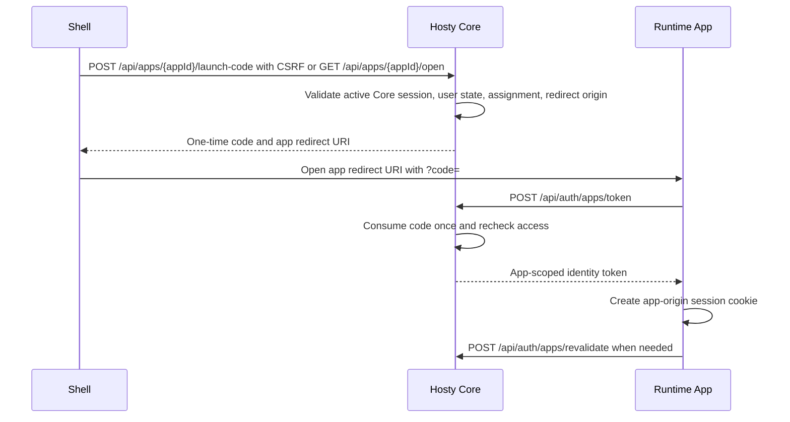

# App Auth And Origin Separation

Hosty-aware runtime apps authenticate through Core-issued app-scoped authorization codes and app-local sessions. Core owns Host login, logout, setup, invitation acceptance, OIDC callbacks, Core browser sessions, CSRF, user access checks, and app assignment checks. Runtime apps do not receive Hosty browser session cookies.



## Contract

- The app audience is the installed app id.
- Authorization and launch codes expire after five minutes and can be consumed once.
- App identity tokens expire after 24 hours. Runtime apps should set app-origin session cookies to no more than the returned `expiresInSeconds`.
- Code exchange rechecks the current user, disabled-user state, installed app state, and app assignments.
- Redirect URIs must be absolute `http` or `https` URLs without fragments and must match an installed app endpoint origin.
- Browser Shell embedded launch-code issuance is bound to the active Core session user and requires `X-Hosty-CSRF`.
- Standalone browser links use `GET /api/apps/{appId}/open?redirectUri=...`, which validates the active Core session and redirects to the app with a one-time code.
- Shell issues an embedded launch code when opening an app workspace from outside that app. Page-to-page navigation inside the already-open app workspace uses the app's direct URL and relies on the existing app-origin session cookie, so runtime apps do not re-exchange a code and reload on every Shell menu click.
- Trusted local CLI/control helpers can request identity or open links for a selected existing enabled Host user, but normal app access checks still apply.
- App identity tokens are app-scoped bearer tokens with a 24-hour lifetime. Apps should store only an app-local HttpOnly session cookie on their own origin.

## Runtime App Integration

A Hosty-aware app should:

- read `HOSTY_APP_ID` as its app id and `HOSTY_CORE_ORIGIN` as the Core origin;
- accept a `code` query parameter on an app-owned route;
- exchange the code with `POST {HOSTY_CORE_ORIGIN}/api/auth/apps/token`;
- create an app-origin session from the returned identity token;
- use app-specific cookie names because local Shell, Core, and runtime apps all use the `localhost` host on different ports;
- remove the code from the browser URL after starting exchange;
- call `POST {HOSTY_CORE_ORIGIN}/api/auth/apps/revalidate` before extending trust in an existing app session;
- treat Core `401` as missing or expired Host authentication and Core `403` as denied app access;
- keep third-party service credentials in app-owned settings or secrets, not in Hosty identity tokens.

The repository Demo App is the first Next.js example. Its `/api/auth/app-code` route exchanges the code, stores an HttpOnly app cookie capped to the Core token lifetime, and `/api/auth/identity` reports app-session revalidation status. The previous iframe/gateway identity diagnostics remain available for compatibility validation.

## Origins

Core reads these public origin settings:

- `HOSTY_CORE_PUBLIC_ORIGIN` - explicit Core public origin.
- `HOSTY_SHELL_PUBLIC_ORIGIN` - explicit Shell public origin and allowed credentialed CORS origin.

Installed CLI defaults:

- Core listens on `http://localhost:7070`.
- Shell listens on `http://localhost:7171`.
- Core and Shell public origins are unset unless configured.

Source development defaults:

- Core listens on `http://localhost:3001`.
- `npm run dev` sets Shell public origin to `http://localhost:3000`.
- Runtime apps publish local endpoints as `http://localhost:<assigned-port>`.
- Local HTTP browser credentials require the browser host to match consistently. Do not mix `localhost` and `127.0.0.1` in one local session.
- Shell and runtime apps are still different origins because their ports differ. Cross-origin messaging and iframe access must use explicit target origins, but the cookie host remains `localhost`.

Core status includes warnings for invalid public origin values and insecure `http` public origins on non-loopback hosts. Shell and `hosty core status` display those warnings.

## Configuration

Split-origin deployments should set both explicit variables:

```env
HOSTY_CORE_PUBLIC_ORIGIN=https://core.host.example
HOSTY_SHELL_PUBLIC_ORIGIN=https://shell.host.example
```

When configuring public origins:

- keep Core auth pages on the Core origin;
- configure reverse proxies to preserve `X-Forwarded-Host` and `X-Forwarded-Proto`;
- use HTTPS for non-loopback browser origins before exposing Core or Shell;
- ensure Shell-to-Core requests use `credentials: "include"` and pass Core CSRF tokens on mutations;
- verify logout and account switching against the Core origin, not the runtime app origin.

## Deferred Scope

Gateway/proxy wrapping for arbitrary third-party browser apps is not part of this feature. Apps that cannot redirect to Core, exchange Hosty app codes, validate or revalidate app identity, and create app-local sessions need a separate future wrapping model. Service/API endpoint exposure remains distinct from browser UI app launch.
