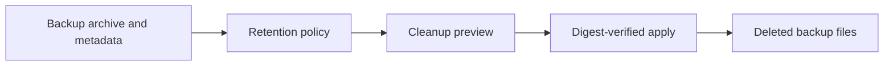

# Feature: App Data Backup Retention

Created: 2026-06-03
Updated: 2026-08-11

## Description

Hosty manages retention for app data backups stored under the Hosty backup root. Backups cover only the primary app `data/` directory; the app `cache/` directory ([app-cache-storage](../app-cache-storage/feature.md)), external mounts, and additional app storage mappings are excluded from backups and from retention cleanup.



## Retention Policy

The default retention policy is conservative:

- `manual` backups are kept until explicit deletion.
- `pre-update`, `pre-restore`, `pre-runtime-switch`, and `scheduled` backups keep the latest 5 backups per app.
- No age-based deletion is enabled by default.
- Retention cleanup does not delete the only known backup candidate unless policy support is explicitly expanded later.
- Per-app retention overrides are not part of the current implementation. Future retention policy extensions are tracked in [Backup Retention Extensions](../../ideas/backup-retention-extensions.md).

Backup list responses include retention status so Shell and CLI can show whether each backup is retained by policy, manually kept, or part of the current cleanup plan.

## Backup Consistency

Core copies the app `data/` directory with no app-side coordination, so Core-initiated backups are taken against a non-live directory to keep the archive internally consistent (e.g. so an open SQLite transaction cannot produce a torn snapshot):

- `pre-update`, `pre-runtime-switch`, and `pre-restore` backups already run after the app is stopped as part of their lifecycle flow.
- An operator-triggered `manual` backup of a running app stops the app for the duration of the copy and restarts it afterwards. Apps that are already stopped are copied in place with no lifecycle change. If the restart fails, the failure surfaces through the normal start path (recorded and reported) and the app is left stopped.
- `app-initiated` backups are requested by the app itself, which is expected to flush or checkpoint its own state before calling, so Core does not stop the app.

A `scheduled` backup creation path is not implemented; if added, it should also copy stopped data (briefly stopping the app per run) rather than copying a live directory.

## Cleanup Preview And Apply

Core exposes cleanup preview and apply endpoints for browser Shell and trusted local control callers:

```text
GET  /api/apps/{appId}/backups/cleanup/plan
POST /api/apps/{appId}/backups/cleanup

GET  /control/v1/apps/{appId}/backups/cleanup/plan
POST /control/v1/apps/{appId}/backups/cleanup
```

The preview response includes cleanup candidates and a plan digest. Apply requires that digest; Core recomputes the current plan before deleting files and rejects stale digests. Candidate deletion verifies paths stay under `<hosty-data-root>/backups/<app-id>/` and verifies archive SHA-256 before deleting archives.

Cleanup handles missing archive or metadata pairs gracefully. Missing-archive metadata can be removed automatically. Archive-only candidates are exposed in previews but require explicit apply.

## Scheduled Cleanup

Hosty Core runs a background retention cleanup pass after startup and then periodically. Scheduled cleanup applies only automatic-safe candidates and writes audit/diagnostic records when cleanup deletes or skips candidates.

## Shell And CLI Controls

Shell backup details can:

- create manual backups;
- list backups with retention status;
- restore stopped apps from a backup;
- delete one backup with confirmation;
- preview retention cleanup;
- apply cleanup with confirmation and plan digest verification.

CLI commands:

```text
hosty apps backup <app-id> [--reason <reason>]
hosty apps backup delete <app-id> <backup-id> --yes
hosty apps backups <app-id>
hosty apps backups prune-plan <app-id> [--format table|json]
hosty apps backups prune <app-id> --plan-digest <digest> --yes [--format table|json]
hosty apps restore <app-id> <backup-id> [--pre-restore-backup]
```

Destructive CLI commands require `--yes`. Manual filesystem cleanup remains a recovery fallback, not the preferred workflow.

## Testing Expectations

- Retention policy, cleanup preview/apply digests, and malformed-metadata tolerance — `AppBackupServiceTests`.
- The scheduled cleanup pass — `AppBackupRetentionSchedulerTests`.
- Backup scope (the `cache/` sibling stays out of archives and restores) — `AppBackupServiceTests`.
