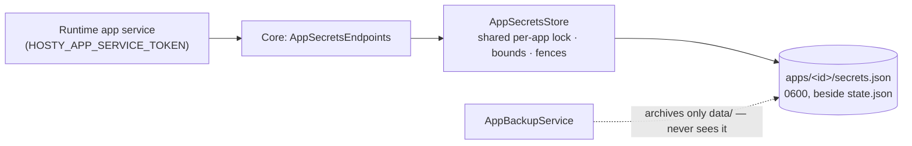

# App Secrets Store

Status: Implemented (Core store + API in Core 0.60.0; SDK clients in `HostySdk.App` 0.3.0 and `@hosty-sdk/app` 0.4.0). Verified against a live Core 2026-07-22.

## Description

The app secrets store is a **Core-managed keychain for runtime-acquired app secrets**: values an
app obtains while running and must later present to a third party — OAuth access and refresh
tokens, API keys issued per user, webhook signing secrets. Unlike the credentials Hosty already
stores, they cannot be hashed, because the app has to send them verbatim.

Apps reach it only through Core, with the service token they already hold:



The point of the design is *where the file is not*: Hosty backups archive the app's `data/`
directory, so a credential kept in the app's own database travels inside every backup archive.
`secrets.json` sits beside `state.json`, one level above `data/`, and is therefore structurally
outside backup scope. This extends the posture Core already had for `secret: true` settings,
which live in `state.json` for the same reason.

## Goal

- Give apps one durable place for runtime-acquired credentials that never enters a backup
  archive, so an archive is not a bundle of live third-party access.
- Keep it a platform capability rather than a per-app pattern: before this, an app needed an
  operator-generated encryption key and its own crypto to store an OAuth token safely.
- Stay boring: one JSON document per app, the existing atomic-write path, the existing auth
  guard. No new credential, no new mounts, no runtime-adapter changes.

## Contract

Four routes, service-token authenticated, no session surface:

```text
GET    {HOSTY_CORE_ORIGIN}/api/internal/apps/{appId}/secrets
Authorization: Bearer <HOSTY_APP_SERVICE_TOKEN>
→ 200 { "keys": ["trakt.connection.4.tokens", …] }        // names only

GET    .../secrets/{key}      → 200 { "value": "…" } | 404
PUT    .../secrets/{key}      { "value": "…" }      → 204   // create or replace
DELETE .../secrets/{key}      → 204                          // idempotent
```

- The bearer token must resolve to the route's `{appId}`, else `401`. Cross-app rejection is
  structural: the app id is HMAC-signed into the token, so a token minted for another app
  cannot validate here.
- `404` carries two distinct meanings, separated by the error code in the body. On a per-key
  `GET`, `app_secret_not_found` means **no secret is stored** — an expected state (the app has
  never connected, or was restored onto a new host), which callers treat as "reconnect required".
  `app_not_found` on any route means Core does not know the routed app, e.g. it has been removed;
  that is a fault, not an answer, and both SDK clients raise rather than reporting an absent
  secret.
- `400` for a malformed key, an empty or oversize value, or exceeding the per-app key count.
  Values are rejected, never truncated.
- Listing returns key names only. Values are never returned by any Shell or admin API.

Bounds: keys match `^[a-z0-9][a-z0-9._-]{0,127}$`, values are non-empty UTF-8 of at most
**16 KiB**, and an app may store at most **256** keys. Replacing an existing key at the limit
still succeeds. Both the endpoint and the store enforce these — the limits belong to the
persisted document, not to the HTTP layer.

## Storage

`AppSecretsStore` persists one document per app at `apps/<id>/secrets.json`:

```json
{ "schemaVersion": 1, "secrets": { "<key>": { "value": "…", "updatedAt": "<ISO-8601 UTC>" } } }
```

- Written through `JsonStorage.WriteOwnerFileAsync`: atomic temp-file + rename, file mode
  `0600`, containing directory left traversable (a container running as another uid must still
  reach `data/`). `updatedAt` is file-internal diagnostics and is not exposed by the API.
- A missing file reads as an empty store. A **malformed file fails loud** rather than being
  silently replaced — silent replacement would be silent credential loss.
- The `schemaVersion` exists so a future at-rest encryption pass is a lazy migration rather than
  a format break.

### Locking and the removal fences

The store serializes on `AppRegistryStore`'s per-app lock — the same semaphore that guards
`state.json` writes and the `RemoveAppAsync` subtree delete — rather than introducing a second
lock family. On top of that, two fences stop a write that *straddles* an app removal from
writing a credential back after the operator asked for it to be deleted:

1. **`state.json` existence**, re-checked inside the lock. Covers an ordinary removal, which
   deletes it.
2. **A per-app data-removal generation**, held on `AppRegistryStore` beside the lock and bumped
   by `DeleteAllAsync`. Covers `hosty apps remove --delete-data --keep-state`, a supported
   combination in which `state.json` deliberately survives, so existence proves nothing. A
   mutation samples the generation on entry and re-checks it under the lock.

Only straddling writes are refused; a request that starts *after* a removal proceeds normally,
which matters because a kept-state app is still installed. Placing the generation on the
registry rather than the store makes the guarantee structural — any collaborator sharing the
registry shares the fence, regardless of DI wiring.

## Lifecycle

| Event | Effect on stored secrets |
| --- | --- |
| Update, restart, runtime-switch, Core restart | Untouched. |
| Backup | Never archived — backups cover `data/` only. |
| Restore | Untouched; a restore rolls the app's data back but not its secrets. |
| Removal keeping data (default) | **Retained**, like `retained-config.json` retains secret settings; a reinstall resumes working connections. |
| Removal deleting data | Deleted through `DeleteAllAsync` in the same branch that deletes `data/`. |
| Machine migration | Lost — Core state is not backed up. |

The restore row is a deliberate improvement over encrypting credentials into app storage, not a
gap: OAuth refresh tokens commonly rotate on every refresh, so a token embedded in a backup
archive is usually already invalid by restore time. A live keychain keeps the connection working
across a data restore.

Losing secrets on machine migration is likewise accepted: OAuth-class credentials are
re-obtainable by design, and credentials arguably should not silently follow an archive to a new
host. Apps must therefore treat a missing secret as a defined reconnect-required state.

## SDK Clients

Both SDKs wrap the contract so no app hand-rolls it:

```csharp
// HostySdk.App (NuGet)
builder.Services.AddHostySecrets(hosty);
var tokens = await secrets.GetAsync("trakt.connection.1.tokens", cancellationToken: ct);
await secrets.SetAsync("trakt.connection.1.tokens", refreshed, ct);
```

```ts
// @hosty-sdk/app/server (npm, server-only)
const tokens = await getAppSecret("trakt.connection.1.tokens", config);
await setAppSecret("trakt.connection.1.tokens", refreshed, config);
```

Both keep a **write-through cache** so a briefly unavailable Core does not break an app that has
already read its secret: reads populate it, mutations update it, `refresh` bypasses it. A read
that overlaps a concurrent write discards its own result instead of overwriting the newer value,
and a failed write is never cached as if it had landed. The TypeScript cache is namespaced by
Core origin and effective app id, since one Node process can legitimately serve more than one
identity; the .NET client is bound to a single `HostyAppOptions` and needs no equivalent.

Errors are classified rather than stringly-typed in both clients: the TypeScript
`HostySecretsError` and the .NET `HostySecretsException` each carry Core's HTTP `status` and a
machine-readable `code`, either passed through from Core's error body (`app_not_found`,
`app_secret_value_invalid`, …) or raised locally (`core_response_invalid`,
`core_secrets_unavailable`, `core_secrets_timeout`, `app_service_token_missing`,
`app_secrets_request_failed` — `HostySecretsErrorCodes` in .NET). An unusable `2xx` — unreadable
body, no `value`, no `keys` array — raises `core_response_invalid` rather than degrading to "no
secret", so a broken Core or proxy cannot masquerade as a reconnect-required state.

## Security Posture

- **At rest, `secrets.json` is plaintext with mode `0600`**, matching how Core already stores
  `secret: true` settings and the Cloudflare API token. This is a deliberate parity choice: Core
  has no encryption-at-rest anywhere, and a one-file AES special case whose master key sits on
  the same disk would add code without materially changing the threat model. The upgrade path is
  one platform-wide pass under a single Core master key, tracked in
  [the design](../ideas/app-secrets-store.md).
- **Secret values are never logged**, never returned by Shell or admin APIs, and never included
  in app summaries or state payloads. Verified: a stored value appears zero times in Core's log.
- **Secret key *names* do appear in Core's request log** (in Development, ASP.NET Core logs the
  request path, which contains the key). Names are listable by design, so this leaks nothing —
  but apps should not encode sensitive data in a key name.
- **The service token gains reach.** It already authorized directory, backup, and notification
  calls; it now also unlocks live third-party credentials. Its known limits — no expiry, no
  scopes, no per-install generation ([2026-07-10 review, C-M7](../reviews/2026-07-10-core-code-review.md))
  — become more pressing, and scoping/expiry should land before marketplace-era third-party apps.
- **Keeping data on removal keeps working credentials on disk** until reinstall or a delete-data
  removal. This mirrors `retained-config.json` and is the ratified trade-off for working
  reinstalls.

## Boundaries

- Not a settings replacement: operator-configured secrets (e.g. `TMDB_API_KEY`) stay in manifest
  `settings` with `secret: true`. The keychain is only for values acquired at runtime.
- Not a blob store — it is bounded key/value.
- No cross-app sharing; the keychain is strictly per-app.
- No per-service scoping inside multi-service apps: any service holding the app's token reads the
  app's store.
- No Shell UI, no CLI command, no rate limiting, no change events in v1.

## Verification

Automated: `dotnet test apps/core/tests/Haas.Hosty.Core.Tests` (store CRUD, bounds, permissions,
malformed-file, both removal-race interleavings, lifecycle removal for both data choices) plus
the two SDK suites.

Live, against a Core 0.60.0 on an isolated data root (2026-07-22): CRUD round-trip with a real
minted service token; a value with leading/trailing whitespace returned verbatim; `401` for
another app's token and for no token; `404` for an unknown app and an absent key; `secrets.json`
created beside `state.json` with mode `0600`; a 16 KiB value accepted and 16 KiB + 1 rejected; a
malformed key and an empty value rejected; the 257th key rejected while replacing an existing key
at the limit succeeded; idempotent delete; a backup archive containing the app's `data/` file and
**not** `secrets.json`; keep-data removal retaining the secret and a reinstall reading it back; a
write during removal refused with `404` instead of recreating the file; delete-data removal
removing it.

## Links

- [Promoted design](../ideas/app-secrets-store.md)
- [Implementation plan](../planning/app-secrets-store.md)
- [Core API](core-api.md)
- [App data backup retention](app-data-backup-retention.md)
- [Hosty App SDK](../ideas/hosty-app-sdk.md)
