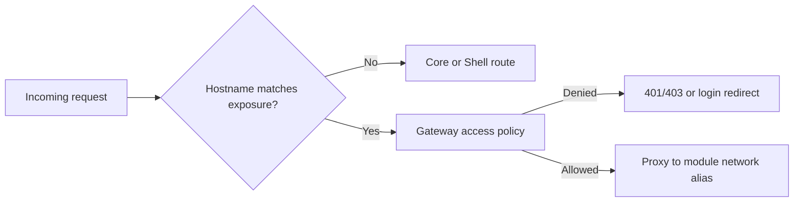
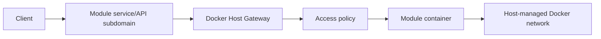
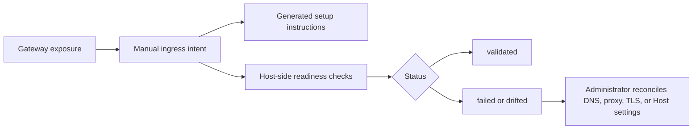

# Auth And Gateway Model

This document captures the Hosty authentication, authorization, app identity, and target gateway model. Hosty Core currently owns auth, users, sessions, app identity exchange, and app access assignments. The legacy gateway and external ingress implementation lived in the removed combined Next.js Host package; gateway/ingress APIs described here are retained as target model notes until Core or a Core-managed gateway runtime implements them again.

## Scope

Hosty should be the access-control boundary for:

- Hosty Shell;
- Hosty Core API;
- externally exposed module service/API endpoints;
- module gateway routing;
- module access assignment;
- Host-level roles and sessions.

Hosty should not depend on a regular managed app for its own authentication. Core must be able to protect and recover its own API independently of Shell.

## Accepted Decisions

- Module browser UIs are opened through the Host shell. Dedicated subdomains are reserved for separate service/API exposures.
- All external service/API exposure traffic goes through the Host gateway by default.
- Direct public module ports are not the primary exposure model and are allowed only as an explicit development override.
- Host has two initial global roles: `host.admin` and `host.user`.
- Host decides whether a user can reach a module.
- Local Host instances, including `localhost`, require authentication by default. Development bypass must be explicit configuration.
- The default exposure policy for externally opened service/API endpoints is `loginRequired`.
- Each module owns its internal permission model.
- Modules may receive Host identity through module-scoped signed tokens.
- Modules may query only a scoped list of users relevant to that module.
- Multiple real-world accounts are modeled as multiple Host users with account switching.
- Identity profiles are not part of the current account model.
- Local authentication stores Host-owned users, browser sessions, account sets, assignments, invitations, setup/recovery tokens, and audit state in dedicated versioned JSON files under the Host data root.
- SQLite is not part of the local auth persistence model.

## Gateway Routing Target

The target production routing model for service/API exposures is subdomain based:

```text
shell.example.com       -> Hosty Shell
reports-api.example.com -> Hosty Gateway -> reports service
media.example.com       -> Hosty Gateway -> media service
```

The Host gateway maps each module hostname to an installed module target inside the Host-managed Docker network. The target should be derived from module metadata and Host-managed runtime state:

- module id;
- Docker network alias;
- runtime port key;
- container port;
- exposure policy;
- assigned users, if applicable.

Path-based service/API routing is not part of the accepted target model. Realtime transports are simpler on a dedicated origin. Module browser UIs are handled separately by the Host shell app portal.

The legacy gateway implementation ran in the removed combined Host package. Future gateway work should be implemented through Hosty Core or an explicit Core-managed gateway runtime, with the same access-policy model:



Current Core origin settings:

| Setting | Default | Meaning |
| --- | --- | --- |
| `HOST_PUBLIC_ORIGIN` | empty | Compatibility external Host UI origin for combined deployments, for example `https://host.example.com`. Split Core/Shell deployments should prefer `HOST_CORE_PUBLIC_ORIGIN` and `HOST_SHELL_PUBLIC_ORIGIN`. |
| `HOST_CORE_PUBLIC_ORIGIN` | empty | Public Core origin for auth, token exchange, and Core-owned API callbacks. |
| `HOST_SHELL_PUBLIC_ORIGIN` | empty | Public Shell origin for browser app launch links. |

Future gateway work should model exposure records separately from Shell app discovery. The retired Legacy Host stored records in `/data/gateway/exposures.json`:

```json
{
  "schemaVersion": "0.2",
  "exposures": [
    {
      "id": "gw_...",
      "moduleId": "com.acme.reports",
      "hostname": "reports.example.com",
      "endpointKey": "web",
      "exposurePolicy": "loginRequired",
      "identityMode": "required",
      "enabled": true,
      "createdAt": "2026-05-18T10:00:00.000Z",
      "updatedAt": "2026-05-18T10:00:00.000Z"
    }
  ],
  "updatedAt": "2026-05-18T10:00:00.000Z"
}
```

Each exposure points to a specific `moduleId + endpoints[].key`. The referenced metadata endpoint must be marked `public: true`; the administrator still chooses the Host-owned exposure policy separately.



## Exposure Policy

The module exposure model uses explicit policy states instead of the older `private` and `protected` terminology. These gateway exposure policies apply to separately published service/API endpoints, not to shell Apps. Shell Apps are discovered only after Host authentication through `/api/apps`.

| Policy | Login required | Host assignment required | Behavior |
| --- | --- | --- | --- |
| `public` | no | no | Anyone who can reach the hostname can reach the exposed service/API endpoint. |
| `loginRequired` | yes | no | Any authenticated Host user can reach the exposed service/API endpoint. |
| `assignedUsersOnly` | yes | yes for `host.user` | Selected Host users can reach the exposed service/API endpoint; `host.admin` can also reach it for bootstrap and configuration. |

These policies control only whether traffic reaches the module. They do not define what the user can do inside the module.

The metadata field `endpoints[].public` is only an endpoint capability hint that says an endpoint is suitable for external UI exposure. It is not an authorization policy. Host-owned exposure policy decides whether the gateway treats an externally reachable module hostname as `public`, `loginRequired`, or `assignedUsersOnly`.

Module access assignments are stored in the auth state as Host-owned authorization data. They are separate from the gateway hostname registry and from module-owned permissions.

## Gateway Admin API Target

Gateway exposure management should be a Hosty admin operation. The old Legacy Host endpoints below are not available in current Core/Shell builds; they document the intended resource shape for future Core-backed implementation:

| Route | Method | Behavior |
| --- | --- | --- |
| `/api/gateway/options` | `GET` | Return the compact Web UI picker model: installed modules with public endpoints, UI-entrypoint hints, active Host users, and gateway domain settings. |
| `/api/gateway/exposures` | `GET` | List configured gateway exposures and assigned Host user ids. |
| `/api/gateway/exposures` | `POST` | Create a gateway exposure for `moduleId`, `hostname`, `endpointKey`, optional `exposurePolicy`, and optional `identityMode`. |
| `/api/gateway/exposures/{exposureId}` | `PUT` | Update hostname, endpoint key, policy, identity mode, or enabled state. |
| `/api/gateway/exposures/{exposureId}` | `DELETE` | Remove an exposure and clear linked external ingress readiness state. |
| `/api/gateway/exposures/{exposureId}/assignments` | `PUT` | Replace assigned Host user ids for the exposure's module. |

The removed `/ingress` Web UI used these endpoints to create, edit, enable/disable, and delete service/API gateway exposures. Future Shell work should keep the same boundary: gateway exposure changes do not create shell Apps, and browser UIs should stay inside the Hosty Apps shell unless an app intentionally publishes a separate service/API origin.

Assignment edits remain module-wide. Calling the assignments endpoint through an exposure id updates the Host assignments for that exposure's module, so assigned-only service/API exposures and shell Apps share the same module assignment set.

## Gateway Proxy Rules

The gateway sanitizes proxied requests:

- strips hop-by-hop headers;
- strips CLI `Authorization`;
- strips Host auth cookies before traffic reaches the module, including the active session cookie and any future account-selection cookies;
- strips inbound `X-Docker-Host-*` headers so clients cannot spoof Host-owned identity headers;
- strips inbound `Forwarded`, `X-Forwarded-*`, and `X-Real-IP` before setting Host-owned forwarding headers for the module;
- strips trusted proxy assertion headers before traffic reaches the module;
- adds `X-Docker-Host-Identity` with a short-lived signed JWT when the exposure identity mode and authenticated Host principal require identity propagation;
- adds `X-Forwarded-Host`, `X-Forwarded-Proto`, and `X-Forwarded-For`;
- preserves the external module `Host` header for applications that generate root-relative or same-origin URLs.

For responses, the gateway preserves relative redirects and rewrites absolute redirects from the internal module target back to the external module hostname. Module `Set-Cookie` headers are passed through with `Domain` stripped so module cookies stay host-only for the module origin.

Shell iframe identity uses a separate direct-origin bridge. `/api/apps/{moduleId}/identity-token` requires Host authentication, validates current app access, and issues short-lived Host-signed module identity tokens. The Host shell sends those tokens to the iframe with `postMessage`. The module UI then decides whether to use the token directly or exchange it for a module-origin session cookie.

Embedded module UIs are rendered in an iframe sandbox with `allow-same-origin` because each module UI runs on its own origin rather than the Host origin. Host cookies are not available to that origin, and Host APIs still require Host authentication and authorization.

## Host Roles

Initial Host roles are intentionally small:

| Role | Meaning |
| --- | --- |
| `host.admin` | Can manage Host configuration, auth settings, users, module install/update/remove, exposure, and recovery. |
| `host.user` | Can load the Host shell as an Apps portal and access module origins allowed by app access policy or gateway exposure policy. It cannot call Host management API functionality, including module listing or Host status views. |

Host role is included in module identity so modules can make bootstrap or admin UX decisions when appropriate. A module may decide to treat `host.admin` as an internal module administrator, but module-specific permissions still belong to the module.

`host.admin` is allowed through the Host gateway for module bootstrap and configuration. This does not force the module to grant internal administrator rights automatically; the module may grant, map, or ignore the Host role according to its own permission model.

`host.user` shell access is intentionally narrow. The user can call the app registry and shell app identity-token endpoints needed by `/apps`, but module install/update/remove/lifecycle, gateway exposure management, external ingress management, security settings, user management, and Host status APIs remain `host.admin` only.

## CLI Access

CLI module commands act as a local administrator tool through the trusted local control channel, not through Host user authentication. The Host writes `<HOST_DATA_ROOT_HOST>/run/control.json` with a per-start local control endpoint, contract version, and channel-binding secret. The CLI reads that owner-only file and calls `/control/v1`.

Control requests do not send `Authorization: Bearer`, browser cookies, account-set cookies, or CSRF headers. The control secret is not a user credential, is not shown in the Web UI, and is not accepted by normal `/api` routes or by the module gateway.

Operational CLI auth decisions:

- `hosty auth setup-token` and `hosty auth recovery-token` are reserved for Core-compatible first-administrator bootstrap and local recovery.
- The retired Legacy Host auth state writer has been removed, so these commands currently return an unavailable status instead of writing obsolete auth JSON.
- `hosty auth token ...` commands are not part of the active CLI surface.
- The Web UI no longer generates CLI admin tokens.
- Browser sessions and user roles protect current normal Hosty Core API routes. Production OIDC, full trusted-proxy authentication, and recent browser reauthentication are future provider work.

## Local Authentication Decisions

The current Core authentication implementation uses local Hosty users, opaque server-side sessions, JSON persistence, invitation tokens, development-only direct session creation, trusted-proxy session creation, app authorization codes, and structured audit records.

Implemented local-auth surface:

- `/login` renders a development user picker in development and a Core-owned placeholder in production until production auth providers are added;
- `/logout` revokes the active Core session and redirects back to Shell or login;
- `/setup`, `/setup/invite`, and `/recovery` remain Core-owned pages; invitation acceptance is implemented at `/setup/invite`;
- `GET /api/auth/csrf` issues the browser CSRF token used by Shell mutation requests;
- `GET /api/auth/session` returns the current authenticated Core user;
- `POST /api/auth/session` creates a session only in development;
- `POST /api/auth/trusted-proxy/session` creates a secure-cookie session from a trusted upstream user id header;
- `POST /api/auth/logout` revokes the active session;
- `POST /api/auth/apps/authorize`, `POST /api/apps/{appId}/launch-code`, and `GET /api/apps/{appId}/open` create app authorization codes for authenticated users;
- `POST /api/auth/apps/token` exchanges an app authorization code for app-scoped identity;
- `POST /api/auth/apps/revalidate` revalidates an app access token;
- `/api/auth/users` and `/api/auth/invitations` endpoints implement User Management;
- `/control/v1/audit/recent` exposes recent audit records to trusted local control clients.

Core stores users, invitations, app assignments, and sessions under `core/auth/state.json`. Sessions use random opaque ids in HttpOnly cookies, expire after 12 hours, and can be revoked by logout or User Management mutations.

Audit events are stored as append-only NDJSON under `core/audit/audit.ndjson`, separate from the main auth state. Events must not write raw bearer tokens, setup tokens, invitation tokens, trusted-proxy assertions, cookies, authorization headers, app access tokens, or token hashes.

The old Legacy Host password login, remembered browser accounts, `/settings/security`, `/api/auth/bootstrap`, `/api/auth/accounts`, `/api/auth/reauth`, `/api/auth/sessions`, and `/api/auth/audit` browser APIs are not part of the current Core/Shell implementation.

## Module-Owned Permissions

Authorization has two layers:

```text
Host authorization:
  Can this Host user reach this module hostname?

Module authorization:
  What can this user do inside the module?
```

Docker Host should not centrally own every module's internal permission system. After Host grants access to the module, the module can use the Host identity to apply its own permissions.

Example module-owned permissions:

```text
user_123 -> reports.admin
user_456 -> reports.viewer
```

This lets different modules implement different domain-specific permission models while still relying on Host for login, assignment, and gateway enforcement.

## App Identity Token

Hosty must not forward its own session cookie to runtime apps. Current direct-origin app launch uses Core-issued authorization codes. The app exchanges the code through Core for a short-lived app-scoped identity token.

Token decisions:

- Current app identity tokens are HMAC-signed with `HS256`.
- The signing key lives under `core/auth/app-identity-signing.key`, separate from users, sessions, invitations, and app assignments.
- Direct-origin Shell launches use `/api/apps/{appId}/launch-code` or `/api/apps/{appId}/open`.
- Apps exchange authorization codes through `/api/auth/apps/token` and can revalidate through `/api/auth/apps/revalidate`.
- Tokens use a 5-minute lifetime and use the installed app id as `aud`.
- Core validates app assignment before issuing app identity to non-admin users.
- The retired gateway JWKS/discovery endpoints are not current Core/Shell APIs. Future gateway identity propagation can reintroduce asymmetric key discovery if service/API exposure traffic needs offline token validation.

## Realtime Traffic

Gateway authorization can work with WebSockets, SignalR, Server-Sent Events, and long polling.

For realtime transports:

- Host checks access before the initial HTTP request or WebSocket upgrade reaches the module.
- SignalR-style negotiation endpoints must be routed and authorized consistently with the final transport endpoint.
- WebSocket identity is established at handshake time.
- Host should be able to close active gateway connections when a session is revoked or module access changes.
- Long-lived connections need a defined maximum lifetime or revalidation policy.

Subdomain routing is preferred because realtime applications often assume stable root-relative URLs and a dedicated origin.

Opening a module UI from the Host shell does not replace the service/API gateway model for realtime endpoints. Modules that need WebSocket, SignalR, SSE, or long-poll service traffic should continue to use their dedicated gateway exposure or another module-owned endpoint contract rather than relying on `/apps/{moduleId}` as a standalone proxy URL.

## Account Switching

The old browser account-set implementation from Legacy Host is not part of the current Core/Shell build. The current model supports one active Core session per browser context. Future account switching should be implemented against Core `core/auth/state.json` rather than the retired `/data/auth/state.json` account-set shape.

Hosty does not use mandatory identity profiles. Different real-world accounts are represented as different Host users:

```text
personal@example.com -> host.admin
work@example.com     -> host.user
```

When a module is opened, the Host session selected for that module determines which `sub`, email, and Host role appear in the module identity token.

Host does not link multiple external identities into a single person, and account switching does not create additional local users.

Gateway proxying should strip Hosty session cookies before forwarding traffic to modules. Direct-origin shell iframe traffic is not proxied by Hosty and cannot receive Hosty cookies for the module origin.

## User Management

Detailed User Management behavior is documented in [User Management](user-management.md).

Host administrators manage users from the Shell User Management view. The view lists Host users, creates local invitation links, revokes pending invitations, changes local user roles, disables users, and replaces app assignments.

Invitations are one-time setup-token style links for local Hosty users. The raw token is returned only once and only its hash is stored in Core `core/auth/state.json`. Invitation tokens carry the invited role, email, optional display name, expiry, creator user id, and initial app assignments. The recipient accepts the invitation at `/setup/invite?setupToken=...`.

User deletion is soft-disable. Disabling a user revokes active sessions and removes app assignments. Hosty Core prevents disabling or demoting the last active administrator and blocks self-disable from User Management.

OIDC and richer trusted-proxy provisioning are future provider work. When enabled, external users should be disabled and assigned to apps through the same User Management surface, while their roles remain provider-managed.

## Scoped Module User Directory

Modules may need a list of users to assign internal permissions. They should not receive the full Host user directory by default.

Preferred model:

- Host stores users, Host roles, and module access assignment.
- Module stores module-specific roles and permissions.
- Module can call a Host internal API to list users assigned to that module.
- The API requires a module service credential, not a browser user token.
- Directory scope is explicit module assignment, even for `loginRequired` modules.
- `host.admin` users appear in a module directory only when explicitly assigned.
- Modules should store module-owned permissions against stable Host user ids from Host-issued token `sub`.
- Email is omitted by default and requires a module directory policy opt-in.
- Disabled Host users are hidden from normal directory responses.
- The endpoint is `GET /api/internal/modules/{moduleId}/directory/users`.
- Newly created module containers receive `DOCKER_HOST_INTERNAL_ORIGIN`, `DOCKER_HOST_MODULE_ID`, and `DOCKER_HOST_MODULE_SERVICE_TOKEN`.

Example response:

```json
{
  "moduleId": "com.acme.reports",
  "users": [
    {
      "id": "user_123",
      "email": "work@example.com",
      "displayName": "Work User",
      "hostRole": "host.user"
    }
  ]
}
```

The directory response is schema-versioned and may include pagination fields. Modules may cache responses briefly, for example for 60 seconds, but Host remains authoritative for assignment changes.

## External Providers

The Host auth model should support multiple authentication provider modes:

- local auth for standalone/local-first installs;
- generic OIDC for Auth0, Keycloak, Authentik, ZITADEL, Microsoft Entra ID, Google Workspace, and similar providers;
- trusted proxy mode for Cloudflare Access, Pomerium, Authentik proxy, oauth2-proxy, and similar deployments.

External providers are target provider work. Hosty should still own:

- Host role assignment;
- module access assignment;
- module exposure policy;
- Host sessions;
- module-scoped identity tokens;
- audit events.

### Generic OIDC Provider Target

The target generic OIDC implementation supports one active browser login provider using Authorization Code with PKCE.

Target OIDC login surface:

- `GET /api/auth/oidc/login` starts the OIDC authorization request;
- `GET /api/auth/oidc/callback` validates the callback, exchanges the authorization code, verifies the ID token with provider JWKS, maps the external identity to a Host role, and creates a normal Host session cookie.

Provider configuration can be supplied through Host auth state or environment variables for early deployments:

| Environment variable | Meaning |
| --- | --- |
| `HOST_OIDC_ISSUER` | OIDC issuer URL. |
| `HOST_OIDC_CLIENT_ID` | OIDC client id. |
| `HOST_OIDC_CLIENT_SECRET` | Optional OIDC client secret. |
| `HOST_OIDC_LABEL` | Optional label shown on the login page. |
| `HOST_OIDC_SCOPES` | Optional comma- or whitespace-separated scopes. Defaults to `openid profile email`. |
| `HOST_OIDC_GROUPS_CLAIM` | Optional claim name for group matching. Defaults to `groups`. |
| `HOST_OIDC_ADMIN_GROUPS` | Groups that map to `host.admin`. |
| `HOST_OIDC_USER_GROUPS` | Groups that map to `host.user`. |
| `HOST_OIDC_CALLBACK_URL` | Optional explicit callback URL. |

OIDC uses explicit claim mappings and denies login when no mapping grants `host.admin` or `host.user`. Just-in-time provisioning creates a Host user only after the ID token is verified and a role mapping succeeds. Host stores the external identity as `providerId + issuer + sub`, while modules continue to see the Host-owned user id in module identity tokens.

Host does not persist OIDC access tokens, refresh tokens, or ID tokens. Provider logout, multiple active OIDC providers, automatic email-based account linking, OIDC admin UI, and background group revalidation are not part of this contract.

### Trusted Proxy Provider Target

Trusted proxy mode supports deployments where an upstream proxy authenticates the browser before requests reach Hosty. The current Core implementation exposes a narrow `/api/auth/trusted-proxy/session` bridge for an already-known user id. Full signed-assertion verification, provisioning, and role mapping remain target provider work.

Provider records include issuer, audience, assertion header name, JWKS or JWKS URI, subject/email/display-name claim names, and explicit claim-to-Host-role mappings. Cloudflare Access uses the `Cf-Access-Jwt-Assertion` header and the Access JWKS endpoint. A generic signed-JWT provider can use `X-Docker-Host-Trusted-Proxy-Jwt` or another configured assertion header.

Trusted proxy configuration can be supplied through Host auth state or environment variables for early deployments:

| Environment variable | Meaning |
| --- | --- |
| `HOST_TRUSTED_PROXY_ENABLED` | Set to `false` to disable the environment provider. |
| `HOST_TRUSTED_PROXY_CLOUDFLARE_TEAM_DOMAIN` | Cloudflare Access team domain, for example `team.cloudflareaccess.com`. Enables the Cloudflare Access preset when paired with an audience. |
| `HOST_TRUSTED_PROXY_ISSUER` | Generic trusted proxy JWT issuer. |
| `HOST_TRUSTED_PROXY_AUDIENCE` | Comma- or whitespace-separated accepted JWT audiences. |
| `HOST_TRUSTED_PROXY_JWKS` | Inline JWKS JSON for generic signed assertions. |
| `HOST_TRUSTED_PROXY_JWKS_URI` | Remote JWKS URI for generic signed assertions. |
| `HOST_TRUSTED_PROXY_ASSERTION_HEADER` | Generic assertion header. Defaults to `X-Docker-Host-Trusted-Proxy-Jwt`. |
| `HOST_TRUSTED_PROXY_GROUPS_CLAIM` | Claim name used for role mapping. Defaults to `groups`. |
| `HOST_TRUSTED_PROXY_ADMIN_GROUPS` | Groups that map to `host.admin`. |
| `HOST_TRUSTED_PROXY_USER_GROUPS` | Groups that map to `host.user`. |
| `HOST_TRUSTED_PROXY_SUBJECT_CLAIM` | Subject claim. Defaults to `sub`. |
| `HOST_TRUSTED_PROXY_EMAIL_CLAIM` | Email claim. Defaults to `email`. |
| `HOST_TRUSTED_PROXY_DISPLAY_NAME_CLAIM` | Display-name claim. Defaults to `name`. |

When full trusted proxy mode is active:

- protected Host API and gateway requests use the verified trusted proxy principal;
- browser session fallback is disabled for protected requests so direct-origin access cannot bypass the upstream proxy;
- local CLI automation uses the trusted control channel instead of trusted-proxy or browser authentication;
- role mapping is default-deny when no configured claim mapping grants `host.admin` or `host.user`;
- disabled mapped Host users are denied;
- trusted proxy assertion headers are stripped before gateway module traffic is proxied.

Trusted proxy users are stored as Host users with `authProvider: "trusted-proxy"` and an external identity keyed by provider id, issuer, and subject. Modules still receive normal Host-signed module identity tokens through gateway headers or the direct-origin shell identity bridge; provider-specific trusted proxy headers are never the module-facing identity contract.

## Local Runtime Development

Module development uses a normal installed runtime app with a source or local command runtime profile. The app still runs through Core-managed lifecycle and receives the same identity and gateway contracts as other runtime profiles.

Supported local flow:

```text
hosty apps install apps/demo-app/manifest.json --runtime dev
hosty apps start com.haas.demo-app
hosty apps identity com.haas.demo-app --user user@docker-host.local --format token
```

Integrated development should be used to verify:

- metadata;
- dependency URLs;
- storage mappings;
- gateway routing;
- module identity tokens;
- realtime transports;
- module access policies.

Local command runtime profiles use the same installed app records, gateway routing, access policy, and Host-signed `X-Docker-Host-Identity` token contract as Docker runtime profiles.

## External Ingress Readiness

External ingress readiness is provider-neutral. Docker Host does not own DNS, TLS termination, reverse proxy configuration, tunnels, or upstream identity provider configuration. Instead, Host records the administrator's manual publish intent, generates setup instructions, validates Host-side prerequisites, and reports drift when Host gateway or auth settings change after an exposure was marked ready.

External ingress readiness records live in `/data/ingress/external-ingress.json`. The records are keyed by gateway exposure id and hostname, separate from `/data/gateway/exposures.json`, so the Host gateway contract remains unchanged.



Supported statuses:

| Status | Meaning |
| --- | --- |
| `unmanaged` | A gateway exposure exists, but no external ingress intent is recorded. |
| `planned` | An administrator started a manual publish record. |
| `manualReady` | The administrator marked the external DNS/proxy/TLS checklist complete. |
| `validated` | Host-side readiness checks passed for the saved manual intent. |
| `drifted` | Gateway hostname, policy, identity mode, public origin, or trusted-proxy mode changed after the manual intent was saved. |
| `failed` | Host-side readiness checks failed. |
| `unknown` | Host cannot determine a useful readiness state. |

Manual setup instructions are generated per exposure and include DNS target guidance, reverse proxy routing expectations, TLS requirements, WebSocket forwarding, the Host OIDC callback URL when Host owns browser login, trusted-proxy assertion guidance when an upstream proxy owns login, and the active Host gateway policy/identity mode.

Future readiness checks should remain Hosty-side only:

- `HOST_PUBLIC_ORIGIN` or the explicit Core/Shell public origins are configured;
- the gateway exposure is enabled;
- non-loopback public origins use HTTPS;
- manual DNS, reverse proxy, TLS, and websocket checklist items are marked complete;
- direct-origin bypass protection is marked complete when trusted proxy mode is enabled.

The retired Legacy Host Web UI showed an external ingress readiness panel for gateway exposures. Future Shell work can restore this as a Core-backed view once `/api/ingress/exposures` or replacement Core endpoints exist.

External ingress lifecycle changes are audited as sanitized events for saved manual intent, mark-ready, validation refresh, drift detection, and unlink. These events reference the gateway exposure target but do not log provider credentials, assertions, secrets, or full request headers.

Provider-specific automation, including Cloudflare DNS, Cloudflare Tunnel public hostname, Cloudflare Access application management, or other provider adapters, is not part of the provider-neutral readiness model.
