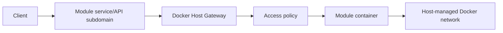
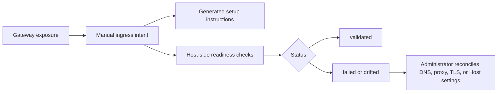

# Auth Gateway

This document captures the implemented Docker Host authentication, authorization, module gateway routing, realtime traffic, external ingress readiness, and module-owned permissions model.

## Scope

Docker Host should be the access-control boundary for:

- Host Web UI;
- Host backend API;
- externally exposed module service/API endpoints;
- module gateway routing;
- module access assignment;
- Host-level roles and sessions.

Docker Host should not depend on a regular managed module for its own authentication. A managed identity module may exist later as an external provider or system-level integration, but the Host must be able to protect and recover its own Web UI and API independently.

## Accepted Decisions

- Module browser UIs are opened through the Host shell. Dedicated subdomains are reserved for separate service/API exposures.
- All external service/API exposure traffic goes through the Host gateway by default.
- Direct public module ports are not the primary exposure model and are allowed only as an explicit development override.
- Host has two initial global roles: `host.admin` and `host.user`.
- Host decides whether a user can reach a module.
- Local Host instances, including `localhost`, require authentication by default. Development bypass must be explicit configuration.
- The default exposure policy for externally opened service/API endpoints is `loginRequired`.
- Each module owns its internal permission model.
- Modules may receive Host identity through module-scoped signed tokens.
- Modules may query only a scoped list of users relevant to that module.
- Multiple real-world accounts are modeled as multiple Host users with account switching.
- Identity profiles are deferred until there is a concrete need to link multiple external identities into one Host person.
- Local authentication stores Host-owned users, sessions, CLI tokens, assignments, and audit state in dedicated versioned JSON files under the Host data root.
- SQLite is not part of the planned local auth persistence model.

## Gateway Routing

The target production routing model for service/API exposures is subdomain based:

```text
host.example.com    -> Docker Host Web UI
reports-api.example.com -> Docker Host Gateway -> mod-reports:8080
media.example.com   -> Docker Host Gateway -> mod-media:3000
```

The Host gateway maps each module hostname to an installed module target inside the Host-managed Docker network. The target should be derived from module metadata and Host-managed runtime state:

- module id;
- Docker network alias;
- runtime port key;
- container port;
- exposure policy;
- assigned users, if applicable.

Path-based service/API routing is not part of the accepted target model. Realtime transports are simpler on a dedicated origin. Module browser UIs are handled separately by the Host shell app portal.

The first gateway implementation runs as a custom Node server in the Host container. It checks the incoming `Host` header before handing the request to Next.js:


Because this uses a custom server, the Host image runs `server.mjs` directly instead of `next start` or Next standalone output. The image still builds the Next application normally, then copies `.next`, production dependencies, static assets, and the custom server into the runtime image.

Gateway launch settings:

| Setting | Default | Meaning |
| --- | --- | --- |
| `HOST_BIND_ADDRESS` | `127.0.0.1` | Host-side address used by Docker port publishing. Set to `0.0.0.0` only when an administrator intentionally exposes the Host beyond loopback or places it behind a trusted ingress. |
| `HOST_PUBLIC_ORIGIN` | empty | Canonical external Host UI origin, for example `https://host.example.com`. Used for gateway login redirects. |
| `HOST_GATEWAY_BASE_DOMAIN` | empty | Base domain for module subdomains, for example `example.com`. When set, Host session cookies can be scoped to this parent domain and unknown subdomains under it are rejected. |
| `HOST_INTERNAL_ORIGIN` | `http://docker-host:3000` | Internal Host origin that module containers can use to fetch Host-published metadata such as JWKS. The CLI attaches the Host container to the module network with the stable `docker-host` alias. |

Gateway exposure records live in `/data/gateway/exposures.json`:

```json
{
  "schemaVersion": "0.1",
  "exposures": [
    {
      "id": "gw_...",
      "moduleId": "com.acme.reports",
      "hostname": "reports.example.com",
      "portKey": "web",
      "exposurePolicy": "loginRequired",
      "identityMode": "required",
      "enabled": true,
      "createdAt": "2026-05-18T10:00:00.000Z",
      "updatedAt": "2026-05-18T10:00:00.000Z"
    }
  ],
  "updatedAt": "2026-05-18T10:00:00.000Z"
}
```

Each exposure points to a specific `moduleId + runtime.ports[].key`. The referenced metadata port must be marked `public: true`; the administrator still chooses the Host-owned exposure policy separately.



## Exposure Policy

The module exposure model uses explicit policy states instead of the older `private` and `protected` terminology. These gateway exposure policies apply to separately published service/API endpoints, not to shell Apps. Shell Apps are discovered only after Host authentication through `/api/apps`.

| Policy | Login required | Host assignment required | Behavior |
| --- | --- | --- | --- |
| `public` | no | no | Anyone who can reach the hostname can reach the exposed service/API endpoint. |
| `loginRequired` | yes | no | Any authenticated Host user can reach the exposed service/API endpoint. |
| `assignedUsersOnly` | yes | yes for `host.user` | Selected Host users can reach the exposed service/API endpoint; `host.admin` can also reach it for bootstrap and configuration. |

These policies control only whether traffic reaches the module. They do not define what the user can do inside the module.

The existing metadata field `runtime.ports[].public` is only a port capability hint that says an endpoint is suitable for Host-managed routing beyond internal module-to-module URLs. It is not an authorization policy and does not create a shell App. Host-owned exposure policy decides whether the gateway treats an externally reachable service/API hostname as `public`, `loginRequired`, or `assignedUsersOnly`.

Module access assignments are stored in the auth state as Host-owned authorization data. They are separate from the gateway hostname registry and from module-owned permissions.

## Gateway Admin API

Gateway exposure management is a Host admin operation:

| Route | Method | Behavior |
| --- | --- | --- |
| `/api/gateway/options` | `GET` | Return the compact Web UI picker model: installed modules with public runtime ports, UI-entrypoint hints, active Host users, and gateway domain settings. |
| `/api/gateway/exposures` | `GET` | List configured gateway exposures and assigned Host user ids. |
| `/api/gateway/exposures` | `POST` | Create a gateway exposure for `moduleId`, `hostname`, `portKey`, optional `exposurePolicy`, and optional `identityMode`. |
| `/api/gateway/exposures/{exposureId}` | `PUT` | Update hostname, target port, policy, or enabled state. |
| `/api/gateway/exposures/{exposureId}` | `DELETE` | Remove an exposure and clear linked external ingress readiness state. |
| `/api/gateway/exposures/{exposureId}/assignments` | `PUT` | Replace assigned Host user ids for the exposure's module. |

The `/ingress` Web UI uses these endpoints to create, edit, enable/disable, and delete service/API gateway exposures. Gateway exposure changes do not create shell Apps. When a selected public runtime port is also the module UI entrypoint, the UI warns that browser UIs should stay inside the Host Apps shell.

Assignment edits remain module-wide. Calling the assignments endpoint through an exposure id updates the Host assignments for that exposure's module, so assigned-only service/API exposures and shell Apps share the same module assignment set.

## Gateway Proxy Rules

The gateway sanitizes proxied requests:

- strips hop-by-hop headers;
- strips CLI `Authorization`;
- strips the Host session cookie before traffic reaches the module;
- strips inbound `X-Docker-Host-*` headers so clients cannot spoof future identity headers;
- strips trusted proxy assertion headers before traffic reaches the module;
- adds `X-Docker-Host-Identity` with a short-lived signed JWT when the exposure identity mode and authenticated Host principal require identity propagation;
- adds `X-Forwarded-Host`, `X-Forwarded-Proto`, and `X-Forwarded-For`;
- preserves the external module `Host` header for applications that generate root-relative or same-origin URLs.

For responses, the gateway preserves relative redirects and rewrites absolute redirects from the internal module target back to the external module hostname. Module `Set-Cookie` headers are passed through with `Domain` stripped so module cookies stay host-only for the module subdomain.

## Host Roles

Initial Host roles are intentionally small:

| Role | Meaning |
| --- | --- |
| `host.admin` | Can manage Host configuration, auth settings, users, module install/update/remove, exposure, and recovery. |
| `host.user` | Can access module subdomains allowed by exposure policy and assignment state. It cannot call Host API functionality, including module listing or Host status views. |

Host role is included in module identity so modules can make bootstrap or admin UX decisions when appropriate. A module may decide to treat `host.admin` as an internal module administrator, but module-specific permissions still belong to the module.

`host.admin` is allowed through the Host gateway for module bootstrap and configuration. This does not force the module to grant internal administrator rights automatically; the module may grant, map, or ignore the Host role according to its own permission model.

## CLI Access

CLI module commands should act as a local administrator tool. The CLI should authenticate to the Host API using local administrator credentials or a local administrator token created during Host setup. The token or credential material must remain local to the physical machine and must not be exposed to remote callers.

The accepted local authentication direction is to use a revocable local admin token for CLI access. The Host stores only a server-side hash of the token. The CLI stores the token material under the local Docker Host config area with restrictive file permissions or platform ACLs. Authenticated CLI module commands are treated as `host.admin` operations.

The operational CLI token lifecycle includes:

- Host administrators can list, create, rotate, and revoke CLI admin tokens through admin-authenticated Host APIs.
- Raw CLI token material is returned only once when a token is created or rotated.
- CLI token records remain user-scoped. A token only works while its owning Host user is enabled and remains `host.admin`.
- The CLI stores the active token in `~/.docker-host/config/auth.json` with restrictive file permissions on Unix-like platforms.
- `DOCKER_HOST_CLI_TOKEN` can provide an ephemeral token override for automation.
- Host API-backed CLI commands send the token as `Authorization: Bearer`.
- CLI token create, revoke, rotate, session revocation, and audit purge operations require recent browser reauthentication when called with a browser session.

## Local Authentication Decisions

The local authentication implementation uses a local password provider, opaque server-side sessions, JSON persistence, local setup and recovery tokens, and structured audit records.

Key local-auth decisions:

- password authentication is the first local credential type;
- the first `host.admin` is created through a local CLI-generated setup token;
- setup tokens are single-use, stored hashed, expire after 15 minutes, and are invalidated after first admin creation;
- browser sessions use opaque random tokens in HttpOnly cookies with server-side hashed token records;
- development auto-login is available only through explicit `HOST_DEV_AUTH=auto` configuration in development runtime and issues a normal local administrator session instead of disabling authorization;
- default browser sessions use a 12-hour idle timeout and a 14-day absolute lifetime;
- logout revokes the current account session by default;
- multiple browser accounts may be remembered, with one active account per request;
- all current Host API functionality remains `host.admin` only, including Host status and module listing;
- pre-auth installations enter setup-required mode while preserving existing modules and data;
- emergency recovery requires local machine or container access.

Implemented local-auth surface:

- `/setup` creates the first Host administrator when supplied with a valid setup token;
- `/recovery` restores or recreates a local `host.admin` account when supplied with a valid setup or recovery token;
- `/settings/security` gives Host administrators a security operations surface for sessions, recent reauthentication, provider diagnostics, audit review, and audit retention;
- `/login` authenticates existing Host users;
- `/api/auth/bootstrap`, `/api/auth/login`, `/api/auth/logout`, and `/api/auth/status` own browser auth flow;
- `/api/auth/recovery` consumes setup or recovery tokens, resets local administrator credentials, revokes old sessions for that account, and creates a new browser session;
- `/api/auth/reauth` refreshes a browser session's recent reauthentication timestamp with a password or recovery token;
- `/api/auth/diagnostics` reports safe OIDC and trusted proxy configuration diagnostics for Host administrators;
- `/api/auth/audit` lists sanitized audit events for Host administrators with pagination and filters;
- `DELETE /api/auth/audit` applies retention-based audit purge and writes a final `auth.audit.purged` event;
- `/api/auth/sessions` lists active and optionally revoked Host sessions for Host administrators;
- `/api/auth/sessions/{sessionId}` revokes a Host session by id for Host administrators;
- `/api/auth/cli-tokens` lists and creates CLI admin tokens for authenticated Host administrators;
- `/api/auth/cli-tokens/{tokenId}` revokes a CLI admin token;
- `/api/auth/cli-tokens/{tokenId}/rotate` creates a replacement CLI admin token and revokes the selected old token;
- `/api/health` is the minimal unauthenticated health endpoint;
- current Host API routes for Host status, modules, containers, images, install, update, lifecycle, remove, and recovery require `host.admin`;
- `docker-host auth setup-token` writes a hashed one-time setup token into the Host auth JSON store through local filesystem access;
- `docker-host auth recovery-token` writes a hashed one-time recovery token into the Host auth JSON store through local filesystem access;
- `docker-host auth token import/status/logout/list/create/revoke/rotate` manages the local CLI token and the Host-side CLI token lifecycle.

Audit events are stored as append-only NDJSON under `/data/auth/audit.ndjson`, separate from the main auth state. New events use a stable envelope with event identity, timestamp, type, optional actor, optional target, request metadata, success state, and sanitized details. Raw passwords, bearer tokens, setup tokens, recovery tokens, OIDC tokens, trusted proxy assertions, cookies, and authorization headers must not be written to the audit log.

The audit reader supports cursor pagination plus filters for event type, actor, target, result, and timestamp range. The retention purge keeps events on or after the selected cutoff, reports malformed discarded lines, and appends a purge summary event. The default operational retention used by the Web UI is 90 days.

High-risk auth operations require a recent browser reauthentication window. Browser sessions can refresh this window through `/api/auth/reauth` using the user's local password or a local recovery token. CLI-token and trusted-proxy authenticated requests bypass browser reauthentication because the caller has already presented a privileged non-browser credential or a verified upstream identity.

Session operational controls build on the existing server-side session records in `/data/auth/state.json`. The session APIs expose session ids, owner metadata, timestamps, active/revoked state, and coarse request metadata, but never token hashes or raw session cookies.

Module lifecycle, install, update, remove, gateway module-open, and gateway denied-access events are written to the same audit log with module targets. Routine module lifecycle actions do not require recent reauthentication, but the resulting audit records include the Host actor, module id, success state, and HTTP status when available.

## Module-Owned Permissions

Authorization has two layers:

```text
Host authorization:
  Can this Host user reach this module hostname?

Module authorization:
  What can this user do inside the module?
```

Docker Host should not centrally own every module's internal permission system. After Host grants access to the module, the module can use the Host identity to apply its own permissions.

Example module-owned permissions:

```text
user_123 -> reports.admin
user_456 -> reports.viewer
```

This lets different modules implement different domain-specific permission models while still relying on Host for login, assignment, and gateway enforcement.

## Module Identity Token

Host must not forward its own session cookie to modules. When a gateway request is authenticated and the exposure identity mode allows identity propagation, Host passes a short-lived signed JWT scoped to the target module in `X-Docker-Host-Identity`.

Token decisions:

- JWTs are signed with an asymmetric Host-owned key. The MVP algorithm is `ES256`.
- Private signing keys live under `/data/auth/module-identity-keys.json`, separate from users, sessions, CLI tokens, and module assignments.
- Public keys are published as JWKS at `/.well-known/docker-host/jwks.json`.
- Discovery metadata is published at `/.well-known/docker-host/module-identity.json`.
- The discovery `jwks_uri` uses `HOST_INTERNAL_ORIGIN`, defaulting to `http://docker-host:3000`, so module containers can validate tokens from inside the Docker network.
- Tokens use a 5-minute lifetime and are minted for each authenticated proxied HTTP request or WebSocket/SSE/long-poll setup request.
- Host strips inbound `X-Docker-Host-*` request headers before adding its own identity header.

Example claims:

```json
{
  "iss": "docker-host",
  "sub": "user_123",
  "aud": "com.acme.reports",
  "exp": 1790000000,
  "iat": 1789999700,
  "jti": "mit_...",
  "hostRole": "host.user",
  "moduleAccess": "assigned",
  "moduleExposurePolicy": "assignedUsersOnly",
  "email": "work@example.com",
  "name": "Work User",
  "gatewayExposureId": "gw_...",
  "hostname": "reports.example.com",
  "portKey": "web"
}
```

Rules:

- `aud` must identify the target module.
- `sub` must identify the Host user.
- `hostRole` should be `host.admin` or `host.user`.
- `moduleAccess` is one of `authenticated`, `assigned`, `hostAdmin`, or `publicAuthenticated`.
- `moduleExposurePolicy` is the Host gateway exposure policy that allowed the request.
- public unauthenticated requests do not include a user token.
- public exposures default to `identityMode: "none"` and may opt into `identityMode: "optional"` for personalization.
- `loginRequired` and `assignedUsersOnly` exposures default to `identityMode: "required"`.
- modules must validate tokens against Host JWKS and must reject tokens with the wrong audience, issuer, signature, or expiration.

Host does not pass unsigned identity convenience headers in the MVP. If convenience headers are added later, the signed token remains the only authoritative identity artifact.

## Realtime Traffic

Gateway authorization can work with WebSockets, SignalR, Server-Sent Events, and long polling.

For realtime transports:

- Host checks access before the initial HTTP request or WebSocket upgrade reaches the module.
- SignalR-style negotiation endpoints must be routed and authorized consistently with the final transport endpoint.
- WebSocket identity is established at handshake time.
- Host should be able to close active gateway connections when a session is revoked or module access changes.
- Long-lived connections need a defined maximum lifetime or revalidation policy.

Subdomain routing is preferred because realtime applications often assume stable root-relative URLs and a dedicated origin.

## Account Switching

The accepted MVP direction is not to introduce mandatory identity profiles. Instead, different real-world accounts are represented as different Host users:

```text
personal@example.com -> host.admin
work@example.com     -> host.user
```

The Web UI should eventually support quick account switching, similar to common account switchers in Google, GitHub, or Microsoft products. When a module is opened, the Host session selected for that module determines which `sub`, email, and Host role appear in the module identity token.

Host may later remember a preferred account per module hostname, but this is a user-experience feature, not a separate identity model.

Identity profiles remain a future option if Docker Host later needs to link multiple external identities into a single person.

## Scoped Module User Directory

Modules may need a list of users to assign internal permissions. They should not receive the full Host user directory by default.

Preferred model:

- Host stores users, Host roles, and module access assignment.
- Module stores module-specific roles and permissions.
- Module can call a Host internal API to list users assigned to that module.
- The API requires a module service credential, not a browser user token.
- Directory scope is explicit module assignment, even for `loginRequired` modules.
- `host.admin` users appear in a module directory only when explicitly assigned.
- Modules should store module-owned permissions against stable Host user ids from Host-issued token `sub`.
- Email is omitted by default and requires a module directory policy opt-in.
- Disabled Host users are hidden from normal directory responses.
- The MVP endpoint is `GET /api/internal/modules/{moduleId}/directory/users`.
- Newly created module containers receive `DOCKER_HOST_INTERNAL_ORIGIN`, `DOCKER_HOST_MODULE_ID`, and `DOCKER_HOST_MODULE_SERVICE_TOKEN`.

Example response:

```json
{
  "moduleId": "com.acme.reports",
  "users": [
    {
      "id": "user_123",
      "email": "work@example.com",
      "displayName": "Work User",
      "hostRole": "host.user"
    }
  ]
}
```

The directory response is schema-versioned and may include pagination fields even when the first implementation returns all assigned users in one response. Modules may cache responses briefly, for example for 60 seconds, but Host remains authoritative for assignment changes.

## External Providers

The Host auth model should support multiple authentication provider modes:

- local auth for standalone/local-first installs;
- generic OIDC for Auth0, Keycloak, Authentik, ZITADEL, Microsoft Entra ID, Google Workspace, and similar providers;
- trusted proxy mode for Cloudflare Access, Pomerium, Authentik proxy, oauth2-proxy, and similar deployments.

External providers authenticate users. Docker Host still owns:

- Host role assignment;
- module access assignment;
- module exposure policy;
- Host sessions;
- module-scoped identity tokens;
- audit events.

### Generic OIDC Provider

The first generic OIDC implementation supports one active browser login provider using Authorization Code with PKCE.

Implemented OIDC login surface:

- `GET /api/auth/oidc/login` starts the OIDC authorization request;
- `GET /api/auth/oidc/callback` validates the callback, exchanges the authorization code, verifies the ID token with provider JWKS, maps the external identity to a Host role, and creates a normal Host session cookie.

Provider configuration can be supplied through Host auth state or environment variables for early deployments:

| Environment variable | Meaning |
| --- | --- |
| `HOST_OIDC_ISSUER` | OIDC issuer URL. |
| `HOST_OIDC_CLIENT_ID` | OIDC client id. |
| `HOST_OIDC_CLIENT_SECRET` | Optional OIDC client secret. |
| `HOST_OIDC_LABEL` | Optional label shown on the login page. |
| `HOST_OIDC_SCOPES` | Optional comma- or whitespace-separated scopes. Defaults to `openid profile email`. |
| `HOST_OIDC_GROUPS_CLAIM` | Optional claim name for group matching. Defaults to `groups`. |
| `HOST_OIDC_ADMIN_GROUPS` | Groups that map to `host.admin`. |
| `HOST_OIDC_USER_GROUPS` | Groups that map to `host.user`. |
| `HOST_OIDC_CALLBACK_URL` | Optional explicit callback URL. |

The OIDC MVP uses explicit claim mappings and denies login when no mapping grants `host.admin` or `host.user`. Just-in-time provisioning creates a Host user only after the ID token is verified and a role mapping succeeds. Host stores the external identity as `providerId + issuer + sub`, while modules continue to see the Host-owned user id in module identity tokens.

Host does not persist OIDC access tokens, refresh tokens, or ID tokens. Provider logout, multiple active OIDC providers, automatic email-based account linking, OIDC admin UI, and background group revalidation are deferred.

### Trusted Proxy Provider

Trusted proxy mode supports deployments where an upstream proxy authenticates the browser before requests reach Docker Host. The implementation accepts only signed JWT assertions from the trusted proxy. The Host verifies issuer, audience, signature, key id, expiration, and not-before before mapping the request to a Host user.

Provider records include issuer, audience, assertion header name, JWKS or JWKS URI, subject/email/display-name claim names, and explicit claim-to-Host-role mappings. Cloudflare Access uses the `Cf-Access-Jwt-Assertion` header and the Access JWKS endpoint. A generic signed-JWT provider can use `X-Docker-Host-Trusted-Proxy-Jwt` or another configured assertion header.

Trusted proxy configuration can be supplied through Host auth state or environment variables for early deployments:

| Environment variable | Meaning |
| --- | --- |
| `HOST_TRUSTED_PROXY_ENABLED` | Set to `false` to disable the environment provider. |
| `HOST_TRUSTED_PROXY_CLOUDFLARE_TEAM_DOMAIN` | Cloudflare Access team domain, for example `team.cloudflareaccess.com`. Enables the Cloudflare Access preset when paired with an audience. |
| `HOST_TRUSTED_PROXY_ISSUER` | Generic trusted proxy JWT issuer. |
| `HOST_TRUSTED_PROXY_AUDIENCE` | Comma- or whitespace-separated accepted JWT audiences. |
| `HOST_TRUSTED_PROXY_JWKS` | Inline JWKS JSON for generic signed assertions. |
| `HOST_TRUSTED_PROXY_JWKS_URI` | Remote JWKS URI for generic signed assertions. |
| `HOST_TRUSTED_PROXY_ASSERTION_HEADER` | Generic assertion header. Defaults to `X-Docker-Host-Trusted-Proxy-Jwt`. |
| `HOST_TRUSTED_PROXY_GROUPS_CLAIM` | Claim name used for role mapping. Defaults to `groups`. |
| `HOST_TRUSTED_PROXY_ADMIN_GROUPS` | Groups that map to `host.admin`. |
| `HOST_TRUSTED_PROXY_USER_GROUPS` | Groups that map to `host.user`. |
| `HOST_TRUSTED_PROXY_SUBJECT_CLAIM` | Subject claim. Defaults to `sub`. |
| `HOST_TRUSTED_PROXY_EMAIL_CLAIM` | Email claim. Defaults to `email`. |
| `HOST_TRUSTED_PROXY_DISPLAY_NAME_CLAIM` | Display-name claim. Defaults to `name`. |

When trusted proxy mode is active:

- protected Host API and gateway requests use the verified trusted proxy principal;
- browser session fallback is disabled for protected requests so direct-origin access cannot bypass the upstream proxy;
- CLI Bearer tokens remain available for local administrative automation;
- role mapping is default-deny when no configured claim mapping grants `host.admin` or `host.user`;
- disabled mapped Host users are denied;
- trusted proxy assertion headers are stripped before module traffic is proxied.

Trusted proxy users are stored as Host users with `authProvider: "trusted-proxy"` and an external identity keyed by provider id, issuer, and subject. Modules still receive the normal Host-signed `X-Docker-Host-Identity` token; provider-specific trusted proxy headers are never the module-facing identity contract.

## Developer Mode

Module development should not require every change to run through a full Host install flow.

Supported target modes:

```text
Standalone:
  module dev server -> http://localhost:3001
  auth -> mock user or local test token

Integrated:
  reports.localhost -> Docker Host Gateway -> http://host.docker.internal:3001
  auth -> real Host session and module-scoped token
```

Integrated development should be used to verify:

- metadata;
- dependency URLs;
- storage mappings;
- gateway routing;
- module identity tokens;
- realtime transports;
- module access policies.

Implemented MVP:

- developer mode is disabled by default and enabled with `HOST_MODULE_DEV_MODE=enabled`;
- developer target records live in `/data/dev/module-targets.json`;
- Host validates a metadata URL before linking a developer target;
- each target maps a hostname and metadata runtime `portKey` to an HTTP local target URL;
- target URLs are limited to localhost, `*.localhost`, `host.docker.internal`, loopback, and private IP ranges;
- gateway developer targets are checked before production gateway exposures while developer mode is enabled;
- integrated requests use the normal Host access policy and the normal Host-signed `X-Docker-Host-Identity` token;
- CLI/API management is available through `docker-host modules dev list`, `link`, and `unlink`.

More details live in [Module developer mode](module-developer-mode.md).

## External Ingress Readiness

External ingress readiness is provider-neutral. Docker Host does not own DNS, TLS termination, reverse proxy configuration, tunnels, or upstream identity provider configuration. Instead, Host records the administrator's manual publish intent, generates setup instructions, validates Host-side prerequisites, and reports drift when Host gateway or auth settings change after an exposure was marked ready.

External ingress readiness records live in `/data/ingress/external-ingress.json`. The records are keyed by gateway exposure id and hostname, separate from `/data/gateway/exposures.json`, so the Host gateway contract remains unchanged.



Supported statuses:

| Status | Meaning |
| --- | --- |
| `unmanaged` | A gateway exposure exists, but no external ingress intent is recorded. |
| `planned` | An administrator started a manual publish record. |
| `manualReady` | The administrator marked the external DNS/proxy/TLS checklist complete. |
| `validated` | Host-side readiness checks passed for the saved manual intent. |
| `drifted` | Gateway hostname, policy, identity mode, base domain, public origin, or trusted-proxy mode changed after the manual intent was saved. |
| `failed` | Host-side readiness checks failed. |
| `unknown` | Host cannot determine a useful readiness state. |

Manual setup instructions are generated per exposure and include DNS target guidance, reverse proxy routing expectations, TLS requirements, WebSocket forwarding, the Host OIDC callback URL when Host owns browser login, trusted-proxy assertion guidance when an upstream proxy owns login, and the active Host gateway policy/identity mode.

Readiness checks are intentionally Host-side only:

- `HOST_GATEWAY_BASE_DOMAIN` is configured;
- `HOST_PUBLIC_ORIGIN` is configured;
- the gateway exposure is enabled;
- non-loopback public origins use HTTPS;
- manual DNS, reverse proxy, TLS, and websocket checklist items are marked complete;
- direct-origin bypass protection is marked complete when trusted proxy mode is enabled.

The Web UI shows an external ingress readiness panel for gateway exposures. Admin-only APIs are available under `/api/ingress/exposures` for listing status, reading a single exposure status, creating/updating manual intent, marking ready, refreshing validation, and unlinking local readiness records.

External ingress lifecycle changes are audited as sanitized events for saved manual intent, mark-ready, validation refresh, drift detection, and unlink. These events reference the gateway exposure target but do not log provider credentials, assertions, secrets, or full request headers.

Provider-specific automation, including Cloudflare DNS, Cloudflare Tunnel public hostname, Cloudflare Access application management, or other provider adapters, is intentionally outside this feature. It can be added later as an optional adapter on top of the provider-neutral readiness model.

## Open Questions

- Should Host remember a preferred account per module hostname?
- What exact revalidation policy should long-lived realtime connections use?
- Should generated `.env` output for standalone modules be added to developer mode, or should that wait for a module SDK?
- Should per-dependency developer target overrides be represented as independent records or as a root target overlay?
