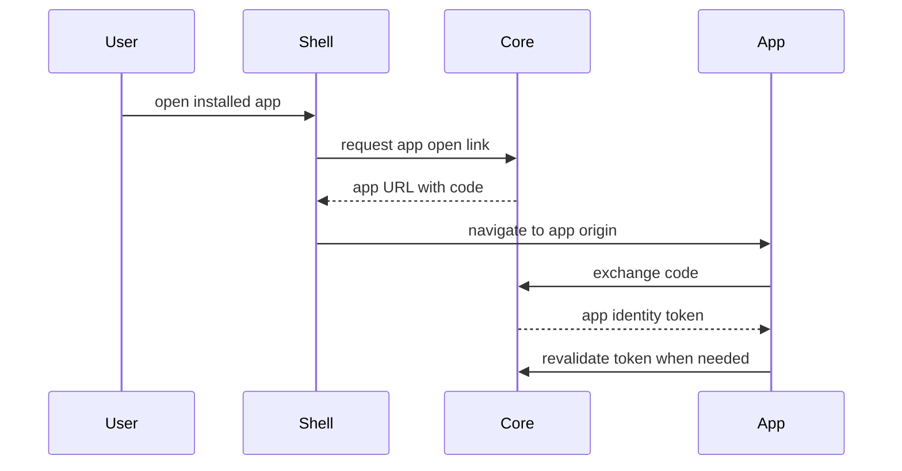

# Auth And Gateway Model

## Description

Hosty Core owns Host user authentication, app access assignment, app identity issuance, and scoped app directory access. Runtime apps own their own app-origin sessions and app-specific permissions.

## Current Auth Flow



## Responsibilities

- Core stores Host users, sessions, invitations, and app assignments.
- Shell lists apps the current Host user can access.
- Runtime apps exchange Core-issued authorization codes for app identity tokens.
- Runtime apps keep app-owned permissions in app data.
- Core provides a scoped app directory for assigned Host users.

## App Identity

Runtime apps can validate the current Host user by calling:

```text
POST /api/auth/apps/revalidate
Authorization: Bearer <HOSTY_APP_SERVICE_TOKEN>
```

Core resolves the calling app from the service token and rejects identity tokens that were issued for a different app, so a token leaked from one app cannot be replayed against another.

Direct endpoint probes against an app origin can pass the app identity token through `Authorization: Bearer` or `X-Docker-Host-Identity`.

## Scoped App Directory

Runtime apps that need app-owned role assignment can call:

```text
GET /api/internal/apps/{appId}/directory/users
Authorization: Bearer <HOSTY_APP_SERVICE_TOKEN>
```

The response includes enabled Host users explicitly assigned to the app. It does not expose the full Host user directory.

## Gateway Status

The old Legacy Host external gateway package is retired. Future gateway or ingress work is tracked in [Gateway And App Wrapping Ideas](../ideas/gateway-and-app-wrapping.md) and should build on app identity, app assignments, and runtime app endpoints instead of legacy metadata contracts.
