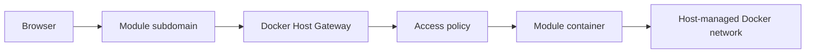

# Auth Gateway

This document captures the accepted architecture direction for Docker Host authentication, authorization, module gateway routing, realtime traffic, and module-owned permissions.

## Scope

Docker Host should be the access-control boundary for:

- Host Web UI;
- Host backend API;
- externally exposed module UIs;
- module gateway routing;
- module access assignment;
- Host-level roles and sessions.

Docker Host should not depend on a regular managed module for its own authentication. A managed identity module may exist later as an external provider or system-level integration, but the Host must be able to protect and recover its own Web UI and API independently.

## Accepted Decisions

- Module UIs use dedicated subdomains, not path-based routing.
- All external module UI traffic goes through the Host gateway by default.
- Direct public module ports are not the primary exposure model.
- Host has two initial global roles: `host.admin` and `host.user`.
- Host decides whether a user can reach a module.
- Each module owns its internal permission model.
- Modules may receive Host identity through module-scoped signed tokens.
- Modules may query only a scoped list of users relevant to that module.
- Multiple real-world accounts are modeled as multiple Host users with account switching.
- Identity profiles are deferred until there is a concrete need to link multiple external identities into one Host person.

## Gateway Routing

The target production routing model is subdomain based:

```text
host.example.com    -> Docker Host Web UI
reports.example.com -> Docker Host Gateway -> mod-reports:8080
media.example.com   -> Docker Host Gateway -> mod-media:3000
```

The Host gateway maps each module hostname to an installed module target inside the Host-managed Docker network. The target should be derived from module metadata and Host-managed runtime state:

- module id;
- Docker network alias;
- runtime port key;
- container port;
- exposure policy;
- assigned users, if applicable.

Path-based module routing is not part of the accepted target model. Many module UIs assume they run at `/`, and realtime transports are simpler on a dedicated origin.



## Exposure Policy

The module exposure model uses explicit policy states instead of the older `private` and `protected` terminology.

| Policy | Login required | Host assignment required | Behavior |
| --- | --- | --- | --- |
| `public` | no | no | Anyone who can reach the hostname can open the module UI. |
| `loginRequired` | yes | no | Any authenticated Host user can open the module. |
| `assignedUsersOnly` | yes | yes | Only selected Host users can open the module. |

These policies control only whether traffic reaches the module. They do not define what the user can do inside the module.

## Host Roles

Initial Host roles are intentionally small:

| Role | Meaning |
| --- | --- |
| `host.admin` | Can manage Host configuration, auth settings, users, module install/update/remove, exposure, and recovery. |
| `host.user` | Can access modules allowed by exposure policy and assignment state. |

Host role is included in module identity so modules can make bootstrap or admin UX decisions when appropriate. A module may decide to treat `host.admin` as an internal module administrator, but module-specific permissions still belong to the module.

## Module-Owned Permissions

Authorization has two layers:

```text
Host authorization:
  Can this Host user reach this module hostname?

Module authorization:
  What can this user do inside the module?
```

Docker Host should not centrally own every module's internal permission system. After Host grants access to the module, the module can use the Host identity to apply its own permissions.

Example module-owned permissions:

```text
user_123 -> reports.admin
user_456 -> reports.viewer
```

This lets different modules implement different domain-specific permission models while still relying on Host for login, assignment, and gateway enforcement.

## Module Identity Token

Host must not forward its own session cookie to modules. When a request is authenticated, Host should pass a short-lived signed token scoped to the target module.

Example claims:

```json
{
  "iss": "docker-host",
  "sub": "user_123",
  "aud": "com.acme.reports",
  "exp": 1790000000,
  "email": "work@example.com",
  "name": "Work User",
  "hostRole": "host.user",
  "moduleAccess": "assigned"
}
```

Rules:

- `aud` must identify the target module.
- `sub` must identify the Host user.
- `hostRole` should be `host.admin` or `host.user`.
- public unauthenticated requests should not include a user token.
- modules should validate tokens against a Host JWKS endpoint or configured public key.

Host may pass convenience headers, but the signed token should be the authoritative identity artifact.

## Realtime Traffic

Gateway authorization can work with WebSockets, SignalR, Server-Sent Events, and long polling.

For realtime transports:

- Host checks access before the initial HTTP request or WebSocket upgrade reaches the module.
- SignalR-style negotiation endpoints must be routed and authorized consistently with the final transport endpoint.
- WebSocket identity is established at handshake time.
- Host should be able to close active gateway connections when a session is revoked or module access changes.
- Long-lived connections need a defined maximum lifetime or revalidation policy.

Subdomain routing is preferred because realtime applications often assume stable root-relative URLs and a dedicated origin.

## Account Switching

The accepted MVP direction is not to introduce mandatory identity profiles. Instead, different real-world accounts are represented as different Host users:

```text
personal@example.com -> host.admin
work@example.com     -> host.user
```

The Web UI should eventually support quick account switching, similar to common account switchers in Google, GitHub, or Microsoft products. When a module is opened, the Host session selected for that module determines which `sub`, email, and Host role appear in the module identity token.

Host may later remember a preferred account per module hostname, but this is a user-experience feature, not a separate identity model.

Identity profiles remain a future option if Docker Host later needs to link multiple external identities into a single person.

## Scoped Module User Directory

Modules may need a list of users to assign internal permissions. They should not receive the full Host user directory by default.

Preferred model:

- Host stores users, Host roles, and module access assignment.
- Module stores module-specific roles and permissions.
- Module can call a Host internal API to list users assigned to that module.
- The API requires a module service credential, not a browser user token.

Example response:

```json
{
  "moduleId": "com.acme.reports",
  "users": [
    {
      "id": "user_123",
      "email": "work@example.com",
      "displayName": "Work User",
      "hostRole": "host.user"
    }
  ]
}
```

For `loginRequired` modules, the exact directory behavior is still open: a module may need all authenticated users, users who have opened the module before, or only users explicitly assigned later.

## External Providers

The Host auth model should support multiple authentication provider modes:

- local auth for standalone/local-first installs;
- generic OIDC for Auth0, Keycloak, Authentik, ZITADEL, Microsoft Entra ID, Google Workspace, and similar providers;
- trusted proxy mode for Cloudflare Access, Pomerium, Authentik proxy, oauth2-proxy, and similar deployments.

External providers authenticate users. Docker Host still owns:

- Host role assignment;
- module access assignment;
- module exposure policy;
- Host sessions;
- module-scoped identity tokens;
- audit events.

## Developer Mode

Module development should not require every change to run through a full Host install flow.

Supported target modes:

```text
Standalone:
  module dev server -> http://localhost:3001
  auth -> mock user or local test token

Integrated:
  reports.localhost -> Docker Host Gateway -> http://host.docker.internal:3001
  auth -> real Host session and module-scoped token
```

Integrated development should be used to verify:

- metadata;
- dependency URLs;
- storage mappings;
- gateway routing;
- module identity tokens;
- realtime transports;
- module access policies.

## Open Questions

- Should local `localhost` Host instances require login by default?
- Should `host.admin` always be accepted as module admin/bootstrap identity, or should each module opt in?
- Should Host remember a preferred account per module hostname?
- Which persistence backend should own users, sessions, assignments, signing keys, and audit events?
- How should signing keys be rotated?
- What exact revalidation policy should long-lived realtime connections use?
- Should `loginRequired` modules be able to query all Host users, users who have opened the module, or only users explicitly assigned later?
- What module service credential should be used for module-to-Host internal APIs?
