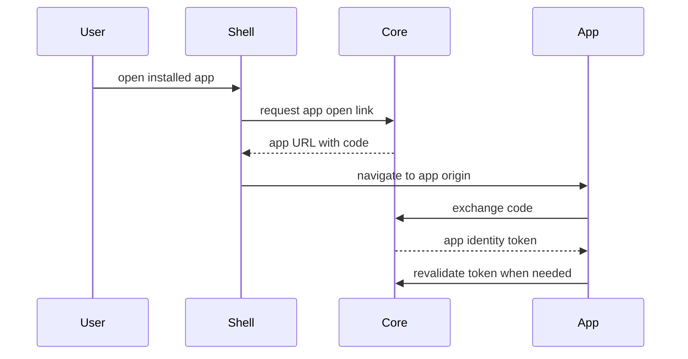

# Auth And Gateway Model

Created: 2026-05-13
Updated: 2026-07-29

## Description

Hosty Core owns Host user authentication, app access assignment, app identity issuance, and scoped app directory access. Runtime apps own their own app-origin sessions and app-specific permissions.

## Current Auth Flow



## Session Credentials

A Host user session is a server-side record; the credential that points at it can travel two ways.

- **Cookie** (`hosty_session`, `HttpOnly`) — how a browser holds a session. Because a browser attaches it to any request to the origin, including one a hostile page provoked, mutating endpoints additionally require the double-submit CSRF pair (`hosty_csrf` cookie plus `X-Hosty-CSRF` header).
- **Bearer** (`Authorization: Bearer <session id>`) — how a non-browser client holds the same session. It is attached deliberately by a client that possesses the session id, and page script cannot read that id because the cookie is `HttpOnly`, so a cross-origin page cannot forge one. Bearer-presented requests are therefore CSRF-exempt.

The bearer form creates no new credential type: same record, same 7-day idle and 30-day absolute windows, same instant revocation, same explicit-logout cascade over app grants.

Two rules keep the exemption from becoming a hole:

1. **The cookie wins.** Resolution reads the cookie first and only falls back to the header. If a request carrying a session cookie could move onto the bearer path by adding a header, it would move itself out of the CSRF check.
2. **Only an actual bearer session is exempt.** A request presenting no credential at all is treated exactly as before the bearer path existed.

Native clients use the bearer form for a second reason beyond CSRF: cookies are not isolated by port (RFC 6265), so two Hosty hosts reachable at one address on different ports would share a cookie jar and overwrite each other's sessions. See [Swift Shell](../swift-shell/plan.md).

## Responsibilities

- Core stores Host users, sessions, invitations, and app assignments.
- Shell lists apps the current Host user can access.
- Runtime apps exchange Core-issued authorization codes for app identity tokens.
- Runtime apps keep app-owned permissions in app data.
- Core provides a scoped app directory for assigned Host users.

## App Identity

Runtime apps can validate the current Host user by calling:

```text
POST /api/auth/apps/revalidate
Authorization: Bearer <HOSTY_APP_SERVICE_TOKEN>
```

Core resolves the calling app from the service token and rejects identity tokens that were issued for a different app, so a token leaked from one app cannot be replayed against another.

Direct endpoint probes against an app origin can pass the app identity token through `Authorization: Bearer` or `X-Docker-Host-Identity`.

## Scoped App Directory

Runtime apps that need app-owned role assignment can call:

```text
GET /api/internal/apps/{appId}/directory/users
Authorization: Bearer <HOSTY_APP_SERVICE_TOKEN>
```

The response includes enabled Host users explicitly assigned to the app, plus enabled Host admins (who have implicit access to every app and are never stored as explicit assignments). It does not expose the full Host user directory.

## Gateway Status

The old Legacy Host external gateway package is retired, along with its ingress UI and metadata contracts.

Public traffic reaches runtime apps through [Cloudflare Ingress](../cloudflare-ingress/feature.md): services listen only on loopback, and an operator-run Cloudflare Tunnel routes by hostname to the right loopback port. Core never runs a reverse proxy itself.

Browser app launch does not go through a gateway at all. A Hosty-aware runtime app redirects to Core, exchanges an app authorization code, and creates its own app-local session on its own origin — the flow described above.

Gateway concerns neither of those covers, chiefly wrapping an app that has no Hosty-aware auth of its own, are recorded in [Gateway And App Wrapping Ideas](../../ideas/gateway-and-app-wrapping.md).

## Testing Expectations

- Session resolution accepts a cookie and a bearer credential, with the cookie taking precedence when both are present.
- CSRF is enforced for cookie-presented sessions and for requests presenting no credential, and skipped only for a bearer.
- A revoked, expired, or unknown session fails identically on both credential paths.
- Logout revokes the session and cascades to the app grants it authorized, whichever way the session was presented.
- App identity tokens issued for one app are rejected when replayed against another.
- The scoped app directory returns assigned users plus enabled admins, and never the full Host user directory.
