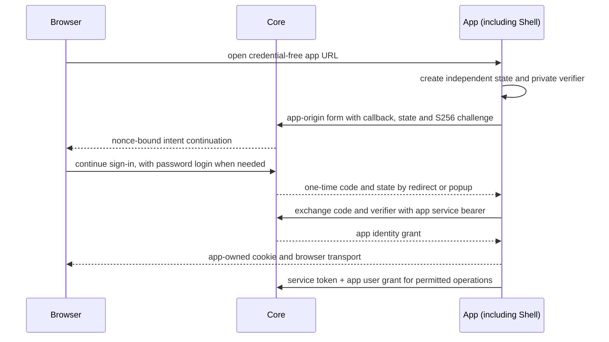

# Auth And Gateway Model

## Description

Hosty Core owns Host user authentication, app access assignment, app identity issuance, and scoped app directory access. Runtime apps own their own app-origin sessions and app-specific permissions.

Core's local login verifies email/password in every environment, including source/IDE Development
launches. There is no environment-based user impersonation endpoint. New accounts use setup or
invitations; passwordless legacy development accounts use explicit recovery. See
[Local Password Login](../local-password-login/feature.md).

## Current Auth Flow


```mermaid
sequenceDiagram
  participant Browser
  participant Core
  participant App as App (including Shell)
  Browser->>App: open credential-free app URL
  App->>App: create independent state and private verifier
  App->>Core: app-origin form with callback, state and S256 challenge
  Core-->>Browser: nonce-bound intent continuation
  Browser->>Core: continue sign-in, with password login when needed
  Core-->>App: one-time code and state by redirect or popup
  App->>Core: exchange code and verifier with app service bearer
  Core-->>App: app identity grant
  App-->>Browser: app-owned cookie and browser transport
  App->>Core: service token + app user grant for permitted operations
```

The app creates independent 256-bit state and a private verifier from 32 random bytes. Its app-owned form submits
an approved callback and public S256 challenge to `POST /api/apps/{appId}/sign-in-intent`. Core
requires an exact non-null app Origin and the appropriate browser navigation context. It freezes a
five-minute intent and stores only the nonce hash. HTTPS and HTTP literal-IP origins set a unique
HttpOnly browser nonce cookie and return a 303 to `/api/apps/{appId}/open?requestId=...`. HTTP on
canonical `localhost` or `.localhost` Core hosts returns Core-origin HTML that stores the nonce in
that context's `sessionStorage` and submits it in the body of a navigation POST to the same
continuation. This POST requires the exact Core Origin and the intent's frozen navigation mode.
The immutable continuation verifies the nonce before login or issuance and claims the intent once
after normal account and access checks. A named-HTTP GET only returns reader HTML for an existing
stored proof; it cannot create a nonce or issue a code.

Core delivers the five-minute single-use code directly to the app's validated origin. Popup
responses carry only code and state; the app checks the original response window, Core origin and
initiation state. Silent initial sign-in requires an iframe and establishes identity only. A missing
Core session or unavailable nonce on a known same-app silent intent returns the frozen callback's
state-bound `login_required` error; denied access returns `access_denied`. Core never frames its
password login. Unavailable Core nonce storage also fails closed: popup recovery returns an
actionable error without credentials, and no plain-cookie fallback exists for named HTTP hosts.
Other missing-nonce contexts fail closed.

The app server exchanges JSON `{ code, codeVerifier }` at `/api/auth/apps/token` with
`Authorization: Bearer <HOSTY_APP_SERVICE_TOKEN>`. Under one store lock, Core checks the calling app
and constant-time S256 proof before consuming the code. Missing or invalid service credentials
return 401 `app_service_token_invalid`; wrong app or proof returns 401 `invalid_code` without
consuming a valid target code. Correct-proof replay and expiry retain `code_consumed` and
`code_expired`. Existing unbound code records are refused; already-issued grants retain their
lifecycle. Public app handlers reject missing or malformed proof locally before contacting Core,
and exchange requests refuse redirects. Refusal audits contain known app IDs and reasons, never
codes, verifiers, challenges, nonces or service credentials.

Ordinary validated `/open?redirectUri=...` links bootstrap the app without issuing a code or choosing
a user. The app creates its own attempt after arrival. Direct proof-bearing GET issuance is refused;
native Shell intercepts a specifically validated app-origin request before network dispatch and uses
the authenticated challenge-bearing launch API. This transport exception does not expose the private
verifier. See [App Code Exchange](../app-code-exchange/feature.md) for the complete intent, proof,
protocol-discovery and native renewal contracts.

Shell's own callback validates its state and private verifier from separate short-lived HttpOnly
attempt cookies before exchanging and revalidating its own grant. Core-owned credential-issuance and
consent pages use Core's primary cookie directly, and Core serves their executable assets. They
reject framing and non-navigation reads and provide no credentialed CORS exception to Shell.
Shell mounts app-owned documents and receives no target app code, verifier or grant; it does not
mint or redeem their credentials. Harness MCP consent and remaining browser acceptance are tracked
in [local browser origins](../local-browser-origins/plan.md).

## Session Credentials

A Host user session is a server-side record; the credential that points at it can travel two ways.

- **Cookie** (`hosty_session`, `HttpOnly`) — how a browser holds a session. Because a browser attaches it to any request to the origin, including one a hostile page provoked, mutating endpoints additionally require the double-submit CSRF pair (`hosty_csrf` cookie plus `X-Hosty-CSRF` header).
- **Bearer** (`Authorization: Bearer <session id>`) — how a non-browser client holds the same session. It is attached deliberately by a client that possesses the session id, and page script cannot read that id because the cookie is `HttpOnly`, so a cross-origin page cannot forge one. Bearer-presented requests are therefore CSRF-exempt.

The bearer form creates no new credential type: same record, same instant revocation, same explicit-logout cascade over app grants. A browser session carries a 7-day idle and a 30-day absolute window; a record marked as an access token is judged by its own longer idle window and no absolute cap at all — see [Access Tokens](../access-tokens/feature.md), which is how a client with no browser obtains one of these records in the first place.

Two rules keep the exemption from becoming a hole:

1. **The cookie wins.** Resolution reads the cookie first and only falls back to the header. If a request carrying a session cookie could move onto the bearer path by adding a header, it would move itself out of the CSRF check.
2. **Only an actual bearer session is exempt.** A request presenting no credential at all is treated exactly as before the bearer path existed.

Native clients use the bearer form for a second reason beyond CSRF: cookies are not isolated by port (RFC 6265), so two Hosty hosts reachable at one address on different ports would share a cookie jar and overwrite each other's sessions. See [Swift Shell](../swift-shell/feature.md).

## Responsibilities

- Core stores Host users, sessions, invitations, and app assignments.
- Shell lists apps the current Host user can access.
- Runtime apps exchange Core-issued authorization codes for app identity tokens.
- Runtime apps keep app-owned permissions in app data.
- Core provides a scoped app directory for assigned Host users.

## User Access And App Authority

Core uses two independent checks for app management calls. The service token identifies the app;
its opaque app grant identifies the user. Core revalidates the user grant, checks the calling app's
current persisted permissions and retains the endpoint's user-role/assignment check. App grants
never turn a `host.user` into an administrator. User authority is currently role-based; per-user
management permission sets are not part of this contract.

Enabled administrators can access every installed app. Other users can access only explicitly
assigned apps, including system apps and Shell. Assignment selection includes both kinds.
An app's own API may impose additional operation-level roles.

Standalone sign-in does not require Shell. The SDK submits its own proof-bound intent to Core;
normal password login preserves that intent's request ID. Core resumes the immutable continuation,
checks access and returns a one-time code only to a registered origin of that particular app.
Registered local browser origins and explicit public origins are supported independently of ingress.
Removing the assignment denies subsequent issuance and revalidation. Harness MCP consent and remaining
browser acceptance are tracked in [local browser origins](../local-browser-origins/plan.md).

Authorization codes are one-time and expire after five minutes. Exchanging one rechecks the user,
their disabled state, the installed app and its assignments. A redirect URI must be an absolute
`http` or `https` URI without a fragment (`redirect_uri_invalid`) on a registered origin of that
app. Runtime apps never receive Core's session cookie: each keeps an app-specific `HttpOnly` session
on its own origin and revalidates it through Core. The Demo App's `/api/auth/app-code` and
`/api/auth/identity` routes are the reference implementation.

## App Identity

Runtime apps can validate the current Host user by calling:

```text
POST /api/auth/apps/revalidate
Authorization: Bearer <HOSTY_APP_SERVICE_TOKEN>
```

Core resolves the calling app from the service token and rejects identity tokens that were issued for a different app, so a token leaked from one app cannot be replayed against another.

Direct endpoint probes against an app origin can pass the app identity token through `Authorization: Bearer` or `X-Docker-Host-Identity`.

## App Sessions And Recovery

App grants are opaque `hostyg_` credentials backed by hash-only Core records. Revalidation checks
user enablement, app access and the auth revision, slides the idle window and respects absolute
expiry. `expiresInSeconds` describes the remaining absolute lifetime; app cookies derive their
`Max-Age` from it. Explicit Core logout revokes the grants it authorized. Ordinary Core-session
expiry does not end established app identity. See [session lifecycles](../auth-session-lifecycle/feature.md).

The app validates its own grant, writes an app-origin HttpOnly cookie and returns the grant to its
own browser transport. Embedded SDK documents also retain it in app-origin `sessionStorage` for the
tab and restore it before their first identity probe. Standalone documents rely on their first-party
cookie and do not write the grant to storage; `localStorage` is never used. Blocked storage falls
back to document memory. The embedder cannot read the app's cross-origin storage, code or grant.
The SDK's `appFetch` sends a bearer grant only to the app's own origin and refuses redirects, taking
precedence over a stale app cookie. The Harness server keeps credentials out of durable session records.

Explicit `token_invalid`, `token_revoked`, `token_expired` and `token_app_mismatch` rejection, or
`forgetAppGrant`, clears the in-memory and stored grant. `reauth_required` retains it: app identity
and privileged [activity](../app-activity-window/feature.md) are separate. Silent codes establish
identity only. Privileged Core calls still need the app's confirmed permissions, current user and
activity window; the app-owned popup renews activity without giving Shell target-app authority.

Apps classify Core 401 as recoverable, 403 as terminal denied access, and network/503 failures as
unavailable. Recovery never auto-redirects a denied user or deletes a cookie on a transient outage.
Standalone recovery uses a once-per-tab loop guard. Initial embedded resolution without a usable
grant can try silent sign-in once; later recovery uses the app-owned popup from a user gesture.
A mounted app keeps its content and unsaved work during identity or activity expiry and never starts
a silent reload after it has been active. See [Embedded App Sign-In](../embedded-app-sign-in/feature.md).

Navigation proof lives in bounded app-origin sessionStorage for five minutes and is verified by a
storage round trip before full-document navigation. Failed storage leaves explicit popup recovery
available. Matching callback state selects only the locally created attempt, consumes its proof
once and cleans code/state from the URL before exchange. Public fields cannot import a verifier.
Popup and renewal proof stays in the initiating app's memory; stale or duplicate completion cannot
exchange a newer attempt. Pending proof and established grant lifetimes remain separate.

## Browser Origins And Integration

`HOSTY_CORE_ORIGIN` is the server-reachable Core origin for exchange, revalidation and scoped APIs.
`HOSTY_CORE_PUBLIC_ORIGIN` is the browser-reachable origin for navigation and popup recovery.
`HOSTY_APP_ID` identifies the installed app; `HOSTY_APP_SERVICE_TOKEN` authenticates its server.
Service credentials stay on the server, outside browser code, cookies, URLs and log output.

[Local browser origins](../local-browser-origins/feature.md) give Core and each app distinct generated
hostnames, including a non-default instance suffix. [Explicit public origins](../public-origins/feature.md)
retain their configured hostnames. Browser intents require Core's cookie hostname to be distinct from
all configured runtime endpoints, including internal, generated, public, private and non-HTTP origins.
HTTPS uses unique `__Host-` nonce cookies with Secure, HttpOnly, Path=/, no Domain, SameSite=Lax and a
five-minute lifetime. HTTP literal-IP Core hosts retain the isolated cookie flow; canonical
`localhost` and `.localhost` Core hosts use the Core-origin nonce storage and body-proof POST flow.
Other HTTP DNS hosts are refused. All accepted hosts still require isolation from registered app
cookie hosts. The source development profile uses Core `[::1]` and app `localhost` names. Unsafe
topology receives an actionable refusal; canonical checks cover IPv4 aliases, IPv6, IDN, case and
trailing dots.

App cookies use `SameSite=None; Secure` over HTTPS and `SameSite=Lax` over plain HTTP. The SDK's
own-origin bearer transport covers embedded documents where app cookies are unavailable. A shared
DNS suffix alone is not evidence that Core's Lax cookie reaches an embedded frame. Keep app-specific
cookie namespaces, validate redirect origins and use explicit message target origins. Cookies ignore
ports, so a listener on another port of a Core or app hostname can receive that hostname's cookies;
origin-scoped app storage does not change this boundary.

Apps declare a public UI endpoint and entrypoint in their manifest, and use the SDK server handler,
React bridge and `appFetch` for app-owned exchange, recovery and protected API transport. The Demo
App exercises `/api/auth/app-code` and `/api/auth/identity` through Core-managed lifecycle. Shell's
app-origin embedding and sandbox behavior belong to [Core App Shell](../core-app-shell/feature.md).

## Scoped App Directory

Runtime apps that need app-owned role assignment can call:

```text
GET /api/internal/apps/{appId}/directory/users
Authorization: Bearer <HOSTY_APP_SERVICE_TOKEN>
```

The response includes enabled Host users explicitly assigned to the app, plus enabled Host admins (who have implicit access to every app and are never stored as explicit assignments). It does not expose the full Host user directory.

## Gateway Status

The old Legacy Host external gateway package is retired, along with its ingress UI and metadata contracts.

Public traffic reaches runtime apps through [Cloudflare Ingress](../cloudflare-ingress/feature.md): services listen only on loopback, and an operator-run Cloudflare Tunnel routes by hostname to the right loopback port. Core never runs a reverse proxy itself.

Browser app launch does not go through a gateway at all. A Hosty-aware runtime app redirects to Core, exchanges an app authorization code, and creates its own app-local session on its own origin — the flow described above.

Wrapping an app that has no Hosty-aware auth of its own is part of [app authoring](../app-authoring/plan.md)'s work on adapting existing apps.

## Testing Expectations

- Session resolution accepts a cookie and a bearer credential, with the cookie taking precedence when both are present.
- CSRF is enforced for cookie-presented sessions and for requests presenting no credential, and skipped only for a bearer.
- A revoked, expired, or unknown session fails identically on both credential paths.
- Logout revokes the session and cascades to the app grants it authorized, whichever way the session was presented.
- App identity tokens issued for one app are rejected when replayed against another.
- Authorization codes are consumed once, expire after five minutes, and recheck access on exchange; redirect URIs with a fragment, a non-HTTP scheme or an unregistered origin are rejected.
- The scoped app directory returns assigned users plus enabled admins, and never the full Host user directory.
- Missing, invalid and wrong-app service credentials or proof cannot consume a target app's code;
  the matching caller can subsequently redeem it. Single use, expiry, access/revision checks,
  parent-session logout and identity-only silent grants retain their existing rules.
- Intents enforce exact/null/foreign Origin, navigation modes, immutable continuation and nonce
  verification before login or issuance. Relayed links and direct proof GETs cannot issue a code;
  legitimate parallel attempts stay independent and each intent claims at most one code.
- Nonce cookies enforce canonical separation from every runtime endpoint cookie host, and refusal
  audits exclude verifiers, challenges, nonce cookies and credentials.
- App APIs prefer the own-origin bearer to a stale cookie and revalidate with their service token.
  Callback correlation, blocked storage and stale/duplicate completion cannot import or reuse proof.
- Core-managed normal password-login acceptance covers standalone, silent embedded and popup entry,
  per-tab grant restoration, identity denial, transient outage and mounted expiry without discarding
  app state. Activity expiry retains the grant while explicit identity rejection clears it.
