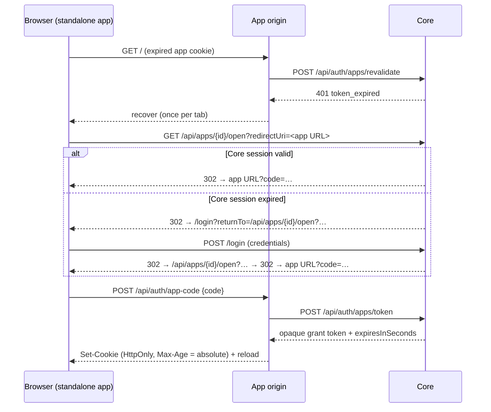

# Auth Session Lifecycle And Recovery

Created: 2026-07-13
Updated: 2026-09-06

How a Hosty app session begins, how long it lives, and how a browser that lost one gets back in.
Two credentials are in scope: the **Core browser session** (`hosty_session`, the signed-in Host user)
and the **app session grant** (the per-app HttpOnly identity cookie a runtime app holds for that
user). Both are opaque server-side records with a sliding idle window under an absolute cap, and both
recover through Core `/login` — the only authentication UI in the system.

The behavior below replaced fixed 24-hour app tokens and fixed 12-hour Core sessions, which
dead-ended a standalone app overnight with no way back.

## Identity Error Contract

`AuthEndpoints.MapIdentityErrorStatus` is the normative table. It maps each `AppIdentityException`
code to a status class, so an app can tell "re-authorize" from "you are not allowed here":

| Status | Meaning | Codes |
| --- | --- | --- |
| **401** | Recoverable — the code or token is invalid, expired, consumed, or revoked | `invalid_code`, `code_expired`, `code_consumed`, `token_invalid`, `token_expired`, `token_revoked` |
| **403** | Terminal — the user is authenticated but not allowed | `user_not_found`, `user_disabled`, `app_access_denied`, `system_app_admin_required`, `token_app_mismatch`, `redirect_uri_denied`, `app_not_found`, and any unmapped code |
| **400** | Caller input | `redirect_uri_invalid` |
| **500** | Server fault | `signing_key_unavailable` |

503 is app-side only (Core unreachable or timing out) and is never a Core identity status.

App-side rules, implemented once in [`@hosty-sdk/app`](../hosty-app-sdk/feature.md) and consumed by
the fleet: 401 drops the app cookie and starts recovery; 403 renders an access-denied state and never
auto-redirects (the redirect-loop guard); 503 keeps the cookie and offers retry, so a transient Core
outage is not a logout. Apps classify on the status, not on the code string — code strings pass
through for logging only, which is why moving a code between 401 and 403 is a breaking contract change
and reviewed as one.

## App Session Grants

The browser app token is an opaque value, not a signed JWT: it is presented **to Core** on every
revalidation, so it belongs in the opaque row of the platform token rule
([ai-agent-bridge](../ai-agent-bridge/feature.md#token-mechanics)). Signing bought nothing there and
cost revocation.

`AppSessionGrantStore` persists `AppSessionGrantRecord` to `auth/app-grants.json`:

```csharp
internal sealed record AppSessionGrantRecord(
    string Id,
    string AppId,
    string UserId,
    string TokenHash,               // SHA-256; the raw hostyg_ value is returned once, never stored
    string IssuedVia,               // "code" (browser exchange) | "cli-diagnostic"
    DateTimeOffset CreatedAt,
    DateTimeOffset LastSeenAt,
    DateTimeOffset AbsoluteExpiresAt,
    DateTimeOffset? RevokedAt,
    string? AuthorizingSessionId);  // audit + explicit-logout cascade only
```

- The raw token is 256 bits of randomness behind a `hostyg_` prefix (`AppIdentityService`), returned
  once at issuance; Core keeps only its hash, so the store is not a credential.
- A grant is valid when it is not revoked, `now < AbsoluteExpiresAt`, and `now` is inside
  `LastSeenAt + idle TTL`. Revalidation resolves the hash, applies the same
  `RequireAccessibleUserAsync` policy checks as before (user disabled, app assignment, role,
  system-app admin), and slides the idle window by advancing `LastSeenAt` — throttled to one write per
  5 minutes, because revalidation runs on every server render and the store is a rewritten JSON file.
- **Grants outlive the authorizing Core session.** Tying them to session liveness would kill every app
  session with the Core session and defeat the feature. `AuthorizingSessionId` drives a cascade only on
  *explicit* logout (`RevokeByAuthorizingSessionAsync`, also used when an access token is revoked), not
  on session expiry. Admin-side revocation works through the policy re-check on every revalidation.
- Expired and revoked grants are pruned opportunistically on write; revoked records linger 7 days so
  revocation is observable in diagnostics.
- The wire contracts are unchanged from the JWT era — `/api/auth/apps/token`, `/api/auth/apps/revalidate`,
  the app cookie mechanics, and the `X-Docker-Host-Identity` header all kept their shapes; only the
  token value's format differs. `expiresInSeconds` is the grant's absolute lifetime, and apps set their
  cookie `Max-Age` from it.
- `hosty apps identity <app> --user <email>` issues a `cli-diagnostic` grant through the same path.
  These are probe credentials, not sessions, and get a single short fixed lifetime.

## Core Sessions

`AuthSessionRecord` carries `LastSeenAt` alongside its absolute `ExpiresAt`. `CoreSessionAuthorization`
extends the idle window on authenticated use under the same 5-minute write throttle, and dead records
are pruned on write (revoked ones retained 7 days). The session cookie's `Expires` is the absolute cap,
so an extension needs no cookie re-issue — the idle window is enforced server-side, which is where the
implementation deviated from the original design sketch and stayed.

**A refusal says which of those happened**, the way the app-session path always has: `session_revoked`
("has been revoked"), `session_expired` ("has reached its maximum lifetime" / "has been idle too
long"), and `session_missing` for a request carrying no credential at all — which names both ways one
can be presented, since a bearer client was never going to send a cookie. Between the two expiries the
sentence names the **earlier deadline**, not whichever condition is tested first: a long-abandoned
session is past both windows, and the one that elapsed first is the one that killed it. `session_invalid` is left
to mean what it can actually prove — no record answers to this id — rather than standing in for all
three. `IsSessionLive` still makes the decision alone and the explanation is derived from the record
afterwards, so a liveness rule added there degrades the message to `session_invalid` instead of
answering a confidently wrong reason. All of them stay 401, which is what clients branch on.

The credential is named for what it is: an access token presented to a `/api` route is refused as an
access token, not as a Core session it never was — the OAuth case, where "Core session is missing,
expired, or revoked" read as an expiry against a grant an operator had just revoked
([mcp-oauth](../mcp-oauth/feature.md)). The answer is as durable as the record: revoked records live
7 days by the retention above, expired ones are dropped at the next session write, and once a record
is gone the honest answer is the vague one.

This is not the [introspection](../scoped-access-tokens/feature.md) rule inverted. There, an *app*
asks Core about a token, and every refusal answers `active: false` alone so an app cannot probe for
credentials it does not hold. Here the credential is presented by its holder — naming the reason
tells them something only they could ask about, since asking takes the opaque id itself.

## Lifetimes

Defaults live in `AuthLifetimes`, in days rather than hours: every revalidation re-checks
role/assignment/disabled online and grants are instantly revocable, so short TTLs recreate the
daily-login problem without buying real security.

| Credential | Idle | Absolute | Environment override |
| --- | --- | --- | --- |
| Regular app grant | 7 days | 30 days | `HOSTY_AUTH_APP_GRANT_IDLE_HOURS` / `HOSTY_AUTH_APP_GRANT_ABSOLUTE_HOURS` |
| System-app grant | 3 days | 14 days | `HOSTY_AUTH_SYSTEM_GRANT_IDLE_HOURS` / `HOSTY_AUTH_SYSTEM_GRANT_ABSOLUTE_HOURS` |
| CLI-diagnostic grant | 12 hours (fixed) | 12 hours | `HOSTY_AUTH_CLI_GRANT_HOURS` |
| Core browser session | 7 days | 30 days | `HOSTY_AUTH_CORE_SESSION_IDLE_HOURS` / `HOSTY_AUTH_CORE_SESSION_ABSOLUTE_HOURS` |
| Access token | 90 days | — | `HOSTY_AUTH_ACCESS_TOKEN_IDLE_HOURS` |

`AuthLifetimes` is no longer a startup snapshot: `CoreSettingsService` owns the values and the record
is resolved per use, so operator edits from the platform panel apply live — idle immediately, absolute
for credentials issued afterwards (see [core-settings](../../ideas/core-settings.md)). Access tokens
get their own, longer idle window because a credential in a keychain is not a browser tab
([access-tokens](../access-tokens/feature.md)).

## Recovery — Standalone

A top-level app navigates to `{HOSTY_CORE_PUBLIC_ORIGIN}/api/apps/{appId}/open?redirectUri=<current URL>`,
at most once per browser tab; the SDK's loop guard turns every further attempt into an explicit link
rather than another redirect.



`/api/apps/{appId}/open` resolves the navigation session first: a missing or expired session redirects
to `/login?returnTo=<this request>` instead of returning JSON a browser cannot act on, while a
valid-but-denied account keeps its 403 rather than bouncing to a login that would reject it anyway.

Both redirect targets are validated server-side. `redirectUri` is checked against the app's registered
endpoint origins (`RequireAllowedRedirectUriAsync`), so a code minted for one app can only be delivered
to that app's origin. `returnTo` accepts two relative shapes and nothing else: a Core-relative
`/api/apps/{id}/open` continuation, or any other relative path resolved against the Shell origin —
the second exists because a destination inside Shell (the device-authorization approval screen, where
someone is waiting) otherwise cannot survive a sign-in. Protocol-relative values, backslashes, control
characters, and absolute URLs are rejected; anything unrecognized falls back to the Shell origin, and
to null on a host with no Shell.

## Recovery — Embedded

The Shell embed iframe sandbox is not loosened, so an embedded app cannot navigate the top window.
Recovery is a `postMessage` instead: the app posts `{ type: "hosty:auth-required", appId }` (no secrets
in the payload) to `window.parent`. Shell verifies that `event.source` is the active frame's
`contentWindow`, that `event.origin` matches that app's endpoint origin, and that the `appId` matches
the mounted app; only then does it reissue a launch code and swap the iframe `src`, rate-limited to one
reissue per app per 3 seconds. Both halves ship in the SDK — `parseActiveFrameAuthRequired` and
`createReissueRateLimiter` in `@hosty-sdk/app/embedder` — and Shell consumes them, so the reference
implementation and the shipped artifact are the same code.

Apps pick the channel by embedding detection. An embedded app whose parent stays silent past a timeout
(a non-Shell embedder) falls back to a plain message whose link opens the standalone recovery URL in a
new tab, which `allow-popups` permits.

## Boundaries

- Browser app tokens are never signed for app-local verification. Signed short-TTL tokens stay reserved
  for delegated agent-bridge tokens, per the token rule in
  [ai-agent-bridge](../ai-agent-bridge/feature.md#token-mechanics).
- Grant validity is never coupled to Core session liveness; `AuthorizingSessionId` cascades only on
  explicit logout or admin revoke.
- Core session cookies are never forwarded to app origins or gateway targets
  ([gateway-and-app-wrapping](../../ideas/gateway-and-app-wrapping.md)).
- The Shell embed iframe sandbox keeps `allow-top-navigation*` off.
- `returnTo` and `redirectUri` are always validated server-side; no raw absolute URL from a query
  parameter is followed.
- On 503 an app keeps its session cookie and does not trigger recovery navigation.
- Apps render no login UI of their own: Core `/login` is the only authentication surface, and an app's
  job is the two reflexes (post `hosty:auth-required` when embedded, navigate to `/open` when
  standalone) plus staying quiet while they run.

## Testing Expectations

- Every identity error code maps to its documented status class, asserted per code rather than per
  class — the table is the contract apps branch on, and a code silently moving between 401 and 403 is
  the regression that matters.
- Grant validity in all four dimensions: revoked, absolutely expired, idle-expired, and live; plus the
  policy re-check (disabled user, removed assignment, non-admin against a system app) still refusing a
  structurally valid grant.
- A Core session refusal names its cause across the same dimensions — revoked, past its cap, idled
  out, and an id no record answers to — each a distinct code or sentence, and a revoked *access
  token* refused as an access token rather than as a session.
- The idle slide is throttled — repeated revalidation inside the throttle window writes once — and a
  grant that keeps being used never crosses its absolute cap.
- Explicit logout revokes the session's grants; session *expiry* does not.
- `/api/apps/{appId}/open` redirects an unauthenticated browser navigation to `/login?returnTo=…`
  rather than returning JSON, and returns 403 unchanged for a denied account.
- `returnTo` hardening in both directions: the two accepted relative shapes work, and
  protocol-relative, backslash, control-character, and absolute values fall back to the Shell origin.
- Pruning drops expired and long-revoked records while keeping live ones, for both stores.
- The embedded responder rejects a message from a foreign `event.source`, a mismatched origin, or a
  mismatched `appId`, and rate-limits repeated reissues.
