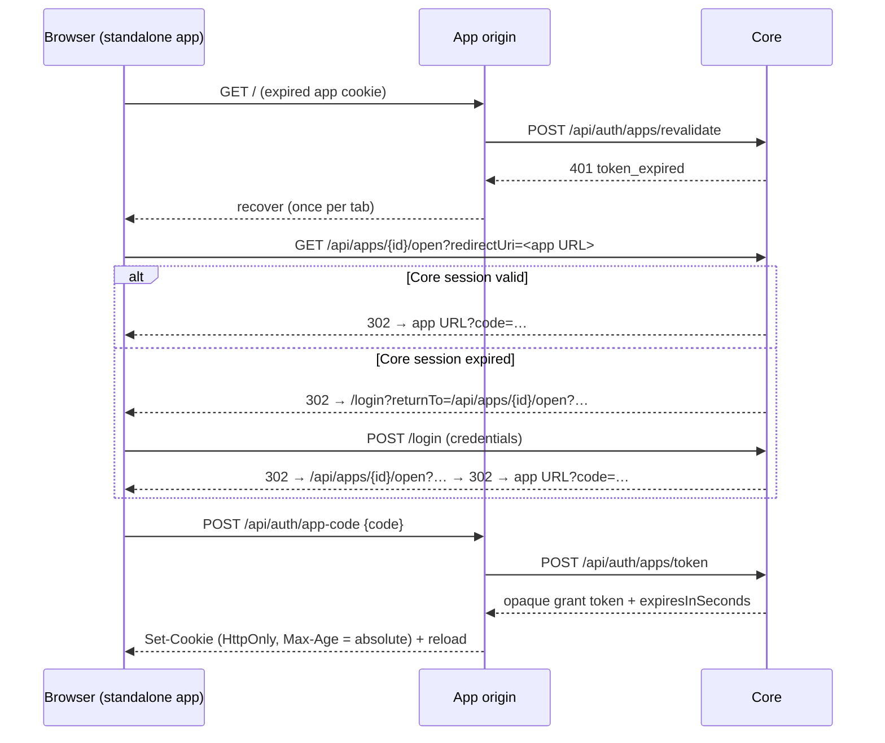

# Auth Session Lifecycle And Recovery

Created: 2026-07-13
Updated: 2026-10-05

How a Hosty app session begins, how long it lives, and how a browser that lost one gets back in.
Two credentials are in scope: the **Core browser session** (`hosty_session`, the signed-in Host user)
and the **app session grant** (the per-app HttpOnly identity cookie a runtime app holds for that
user). Both are opaque server-side records with a sliding idle window under an absolute cap, and both
recover through Core `/login` — the only authentication UI in the system.

The behavior below replaced fixed 24-hour app tokens and fixed 12-hour Core sessions, which
dead-ended a standalone app overnight with no way back.

## Identity Error Contract

`AuthEndpoints.MapIdentityErrorStatus` is the normative table. It maps each `AppIdentityException`
code to a status class, so an app can tell "re-authorize" from "you are not allowed here":

| Status | Meaning | Codes |
| --- | --- | --- |
| **401** | Recoverable — the code or token is invalid, expired, consumed, or revoked | `invalid_code`, `code_expired`, `code_consumed`, `token_invalid`, `token_expired`, `token_revoked` |
| **403** | Terminal — the user is authenticated but not allowed | `user_not_found`, `user_disabled`, `app_access_denied`, `system_app_admin_required`, `token_app_mismatch`, `redirect_uri_denied`, `app_not_found`, and any unmapped code |
| **400** | Caller input | `redirect_uri_invalid` |
| **500** | Server fault | `signing_key_unavailable` |

503 is app-side only (Core unreachable or timing out) and is never a Core identity status.

App-side rules, implemented once in [`@hosty-sdk/app`](../hosty-app-sdk/feature.md) and consumed by
the fleet: 401 drops the app cookie and starts recovery; 403 renders an access-denied state and never
auto-redirects (the redirect-loop guard); 503 keeps the cookie and offers retry, so a transient Core
outage is not a logout. Apps classify recovery and denial by status. Machine-readable codes also
identify the specific identity rejections that clear the embedded stored grant; `reauth_required`
retains it. This cleanup does not change the recovery/denial status contract, so moving a code
between 401 and 403 is a breaking change and reviewed as one.

## App Session Grants

The browser app token is an opaque value, not a signed JWT: it is presented **to Core** on every
revalidation, so it belongs in the opaque row of the platform token rule
([ai-agent-bridge](../ai-agent-bridge/feature.md#token-mechanics)). Signing bought nothing there and
cost revocation.

`AppSessionGrantStore` persists `AppSessionGrantRecord` to `auth/app-grants.json`:

```csharp
internal sealed record AppSessionGrantRecord(
    string Id,
    string AppId,
    string UserId,
    string TokenHash,               // SHA-256; the raw hostyg_ value is returned once, never stored
    string IssuedVia,               // "code" (browser exchange) | "cli-diagnostic"
    DateTimeOffset CreatedAt,
    DateTimeOffset LastSeenAt,
    DateTimeOffset AbsoluteExpiresAt,
    DateTimeOffset? RevokedAt,
    string? AuthorizingSessionId);  // audit + explicit-logout cascade only
```

- The raw token is 256 bits of randomness behind a `hostyg_` prefix (`AppIdentityService`), returned
  once at issuance; Core keeps only its hash, so the store is not a credential.
- A grant is valid when it is not revoked, `now < AbsoluteExpiresAt`, and `now` is inside
  `LastSeenAt + idle TTL`. Revalidation resolves the hash, applies the same
  `RequireAccessibleUserAsync` policy checks as before (user disabled, app assignment, role,
  system-app admin), and slides the idle window by advancing `LastSeenAt` — throttled to one write per
  5 minutes, because revalidation runs on every server render and the store is a rewritten JSON file.
- **Grants outlive the authorizing Core session.** Tying them to session liveness would kill every app
  session with the Core session and defeat the feature. `AuthorizingSessionId` drives a cascade only on
  *explicit* logout (`RevokeByAuthorizingSessionAsync`, also used when an access token is revoked), not
  on session expiry. Admin-side revocation works through the policy re-check on every revalidation.
- Expired and revoked grants are pruned opportunistically on write; revoked records linger 7 days so
  revocation is observable in diagnostics.
- The wire contracts are unchanged from the JWT era — `/api/auth/apps/token`, `/api/auth/apps/revalidate`,
  the app cookie mechanics, and the `X-Docker-Host-Identity` header all kept their shapes; only the
  token value's format differs. `expiresInSeconds` is the grant's absolute lifetime, and apps set their
  cookie `Max-Age` from it.
- `hosty apps identity <app> --user <email>` issues a `cli-diagnostic` grant through the same path.
  These are probe credentials, not sessions, and get a single short fixed lifetime.

## Assistant Tool Grants

[Assistant session authority](../assistant-session-autonomy/feature.md#core-tool-authority) has an
additional explicit Core review: one hour or until the approving browser session ends. The latter
uses the browser's absolute expiry and continues checking its idle/revoked state. This privileged
authority cannot outlive the Core sign-in even when an ordinary app identity grant remains valid.
The assistant's native approval mode does not grant or renew Core authority.

## Account Recovery Revocation

Administrator recovery changes the user's `AuthRevision` atomically with the password and revokes
existing Core sessions. Application authorization codes and grants capture that revision. Core
rejects an old revision with `token_revoked` during code exchange and every grant revalidation,
including MCP validation through the parent grant. Old grants cannot survive recovery merely because
they normally outlive their Core session. A delayed exchange that writes an old-revision grant after
recovery also cannot restore access. Fresh authentication issues credentials with the new revision.
Legacy records omit the revision and remain compatible until that account is recovered.

## Core Sessions

`AuthSessionRecord` carries `LastSeenAt` alongside its absolute `ExpiresAt`. `CoreSessionAuthorization`
extends the idle window on authenticated use under the same 5-minute write throttle, and dead records
are pruned on write (revoked ones retained 7 days). The session cookie's `Expires` is the absolute cap,
so an extension needs no cookie re-issue — the idle window is enforced server-side, which is where the
implementation deviated from the original design sketch and stayed.

A caller that presented nothing at all answers `401 session_missing`, and the message names **both**
accepted forms — the `hosty_session` cookie and the `Authorization: Bearer` header — so a non-browser
client is told what it failed to send rather than about a mechanism it was never going to use.

A credential that was presented and refused **says which condition killed it**: `session_revoked`
("has been revoked"), or `session_expired` ("has reached its maximum lifetime" / "has been idle too
long"). The record is looked up by id first and judged live second, so the reason survives to the
refusal instead of being folded into one boolean — and `IsSessionLive` still makes the decision alone,
with the explanation derived from the record afterwards, so a liveness rule added there degrades the
message rather than naming a confidently wrong cause. `session_invalid` is left meaning what it can
prove: no record answers to this id. Distinct codes rather than one, because the identity table above
already tells `token_expired` from `token_revoked` for the app-session path, and because these are the
strings that reach a log search. All of them stay 401, which is what callers branch on.

Two rules decide which cause is named when more than one applies. Revocation is reported ahead of an
expiry that also holds — it is the deliberate act, and the one an operator is trying to confirm
landed. Between the two windows the **earlier deadline** wins, compared as deadlines rather than by
asking which has passed by now: an untouched browser session idles out on day 7 and hits its absolute
cap on day 30, so a request on day 31 is past both, and naming whichever condition was tested first
would call every long-abandoned session an absolute expiry.

The credential is named for what it is: an access token presented to a `/api` route is refused as an
access token, not as a Core session it never was — the OAuth case, where "Core session is missing,
expired, or revoked" read as an expiry against a grant an operator had just revoked
([mcp-oauth](../mcp-oauth/feature.md)). The answer is as durable as the record: revoked records live
7 days by the retention above, expired ones are dropped at the next session write, and once no record
survives — pruned, or never issued — the answer stays the vague "missing, expired, or revoked", which
is then the honest one.

Naming the cause reveals nothing about another principal. The caller already holds the credential
being described and ids are 256 bits, so "revoked" versus "never existed" is not an oracle anything
can walk. Nor is this the [introspection](../scoped-access-tokens/feature.md) rule inverted: there an
*app* asks Core about a token, and every refusal answers `active: false` alone so an app cannot probe
for credentials it does not hold.

## Lifetimes

Defaults live in `AuthLifetimes`, in days rather than hours: every revalidation re-checks
role/assignment/disabled online and grants are instantly revocable, so short TTLs recreate the
daily-login problem without buying real security.

| Credential | Idle | Absolute | Environment override |
| --- | --- | --- | --- |
| Regular app grant | 7 days | 30 days | `HOSTY_AUTH_APP_GRANT_IDLE_HOURS` / `HOSTY_AUTH_APP_GRANT_ABSOLUTE_HOURS` |
| System-app grant | 3 days | 14 days | `HOSTY_AUTH_SYSTEM_GRANT_IDLE_HOURS` / `HOSTY_AUTH_SYSTEM_GRANT_ABSOLUTE_HOURS` |
| CLI-diagnostic grant | 12 hours (fixed) | 12 hours | `HOSTY_AUTH_CLI_GRANT_HOURS` |
| Core browser session | 7 days | 30 days | `HOSTY_AUTH_CORE_SESSION_IDLE_HOURS` / `HOSTY_AUTH_CORE_SESSION_ABSOLUTE_HOURS` |
| Access token | 90 days | — | `HOSTY_AUTH_ACCESS_TOKEN_IDLE_HOURS` |

`AuthLifetimes` is no longer a startup snapshot: `CoreSettingsService` owns the values and the record
is resolved per use, so operator edits from the platform panel apply live — idle immediately, absolute
for credentials issued afterwards (see [core-settings](../../ideas/core-settings.md)). Access tokens
get their own, longer idle window because a credential in a keychain is not a browser tab
([access-tokens](../access-tokens/feature.md)).

## Recovery — Standalone

A top-level app navigates to `{HOSTY_CORE_PUBLIC_ORIGIN}/api/apps/{appId}/open?redirectUri=<current URL>`,
at most once per browser tab; the SDK's loop guard turns every further attempt into an explicit link
rather than another redirect.


```mermaid
sequenceDiagram
  participant B as Browser (standalone app)
  participant A as App origin
  participant C as Core
  B->>A: GET / (expired app cookie)
  A->>C: POST /api/auth/apps/revalidate
  C-->>A: 401 token_expired
  A-->>B: recover (once per tab)
  B->>C: GET /api/apps/{id}/open?redirectUri=<app URL>
  alt Core session valid
    C-->>B: 302 → app URL?code=…
  else Core session expired
    C-->>B: 302 → /login?returnTo=/api/apps/{id}/open?…
    B->>C: POST /login (credentials)
    C-->>B: 302 → /api/apps/{id}/open?… → 302 → app URL?code=…
  end
  B->>A: POST /api/auth/app-code {code}
  A->>C: POST /api/auth/apps/token
  C-->>A: opaque grant token + expiresInSeconds
  A-->>B: Set-Cookie (HttpOnly, Max-Age = absolute) + reload
```

`/api/apps/{appId}/open` resolves the navigation session first: a missing or expired session redirects
to `/login?returnTo=<this request>` instead of returning JSON a browser cannot act on, while a
valid-but-denied account keeps its 403 rather than bouncing to a login that would reject it anyway.

Both redirect targets are validated server-side. `redirectUri` is checked against the app's registered
endpoint origins (`RequireAllowedRedirectUriAsync`), so a code minted for one app can only be delivered
to that app's origin. `returnTo` accepts two relative shapes and nothing else: a Core-relative
`/api/apps/{id}/open`, account, installation or OAuth continuation, or another safe relative path resolved against the Shell origin —
the second exists because a destination inside Shell (a workspace route, where
someone is waiting) otherwise cannot survive a sign-in. Protocol-relative values, backslashes, control
characters, and absolute URLs are rejected; anything unrecognized falls back to the Shell origin, and
to null on a host with no Shell.

## Recovery — Embedded

Shell opens the app URL without minting credentials. `AppIdentityBridge` restores an embedded
document's app-origin `sessionStorage` grant before its first identity probe. When no stored grant
exists and that first probe answers `not-present` or `expired`, the bridge attempts one silent
Core sign-in in its own frame, guarded once per tab per app. The frame does not navigate its parent
or ask Shell for a user token.

`/api/apps/{appId}/open?prompt=none&state=...` accepts only iframe navigation with a random 256-bit
hex state. It validates the app redirect origin and returns a code with that state for a live Core
session, `error=login_required` for no live session, or `error=access_denied` for denied access.
It never sends the frame to `/login`. The SDK exchanges a silent code only with the matching stored
state, shows the inline popup button on `login_required`, and shows denial on `access_denied`.
Silent codes establish identity without privileged activity and keep Core-session provenance for
explicit-logout revocation. [Embedded app sign-in](../embedded-app-sign-in/feature.md) describes the
deployment that lets the browser send Core's `SameSite=Lax` cookie in this frame.

Core `/api/apps/{appId}/open?responseMode=web_message&state=...` requires a browser navigation and
its own origin-bound session cookie. It validates the app assignment and registered callback origin,
then posts a single-use code to that exact app origin. The SDK accepts the message only from the
opened popup, at the configured Core origin, with the matching random 256-bit state. Missing Core
sessions go through Core's password form. Invalid targets, mismatched state and code replay fail.

The app's own server exchanges the code and validates the result with its service credential before
returning its app grant and setting its host-only HttpOnly cookie. Where iframe cookie access is
blocked, embedded documents keep their grant in document memory and app-origin `sessionStorage`,
so recreated frames and Shell reloads can restore it in the same tab. Standalone documents never
write the grant there. `localStorage` is not used, and blocked storage leaves document memory as the
fallback. `appFetch` attaches the grant exclusively to same-origin requests and refuses redirects;
it never sends a credential to Shell. Identity rejection (`token_invalid`, `token_revoked`,
`token_expired`, or `token_app_mismatch`) and `forgetAppGrant` clear the stored grant.
`reauth_required` preserves it because activity expiry does not invalidate identity. Renewal
replaces it. After a bridge has been active, expiry shows the inline recovery button and preserves
the document without a silent redirect. A 403 remains terminal denial and a 503 keeps credentials.

Use `appFetch` from `@hosty-sdk/app/browser-auth` for protected client API calls and streams. Gate
protected content with the bridge's children or `renderState`; a custom sign-in view must invoke
`state.signIn` directly from a user gesture. Popup cancellation, blocking and timeout return a
retryable sign-in state. Server-rendered protected data needs its own compatible loading design;
a client-held frame grant is not automatically available to an initial server render.

The SDK retains legacy embedder parsers for compatibility. Their presence grants no authority;
Hosty Shell does not issue cross-app launch codes or answer delegated-token requests. MCP access
requires a separate authorization basis from app sign-in. The remaining Harness migration and
browser acceptance are tracked in [local browser origins](../local-browser-origins/plan.md).

## Boundaries

- Browser app tokens are never signed for app-local verification. Signed short-TTL tokens stay reserved
  for delegated agent-bridge tokens, per the token rule in
  [ai-agent-bridge](../ai-agent-bridge/feature.md#token-mechanics).
- Grant validity is never coupled to Core session liveness; `AuthorizingSessionId` cascades only on
  explicit logout or admin revoke.
- Core session cookies are never forwarded to app origins or gateway targets
  ([gateway-and-app-wrapping](../../ideas/gateway-and-app-wrapping.md)).
- The Shell embed iframe sandbox keeps `allow-top-navigation*` off.
- `returnTo` and `redirectUri` are always validated server-side; no raw absolute URL from a query
  parameter is followed.
- On 503 an app keeps its session cookie and does not trigger recovery navigation.
- Apps render no login UI of their own: Core `/login` is the only authentication surface, and an app's
  job is to attempt initial silent sign-in or open Core from a sign-in action when embedded, or
  navigate to `/open` when standalone.


## Privileged App Activity

Long-lived app identity does not keep privileged actions authorized indefinitely. The separate
[app activity window](../app-activity-window/feature.md) requires browser-established activity and
a live authorizing Core session. Its expiry returns `reauth_required` without revoking identity.
SDK popup renewal preserves the existing document and drafts.

## Testing Expectations

- Every identity error code maps to its documented status class, asserted per code rather than per
  class — the table is the contract apps branch on, and a code silently moving between 401 and 403 is
  the regression that matters.
- Grant validity in all four dimensions: revoked, absolutely expired, idle-expired, and live; plus the
  policy re-check (disabled user, removed assignment, ordinary user without an assignment) still refusing a
  structurally valid grant.
- A Core session refusal names its cause across the same dimensions — revoked, past its cap, idled
  out, and an id no record answers to — each a distinct code or sentence, and a revoked *access
  token* refused as an access token rather than as a session.
- The idle slide is throttled — repeated revalidation inside the throttle window writes once — and a
  grant that keeps being used never crosses its absolute cap.
- Explicit logout revokes the session's grants; session *expiry* does not.
- Account recovery rejects previously issued app codes and grants, including legacy records without
  an authorization revision and delayed writes carrying the previous revision. Fresh authorization
  succeeds, and both recovery revocation and new sessions survive a Core restart.
- A refused Core credential names its cause: a revoked record and an expired one, refused side by side,
  answer the same `session_invalid` code and different messages — plus revocation winning over a
  concurrent expiry, an access token called by its own name, and an unknown id still answered vaguely.
- The window named is the earlier *deadline*, asserted in both directions: a session past both its idle
  window and its absolute cap reports the idle window, and a token whose short cap beat its long idle
  window reports the cap.
- A request carrying no credential answers `session_missing` and names both accepted forms, so the
  sentence cannot regress to the cookie alone.
- `/api/apps/{appId}/open` redirects an unauthenticated browser navigation to `/login?returnTo=…`
  rather than returning JSON, and returns 403 unchanged for a denied account.
- `returnTo` hardening in both directions: the two accepted relative shapes work, and
  protocol-relative, backslash, control-character, and absolute values fall back to the Shell origin.
- Pruning drops expired and long-revoked records while keeping live ones, for both stores.
- Embedded sign-in rejects messages from a foreign window, mismatched Core origin or initiation state.
- Exercise popup blocking/cancellation, code replay, foreign app audience, and recovery with iframe cookies unavailable.
- Silent frame sign-in requires state and iframe navigation, returns state-bound code or login/denial
  errors without framing Core login, establishes no activity, and participates in explicit logout.
- Embedded grants survive frame recreation in the same tab and are removed on identity rejection;
  standalone persistence, `localStorage` use and navigation after mounted expiry are excluded.
