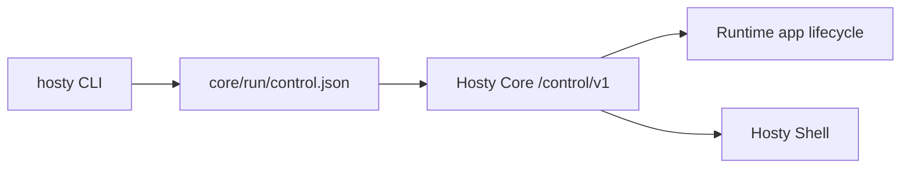

# CLI Bootstrap

The `hosty` CLI is the local bootstrap executable and Core API client. It is a .NET `net10.0` executable and uses Spectre.Console for terminal output.

`docker-host` remains a deprecated compatibility alias during the Hosty migration. New documentation and examples should prefer `hosty`.

## Command Surface

Implemented commands:

```text
hosty install
hosty uninstall
hosty start
hosty stop
hosty restart
hosty update
hosty status
hosty logs
hosty open
hosty core
hosty config
hosty apps
hosty users
hosty modules
hosty auth
```

`hosty start`, `hosty stop`, `hosty restart`, `hosty status`, and `hosty logs` operate on the local Hosty Core process. `hosty core ...` exposes the same process lifecycle commands explicitly.

`hosty apps` is the preferred app command group. It covers app list, install/add, app-level autostart, start, stop, restart, update, runtime switching, remove, app data backup, app data restore, app logs, app identity, and app open links. Local development uses app manifests with local command runtime profiles, for example:

```bash
hosty apps install apps/demo-app/manifest.json --runtime dev
```

`hosty modules` and `docker-host modules` remain compatibility aliases for legacy module management. They are not the preferred workflow for new runtime apps.

`hosty auth setup-token` and `hosty auth recovery-token` call the running Hosty Core trusted control API to create one-time local setup and recovery tokens. The retired Legacy Host state writer has been removed, so these commands never write obsolete auth JSON directly from the CLI:

```text
hosty auth setup-token
hosty auth recovery-token
```

Core must be running and local control discovery must be available. Each command prints the raw token and Core-owned setup or recovery URL once. Core stores only token hashes under `core/auth/bootstrap-tokens.json`.

## Configuration

The CLI persists known local settings in the selected CLI root:

```text
~/.hosty/config/launch.env
```

The legacy `~/.docker-host/config/launch.env` remains readable when the legacy root is selected. Unknown settings from older launch files, such as removed Host image settings, are ignored.

Current settings:

```env
HOST_CONTAINER_NAME=docker-host
HOST_DATA_ROOT_HOST=$HOME/.hosty
HOST_UI_PORT=auto
HOST_PUBLIC_ORIGIN=
HOST_CORE_PUBLIC_ORIGIN=
HOST_SHELL_PUBLIC_ORIGIN=
HOST_DOCKER_ENDPOINT=unix:///var/run/docker.sock
```

`HOST_CONTAINER_NAME`, `HOST_UI_PORT`, and `HOST_DOCKER_ENDPOINT` are retained only for legacy module command fallback that needs to discover an old Host container. Current Core lifecycle commands do not start or recreate that container.

For tests and isolated local checks, `HOSTY_HOME` can override the CLI root. Legacy `DOCKER_HOST_HOME` remains supported. When an override is present, the default `HOST_DATA_ROOT_HOST` follows the override root instead of the user's real home directory.

Default root selection without overrides:

1. use `~/.hosty` when it exists;
2. otherwise use `~/.docker-host` when it exists;
3. otherwise create and use `~/.hosty`.

If both roots exist, `~/.hosty` wins and Hosty does not merge legacy state automatically.

## Control Discovery

Hosty Core writes trusted local control discovery in:

```text
<hosty-data-root>/core/run/control.json
```

CLI app commands read this file and call Core's local `/control/v1` channel with the discovered per-start control secret.



## Lifecycle Behavior

`hosty install` creates the local Hosty root, config, bin, and app directories. It no longer pulls or prepares a combined Host Docker image.

`hosty uninstall` requests Core shutdown when local control discovery is available, then removes local Hosty state while preserving the CLI executable directory. For the default root it clears everything except `bin/`; for an external data root it removes known Hosty-owned state such as `core/`, `apps.json`, `apps/`, `backups/`, `sources/`, `modules.json`, and `modules/`.

`hosty start` starts Hosty Core from source when the Core project is discoverable from the current checkout or app base directory. `hosty stop` requests Core shutdown through local control. `hosty restart` combines those two operations.

`hosty open` reads Core status through local control and opens the configured Shell public origin.

`hosty update` updates the managed CLI executable and synchronizes both managed executable names: `hosty` and deprecated `docker-host`. After the bootstrap update step it checks running Core and prepares a Shell update plan when `hosty.shell` is installed. Runtime app updates remain separate app commands, for example `hosty apps update <app-id>`.

## Docker Engine Integration

The CLI still contains a minimal Docker Engine adapter for legacy module command fallback and diagnostics. Current Core lifecycle commands do not use Docker Engine to create, start, stop, or remove a Host container.
