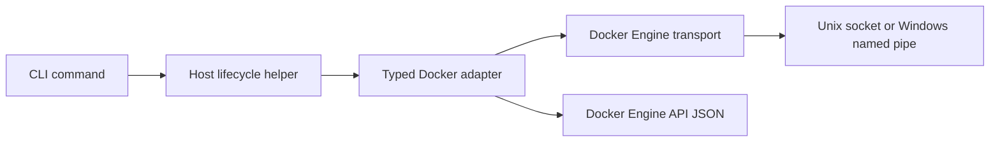

# CLI bootstrap

The `docker-host` CLI is the recovery path for the Host container lifecycle. It is a .NET `net10.0` executable named `docker-host` and uses Spectre.Console for terminal output.

## Command surface

Implemented commands:

```text
docker-host install
docker-host uninstall
docker-host start
docker-host stop
docker-host restart
docker-host update
docker-host status
docker-host logs
docker-host open
docker-host config
docker-host modules
docker-host dev
docker-host auth
```

`docker-host config` is a typed interface for known Host launch settings:

```text
docker-host config list
docker-host config get <KEY>
docker-host config set <KEY> <VALUE>
docker-host config set <KEY>=<VALUE>
docker-host config reset <KEY>
```

Unknown setting keys are rejected. `HOST_UI_PORT` accepts `auto` or a TCP port number. `HOST_DOCKER_ENDPOINT` is limited to the supported local Docker Engine endpoint for the current platform. `HOST_DEV_REPOSITORY_PATH` and `HOST_DEV_PORT` configure the local Host process used by `docker-host dev up`; dev commands do not fall back to the production Host container.

`docker-host modules` is the trusted-control-backed module command group. It covers module list, install/add, start, stop, restart, update, remove, and low-level developer target commands. The detailed command behavior is documented in [CLI module commands](cli-module-commands.md).

`docker-host dev` is the trusted-control-backed module development harness:

```text
docker-host dev up [--manifest <path>] [--host-url <url>] [--prepare-only]
docker-host dev status [--manifest <path>] [--host-url <url>]
docker-host dev reset [--manifest <path>] [--host-url <url>]
docker-host dev clean <module-id-or-dev-metadata> [--host-url <url>] [--yes]
```

It reads `metadata.dev.json` by default, starts the development Host from `HOST_DEV_REPOSITORY_PATH` or connects to a loopback `--host-url`, links a deterministic developer target through local control, seeds development users and assignments through Host-owned services, applies module directory policy, and starts the local module command in the foreground. The detailed workflow is documented in [Module Development Harness](module-development-harness.md).

`docker-host auth` contains local authentication recovery and bootstrap commands:

```text
docker-host auth setup-token
docker-host auth recovery-token
```

`auth setup-token` creates a one-time first-admin setup token in the Host auth JSON store under `HOST_DATA_ROOT_HOST/auth/state.json`. It stores only the token hash and prints the raw token for local use in `/setup`.

`auth recovery-token` creates a one-time recovery token through local machine access and writes only the token hash to `HOST_DATA_ROOT_HOST/auth/state.json`. The command also records a sanitized audit event in `HOST_DATA_ROOT_HOST/auth/audit.ndjson`.

CLI module and dev commands do not use Host user credentials or bearer tokens. They read `<HOST_DATA_ROOT_HOST>/run/control.json` and call the Host's local `/control/v1` channel with the discovered control contract version and per-start control secret.

## Launch configuration

The CLI persists launch settings in:

```text
~/.docker-host/config/launch.env
```

The Host writes trusted control discovery for the local CLI in:

```text
<HOST_DATA_ROOT_HOST>/run/control.json
```

Default values:

```env
HOST_IMAGE=ghcr.io/alex-de-haas/docker-host:latest
HOST_CONTAINER_NAME=docker-host
HOST_DATA_ROOT_HOST=$HOME/.docker-host
HOST_DATA_ROOT_CONTAINER=/data
HOST_UI_PORT=auto
HOST_BIND_ADDRESS=127.0.0.1
HOST_PUBLIC_ORIGIN=
HOST_GATEWAY_BASE_DOMAIN=
HOST_RESTART_POLICY=unless-stopped
HOST_DOCKER_ENDPOINT=unix:///var/run/docker.sock
HOST_DOCKER_SOCKET=/var/run/docker.sock
HOST_MODULE_NETWORK=docker-host-modules
```

On native Windows, the Docker endpoint default is:

```env
HOST_DOCKER_ENDPOINT=npipe:////./pipe/docker_engine
```

For tests and isolated local checks, `DOCKER_HOST_HOME` can override the CLI root. When this override is present, the default `HOST_DATA_ROOT_HOST` follows the override root instead of the user's real home directory.

## Docker Engine integration

The CLI does not shell out to the Docker executable for lifecycle operations. Docker Engine communication is isolated under `Haas.DockerHost.Cli.Docker`:



The transport supports:

- `unix:///var/run/docker.sock` on macOS, Linux, and WSL;
- `npipe:////./pipe/docker_engine` on native Windows.

The high-level adapter owns Docker Engine paths, request payloads, response parsing, and Docker error diagnostics. Commands call typed methods for image pull, container inspect/create/start/stop/remove, logs, and network inspect/create.

## Lifecycle behavior

`docker-host install` creates the root directories, writes `launch.env`, validates Docker Engine Linux container mode, and pulls the configured Host image so rolling tags such as `latest` are refreshed before the first start. If `HOST_IMAGE` is a single-component local tag such as `docker-host:dev` and that image already exists locally, install keeps the local image and skips the registry pull.

`docker-host uninstall` removes Host-managed runtime and local state while preserving the CLI executable. It removes installed module containers known from `modules.json`, removes the Host container, attempts to remove Host/module images and the Host-managed module network, deletes launch configuration, and deletes Host state files. When the data root is the default `~/.docker-host`, uninstall clears that directory except for `bin/` so the installed CLI remains runnable. If `HOST_DATA_ROOT_HOST` points outside the CLI root, uninstall removes only known Host state paths such as `modules.json` and `modules/` from that external data root. `docker-host install` recreates launch configuration and Host directories after uninstall and refreshes the configured Host image.

`docker-host start`:

- validates launch settings;
- verifies Docker Engine reports Linux container mode;
- creates the shared module network if needed;
- checks the configured Host image before creating or starting a stopped Host container;
- pulls registry-backed Host image references so rolling tags such as `latest` can move forward;
- recreates a stopped Host container when the configured image tag now points at a different local image id;
- selects a free loopback host port when `HOST_UI_PORT=auto`;
- creates and starts the Host container with Docker socket, data root, env vars, restart policy, and module network.

`docker-host stop` reads the installed module registry from `HOST_DATA_ROOT_HOST`, stops every known Host-managed module container through Docker Engine, and then stops the Host container. This keeps the command useful as a recovery path even when the Host API or local control channel is unavailable. If the module registry cannot be read, the CLI warns that module containers may require manual cleanup and still stops the Host container.

`docker-host restart` recreates the Host container with the current launch settings while preserving `HOST_DATA_ROOT_HOST`.

`docker-host update` downloads the matching CLI artifact from the rolling GitHub prerelease `cli-dev`, showing Spectre.Console progress for the checksum file and CLI artifact. Downloads with a known `Content-Length` show a determinate progress bar, percentage, downloaded bytes, transfer speed, and remaining time; downloads without a known size show an indeterminate dotted spinner, downloaded bytes, and transfer speed. The command verifies `SHA256SUMS` when available, compares the downloaded artifact with the current executable, reports whether the CLI was updated or already current, and then stops. It does not pull the Host image, recreate the Host container, or relaunch the updated executable. At the end it recommends restarting the Host with `docker-host stop` and `docker-host start`; the next `start` checks the configured Host image and recreates the stopped container only when the image id changed.

`docker-host open` uses Docker container port metadata to open the current Host UI URL, with a plain URL fallback when browser launch fails.

Remote Docker endpoints, TLS, SSH, and `DOCKER_HOST` environment discovery are not part of the local Host launch model.
