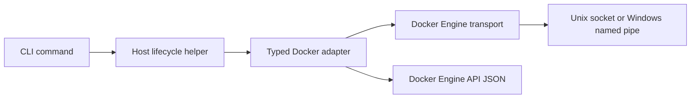

# CLI bootstrap

The `docker-host` CLI is the recovery path for the Host container lifecycle. It is a .NET `net10.0` executable named `docker-host` and uses Spectre.Console for terminal output.

## Command surface

Implemented commands:

```text
docker-host install
docker-host uninstall
docker-host start
docker-host stop
docker-host restart
docker-host update
docker-host status
docker-host logs
docker-host open
docker-host config
docker-host modules
docker-host auth
```

`docker-host config` is a typed interface for known Host launch settings:

```text
docker-host config list
docker-host config get <KEY>
docker-host config set <KEY> <VALUE>
docker-host config set <KEY>=<VALUE>
docker-host config reset <KEY>
```

Unknown setting keys are rejected. `HOST_UI_PORT` accepts `auto` or a TCP port number. `HOST_DOCKER_ENDPOINT` is limited to the supported local Docker Engine endpoint for the current platform.

`docker-host modules` is the Host API-backed module command group. It covers module list, install/add, start, stop, restart, and update commands. The detailed command behavior is documented in [CLI module commands](cli-module-commands.md).

`docker-host auth` contains local authentication recovery and bootstrap commands:

```text
docker-host auth setup-token
```

`auth setup-token` creates a one-time first-admin setup token in the Host auth JSON store under `HOST_DATA_ROOT_HOST/auth/state.json`. It stores only the token hash and prints the raw token for local use in `/setup`.

## Launch configuration

The CLI persists launch settings in:

```text
~/.docker-host/config/launch.env
```

Default values:

```env
HOST_IMAGE=ghcr.io/alex-de-haas/docker-host:latest
HOST_CONTAINER_NAME=docker-host
HOST_DATA_ROOT_HOST=$HOME/.docker-host
HOST_DATA_ROOT_CONTAINER=/data
HOST_UI_PORT=auto
HOST_RESTART_POLICY=unless-stopped
HOST_DOCKER_ENDPOINT=unix:///var/run/docker.sock
HOST_DOCKER_SOCKET=/var/run/docker.sock
HOST_MODULE_NETWORK=docker-host-modules
```

On native Windows, the Docker endpoint default is:

```env
HOST_DOCKER_ENDPOINT=npipe:////./pipe/docker_engine
```

For tests and isolated local checks, `DOCKER_HOST_HOME` can override the CLI root. When this override is present, the default `HOST_DATA_ROOT_HOST` follows the override root instead of the user's real home directory.

## Docker Engine integration

The CLI does not shell out to the Docker executable for lifecycle operations. Docker Engine communication is isolated under `Haas.DockerHost.Cli.Docker`:



The transport supports:

- `unix:///var/run/docker.sock` on macOS, Linux, and WSL;
- `npipe:////./pipe/docker_engine` on native Windows.

The high-level adapter owns Docker Engine paths, request payloads, response parsing, and Docker error diagnostics. Commands call typed methods for image pull, container inspect/create/start/stop/remove, logs, and network inspect/create.

## Lifecycle behavior

`docker-host install` creates the root directories and writes `launch.env`.

`docker-host uninstall` removes Host-managed runtime and local state while preserving the CLI executable. It removes installed module containers known from `modules.json`, removes the Host container, attempts to remove Host/module images and the Host-managed module network, deletes launch configuration, and deletes Host state files. When the data root is the default `~/.docker-host`, uninstall clears that directory except for `bin/` so the installed CLI remains runnable. If `HOST_DATA_ROOT_HOST` points outside the CLI root, uninstall removes only known Host state paths such as `modules.json` and `modules/` from that external data root. A later `docker-host install` recreates launch configuration and Host directories.

`docker-host start`:

- validates launch settings;
- verifies Docker Engine reports Linux container mode;
- creates the shared module network if needed;
- pulls the Host image if it is missing locally;
- selects a free loopback host port when `HOST_UI_PORT=auto`;
- creates and starts the Host container with Docker socket, data root, env vars, restart policy, and module network.

`docker-host restart` recreates the Host container with the current launch settings while preserving `HOST_DATA_ROOT_HOST`.

`docker-host update` downloads the matching CLI artifact from the rolling GitHub prerelease `cli-dev`, showing Spectre.Console progress for the checksum file and CLI artifact. Downloads with a known `Content-Length` show a determinate progress bar, percentage, downloaded bytes, transfer speed, and remaining time; downloads without a known size fall back to an indeterminate moving progress bar. The command verifies `SHA256SUMS` when available, compares the downloaded artifact with the current executable, reports whether the CLI was updated or already current, pulls the Host image through Docker Engine, and recreates the Host container while preserving the previous auto-selected port when Docker metadata exposes it. `docker-host update --host-only` skips the CLI artifact step for local repair and development flows.

`docker-host open` uses Docker container port metadata to open the current Host UI URL, with a plain URL fallback when browser launch fails.

## Open Questions

- Windows self-replacement may need an additional delayed-replace strategy if replacing the running `.exe` fails on native Windows.
- Remote Docker endpoints, TLS, SSH, and `DOCKER_HOST` environment discovery remain out of scope for the local Host launch model.
