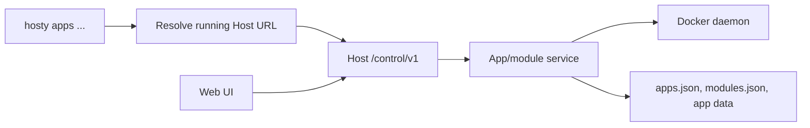
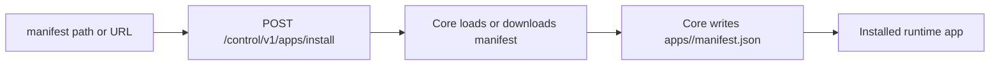
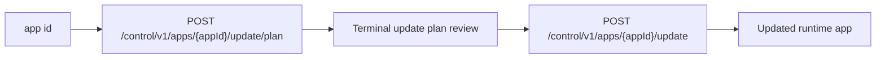
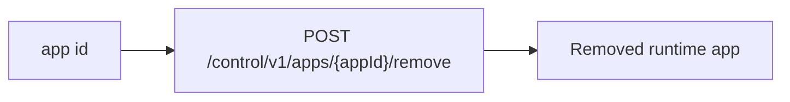

# CLI app and module commands

This document describes `hosty apps ...` and legacy `docker-host modules ...` commands as a terminal-first interface on top of the Host local control channel.

## Description

CLI app commands support headless, server-side, and scripted scenarios where an administrator does not want to or cannot use the Web UI. They are not a separate runtime. The `hosty` CLI remains a thin local control client: it receives plans, renders them in the terminal, collects administrator input, and submits confirmed requests.

The business logic for installation, update, dependency resolution, Docker conflict checks, storage mappings, app data backups, secret handling, module state, retry, and cleanup remains in the Host backend.



## Goals

- Allow common module operations without opening the Web UI.
- Reuse the same Host module-management logic as the Web UI.
- Keep CLI output readable for administrators and useful in CI logs.
- Support interactive review for install and update plans.
- Keep direct Docker Engine access limited to legacy Host URL discovery while this compatibility command exists.
- Keep the command surface interactive and human-readable.

## Non-goals

- CLI must not parse module metadata or build install/update plans locally.
- CLI must not directly create module containers, volumes, networks, directories, or `modules.json` records.
- CLI must not bypass reviewed digest semantics for install or update.
- CLI must not expose raw secret values in normal output, errors, diagnostics, or JSON previews.
- CLI module commands do not replace current `hosty apps` workflows or Core lifecycle commands.
- Remote Host management, authentication setup, TLS, SSH, and multi-user authorization are not part of CLI module commands.
- CLI bearer tokens and Host user sessions are not part of module command authentication.

## Command surface

The preferred app command surface:

```text
hosty apps list
hosty apps install <manifest-reference> [--autostart|--no-autostart]
hosty apps autostart <app-id> --enabled|--disabled
hosty apps start <app-id>
hosty apps stop <app-id>
hosty apps restart <app-id>
hosty apps update-plan <app-id>
hosty apps update <app-id> --plan-digest <digest>
hosty apps switch-runtime-plan <app-id> --runtime <key>
hosty apps switch-runtime <app-id> --runtime <key> --plan-digest <digest>
hosty apps source <app-id>
hosty apps source-resolve <app-id>
hosty apps source-override <app-id> --path <worktree>
hosty apps source-clear-override <app-id>
hosty apps health <app-id>
hosty apps identity <app-id> --user <email-or-id>
hosty apps open <app-id> --user <email-or-id> --mode shell|standalone
hosty apps backup <app-id>
hosty apps backup delete <app-id> <backup-id> --yes
hosty apps backups <app-id>
hosty apps backups prune-plan <app-id>
hosty apps backups prune <app-id> --plan-digest <digest> --yes
hosty apps restore <app-id> <backup-id>
hosty apps remove <app-id> [--delete-data]
```

Source, health, runtime switching, identity, open, and autostart commands call Core trusted-control APIs. The CLI renders plans and summaries, but Core owns source policy, selected-runtime mutation, local command process supervision, startup autostart, shutdown stop, identity issuance, and access checks.

## `apps autostart`

```bash
hosty apps autostart <app-id> --enabled
hosty apps autostart <app-id> --disabled
```

`autostart` updates the installed app setting that tells Core whether to start the app during Core startup. The setting is app-level and runtime-neutral. Docker runtime apps do not receive Docker-managed restart policies; Core starts enabled apps and stops disabled apps when Core starts.

Compatibility aliases remain:

```text
hosty modules ...
docker-host modules ...
```

`install` is the preferred verb because it matches the backend install flow. `add` remains a user-friendly alias:

```text
hosty apps add <manifest-url>
```

## Shared command behavior

Every module command should:

1. Load `launch.env` through the existing launch settings store.
2. Inspect the legacy Host container through Docker Engine only to resolve the local legacy Host URL.
3. Exit with a clear message if the legacy Host container is missing or stopped, suggesting `hosty apps` for current runtime app workflows.
4. Read `<HOST_DATA_ROOT_HOST>/run/control.json` and use `/control/v1` for module operations.
5. Preserve Host API error boundaries and diagnostics.

The CLI may call `GET /control/v1/host/status` before commands that mutate module state. `list` can skip the preflight and rely on `GET /control/v1/modules` when a faster read-only path is preferred.

## `apps list`

```text
hosty apps list
```

`apps list` calls:

```text
GET /control/v1/apps
```

CLI output uses a compact table with:

- app display name and id;
- kind: `system` or `runtime`;
- source: `system` or `installed`;
- status;
- selected runtime;
- selected channel;
- capabilities.

When no apps are registered, CLI prints a short empty-state message and suggests `hosty apps install <manifest-url>`.

Legacy `modules list` still calls `GET /control/v1/modules` and renders the installed module table.

## `apps install`

```text
hosty apps install <manifest-reference> [--autostart|--no-autostart]
hosty apps add <manifest-reference>
```

`manifest-reference` may be a local manifest path or an absolute `http` or `https` manifest URL. The CLI normalizes local paths to absolute paths before sending them to Core and preserves remote URLs unchanged.

`install` calls the Core runtime app install endpoint:



Core stores the installed local copy as `manifestPath`. When the submitted manifest reference is an `http` or `https` URL, Core also stores it as `manifestUrl`; later update planning refreshes from that URL by default.

Request body:

```json
{
  "manifestPath": "https://apps.example.com/reports/manifest.json",
  "selectedRuntime": "default",
  "selectedChannel": null,
  "system": false,
  "autostart": true
}
```

`autostart` defaults to `true`. Passing `--no-autostart` installs the app without starting it on future Core startups.

The Shell admin UI uses `/api/apps/install/plan` for review before applying the same app install operation. Legacy module installation remains available through `/control/v1/modules/install/plan` and `/control/v1/modules/install`; the reviewed legacy module prompt behavior is described below.

### Legacy module setting prompts

CLI prompt behavior should match the plan schema:

| Setting type | CLI input behavior |
| --- | --- |
| `string` | Text prompt. Optional empty value is omitted. |
| `number` | Numeric prompt. CLI should reject non-numeric values before apply. |
| `boolean` | Selection or yes/no prompt. |
| `url` | Text prompt. Backend remains authoritative for validation. |
| `secret` | Masked prompt. Value is submitted as write-only and never printed back. |

Defaults from the plan may be shown for non-secret settings. Secret defaults must not be displayed as raw values.

The submitted shape must stay compatible with `ModuleInstallRequest`:

```json
{
      "metadataUrl": "https://apps.example.com/reports/manifest.json",
  "planDigest": "sha256:...",
  "settings": [
    {
      "moduleId": "com.acme.reports",
      "key": "REPORT_RETENTION_DAYS",
      "value": 30,
      "secret": false
    }
  ],
  "externalMounts": []
}
```

### Legacy module external mounts

For each mount collection in `plan.storage.mountCollections`, CLI should show:

- module id;
- collection key and label;
- required/min/max item count;
- read/write mode;
- container path template.

For each selected item, CLI collects:

- safe item key;
- optional label;
- host path;
- access mode, limited by the collection's writable flag.

CLI may pre-validate item keys with the same safe path segment rules as the Web UI helper, but the Host backend remains authoritative.

## `apps start`

```text
hosty apps start <app-id>
```

`start` calls:

```text
POST /control/v1/apps/{appId}/start
```

CLI should print the updated runtime state on success. On failure, it should print the backend lifecycle error, including runtime status and next step when available.

This command should not directly start app runtime processes through Docker Engine or local process supervision. Missing runtime state, invalid operation status, storage mapping, and dependency checks belong to Core.

## `apps stop`

```text
hosty apps stop <app-id>
```

`stop` calls:

```text
POST /control/v1/apps/{appId}/stop
```

CLI should print the updated runtime state on success. Stop remains a Core lifecycle action so persistent app status and runtime error handling stay consistent with Shell behavior.

## `apps restart`

```text
hosty apps restart <app-id>
```

`restart` calls:

```text
POST /control/v1/apps/{appId}/restart
```

CLI should print the updated runtime state on success. If restart fails because runtime state is missing or the app is not in a runnable operation state, CLI should surface the backend error without attempting local repair.

## `apps update`

```text
hosty apps update-plan <app-id> [--manifest <manifest-reference>] [--runtime <key>] [--channel <id>]
hosty apps update <app-id> --plan-digest <digest> [--manifest <manifest-reference>] [--runtime <key>] [--channel <id>]
```

`update` is a two-step reviewed flow:



### Interactive update flow

1. CLI calls `POST /control/v1/apps/{appId}/update/plan`.
2. When `--manifest` is omitted, Core refreshes the stored `manifestUrl` for apps installed from an `http` or `https` URL; otherwise it uses the installed local `manifestPath`.
3. CLI renders:

- current and proposed app version;
- current and refreshed manifest digests;
- update plan digest;
- selected runtime and target channel;
- whether a pre-update backup will be created;
- runtime contract changes.

4. CLI requires the reviewed `planDigest` before apply.
5. CLI calls `POST /control/v1/apps/{appId}/update` with:

```json
{
  "planDigest": "sha256:...",
  "manifestPath": "https://apps.example.com/reports/manifest.json",
  "selectedRuntime": "default",
  "targetChannel": null
}
```

6. CLI prints the updated app id and resulting runtime state.

Before applying an update, Core creates a `pre-update` app data backup when a primary app data directory exists.

## `apps backup`, `apps backups`, and `apps restore`

```text
hosty apps backup <app-id> [--reason <reason>]
hosty apps backup delete <app-id> <backup-id> --yes
hosty apps backups <app-id>
hosty apps backups prune-plan <app-id> [--format table|json]
hosty apps backups prune <app-id> --plan-digest <digest> --yes [--format table|json]
hosty apps restore <app-id> <backup-id> [--pre-restore-backup]
```

Backup commands use the app data backup control API:

```text
POST /control/v1/apps/{appId}/backups
GET /control/v1/apps/{appId}/backups
DELETE /control/v1/apps/{appId}/backups/{backupId}
GET /control/v1/apps/{appId}/backups/cleanup/plan
POST /control/v1/apps/{appId}/backups/cleanup
POST /control/v1/apps/{appId}/backups/{backupId}/restore
```

`backup` creates a manual ZIP backup of the app's primary `data/` directory. If the app has no data directory, the backend returns a response with no backup record.

`backup delete` deletes one backup and requires `--yes`.

`backups` lists backup id, reason, creation time, archive size, and retention status.

`backups prune-plan` previews retention cleanup candidates and prints the plan digest. `backups prune` requires that digest and `--yes`; Core recomputes the plan and rejects stale digests before deleting files.

`restore` submits:

```json
{
  "createPreRestoreBackup": true
}
```

The `createPreRestoreBackup` field is `true` only when `--pre-restore-backup` is passed. Core requires the app to be stopped before restore, replaces the data directory from the ZIP archive, and does not restart the app automatically.

## `apps remove`

```text
hosty apps remove <app-id> [--delete-data]
```

`remove` calls the Core runtime app remove endpoint:



By default, remove deletes runtime state and preserves app data, backups, and managed source checkouts. Flags such as `--delete-data`, `--delete-backups`, and `--delete-source` request additional cleanup.

## Output modes

CLI module commands use interactive human-readable output. Automation flags, JSON output, `--yes`, `--setting`, `--secret-from-env`, and `--mount` are not part of the current command surface.

## Command decisions

- `install` is the canonical command. `add` is supported as an alias.
- `apps` is the preferred command group. `modules` remains a compatibility alias for legacy scripts.
- App commands do not auto-start Core. If Core is stopped, CLI prints `hosty start` as the next step.
- Install, update, and remove call `GET /control/v1/host/status` before requesting a plan.
- Module commands are interactive-first.
- Interactive install and update always ask for final confirmation before apply.
- Settings are collected through typed prompts. Optional empty values are omitted.
- Secret settings use masked prompts and are redacted from previews and diagnostics.
- Required and optional external mount collections are supported in the interactive flow.
- CLI performs safe external mount item key pre-validation, while Host backend remains authoritative.
- Install and update conflicts block apply; CLI must not ask the backend to apply a conflicted plan.
- Initial exit code mapping is `0` for success, `1` for runtime/API failure, `2` for usage/input errors, and `130` for cancelled operations.
- App/module control requests include CLI version and expected control contract version headers.
- `Haas.DockerHost.Cli.HostApi` owns HTTP details; command classes own argument parsing and terminal UX.

## Error handling

CLI should preserve the Host API error boundary:

- `422` means metadata or submitted input is invalid.
- `409` means the reviewed plan conflicts with current Host or Docker state.
- `503` means Host runtime or Docker daemon dependencies are unavailable.
- `500` after mutation means Host may have preserved partial artifacts for explicit recovery.

When an API response includes `validationErrors[]`, `conflicts[]`, or `ModuleOperationError`, CLI should print them as structured terminal tables. It should not collapse backend diagnostics into a single generic error string.

If the legacy Host URL cannot be resolved from the container, CLI should suggest migrating to `hosty apps` unless the user is intentionally operating an old compatibility install.

## Trusted Control Compatibility

CLI module commands should send:

- CLI version;
- expected control contract version;
- the per-start local control secret read from `<HOST_DATA_ROOT_HOST>/run/control.json`.

The Host should return a clear incompatibility error when the running legacy Host API does not support the requested CLI module command contract.

## Implementation notes

The CLI implementation has a Host control client layer separate from the Docker Engine adapter. The Docker adapter remains only for legacy Host URL discovery.

Suggested CLI namespaces:

```text
Haas.DockerHost.Cli.HostApi
Haas.DockerHost.Cli.Commands.Modules
```

The Host control client should own:

- URL construction;
- JSON serialization and deserialization;
- HTTP status mapping;
- contract/version headers;
- redacted error formatting for module API calls.

Command code should own:

- argument parsing;
- terminal tables and prompts;
- redacted request preview;
- non-zero exit codes.
