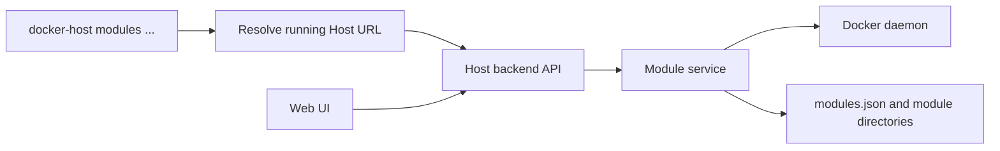
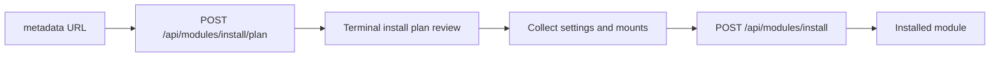
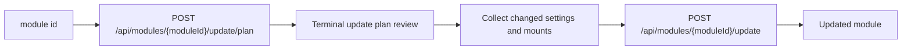

# CLI module commands

Этот документ описывает `docker-host modules ...` commands как terminal-first интерфейс поверх существующего Host backend API.

## Description

CLI module commands нужны для headless, server-side и scripted сценариев, где администратор не хочет или не может пользоваться Web UI. Это не отдельный runtime управления модулями. `docker-host` CLI должен оставаться тонким клиентом к Host API: он получает планы, показывает их в терминале, собирает administrator input и отправляет подтвержденные requests.

Бизнес-логика установки, обновления, dependency resolution, Docker conflict checks, storage mappings, secret handling, module state, retry и cleanup остаются в Host backend.



## Goals

- Allow common module operations without opening the Web UI.
- Reuse the exact same Host API and module-management logic as the Web UI.
- Keep CLI output readable for administrators and useful in CI logs.
- Support interactive review for install and update plans.
- Keep direct Docker Engine access limited to Host container lifecycle and Host URL discovery.
- Keep the command surface interactive and human-readable.

## Non-goals

- CLI must not parse module metadata or build install/update plans locally.
- CLI must not directly create module containers, volumes, networks, directories, or `modules.json` records.
- CLI must not bypass reviewed digest semantics for install or update.
- CLI must not expose raw secret values in normal output, errors, diagnostics, or JSON previews.
- CLI module commands do not replace Host recovery commands for the Host container itself.
- Remote Host management, authentication setup, TLS, SSH, and multi-user authorization are not part of CLI module commands.

## Command surface

The initial module command surface:

```text
docker-host modules list
docker-host modules install <metadata-url>
docker-host modules start <module-id>
docker-host modules stop <module-id>
docker-host modules restart <module-id>
docker-host modules update <module-id>
```

`install` is the preferred verb because it matches the backend install flow. `add` may be kept as a user-friendly alias because earlier launch documentation used `docker-host modules add <metadata-url>`:

```text
docker-host modules add <metadata-url>
```

## Shared command behavior

Every module command should:

1. Load `launch.env` through the existing launch settings store.
2. Inspect the Host container through Docker Engine only to resolve the local Host API URL, using the same model as `docker-host open`.
3. Exit with a clear message if the Host container is missing or stopped, suggesting `docker-host start`.
4. Use the Host backend API for module operations.
5. Preserve Host API error boundaries and diagnostics.

The CLI may call `GET /api/host/status` before commands that mutate module state. `list` can skip the preflight and rely on `GET /api/modules` when a faster read-only path is preferred.

## `modules list`

```text
docker-host modules list
```

`list` calls:

```text
GET /api/modules
```

CLI output should use a compact table with:

- module id;
- name;
- version;
- operation status;
- Docker runtime state;
- image reference;
- updated timestamp or installed timestamp;
- last error summary when present.

When no modules are installed, CLI should print a short empty-state message and suggest `docker-host modules install <metadata-url>`.

JSON output is not part of the current `modules list` command.

## `modules install`

```text
docker-host modules install <metadata-url>
docker-host modules add <metadata-url>
```

`install` is a two-step reviewed flow:



### Interactive install flow

1. CLI calls `GET /api/host/status` and fails before planning if Host runtime or Docker daemon dependencies are unavailable.
2. CLI calls `POST /api/modules/install/plan` with:

```json
{
  "metadataUrl": "https://modules.example.com/reports.json"
}
```

3. CLI renders the returned plan as terminal tables and sections:

- root module identity;
- metadata digest and plan digest;
- dependency tree and install order;
- images and pull policies;
- module-owned storage directories;
- external mount collections;
- setting prompts, with secret values marked write-only;
- runtime ports and Docker container names;
- conflicts and validation messages.

4. If the plan contains conflicts, CLI does not submit apply. It exits non-zero after printing conflict details.
5. CLI prompts for setting values declared in `plan.settings`.
6. CLI prompts for required external mount collection items and allows optional items to be skipped.
7. CLI shows a redacted request preview and asks for final confirmation.
8. CLI calls `POST /api/modules/install` with the reviewed `planDigest`, setting values, and external mount selections.
9. CLI prints installed and reused module ids, root module status, and next actions.

### Setting prompts

CLI prompt behavior should match the plan schema:

| Setting type | CLI input behavior |
| --- | --- |
| `string` | Text prompt. Optional empty value is omitted. |
| `number` | Numeric prompt. CLI should reject non-numeric values before apply. |
| `boolean` | Selection or yes/no prompt. |
| `url` | Text prompt. Backend remains authoritative for validation. |
| `secret` | Masked prompt. Value is submitted as write-only and never printed back. |

Defaults from the plan may be shown for non-secret settings. Secret defaults must not be displayed as raw values.

The submitted shape must stay compatible with `ModuleInstallRequest`:

```json
{
  "metadataUrl": "https://modules.example.com/reports.json",
  "planDigest": "sha256:...",
  "settings": [
    {
      "moduleId": "com.acme.reports",
      "key": "REPORT_RETENTION_DAYS",
      "value": 30,
      "secret": false
    }
  ],
  "externalMounts": []
}
```

### External mounts

For each mount collection in `plan.storage.mountCollections`, CLI should show:

- module id;
- collection key and label;
- required/min/max item count;
- read/write mode;
- container path template.

For each selected item, CLI collects:

- safe item key;
- optional label;
- host path;
- access mode, limited by the collection's writable flag.

CLI may pre-validate item keys with the same safe path segment rules as the Web UI helper, but the Host backend remains authoritative.

## `modules start`

```text
docker-host modules start <module-id>
```

`start` calls:

```text
POST /api/modules/{moduleId}/start
```

CLI should print the updated runtime state on success. On failure, it should print the backend `ModuleOperationError`, including Docker status and next step when available.

This command should not directly start module containers through Docker Engine. Missing container, invalid operation status, storage mapping, and dependency checks belong to the Host backend.

## `modules stop`

```text
docker-host modules stop <module-id>
```

`stop` calls:

```text
POST /api/modules/{moduleId}/stop
```

CLI should print the updated runtime state on success. Stop remains a backend lifecycle action so persistent module status and Docker error handling stay consistent with Web UI behavior.

## `modules restart`

```text
docker-host modules restart <module-id>
```

`restart` calls:

```text
POST /api/modules/{moduleId}/restart
```

CLI should print the updated runtime state on success. If restart fails because the module container is missing or the module is not in a runnable operation state, CLI should surface the backend error without attempting local repair.

## `modules update`

```text
docker-host modules update <module-id>
```

`update` is a two-step reviewed flow:



### Interactive update flow

1. CLI calls `GET /api/host/status` and fails before planning if Host runtime or Docker daemon dependencies are unavailable.
2. CLI calls `POST /api/modules/{moduleId}/update/plan`.
3. CLI renders:

- current and proposed module version;
- current and refreshed metadata digests;
- update plan digest;
- image changes;
- settings added, removed, changed, preserved;
- storage and external mount changes;
- dependency install/reuse decisions;
- runtime and Docker replacement requirements;
- warnings and conflicts.

4. If the plan contains conflicts, CLI does not submit apply. It exits non-zero after printing conflict details.
5. CLI prompts only for new or changed values required by `plan.settings` and mount collections.
6. CLI shows a redacted update request preview and asks for final confirmation.
7. CLI calls `POST /api/modules/{moduleId}/update` with:

```json
{
  "updatePlanDigest": "sha256:...",
  "confirmed": true,
  "settings": [],
  "externalMounts": []
}
```

8. CLI prints updated module id, installed dependency ids, reused dependency ids, and the resulting runtime state.

Failed update retry uses `POST /api/modules/{moduleId}/update/retry`, but retry command behavior should be specified separately when recovery commands are added to the CLI surface.

## Output modes

CLI module commands use interactive human-readable output. Automation flags, JSON output, `--yes`, `--setting`, `--secret-from-env`, and `--mount` are not part of the current command surface.

## Command decisions

- `install` is the canonical command. `add` is supported as an alias.
- Module commands do not auto-start the Host container. If Host is stopped, CLI prints `docker-host start` as the next step.
- Install and update call `GET /api/host/status` before requesting a plan.
- Module commands are interactive-first.
- Interactive install and update always ask for final confirmation before apply.
- Settings are collected through typed prompts. Optional empty values are omitted.
- Secret settings use masked prompts and are redacted from previews and diagnostics.
- Required and optional external mount collections are supported in the interactive flow.
- CLI performs safe external mount item key pre-validation, while Host backend remains authoritative.
- Install and update conflicts block apply; CLI must not ask the backend to apply a conflicted plan.
- Initial exit code mapping is `0` for success, `1` for runtime/API failure, `2` for usage/input errors, and `130` for cancelled operations.
- Module API requests include CLI version and expected Host API contract version headers.
- `Haas.DockerHost.Cli.HostApi` owns HTTP details; command classes own argument parsing and terminal UX.

## Error handling

CLI should preserve the Host API error boundary:

- `422` means metadata or submitted input is invalid.
- `409` means the reviewed plan conflicts with current Host or Docker state.
- `503` means Host runtime or Docker daemon dependencies are unavailable.
- `500` after mutation means Host may have preserved partial artifacts for explicit recovery.

When an API response includes `validationErrors[]`, `conflicts[]`, or `ModuleOperationError`, CLI should print them as structured terminal tables. It should not collapse backend diagnostics into a single generic error string.

If the Host URL cannot be resolved from the container, CLI should suggest `docker-host status` and `docker-host start`.

## Version compatibility

CLI module commands should send:

- CLI version;
- expected Host API contract version.

The Host should return a clear incompatibility error when the running Host image does not support the requested CLI module command contract. This is especially important because CLI artifacts and Host images are released independently.

## Implementation notes

The CLI implementation should add a Host API client layer separate from the Docker Engine adapter. The Docker adapter remains only for Host container lifecycle and Host URL discovery.

Suggested CLI namespaces:

```text
Haas.DockerHost.Cli.HostApi
Haas.DockerHost.Cli.Commands.Modules
```

The Host API client should own:

- URL construction;
- JSON serialization and deserialization;
- HTTP status mapping;
- contract/version headers;
- redacted error formatting for module API calls.

Command code should own:

- argument parsing;
- terminal tables and prompts;
- redacted request preview;
- non-zero exit codes.
