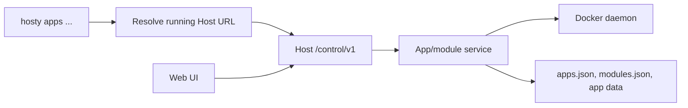
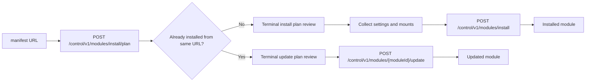
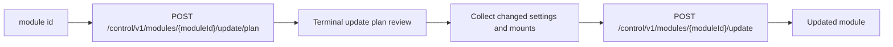
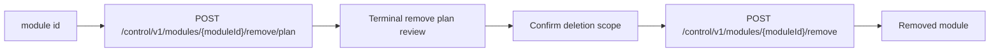

# CLI app and module commands

This document describes `hosty apps ...` and legacy `docker-host modules ...` commands as a terminal-first interface on top of the Host local control channel.

## Description

CLI app commands support headless, server-side, and scripted scenarios where an administrator does not want to or cannot use the Web UI. They are not a separate runtime. The `hosty` CLI remains a thin local control client: it receives plans, renders them in the terminal, collects administrator input, and submits confirmed requests.

The business logic for installation, update, dependency resolution, Docker conflict checks, storage mappings, app data backups, secret handling, module state, retry, and cleanup remains in the Host backend.



## Goals

- Allow common module operations without opening the Web UI.
- Reuse the same Host module-management logic as the Web UI.
- Keep CLI output readable for administrators and useful in CI logs.
- Support interactive review for install and update plans.
- Keep direct Docker Engine access limited to Host container lifecycle and Host URL discovery.
- Keep the command surface interactive and human-readable.

## Non-goals

- CLI must not parse module metadata or build install/update plans locally.
- CLI must not directly create module containers, volumes, networks, directories, or `modules.json` records.
- CLI must not bypass reviewed digest semantics for install or update.
- CLI must not expose raw secret values in normal output, errors, diagnostics, or JSON previews.
- CLI module commands do not replace Host recovery commands for the Host container itself.
- Remote Host management, authentication setup, TLS, SSH, and multi-user authorization are not part of CLI module commands.
- CLI bearer tokens and Host user sessions are not part of module command authentication.

## Command surface

The preferred app command surface:

```text
hosty apps list
hosty apps install <manifest-url>
hosty apps start <app-id>
hosty apps stop <app-id>
hosty apps restart <app-id>
hosty apps update <app-id>
hosty apps backup <app-id>
hosty apps backups <app-id>
hosty apps restore <app-id> <backup-id>
hosty apps remove <app-id> [--delete-data]
```

Compatibility aliases remain:

```text
hosty modules ...
docker-host modules ...
```

`install` is the preferred verb because it matches the backend install flow. `add` remains a user-friendly alias:

```text
hosty apps add <manifest-url>
```

## Shared command behavior

Every module command should:

1. Load `launch.env` through the existing launch settings store.
2. Inspect the Host container through Docker Engine only to resolve the local Host URL, using the same model as `hosty open`.
3. Exit with a clear message if the Host container is missing or stopped, suggesting `hosty start`.
4. Read `<HOST_DATA_ROOT_HOST>/run/control.json` and use `/control/v1` for module operations.
5. Preserve Host API error boundaries and diagnostics.

The CLI may call `GET /control/v1/host/status` before commands that mutate module state. `list` can skip the preflight and rely on `GET /control/v1/modules` when a faster read-only path is preferred.

## `apps list`

```text
hosty apps list
```

`apps list` calls:

```text
GET /control/v1/apps
```

CLI output uses a compact table with:

- app display name and id;
- kind: `system` or `runtime`;
- source: `system`, `installed`, or `developer`;
- status;
- selected runtime;
- selected channel;
- capabilities.

When no apps are registered, CLI prints a short empty-state message and suggests `hosty apps install <manifest-url>`.

Legacy `modules list` still calls `GET /control/v1/modules` and renders the installed module table.

## `apps install`

```text
hosty apps install <manifest-url>
hosty apps add <manifest-url>
```

`install` is a two-step reviewed flow:



### Interactive install flow

1. CLI calls `GET /control/v1/host/status` and fails before planning if Host runtime or Docker daemon dependencies are unavailable.
2. CLI calls `POST /control/v1/modules/install/plan` with both preferred and compatibility fields:

```json
{
  "manifestUrl": "https://apps.example.com/reports/manifest.json",
  "metadataUrl": "https://apps.example.com/reports/manifest.json"
}
```

3. If the response is `mode: "update"`, CLI switches to the update review flow using the returned `updatePlan`. This happens when the metadata URL identifies a module id already registered from the same source URL.
4. CLI renders the returned install plan as terminal tables and sections:

- root module identity;
- metadata digest and plan digest;
- dependency tree and install order;
- images and pull policies;
- module-owned storage directories;
- external mount collections;
- setting prompts, with secret values marked write-only;
- runtime ports and Docker container names;
- conflicts and validation messages.

5. If the plan contains conflicts, CLI does not submit apply. It exits non-zero after printing conflict details.
6. CLI prompts for setting values declared in `plan.settings`.
7. CLI prompts for required external mount collection items and allows optional items to be skipped.
8. CLI shows a redacted request preview and asks for final confirmation.
9. CLI calls `POST /control/v1/modules/install` with the reviewed `planDigest`, setting values, and external mount selections.
10. CLI prints installed and reused module ids, root module status, and next actions.

### Setting prompts

CLI prompt behavior should match the plan schema:

| Setting type | CLI input behavior |
| --- | --- |
| `string` | Text prompt. Optional empty value is omitted. |
| `number` | Numeric prompt. CLI should reject non-numeric values before apply. |
| `boolean` | Selection or yes/no prompt. |
| `url` | Text prompt. Backend remains authoritative for validation. |
| `secret` | Masked prompt. Value is submitted as write-only and never printed back. |

Defaults from the plan may be shown for non-secret settings. Secret defaults must not be displayed as raw values.

The submitted shape must stay compatible with `ModuleInstallRequest`:

```json
{
      "metadataUrl": "https://apps.example.com/reports/manifest.json",
  "planDigest": "sha256:...",
  "settings": [
    {
      "moduleId": "com.acme.reports",
      "key": "REPORT_RETENTION_DAYS",
      "value": 30,
      "secret": false
    }
  ],
  "externalMounts": []
}
```

### External mounts

For each mount collection in `plan.storage.mountCollections`, CLI should show:

- module id;
- collection key and label;
- required/min/max item count;
- read/write mode;
- container path template.

For each selected item, CLI collects:

- safe item key;
- optional label;
- host path;
- access mode, limited by the collection's writable flag.

CLI may pre-validate item keys with the same safe path segment rules as the Web UI helper, but the Host backend remains authoritative.

## `apps start`

```text
hosty apps start <app-id>
```

`start` calls:

```text
POST /control/v1/modules/{moduleId}/start
```

CLI should print the updated runtime state on success. On failure, it should print the backend `ModuleOperationError`, including Docker status and next step when available.

This command should not directly start module containers through Docker Engine. Missing container, invalid operation status, storage mapping, and dependency checks belong to the Host backend.

## `apps stop`

```text
hosty apps stop <app-id>
```

`stop` calls:

```text
POST /control/v1/modules/{moduleId}/stop
```

CLI should print the updated runtime state on success. Stop remains a backend lifecycle action so persistent module status and Docker error handling stay consistent with Web UI behavior.

## `apps restart`

```text
hosty apps restart <app-id>
```

`restart` calls:

```text
POST /control/v1/modules/{moduleId}/restart
```

CLI should print the updated runtime state on success. If restart fails because the module container is missing or the module is not in a runnable operation state, CLI should surface the backend error without attempting local repair.

## `apps update`

```text
hosty apps update <app-id>
```

`update` is a two-step reviewed flow:



### Interactive update flow

1. CLI calls `GET /control/v1/host/status` and fails before planning if Host runtime or Docker daemon dependencies are unavailable.
2. CLI calls `POST /control/v1/modules/{moduleId}/update/plan`.
3. CLI renders:

- current and proposed module version;
- current and refreshed metadata digests;
- update plan digest;
- image changes;
- settings added, removed, changed, preserved;
- storage and external mount changes;
- dependency install/reuse decisions;
- runtime and Docker replacement requirements;
- warnings and conflicts.

4. If the plan contains conflicts, CLI does not submit apply. It exits non-zero after printing conflict details.
5. CLI prompts only for new or changed values required by `plan.settings` and mount collections.
6. CLI shows a redacted update request preview and asks for final confirmation.
7. CLI calls `POST /control/v1/modules/{moduleId}/update` with:

```json
{
  "updatePlanDigest": "sha256:...",
  "confirmed": true,
  "settings": [],
  "externalMounts": []
}
```

8. CLI prints updated module id, installed dependency ids, reused dependency ids, and the resulting runtime state.

Before applying an update, the Host backend creates a `pre-update` app data backup when a primary app data directory exists.

## `apps backup`, `apps backups`, and `apps restore`

```text
hosty apps backup <app-id>
hosty apps backups <app-id>
hosty apps restore <app-id> <backup-id>
```

Backup commands use the app data backup control API:

```text
POST /control/v1/apps/{appId}/backups
GET /control/v1/apps/{appId}/backups
POST /control/v1/apps/{appId}/backups/{backupId}/restore
```

`backup` creates a manual ZIP backup of the app's primary `data/` directory. If the app has no data directory, the backend returns `404`.

`backups` lists backup id, reason, creation time, file count, and archive size.

`restore` asks for confirmation, then submits:

```json
{
  "confirmed": true,
  "stopBeforeRestore": true,
  "createPreRestoreBackup": true
}
```

Restore stops the app first by default, creates a `pre-restore` backup by default, verifies archive integrity, replaces the data directory, and does not restart the app automatically.

## `apps remove`

```text
hosty apps remove <app-id> [--delete-data]
```

`remove` is a two-step reviewed flow:



The plan shows the module, containers, storage mappings, dependency impact, and whether module-owned data will be deleted. By default, remove preserves module data. `--delete-data` requests deletion of module-owned data after confirmation. External mount collection data is never deleted by module removal.

## Output modes

CLI module commands use interactive human-readable output. Automation flags, JSON output, `--yes`, `--setting`, `--secret-from-env`, and `--mount` are not part of the current command surface.

## Command decisions

- `install` is the canonical command. `add` is supported as an alias.
- `apps` is the preferred command group. `modules` remains a compatibility alias for legacy scripts.
- App commands do not auto-start the Host container. If Host is stopped, CLI prints `hosty start` as the next step.
- Install, update, and remove call `GET /control/v1/host/status` before requesting a plan.
- Module commands are interactive-first.
- Interactive install and update always ask for final confirmation before apply.
- Settings are collected through typed prompts. Optional empty values are omitted.
- Secret settings use masked prompts and are redacted from previews and diagnostics.
- Required and optional external mount collections are supported in the interactive flow.
- CLI performs safe external mount item key pre-validation, while Host backend remains authoritative.
- Install and update conflicts block apply; CLI must not ask the backend to apply a conflicted plan.
- Initial exit code mapping is `0` for success, `1` for runtime/API failure, `2` for usage/input errors, and `130` for cancelled operations.
- App/module control requests include CLI version and expected control contract version headers.
- `Haas.DockerHost.Cli.HostApi` owns HTTP details; command classes own argument parsing and terminal UX.

## Error handling

CLI should preserve the Host API error boundary:

- `422` means metadata or submitted input is invalid.
- `409` means the reviewed plan conflicts with current Host or Docker state.
- `503` means Host runtime or Docker daemon dependencies are unavailable.
- `500` after mutation means Host may have preserved partial artifacts for explicit recovery.

When an API response includes `validationErrors[]`, `conflicts[]`, or `ModuleOperationError`, CLI should print them as structured terminal tables. It should not collapse backend diagnostics into a single generic error string.

If the Host URL cannot be resolved from the container, CLI should suggest `hosty status` and `hosty start`.

## Trusted Control Compatibility

CLI module commands should send:

- CLI version;
- expected control contract version;
- the per-start local control secret read from `<HOST_DATA_ROOT_HOST>/run/control.json`.

The Host should return a clear incompatibility error when the running Host image does not support the requested CLI module command contract. This is especially important because CLI artifacts and Host images are released independently.

## Implementation notes

The CLI implementation has a Host control client layer separate from the Docker Engine adapter. The Docker adapter remains only for Host container lifecycle and Host URL discovery.

Suggested CLI namespaces:

```text
Haas.DockerHost.Cli.HostApi
Haas.DockerHost.Cli.Commands.Modules
```

The Host control client should own:

- URL construction;
- JSON serialization and deserialization;
- HTTP status mapping;
- contract/version headers;
- redacted error formatting for module API calls.

Command code should own:

- argument parsing;
- terminal tables and prompts;
- redacted request preview;
- non-zero exit codes.
