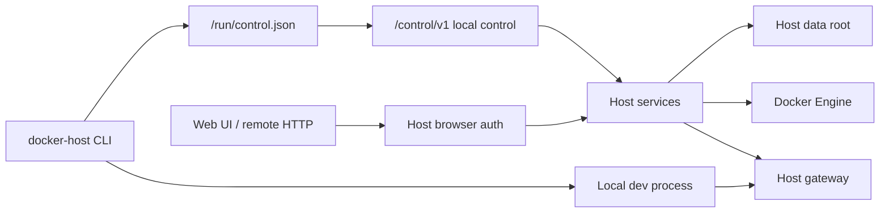

# CLI Trusted Control and Dev Metadata

Docker Host treats the local `docker-host` CLI as a trusted machine-control tool for the local Host installation. A person who can run the CLI with access to the Host data root already has local administrative control over that installation, so module lifecycle and local development commands no longer authenticate with Host user sessions or CLI bearer tokens.

The Host remains the owner of module state and side effects. The CLI resolves the running Host, discovers the local control channel, renders terminal plans and prompts, supervises local development processes, and submits confirmed requests. Install, update, remove, lifecycle, developer target registration, app registry state, assignments, directory policy, Docker container creation, gateway behavior, and audit records stay Host-owned.



## Trusted Control

On startup, the Host writes `<HOST_DATA_ROOT_HOST>/run/control.json` with:

- `schemaVersion` and `controlContractVersion`;
- a per-start `instanceId`;
- the transport name, currently `http-loopback`;
- the discovered local endpoint, usually `http://127.0.0.1:<host-ui-port>/control/v1`;
- required control headers;
- a per-start control secret.

The file is written with owner-only permissions on Unix-like platforms. The secret is local channel binding, not a user credential. It is not accepted by public Host API routes, is not shown in the Web UI, is not stored by user id, and is replaced when the Host restarts.

CLI control requests send:

- `X-Docker-Host-Cli-Version`;
- `X-Docker-Host-Control-Contract-Version`;
- `X-Docker-Host-Control-Secret`.

CLI control requests do not send `Authorization: Bearer`, Host cookies, account-set cookies, or CSRF headers. Public Host routes and the module gateway do not proxy `/control/v1`.

## CLI Auth Surface

The active `docker-host auth` surface is local recovery only:

```text
docker-host auth setup-token
docker-host auth recovery-token
```

`setup-token` writes a hashed, expiring, one-time token for first-admin setup. `recovery-token` writes a hashed, expiring, one-time recovery token for local administrator recovery. Neither token grants CLI API access.

Browser authentication, sessions, account switching, users, roles, invitations, OIDC, trusted proxy authentication, and recent browser reauthentication remain the Web UI and public Host API model.

## Control Methods

The first control contract covers:

- Host readiness: `GET /control/v1/host/status`;
- module list, install plan/apply, update plan/apply, remove plan/apply, start, stop, and restart;
- developer target list, upsert, delete, and dev data cleanup;
- Host-owned development user, invitation, assignment, directory policy, and app registry helpers used by `docker-host dev`.

The CLI still inspects Docker only for Host container lifecycle and production module command Host URL discovery. The top-level `docker-host dev` harness does not inspect or start the production Host container; it starts the source-run Host from `HOST_DEV_REPOSITORY_PATH` or connects to an explicit loopback `--host-url`.

## Dev Metadata

Repository-local development uses `metadata.dev.json` beside production `metadata.json`.

`metadata.dev.json` is real module metadata using `schemaVersion: "0.3"`. It uses canonical `services[]` instead of `containers[]` and lets each service declare a source:

- `image` for production-like Docker image services;
- `process` for local development services launched by the CLI.

Production install and update currently accept only image-backed services. Process-backed services are for local development through `docker-host dev`.

Example:

```json
{
  "schemaVersion": "0.3",
  "id": "com.example.module",
  "name": "Example Module",
  "version": "1.0.0",
  "services": [
    {
      "key": "app",
      "source": {
        "type": "process",
        "command": "npm run dev",
        "workingDirectory": "."
      },
      "runtime": {
        "ports": [
          {
            "key": "http",
            "containerPort": 3000,
            "localPort": 3100,
            "protocol": "http"
          }
        ]
      },
      "healthCheck": {
        "type": "http",
        "path": "/api/health",
        "intervalSeconds": 10,
        "timeoutSeconds": 2,
        "successStatus": [200]
      }
    }
  ],
  "endpoints": [
    {
      "key": "http",
      "service": "app",
      "port": "http",
      "public": true
    }
  ]
}
```

`docker-host dev up` accepts a module metadata path, a repository directory containing `metadata.dev.json`, or the current directory when it contains `metadata.dev.json`. Repository scripts pass `modules/demo-module/metadata.dev.json` explicitly and provide Host process development environment through the wrapper process when needed.

Development module data persists under `<HOST_DATA_ROOT_HOST>/dev/modules/<module-id>/` between runs. Use:

```bash
docker-host dev clean <module-id-or-dev-metadata>
```

to remove one development module's stored data after confirmation.
