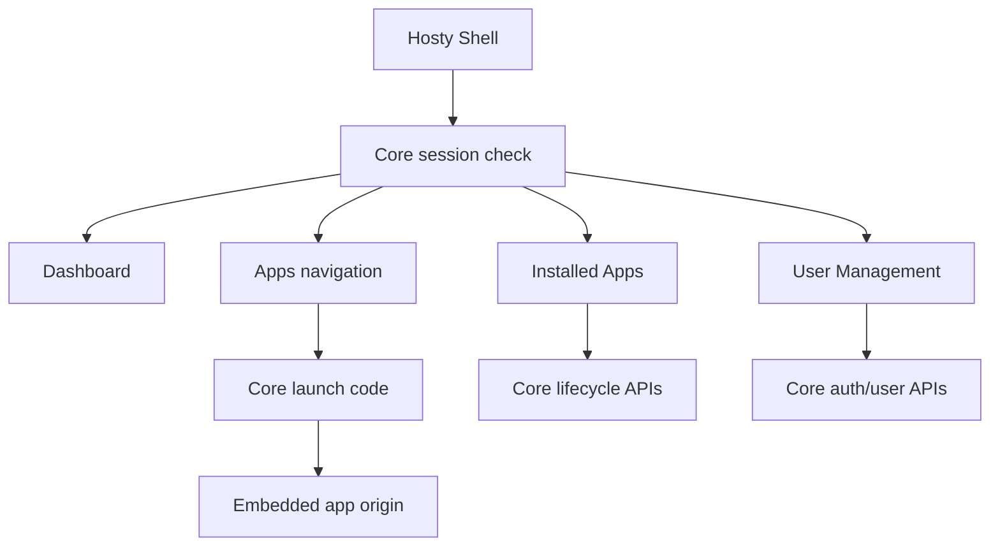

# Core App Shell

Hosty Shell is the Core-managed browser UI runtime app. It renders a single authenticated Shell surface backed by Hosty Core APIs; it does not own Core lifecycle logic and it does not reintroduce the retired combined Next.js Host package.

## Scope

The implemented Shell provides:

- administrator-only Dashboard overview widgets for Core status and installed runtime app summary;
- administrator-only Installed Apps management for runtime app install, lifecycle, configuration, updates, logs, backups, restore, prune, and removal;
- administrator-only User Management for local invitations, user role changes, disabling users, and app assignments;
- Apps navigation for app manifests that declare shell UI metadata;
- embedded app workspaces that open app-owned UI origins through Core-issued launch codes.

Shell uses Core session cookies and redirects unauthenticated users to Core-owned `/login`. Protected data comes from Core APIs such as `/api/core/status`, `/api/auth/session`, `/api/apps`, `/api/auth/users`, and `/api/apps/{appId}/...` lifecycle endpoints.

When `HOSTY_CORE_PUBLIC_ORIGIN` or `HOSTY_SHELL_PUBLIC_ORIGIN` is not configured, Core uses local fallback origins from the configured ports: `http://localhost:<core-port>` and `http://localhost:<shell-port>`. Login redirects, Shell CORS, setup/recovery redirects, and Shell status all use these effective origins.

## Navigation

The Shell sidebar is a persistent desktop-style rail with an expanded and compact mode. The selected mode is stored in browser local storage.

- Core:
  - Dashboard
  - Installed Apps
  - User Management
- Apps:
  - one entry for each non-system runtime app that exposes shell UI metadata
  - nested app links from manifest `ui.navigation`
  - loading, error, and empty states when app registry data is unavailable

The Core navigation group is visible only to `host.admin`. Non-admin `host.user` principals can load Shell but see only non-system runtime app navigation and the `/apps` app overview. Dashboard, Installed Apps, User Management, system apps, and app mutation controls are restricted to `host.admin`.

Hosty Shell is installed as a system runtime app and does not appear as a normal entry in the Apps sidebar.

## Installed Apps

The Installed Apps view is the current administrator management surface for installed apps. It separates app inventory into:

- Runtime Apps: non-system runtime apps installed by users or administrators;
- System Apps: Core-managed apps such as Hosty Shell.

Runtime Apps expose actions according to Core state and app capabilities:

- start, stop, and restart;
- install from an `app.0.1` manifest URL or local manifest path;
- configure settings and autostart;
- plan and apply updates;
- inspect logs and health;
- create, restore, delete, and prune backups;
- remove an app, with optional backup deletion.

System Apps are inspect-only in Shell. Hosty Shell and future system apps can expose logs when the `logs` capability is present, but Shell hides lifecycle, configuration, update, backup, restore, autostart, and removal controls for all `system` apps. Core remains the source of truth for what operations are allowed.

## Embedded Apps

Apps appear in the Shell Apps navigation only when their installed manifest includes a `ui` contract and the app is not a system app. Public runtime endpoints alone do not create Shell navigation.

Shell opens app UIs through the app-owned origin returned by Core. Local runtime app origins use `http://localhost:<assigned-port>`. If an app endpoint has a configured `HOSTY_PUBLIC_ORIGIN_{ENDPOINT_KEY}` value, Core uses that public origin for Shell and standalone links, while endpoint summaries still keep the local `url` and expose the external value separately as `publicOrigin`. For embedded workspaces, Shell requests `/api/apps/{appId}/launch-code` and loads the resulting redirect URI in an iframe. For standalone tabs, Shell uses `/api/apps/{appId}/open?redirectUri=...`.

The app receives a short-lived code and exchanges it with Core for app-scoped identity. Shell does not proxy app HTML, rewrite assets, or forward Hosty session cookies to the app origin.

Embedded workspace iframes are hosted in a Shell-owned `bg-background` surface. Shell keeps the iframe transparent until its document fires `load`, then reveals it and posts the current Shell theme. Theme posting is best-effort because local app restarts can leave the iframe on `about:blank` or a browser error document with a different origin. This masks the browser's default white iframe canvas during dark-theme app navigation and initial app loads without surfacing transient `postMessage` origin errors.

## Deferred Gateway UX

The removed Legacy Host included `/ingress` and gateway exposure UI. That route tree no longer exists in the repository.

Gateway and external ingress readiness remain target architecture topics for service/API exposure publishing. Future work should implement them through Hosty Core or an explicit Core-managed gateway runtime. Until then, Shell documentation and UI should not present `/ingress`, `/api/gateway/*`, or `/api/ingress/*` as current implemented surfaces.
