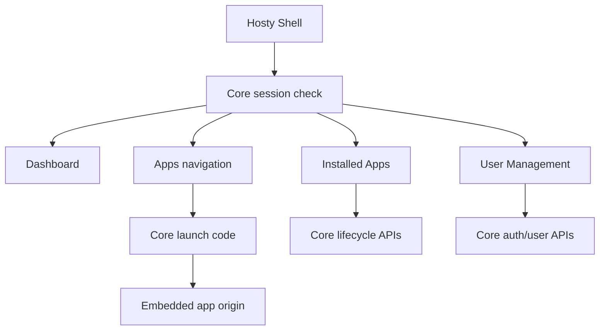

# Core App Shell

Created: 2026-05-19
Updated: 2026-07-11

Hosty Shell is the Core-managed browser UI runtime app. It renders a single authenticated Shell surface backed by Hosty Core APIs; it does not own Core lifecycle logic and it does not reintroduce the retired combined Next.js Host package.

## Scope

The implemented Shell provides:

- administrator-only Dashboard overview widgets for Core status and installed runtime app summary;
- administrator-only Installed Apps management for runtime app install, lifecycle, configuration, updates, logs, backups, restore, prune, and removal;
- administrator-only User Management for local invitations, user role changes, disabling users, and app assignments;
- Apps navigation for app manifests that declare shell UI metadata;
- embedded app workspaces that open app-owned UI origins through Core-issued launch codes.

Shell uses Core session cookies and redirects unauthenticated users to Core-owned `/login`. Public status comes from `/api/core/status`; protected data comes from Core APIs such as `/api/auth/session`, `/api/apps`, `/api/auth/users`, and `/api/apps/{appId}/...` lifecycle endpoints. If a protected Core API returns `401`, Shell treats that as an authentication-required state and navigates to Core `/login` instead of rendering a reduced unauthenticated Shell surface. `403` responses remain visible authorization or CSRF failures.

Shell is a thin browser client for Core APIs. Its browser-facing Core origin comes from `HOSTY_CORE_PUBLIC_ORIGIN` or, for client-side build compatibility, `NEXT_PUBLIC_HOSTY_CORE_PUBLIC_ORIGIN`. `NEXT_PUBLIC_HOSTY_CORE_ORIGIN` is accepted only as a legacy fallback. When Core manages Shell without an explicit public origin, Shell uses Core's fallback `http://localhost:<core-port>` value. `HOSTY_CORE_ORIGIN` is reserved for runtime process-to-Core calls; Docker runtimes may receive it as `http://host.docker.internal:<core-port>`, but Shell must not serialize that internal container origin into browser fetches or login links.

When `HOSTY_CORE_PUBLIC_ORIGIN` or `HOSTY_SHELL_PUBLIC_ORIGIN` is not configured, Core uses local fallback origins from the configured ports: `http://localhost:<core-port>` and `http://localhost:<shell-port>`. Login redirects, Shell CORS, setup/recovery redirects, and Shell status all use these effective origins.

## Client Module Structure

Shell keeps one persistent client orchestrator at `apps/shell/src/app/shell-client.tsx`. The root App Router layout creates this orchestrator once around the route `children`, so Core state, session/auth state, sidebar compact state, app registry data, CSRF mutation ordering, dialogs, and embedded workspace launch state survive navigation between Shell routes.

Feature UI lives under `apps/shell/src/app/shell/`:

- `types.ts`, `core-api.ts`, `shell-routes.ts`, `theme.ts`, `state.ts`, and `server-env.ts` define shared contracts, low-level helpers, and server-side Shell environment resolution;
- `shell-context.tsx` exposes separate persistent Shell state and action contexts to route pages;
- `shell-route-pages.tsx` adapts individual App Router pages to Shell feature components;
- `sidebar/` contains Shell navigation and account/theme controls;
- `pages/` contains Dashboard, Apps, Installed Apps, and User Management view components;
- `dialogs/` contains install review and installed-app detail dialogs;
- `workspace/` contains embedded app workspace loading and iframe surfaces;
- `ui.tsx`, `settings.tsx`, `app-helpers.ts`, and `clipboard.ts` contain shared presentational and formatting helpers.

Each top-level Shell route file renders only its route surface:

- `/` and `/dashboard` render the Dashboard route surface for administrators;
- `/apps` renders the Apps route surface;
- `/installed-apps` renders the Installed Apps route surface for administrators;
- `/users` renders the User Management route surface for administrators;
- `/workspace` delegates the visible content to the persistent Shell workspace state when a workspace query is present.

Administrator-only route surfaces fall back to the Apps route while the persistent Shell orchestrator redirects non-admin sessions to `/apps`.

## Navigation

The Shell sidebar is a persistent desktop-style rail with an expanded and compact mode. The selected mode is stored in browser local storage.

- Core:
  - Dashboard (`/dashboard`, with `/` retained as a compatible entry route)
  - Installed Apps (`/installed-apps`)
  - User Management (`/users`)
- Apps:
  - app overview (`/apps`)
  - one sidebar entry for each non-system runtime app that exposes shell UI metadata
  - nested app links from manifest `ui.navigation`
  - embedded app workspace links (`/workspace?app=<app-id>&path=<app-path>`)
  - loading, error, and empty states when app registry data is unavailable

The Core navigation group is visible only to `host.admin`. Non-admin `host.user` principals can load Shell but see only non-system runtime app navigation and the `/apps` app overview. Dashboard, Installed Apps, User Management, system apps, and app mutation controls are restricted to `host.admin`.

Shell top-level navigation is route-backed. Sidebar clicks update the browser URL, and refresh restores the active route. Workspace URLs store only the app id and app path; Shell requests a fresh Core launch code after loading the current Core session and app registry.

Because the sidebar and Core/session state are owned by the root Shell layout, switching between `/dashboard`, `/apps`, `/installed-apps`, `/users`, and `/workspace` does not remount the sidebar or briefly render the unauthenticated navigation state.

Hosty Shell is installed as a system runtime app and does not appear as a normal entry in the Apps sidebar.

## Installed Apps

The Installed Apps view is the current administrator management surface for installed apps. It separates app inventory into:

- Runtime Apps: non-system runtime apps installed by users or administrators;
- System Apps: Core-managed apps such as Hosty Shell.

Runtime Apps expose actions according to Core state, plus — for the two entries that are optional app features rather than lifecycle verbs — the `logs` and `backup` capabilities the app declares (see below):

- start, stop, and restart;
- install from an `app.0.1` manifest URL, local manifest file path, or local app directory containing `manifest.json`;
- configure settings and autostart;
- plan and apply updates;
- inspect logs and health;
- create, restore, delete, and prune backups;
- remove an app, with optional backup deletion.

### Lifecycle operations vs. app capabilities

These are two different things, and only one of them is the app's to declare.

**Lifecycle operations are inherent to Core managing an app** — start, stop, restart, update, remove, autostart. Core authorizes them on the administrator session at the endpoint (`RequireAdminSessionAsync`) and never consults the manifest, so an app cannot decline to be stopped or updated by omitting a token. Shell gates them on administrator rights, and additionally hides start, stop, restart, backups, autostart, and removal for `system` apps. Updates are deliberately **not** system-gated: a system app is reviewed-updated through the same plan/apply flow as any other runtime app. The one genuine Core-side refusal is a live source runtime, which has no reviewed update because its manifest is adopted on restart rather than advanced through a plan.

**The manifest `capabilities` list describes optional app *features*** a client may surface, and its canonical vocabulary is therefore only `backup` and `logs` — things that genuinely depend on the app (does it have data worth snapshotting?). Core normalizes a declared list to that vocabulary, dropping the retired lifecycle tokens (`update`, `stop`, `restart`, `remove`) and the two that no client ever read: `open` is derived from the app's endpoints, and `restore` lives inside the backup panel. A manifest that declares nothing gets the full default set.

This list is a client hint, never a grant. The separate manifest `provides` field is the axis on which an app declares a role to Core (see [Runtime App Manifest](runtime-app-manifest.md) and [Core Extension Model](../ideas/core-extension-model.md)); self-description is load-bearing there and is guarded by explicit operator consent instead.

System Apps are inspectable and configurable in Shell. Administrators can open their ordinary settings dialog, switch runtime profiles, and apply reviewed updates — system apps update through the exact same plan/apply flow as every other runtime app. Logs remain available when the `logs` capability is present. Shell hides start, stop, restart, backup, restore, autostart, and removal controls for all `system` apps. This lets Marketplace own its catalog URL as a manifest setting without adding Marketplace logic to Core. Core remains the source of truth for what operations are allowed.

## Embedded Apps

Apps appear in the Shell Apps navigation only when their installed manifest includes a `ui` contract and the app is not a system app. Public runtime endpoints alone do not create Shell navigation.

UI-capable system apps get their own administrator-only System sidebar group instead (Shell 0.26.0). It reuses the same page-link, launch, and iframe machinery as the Apps group, with the canonical deep link `/system-apps/<app-id>?path=<app-path>` in place of `/workspace?app=...`. The group is hidden when no installed system app declares UI; a stopped UI-capable system app stays listed but disabled with its runtime state, and direct navigation reports the state with a pointer to Installed Apps. Non-admins are redirected from `/system-apps/*` to `/apps` client-side, while Core independently refuses system-app launch codes for non-admins (`system_app_admin_required`).

Shell opens app UIs through the app-owned origin returned by Core. Local runtime app origins use `http://localhost:<assigned-port>`. If an app endpoint has a configured `HOSTY_PUBLIC_ORIGIN_{ENDPOINT_KEY}` value, Core uses that public origin for Shell and standalone links, while endpoint summaries still keep the local `url` and expose the external value separately as `publicOrigin`. For embedded workspaces, Shell navigates to `/workspace?app=<app-id>&path=<app-path>`, requests `/api/apps/{appId}/launch-code`, and loads the resulting redirect URI in an iframe. For standalone tabs, Shell uses `/api/apps/{appId}/open?redirectUri=...`.

The app receives a short-lived code and exchanges it with Core for app-scoped identity. Shell does not proxy app HTML, rewrite assets, or forward Hosty session cookies to the app origin.

An active embedded app may send the versioned `hosty:install-feed` intent with an HTTP(S) `feedsUrl` and optional `feedId`. Shell accepts it only when the message source is the active iframe, the origin exactly matches the resolved app origin, the payload is bounded and well formed, and the URL uses HTTP(S). A valid intent opens Core's generic reviewed feed-install dialog; it never installs directly. This is how the Marketplace system app hands discovery data back to Shell without receiving Core lifecycle credentials.

Embedded workspace iframes are hosted in a Shell-owned `bg-background` surface. Shell keeps the iframe transparent until its document fires `load`, then reveals it and posts the current Shell theme. Theme posting is best-effort because local app restarts can leave the iframe on `about:blank` or a browser error document with a different origin. This masks the browser's default white iframe canvas during dark-theme app navigation and initial app loads without surfacing transient `postMessage` origin errors.

While an embedded workspace route is launching before the iframe exists, Shell shows a plain theme-background workspace surface without a spinner or opening label. Launch errors remain visible on that surface.

## Gateway Boundary

The removed Legacy Host included `/ingress` and gateway exposure UI. That route tree no longer exists in the repository.

Gateway and external ingress readiness remain target architecture topics for service/API exposure publishing. Future work is tracked in [Gateway And App Wrapping Ideas](../ideas/gateway-and-app-wrapping.md). Until then, Shell documentation and UI should not present `/ingress`, `/api/gateway/*`, or `/api/ingress/*` as current implemented surfaces.

## Links

- [System App Pages](../ideas/system-app-pages.md) - originating design for administrator-only pages.
- [Marketplace System App](runtime-app-marketplace/feature.md) - the first storefront using the generic system-app and install-intent paths.
