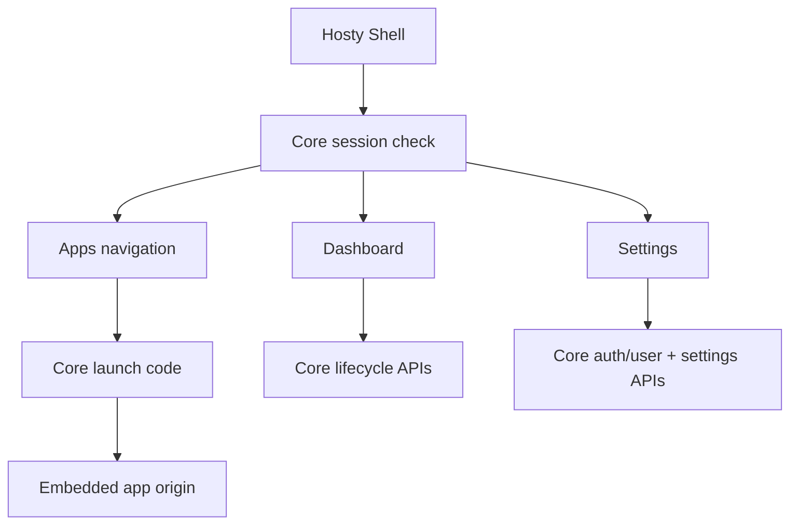

# Core App Shell

Created: 2026-05-19
Updated: 2026-09-01

Hosty Shell is the Core-managed browser UI runtime app. It renders a single authenticated Shell surface backed by Hosty Core APIs; it does not own Core lifecycle logic and it does not reintroduce the retired combined Next.js Host package.

## Scope

The implemented Shell provides:

- an administrator-only Dashboard: Core's status and version beside every installed app, with install,
  lifecycle, configuration, updates, logs, backups, restore, prune, and removal;
- administrator-only Settings: users and invitations, Core's own settings and ingress connection, and
  host-wide shared mounts;
- Apps navigation for app manifests that declare shell UI metadata;
- embedded app workspaces that open app-owned UI origins through Core-issued launch codes.

The route table and sidebar structure live in [Shell Navigation](../shell-navigation/feature.md).

Shell uses Core session cookies and redirects unauthenticated users to Core-owned `/login`. Public status comes from `/api/core/status`; protected data comes from Core APIs such as `/api/auth/session`, `/api/apps`, `/api/auth/users`, and `/api/apps/{appId}/...` lifecycle endpoints. If a protected Core API returns `401`, Shell treats that as an authentication-required state and navigates to Core `/login` instead of rendering a reduced unauthenticated Shell surface. `403` responses remain visible authorization or CSRF failures.

Shell is a thin browser client for Core APIs. Its browser-facing Core origin comes from `HOSTY_CORE_PUBLIC_ORIGIN` or, for client-side build compatibility, `NEXT_PUBLIC_HOSTY_CORE_PUBLIC_ORIGIN`. `NEXT_PUBLIC_HOSTY_CORE_ORIGIN` is accepted only as a legacy fallback. When Core manages Shell without an explicit public origin, Shell uses Core's fallback `http://localhost:<core-port>` value. `HOSTY_CORE_ORIGIN` is reserved for runtime process-to-Core calls; Docker runtimes may receive it as `http://host.docker.internal:<core-port>`, but Shell must not serialize that internal container origin into browser fetches or login links.

When `HOSTY_CORE_PUBLIC_ORIGIN` or `HOSTY_SHELL_PUBLIC_ORIGIN` is not configured, Core uses local fallback origins from the configured ports: `http://localhost:<core-port>` and `http://localhost:<shell-port>`. Login redirects, Shell CORS, setup/recovery redirects, and Shell status all use these effective origins.

## Client Module Structure

Shell keeps one persistent client orchestrator at `apps/shell/src/app/shell-client.tsx`. The root App Router layout creates this orchestrator once around the route `children`, so Core state, session/auth state, sidebar compact state, app registry data, CSRF mutation ordering, dialogs, and embedded workspace launch state survive navigation between Shell routes.

Feature UI lives under `apps/shell/src/app/shell/`:

- `types.ts`, `core-api.ts`, `shell-routes.ts`, `theme.ts`, `state.ts`, and `server-env.ts` define shared contracts, low-level helpers, and server-side Shell environment resolution;
- `shell-context.tsx` exposes separate persistent Shell state and action contexts to route pages;
- `shell-route-pages.tsx` adapts individual App Router pages to Shell feature components;
- `sidebar/` contains Shell navigation and account/theme controls;
- `pages/` contains the Dashboard, Apps, and Settings view components, including the Settings
  sections for Core and shared mounts;
- `dialogs/` contains install review and installed-app detail dialogs;
- `workspace/` contains embedded app workspace loading and iframe surfaces;
- `ui.tsx`, `settings.tsx`, `app-helpers.ts`, and `clipboard.ts` contain shared presentational and formatting helpers;
- `settings-draft.ts` holds the app settings form's pure rules — the draft, the configure payload, and
  a secret field's rendered state — kept out of the JSX so they can be tested directly.

Each top-level route file renders only its route surface; the route table, the legacy paths that
still resolve, and the sidebar's two groups are described in
[Shell Navigation](../shell-navigation/feature.md). An administrator-only surface falls back to the
Apps route while the persistent orchestrator redirects a non-admin session to `/apps`.

The sidebar is a persistent desktop-style rail with an expanded and a compact mode; the selected
mode — like the right panel's docked state — is stored in a cookie the server layout reads, so the
first paint after a reload is already in the stored state instead of rendering the default and
animating the correction. A missing cookie falls back once to the legacy local-storage value. The
chrome's column animation stays disabled until the first Core load settles, so the right panel
column appearing with the apps response snaps into place rather than looking like it opens itself.
Because the sidebar and Core/session state are owned by the root layout, moving between routes does
not remount it or briefly render the unauthenticated navigation state.

Hosty Shell is installed as a system runtime app and does not appear as an entry in the Apps
sidebar.

## Installed apps

Dashboard is the administrator management surface for installed apps: one table holding non-system runtime apps and Core-managed system apps together, the latter marked by a `System` badge.

Apps expose actions according to Core state, plus — for the two entries that are optional app features rather than lifecycle verbs — the `logs` and `backup` capabilities the app declares (see below):

- start, stop, and restart;
- install from an `app.0.1` manifest URL, local manifest file path, or local app directory containing `manifest.json`;
- configure settings and autostart;
- plan and apply updates;
- inspect logs and health;
- create, restore, delete, and prune backups;
- remove an app, with optional backup deletion.

### Secret settings

Core masks a `secret: true` setting's value out of the app summary and serves it only from
`/api/apps/{appId}/settings/{settingKey}/value`, so the settings form never receives it with the rest
of the app record. The field therefore renders from three states rather than one stored string:

- **Untouched.** The input is empty and reads `Unchanged` when a value is stored, `Not set` when none
  is. Revealing it fetches the stored value for display only — it never enters the draft, so looking at
  a secret cannot mark the form dirty or resave it. Hiding discards the fetched plaintext, so the next
  reveal fetches again.
- **Touched.** The input renders exactly what the operator typed, the empty string included. An
  untouched field may stand in the stored value; a touched one never does. (Falling back to the stored
  value whenever the draft read empty made a revealed secret impossible to delete: deleting the last
  character restored the whole value.)
- **Cleared.** A touched, empty field is a pending delete and says `Will be cleared on save`.

Core merges a configure payload key by key, so what the form omits decides what survives: an untouched
secret is left out and keeps its stored value, while a touched one is submitted verbatim. A clear is
submitted as `""` rather than `null`, because Core reapplies the manifest default over a `null` on the
next rebuild (install, update, or runtime switch) while an empty string stays empty.

Clearing a secret that the manifest marks `required` is allowed; Core then refuses to start the app
with `app_required_settings_missing` until it is set again.

### Lifecycle operations vs. app capabilities

These are two different things, and only one of them is the app's to declare.

**Lifecycle operations are inherent to Core managing an app** — start, stop, restart, update, remove, autostart. Core authorizes them on the administrator session at the endpoint (`RequireAdminSessionAsync`) and never consults the manifest, so an app cannot decline to be stopped or updated by omitting a token. Shell gates them on administrator rights, and additionally hides start, stop, restart, backups, autostart, and removal for `system` apps. Updates are deliberately **not** system-gated: a system app is reviewed-updated through the same plan/apply flow as any other runtime app. The one genuine Core-side refusal is a live source runtime, which has no reviewed update because its manifest is adopted on restart rather than advanced through a plan.

**The manifest `capabilities` list describes optional app *features*** a client may surface, and its canonical vocabulary is therefore only `backup` and `logs` — things that genuinely depend on the app (does it have data worth snapshotting?). Core normalizes a declared list to that vocabulary, dropping the retired lifecycle tokens (`update`, `stop`, `restart`, `remove`) and the two that no client ever read: `open` is derived from the app's endpoints, and `restore` lives inside the backup panel. A manifest that declares nothing gets the full default set.

This list is a client hint, never a grant. The separate manifest `provides` field is the axis on which an app declares a role to Core (see [Runtime App Manifest](runtime-app-manifest.md) and [Core Extension Model](../core-extension-model/plan.md)); self-description is load-bearing there and is guarded by explicit operator consent instead.

System Apps are inspectable and configurable in Shell. Administrators can open their ordinary settings dialog, switch runtime profiles, and apply reviewed updates — system apps update through the exact same plan/apply flow as every other runtime app. Logs remain available when the `logs` capability is present. Shell hides start, stop, restart, backup, restore, autostart, and removal controls for all `system` apps. This lets Marketplace own its catalog URL as a manifest setting without adding Marketplace logic to Core. Core remains the source of truth for what operations are allowed.

## Embedded Apps

An app appears in the Apps navigation only when its installed manifest includes a `ui` contract. Public runtime endpoints alone do not create Shell navigation, and the Shell itself is excluded from the group.

Ordinary and system apps share one group and one deep link, `/workspace?app=<app-id>&path=<app-path>` (Shell 0.49.0). System apps had their own administrator-only group and `/system-apps/<app-id>` route until then; both expressed a gate Core already enforces, since `GET /api/apps` omits a system app for a non-administrator and `AppIdentityService` refuses its launch code with `system_app_admin_required`. A stopped UI-capable app stays listed but disabled with its runtime state, and direct navigation reports that state.

Shell opens app UIs through the app-owned origin returned by Core. Local runtime app origins use `http://localhost:<assigned-port>`. If an app endpoint has a configured `HOSTY_PUBLIC_ORIGIN_{ENDPOINT_KEY}` value, Core uses that public origin for Shell and standalone links, while endpoint summaries still keep the local `url` and expose the external value separately as `publicOrigin`. For embedded workspaces, Shell navigates to `/workspace?app=<app-id>&path=<app-path>`, requests `/api/apps/{appId}/launch-code`, and loads the resulting redirect URI in an iframe. For standalone tabs, Shell uses `/api/apps/{appId}/open?redirectUri=...`.

The app receives a short-lived code and exchanges it with Core for app-scoped identity. Shell does not proxy app HTML, rewrite assets, or forward Hosty session cookies to the app origin.

The workspace URL also carries `hosty_launch=embedded`, which tells the app that Shell is rendering its name and its `ui.navigation` pages so it can drop its own copies — see [Embedded App Chrome](../embedded-app-chrome/feature.md). Only the workspace URL carries it; the standalone href behind "open in a new tab" never does, because that link exists to leave Shell.

An active embedded app may send the versioned `hosty:install-feed` intent with an HTTP(S) `feedsUrl` and optional `feedId`. Shell accepts it only when the message source is the active iframe, the origin exactly matches the resolved app origin, the payload is bounded and well formed, and the URL uses HTTP(S). A valid intent opens Core's generic reviewed feed-install dialog; it never installs directly. This is how the Marketplace system app hands discovery data back to Shell without receiving Core lifecycle credentials.

Embedded workspace iframes are hosted in a Shell-owned `bg-background` surface. Shell keeps the iframe transparent until its document fires `load`, then reveals it and posts the current Shell theme. Theme posting is best-effort because local app restarts can leave the iframe on `about:blank` or a browser error document with a different origin. This masks the browser's default white iframe canvas during dark-theme app navigation and initial app loads without surfacing transient `postMessage` origin errors.

While an embedded workspace route is launching before the iframe exists, Shell shows a plain theme-background workspace surface without a spinner or opening label. Launch errors remain visible on that surface.

## Gateway Boundary

The removed Legacy Host included `/ingress` and gateway exposure UI. That route tree no longer exists in the repository.

Gateway and external ingress readiness remain target architecture topics for service/API exposure publishing. Future work is tracked in [Gateway And App Wrapping Ideas](../ideas/gateway-and-app-wrapping.md). Until then, Shell documentation and UI should not present `/ingress`, `/api/gateway/*`, or `/api/ingress/*` as current implemented surfaces.

## Links

- [System App Pages](../ideas/system-app-pages.md) - originating design for administrator-only pages.
- [Marketplace System App](runtime-app-marketplace/feature.md) - the first storefront using the generic system-app and install-intent paths.

## Testing Expectations

Shell has no browser or component-rendering harness: `npm test --workspace @haas/hosty-shell` runs
`node --test` over `apps/shell/test/*.test.mjs`, which import the TypeScript modules directly. Coverage
therefore depends on decision logic living in a pure module rather than inside JSX, and that is the
requirement rather than an accident of the current layout — any rule that decides **what Shell sends to
Core** or **what a field shows** belongs in such a module, with tests, not in a component body.

Required coverage:

- `settings-draft.ts` — the draft's untouched/cleared split, the configure payload it produces, and a
  secret field's display value and placeholder across the reveal-and-delete sequence;
- `app-problems.ts` — the problems derived for an app row, including settings a required field leaves
  missing;
- `runtime-states.ts` — the busy/idle/up predicates and their mutual exclusivity;
- `shell-routes.ts` — route parsing and building agreeing in both directions, legacy paths
  canonicalizing without looping, and administrator-only surfaces;
- `workspace/install-intent.ts` and `workspace/insecure-embed.ts` — the versioned install-feed intent's
  accept/reject rules and the insecure-embed guard;
- `ingress.ts` — public-origin and ingress-provider resolution.

What the harness cannot reach — JSX wiring, event handling, and anything requiring a live Core session —
is verified by `npx tsc --noEmit`, `npx eslint`, `npm run build`, and manual checks against a running
Shell.
