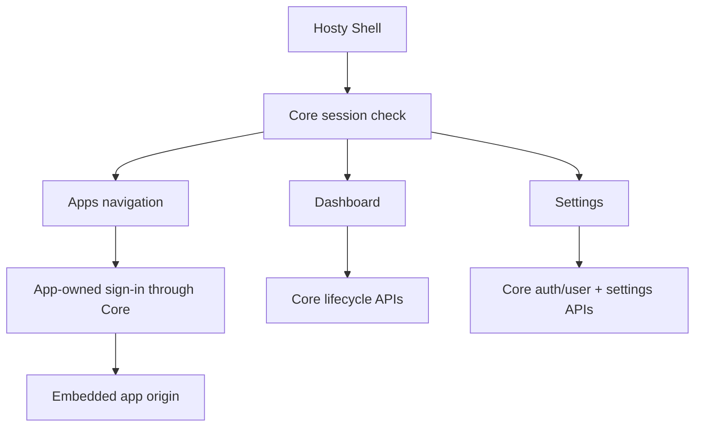

# Core App Shell

Hosty Shell is the Core-managed browser UI runtime app. It renders a single authenticated Shell surface backed by Hosty Core APIs; it does not own Core lifecycle logic and it does not reintroduce the retired combined Next.js Host package.

The Shell frame stays within the viewport. Its navigation, workspace and right panel have
independent bounded scroll areas: expanding navigation sections does not grow the document,
and the account footer stays visible below the navigation. Navigation scroll gestures do not
propagate to the surrounding page when the list reaches an edge.

## Scope

The implemented Shell provides:

- an administrator-only Dashboard: Core's status and version beside every installed app, with install,
  lifecycle, configuration, updates, logs, backups, restore, prune, and removal;
- administrator-only Settings: users and invitations, Core's own settings and ingress connection, and
  host-wide shared mounts;
- Apps navigation for app manifests that declare shell UI metadata;
- embedded app workspaces whose apps establish their own Core-authorized sessions.

The route table and sidebar structure live in [Shell Navigation](../shell-navigation/feature.md).

Shell owns only an app-bound HttpOnly cookie. Its `/auth/start` navigates to Core's app-open flow;
`/auth/callback` checks browser-bound state, exchanges the code and revalidates its audience before
setting the cookie. Same-origin `/api/core/...` handlers send the server's service credential and
app-bound user grant to Core. Core checks the app's confirmed permission and the user's current
role/assignment. Core's primary cookie is never forwarded to Shell; no credentialed Core CORS
exception remains for Shell. Public status comes from `/api/core/status`; protected data comes from Core APIs such as `/api/auth/session`, `/api/apps`, `/api/auth/users`, and `/api/apps/{appId}/...` lifecycle endpoints. If a protected Core API returns `401`, Shell treats that as an authentication-required state and navigates to its `/auth/start` flow instead of rendering a reduced unauthenticated Shell surface. `403` responses remain visible authorization or CSRF failures.

Shell is a thin browser client for Core APIs. Its browser-facing Core origin comes from `HOSTY_CORE_PUBLIC_ORIGIN` or, for client-side build compatibility, `NEXT_PUBLIC_HOSTY_CORE_PUBLIC_ORIGIN`. `NEXT_PUBLIC_HOSTY_CORE_ORIGIN` is accepted only as a legacy fallback. When Core manages Shell without an explicit public origin, Shell uses Core's fallback `http://localhost:<core-port>` value. `HOSTY_CORE_ORIGIN` is reserved for runtime process-to-Core calls; Docker runtimes may receive it as `http://host.docker.internal:<core-port>`, but Shell must not serialize that internal container origin into browser fetches or login links.

Without an explicit public origin, Core derives separate per-app browser names under `hosty.localhost`, keeping the assigned ports. Login, account/consent, setup/recovery and status links use these effective browser origins; internal transport remains separate.

## Client Module Structure

Shell keeps one persistent client orchestrator at `apps/shell/src/app/shell-client.tsx`. The root App Router layout creates this orchestrator once around the route `children`, so Core state, session/auth state, sidebar compact state, app registry data, CSRF mutation ordering, dialogs, and embedded workspace launch state survive navigation between Shell routes.

Feature UI lives under `apps/shell/src/app/shell/`:

- `types.ts`, `core-api.ts`, `shell-routes.ts`, `theme.ts`, `state.ts`, and `server-env.ts` define shared contracts, low-level helpers, and server-side Shell environment resolution;
- `shell-context.tsx` exposes separate persistent Shell state and action contexts to route pages;
- `shell-route-pages.tsx` adapts individual App Router pages to Shell feature components;
- `sidebar/` contains Shell navigation and account/theme controls;
- `pages/` contains the Dashboard, Apps, and Settings view components, including the Settings
  sections for Core and shared mounts;
- `dialogs/` contains install review and installed-app detail dialogs;
- `workspace/` contains embedded app workspace loading and iframe surfaces;
- `ui.tsx`, `settings.tsx`, `app-helpers.ts`, and `clipboard.ts` contain shared presentational and formatting helpers;
- `settings-draft.ts` holds the app settings form's pure rules — the draft, the configure payload, and
  a secret field's rendered state — kept out of the JSX so they can be tested directly.

Each top-level route file renders only its route surface; the route table, the legacy paths that
still resolve, and the sidebar's two groups are described in
[Shell Navigation](../shell-navigation/feature.md). An administrator-only surface falls back to the
Apps route while the persistent orchestrator redirects a non-admin session to `/apps`.

The sidebar is a persistent desktop-style rail with an expanded and a compact mode; the selected
mode — like the right panel's docked state — is stored in a cookie the server layout reads, so the
first paint after a reload is already in the stored state instead of rendering the default and
animating the correction. A missing cookie falls back once to the legacy local-storage value. The
chrome's column animation stays disabled until the first Core load settles, so the right panel
column appearing with the apps response snaps into place rather than looking like it opens itself.
Because the sidebar and Core/session state are owned by the root layout, moving between routes does
not remount it or briefly render the unauthenticated navigation state.

Hosty Shell is installed as a system runtime app and does not appear as an entry in the Apps
sidebar.

```mermaid
flowchart TD
  A["Hosty Shell"] --> B["Core session check"]
  B --> C["Dashboard"]
  B --> E["Settings"]
  B --> F["Apps navigation"]
  F --> G["App-owned sign-in through Core"]
  G --> H["Embedded app origin"]
  C --> I["Core lifecycle APIs"]
  E --> J["Core auth/user + settings APIs"]
```

## Installed apps

Dashboard is the administrator management surface for installed apps: one table holding non-system runtime apps and Core-managed system apps together, the latter marked by a `System` badge.

The Core and installed-app tables share column widths. Runtime, version/source and status receive
12%, 17% and 20% of the table respectively; actions reserve 224 px and the app name uses the
remaining width. Both tables scroll horizontally below their 1040 px minimum width, preserving
readable names and space between metadata and action controls.

Apps expose actions according to Core state, plus — for the two entries that are optional app features rather than lifecycle verbs — the `logs` and `backup` capabilities the app declares (see below):

- start, stop, and restart;
- install from an `app.0.1` manifest URL, local manifest file path, or local app directory containing `manifest.json`;
- configure settings and autostart;
- plan and apply updates;
- inspect logs and health;
- create, restore, delete, and prune backups;
- remove an app, with optional backup deletion.

Each app row expands into its service details: per service, the runtime state and health message,
resource usage, and for image-based services the locked, running and available image digests.
Endpoints are grouped by service with their key, the service address (`not assigned` until Core has
assigned one) and, for public endpoints, the browser address, each with copy and open controls. A
stopped app still lists its declared endpoints; a service without endpoints says so.

The Status badge composes the two axes when they differ ([App Readiness](../app-readiness/feature.md)):
a running app whose health fold is not `healthy` reads `running · starting` or `running · degraded`,
in the health's tone, the way Aspire's dashboard shows it. A healthy app reads its state alone.

Autostart has no column of its own: nearly every app starts with the host, so a column that reads
`On` down its whole length costs width and says nothing. Only the exception is marked — an app that
does not start with Core carries a hand icon beside its status, and the tooltip says where to turn
autostart back on.

Below 1240 px of dashboard workspace width, the header actions collapse into an **App actions**
ellipsis menu at the same breakpoint as the row shortcuts. The menu contains Install app,
Check updates (disabled while a check is running), and Update all when routine updates are available.
Checking updates keeps the menu open so its progress indicator remains visible.
Routine updates use Core's queued update endpoint without a confirmation popup. Update all
submits only routine plans and queues Shell itself last. New permissions, provider roles and
other review-required manifest changes still open Core confirmation through the plan view.
Core validates the cached plan, current permissions and installed base; stale plans do not apply.
During a Shell self-update, the page waits for Core's operation to settle and the new Shell origin
to respond before reloading. Interrupted reads are retried without repeating the mutation.
At wider widths, the existing icon buttons remain visible. Opening the assistant panel or resizing
it changes this layout based on the remaining workspace width, not the browser viewport.

Each row's Actions cell carries the shortcuts an operator reaches for most — start or stop, restart,
console logs, and settings — as icon buttons, and the row's overflow menu lists every action the app
supports, the lifecycle verbs included. The menu is the complete, named set; the icons are a subset of
it, so an action is never only in one place. Version strings — each app's, and Core's — render
monospaced so the digits line up down the column, and Core's version is printed bare, without a `v`
prefix, in the same shape as an app's. Core and non-development apps show one package icon before
their version block, vertically centered across the installed and available versions when both
are present; development apps show their Git branch icon instead. The live-source icon beside the
runtime exposes the full explanation and last adopted manifest changes in a hover/focus tooltip,
without a repeated informational banner in the expanded service details.
The tooltip distinguishes an active live-source runtime from a selected development profile whose
source is not active; only the active live state says reviewed updates are unavailable.

### Secret settings

Core masks a `secret: true` setting's value out of the app summary and serves it only from
`/api/apps/{appId}/settings/{settingKey}/value`, so the settings form never receives it with the rest
of the app record. The field therefore renders from three states rather than one stored string:

- **Untouched.** The input is empty and reads `Unchanged` when a value is stored, `Not set` when none
  is. Revealing it fetches the stored value for display only — it never enters the draft, so looking at
  a secret cannot mark the form dirty or resave it. Hiding discards the fetched plaintext, so the next
  reveal fetches again.
- **Touched.** The input renders exactly what the operator typed, the empty string included. An
  untouched field may stand in the stored value; a touched one never does. (Falling back to the stored
  value whenever the draft read empty made a revealed secret impossible to delete: deleting the last
  character restored the whole value.)
- **Cleared.** A touched, empty field is a pending delete and says `Will be cleared on save`.

Core merges a configure payload key by key, so what the form omits decides what survives: an untouched
secret is left out and keeps its stored value, while a touched one is submitted verbatim. A clear is
submitted as `""` rather than `null`, because Core reapplies the manifest default over a `null` on the
next rebuild (install, update, or runtime switch) while an empty string stays empty.

Clearing a secret that the manifest marks `required` is allowed; Core then refuses to start the app
with `app_required_settings_missing` until it is set again.

### Lifecycle operations vs. app capabilities

These are two different things, and only one of them is the app's to declare.

**Lifecycle operations are inherent to Core managing an app** — start, stop, restart, update, remove, autostart. Core authorizes them on the administrator session at the endpoint (`RequireAdminSessionAsync`) and never consults the manifest, so an app cannot decline to be stopped or updated by omitting a token. Shell gates them on administrator rights, and additionally hides start, stop, restart, backups, autostart, and removal for `system` apps. Updates are deliberately **not** system-gated: a system app is reviewed-updated through the same plan/apply flow as any other runtime app. The one genuine Core-side refusal is a live source runtime, which has no reviewed update because its manifest is adopted on restart rather than advanced through a plan.

**The manifest `capabilities` list describes optional app *features*** a client may surface, and its canonical vocabulary is therefore only `backup` and `logs` — things that genuinely depend on the app (does it have data worth snapshotting?). Core normalizes a declared list to that vocabulary, dropping the retired lifecycle tokens (`update`, `stop`, `restart`, `remove`) and the two that no client ever read: `open` is derived from the app's endpoints, and `restore` lives inside the backup panel. A manifest that declares nothing gets the full default set.

This list is a client hint, never a grant. The separate manifest `provides` field is the axis on which an app declares a role to Core (see [Runtime App Manifest](../runtime-app-manifest/feature.md) and [Core Extension Model](../core-extension-model/plan.md)); self-description is load-bearing there and is guarded by explicit operator consent instead.

System Apps are inspectable and configurable in Shell. Administrators can open their ordinary settings dialog, switch runtime profiles, and apply reviewed updates — system apps update through the exact same plan/apply flow as every other runtime app. Logs remain available when the `logs` capability is present. Shell hides start, stop, restart, backup, restore, autostart, and removal controls for all `system` apps. This lets Marketplace own its catalog URL as a manifest setting without adding Marketplace logic to Core. Core remains the source of truth for what operations are allowed.

## Profile and authorization surfaces

Shell renders display-name editing at `/settings?tab=profile` through its app-session BFF.
Harness settings owns source-provider connection forms under `apps.sources`; Shell does not read
or configure them. Core keeps persistence and ownership checks in the API; it serves no profile/settings page.
An authenticated app can read and edit its current user's profile without `users.read/manage`.
The API accepts profile fields only; user administration remains a separate permission boundary.

Credential issuance stays at Core `/account/tokens`, and OAuth consent at `/oauth/consent`.
Installation/permission confirmation stays on Core's isolated origin. Source selection is app UI;
Core remains responsible for validating ownership and the final reviewed installation.

Assistant handoff uses a same-origin Shell server endpoint and the optional `providers.assistant`
grant. Core chooses the confirmed provider endpoint and validates the acting user; the browser
receives the handoff result, not provider credentials. The old embedded delegated-token responder
is disabled. Harness MCP authorization is tracked in
[local browser origins](../local-browser-origins/plan.md).

## Embedded Apps

An app appears in the Apps navigation only when its installed manifest includes a `ui` contract. Public runtime endpoints alone do not create Shell navigation, and the Shell itself is excluded from the group.

Ordinary and system apps share one group and one deep link, `/workspace?app=<app-id>&path=<app-path>` (Shell 0.49.0). Core filters `GET /api/apps` and app identity issuance using the same assignment rule for system and ordinary apps: enabled administrators have implicit access; other users need an explicit assignment. A stopped UI-capable app stays listed but disabled with its runtime state, and direct navigation reports that state.

Shell opens app UIs through the app-owned origin returned by Core. Local runtime app browser origins use the generated names described in [local browser origins](../local-browser-origins/feature.md). If an app endpoint has a configured `HOSTY_PUBLIC_ORIGIN_{ENDPOINT_KEY}` value, Core uses that public origin for Shell and standalone links, while endpoint summaries still keep the local `url` and expose the external value separately as `publicOrigin`. All four embedded launch paths open the app URL directly. The app SDK establishes or recovers its own identity through Core; Shell does not issue cross-app launch codes. For standalone tabs, Shell uses `/api/apps/{appId}/open?redirectUri=...`.

The app receives a short-lived code and exchanges it with Core for app-scoped identity. Shell does not proxy app HTML, rewrite assets, or forward Hosty session cookies to the app origin.

The workspace URL also carries `hosty_launch=embedded`, which tells the app that Shell is rendering its name and its `ui.navigation` pages so it can drop its own copies — see [Embedded App Chrome](../embedded-app-chrome/feature.md). Only the workspace URL carries it; the standalone href behind "open in a new tab" never does, because that link exists to leave Shell.

An active embedded app may send the versioned `hosty:install-feed` intent with an HTTP(S) `feedsUrl` and optional `feedId`. Shell accepts it only when the message source is the active iframe, the origin exactly matches the resolved app origin, the payload is bounded and well formed, and the URL uses HTTP(S). A valid intent opens Core's generic reviewed feed-install dialog; it never installs directly. This is how the Marketplace system app hands discovery data back to Shell without receiving Core lifecycle credentials.

Embedded workspace iframes are hosted in a Shell-owned `bg-background` surface. Shell keeps the iframe transparent until its document fires `load`, then reveals it and posts the current Shell theme. Theme posting is best-effort because local app restarts can leave the iframe on `about:blank` or a browser error document with a different origin. This masks the browser's default white iframe canvas during dark-theme app navigation and initial app loads without surfacing transient `postMessage` origin errors.

While an embedded workspace route is launching before the iframe exists, Shell shows a plain theme-background workspace surface without a spinner or opening label. Launch errors remain visible on that surface.

## Gateway Boundary

The removed Legacy Host included `/ingress` and gateway exposure UI. That route tree no longer exists in the repository.

Public exposure goes through [Cloudflare ingress](../cloudflare-ingress/feature.md), configured in Shell's Settings. Shell presents no `/ingress`, `/api/gateway/*` or `/api/ingress/*` surfaces.

## Links

- [App UI surfaces](../app-ui-surfaces/feature.md) - where app pages, settings and panels are placed.
- [Marketplace System App](../runtime-app-marketplace/feature.md) - the first storefront using the generic system-app and install-intent paths.

## App Icons

Dashboard and sidebar app rows prefer the manifest's `catalogMetadata.icon` image. When that image
is absent or fails to load, Shell renders the Lucide name declared in `ui.icon`, which Core projects
as `AppSummary.icon`. Component names such as `BarChart` and dynamic keys such as `bar-chart`
resolve to the same icon. Named icons load on demand; missing or unknown names retain the surface's
generic fallback. This behavior is the same for live development and compiled runtimes.

Image failure state belongs to its URL. A changed URL starts a fresh image load instead of carrying
a previous failure into the new version's icon.

## Build

Shell development and production commands explicitly select webpack. Its extension aliases resolve
the workspace SDK's `.js` imports to TypeScript sources; the Docker image uses the same production
build command.

Shell ships as the `ghcr.io/alex-de-haas/hosty-shell` image, published by `shell-image.yml` (see
[repository and release model](../repository-release-model/feature.md#release-artifacts)). Core
installs it as the system app `hosty.shell` from the release-owned distribution list
([removable system apps](../removable-system-apps/feature.md)); its manifest defaults to the
`docker` profile and also offers a `dev` `localCommand` profile. An installed Shell advances only
through the operator's reviewed update flow, like every other runtime app.

Shell's app-session proxy uses a 15-second response-header deadline for reads and auth checks,
and a 10-minute operation deadline for mutations, matching the local CLI's operation budget.
Starting a local app can install dependencies and build its UI before Core responds. Shell does
not cancel that setup at the short read deadline. Browser disconnects still cancel the request;
streaming responses remain tied to that signal after headers arrive. A proxy deadline returns
`core_request_timeout` (504), with guidance to check current state before retrying. Shell never
replays a mutation automatically.

## Assistant MCP Review

Harness configures its own MCP target access, instructions and tool rules in its settings. Shell's
Agents settings remain a fleet-wide administrative view. Embedded Harness can send
`hosty:request-mcp-review` with a target ID; Shell validates the sending frame and origin and derives
the assistant ID from that mounted frame. It opens Core's isolated review page and exposes a fallback
link if a popup is blocked. Message-supplied assistant IDs and URLs are not trusted.

## Testing Expectations

`npm test --workspace @haas/hosty-shell` runs `node --test` over the pure TypeScript decision
modules and Vitest for component and embedding behavior. Keep payload and access decisions in
separately testable modules; component tests cover their UI wiring.

Required coverage:

- Embedded MCP review accepts only the mounted frame and exact origin, derives the assistant identity
  locally and ignores forged assistant IDs or review URLs;

- `settings-draft.ts` — the draft's untouched/cleared split, the configure payload it produces, and a
  secret field's display value and placeholder across the reveal-and-delete sequence;
- `app-problems.ts` — the problems derived for an app row, including settings a required field leaves
  missing;
- `runtime-states.ts` — the busy/idle/up predicates and their mutual exclusivity;
- `shell-routes.ts` — route parsing and building agreeing in both directions, legacy paths
  canonicalizing without looping, and administrator-only surfaces;
- `workspace/install-intent.ts` and `workspace/insecure-embed.ts` — the versioned install-feed intent's
  accept/reject rules and the insecure-embed guard;
- `ingress.ts` — public-origin and ingress-provider resolution.

Build and lint checks complement these suites. Behavior requiring a live Core browser session is
verified against a Core-managed Shell rather than a standalone app without Hosty identity.

- Icon coverage includes manifest-declared names without catalog metadata for both live and compiled
  runtimes, unknown names, image priority, and recovery after a failed URL changes.
