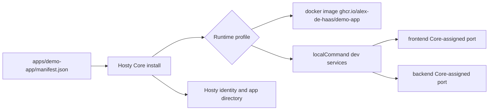

# Demo App

Demo App is the repository-local Hosty runtime app under `apps/demo-app`. It is the primary first-party app used to validate runtime app lifecycle work, source overrides, local command runtime profiles, runtime switching, Hosty identity, scoped app directory access, storage probes, and app-owned roles.



## Files

- `apps/demo-app/manifest.json` - `app.0.1` manifest with Docker and `dev` local command runtime profiles.
- `apps/demo-app/Dockerfile` - production image build for the Demo App.
- `apps/demo-app/src/app/page.tsx` - runtime diagnostics dashboard.
- `apps/demo-app/src/app/people/page.tsx` - assigned Host users from the scoped app directory.
- `apps/demo-app/src/app/roles/page.tsx` - app-owned role assignment test page.
- `apps/demo-app/src/app/settings/page.tsx` - runtime configuration and storage inspection page.
- `apps/demo-app/src/app/api/health/route.ts` - health and writable-storage probe.
- `apps/demo-app/src/app/api/auth/identity/route.ts` - app identity, request-header, app directory, and app-owned permission diagnostics.

## Local Runtime Loop

```bash
hosty core start
hosty apps install apps/demo-app --runtime dev
hosty apps start com.haas.demo-app
hosty apps health com.haas.demo-app
hosty apps open com.haas.demo-app --user user@docker-host.local --mode shell
```

The `dev` runtime profile starts two Core-managed local command services from `apps/demo-app`. Core assigns available local ports and injects each service's selected port as `HOSTY_PORT_HTTP` and `PORT`.

- `frontend` exposes the public app UI endpoint.
- `backend` exposes the internal API endpoint.

Use source overrides when validating changes from a specific worktree:

```bash
hosty apps source-override com.haas.demo-app --path "$PWD"
hosty apps restart com.haas.demo-app
```

This installed-app loop replaces the removed legacy developer harness. Local checks should use Core-managed app lifecycle, existing Host users, app assignments, source overrides, and `hosty apps identity` or `hosty apps open`; they should not seed deterministic development users or inject fake identity headers.

## Docker Image

Build the local image from the repository root:

```bash
docker build -f apps/demo-app/Dockerfile -t hosty-demo-app:dev .
```

The published manifest image uses:

```text
ghcr.io/alex-de-haas/demo-app:latest
```

For local install testing, pass the app directory to Core:

```bash
hosty apps install apps/demo-app --runtime dev
```

The removed Legacy Host fixture route at `http://localhost:3000/fixtures/apps/demo-app` is no longer available. Local Docker image testing should use `hosty-demo-app:dev` together with a manifest or feed entry that selects the local image and `pullPolicy: ifNotPresent`.
