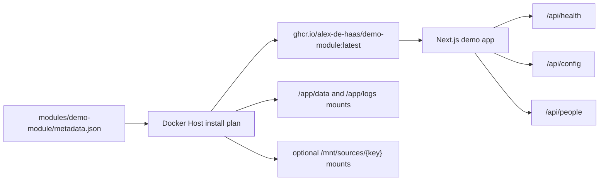

# Demo Module

## Description

Demo Module is a repository-local Docker Host module under `modules/demo-module`. It is a small Next.js application that gives Docker Host a stable target for validating module operations during development.

The module is intentionally simple: it exposes a dashboard, sample people data, sanitized runtime configuration, and a health endpoint. The metadata file exercises the current module schema with settings, module-owned storage directories, an optional external mount collection, a public HTTP runtime port, ignored MVP health-check metadata, and resource hints. The image is published to GitHub Container Registry as `ghcr.io/alex-de-haas/demo-module`.



## Files

- `modules/demo-module/metadata.json` - Docker Host metadata used for install and update tests.
- `modules/demo-module/Dockerfile` - production image build for the demo module.
- `modules/demo-module/src/app/page.tsx` - demo dashboard.
- `modules/demo-module/src/app/api/health/route.ts` - health and writable-storage probe.
- `modules/demo-module/src/app/api/config/route.ts` - sanitized runtime configuration.
- `modules/demo-module/src/app/api/people/route.ts` - sample people payload.

## Local Development

Run the Next.js app directly:

```bash
npm run demo-module:dev
```

The development server listens on `http://localhost:3100`.

## Docker Image

Build the local image from the repository root:

```bash
npm run demo-module:docker:build
```

The metadata uses:

```text
ghcr.io/alex-de-haas/demo-module:latest
```

The CI image workflow publishes `latest` and SHA tags to GitHub Container Registry. It authenticates with the built-in `GITHUB_TOKEN`, so no extra registry secrets are required. The metadata uses `pullPolicy: always`, so Docker Host pulls the rolling image on install and update.

## Install Testing

Docker Host accepts a URL to a metadata JSON file. Install this module from the repository metadata URL:

```bash
docker-host modules install https://raw.githubusercontent.com/alex-de-haas/docker-host/main/modules/demo-module/metadata.json
```

The module currently validates these Host flows:

- install plan generation from metadata;
- settings prompts and env injection;
- module-owned storage directory creation and mounting;
- optional external mount collection input;
- container start, stop, restart, remove, and update paths;
- future health-check integration through `/api/health`;
- future authorization experiments through the `DEMO_AUTH_PREVIEW` setting.
