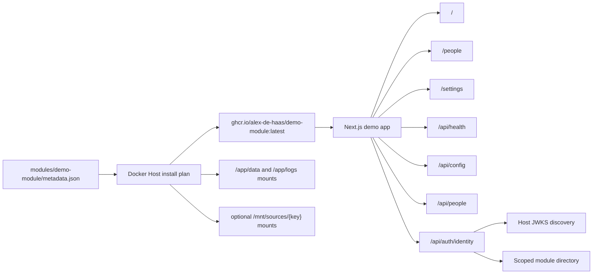

# Demo Module

## Description

Demo Module is a repository-local Docker Host module under `modules/demo-module`. It is a small Next.js application that gives Docker Host a stable target for validating module operations during development.

The module is intentionally small but covers the module contracts Docker Host needs to validate: it exposes a dashboard, sample people data, sanitized runtime configuration, storage probes, Host gateway identity diagnostics, module directory access, and a health endpoint. The metadata file exercises the current module schema with settings, module-owned storage directories, an optional external mount collection, a public HTTP runtime port, health-check metadata, resource hints, and shell UI metadata. The image is published to GitHub Container Registry as `ghcr.io/alex-de-haas/demo-module`.



## Files

- `modules/demo-module/metadata.json` - Docker Host metadata used for install and update tests.
- `modules/demo-module/Dockerfile` - production image build for the demo module.
- `modules/demo-module/src/app/page.tsx` - demo dashboard.
- `modules/demo-module/src/app/people/page.tsx` - stable people page for shell app navigation.
- `modules/demo-module/src/app/settings/page.tsx` - stable settings page for shell app navigation.
- `modules/demo-module/src/app/api/health/route.ts` - health and writable-storage probe.
- `modules/demo-module/src/app/api/config/route.ts` - sanitized runtime configuration.
- `modules/demo-module/src/app/api/people/route.ts` - sample people payload.
- `modules/demo-module/src/app/api/auth/identity/route.ts` - Host gateway identity, request-header, module directory, and module-owned permission diagnostics.
- `modules/demo-module/src/lib/host-auth.ts` - module-side validation of the Host-issued `X-Docker-Host-Identity` JWT and scoped directory lookup.

## Local Development

Run the Next.js app directly:

```bash
npm run demo-module:dev
```

The development server listens on `http://localhost:3100`.

Run the Host shell with this current checkout's demo module already linked as a developer app:

```bash
npm run host:dev:demo
```

This starts Docker Host with auto-login and module developer mode enabled, starts the demo module dev server, and seeds `.docker-host-dev-demo/dev/module-targets.json` so the app appears in the Apps sidebar immediately.

## Docker Image

Build the local image from the repository root:

```bash
npm run demo-module:docker:build
```

The metadata uses:

```text
ghcr.io/alex-de-haas/demo-module:latest
```

For current-branch install testing, build the local development tag instead:

```bash
npm run demo-module:docker:build:local
```

Then install the Host fixture metadata at:

```text
http://localhost:3000/fixtures/modules/demo-module
```

That fixture rewrites the image reference to `docker-host-demo-module:dev` with `pullPolicy: ifNotPresent`, so the Host installs the locally built image instead of the published registry image.

The CI image workflow publishes `latest` and SHA tags to GitHub Container Registry. It authenticates with the built-in `GITHUB_TOKEN`, so no extra registry secrets are required. The metadata uses `pullPolicy: always`, so Docker Host pulls the rolling image on install and update.

## Install Testing

Docker Host accepts a URL to a metadata JSON file. Install this module from the repository metadata URL:

```bash
docker-host modules install https://raw.githubusercontent.com/alex-de-haas/docker-host/main/modules/demo-module/metadata.json
```

The module currently validates these Host flows:

- install plan generation from metadata;
- settings prompts and env injection;
- module-owned storage directory creation and mounting;
- optional external mount collection input;
- container start, stop, restart, remove, and update paths;
- future health-check integration through `/api/health`;
- shell app discovery through `ui.entrypoint` and nested navigation for `/`, `/people`, and `/settings`;
- gateway exposure policies through the presence or absence of a Host identity token;
- module identity token validation through Host discovery and JWKS endpoints;
- module-scoped directory reads through `DOCKER_HOST_INTERNAL_ORIGIN`, `DOCKER_HOST_MODULE_ID`, and `DOCKER_HOST_MODULE_SERVICE_TOKEN`;
- module-owned permission mapping from Host identity claims;
- gateway request sanitization, including stripped Host session cookies and visible `X-Docker-Host-*` headers;
- authorization diagnostics through `/api/auth/identity`.
