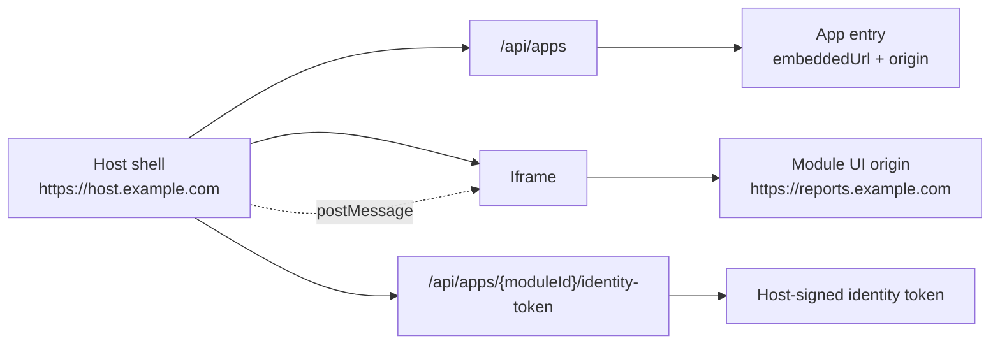

# Direct Origin Module UI

## Description

Docker Host opens module browser UIs in the Host shell iframe without proxying module HTML, JavaScript, CSS, assets, or application requests through Host-owned embed routes. Each module UI runs on its own browser origin. That origin can be any administrator-provided `http` or `https` origin, for example `https://reports.example.com`, or a Host-generated local fallback origin based on a published Host port.

The Host still owns app discovery, Host authentication, app access checks, shell navigation, and short-lived module identity token issuance. The module owns its own UI runtime, routing, cookies, assets, data model, and application-specific authorization.

## Origin Model

A module UI origin is not limited to a subdomain of the Host. The administrator can provide any valid origin:

- `https://reports.example.com`
- `https://customer-module.example.net`
- `http://192.0.2.10:3210`
- `http://localhost:3210`

The value must be an origin only: scheme, host, and optional port. Paths, query strings, fragments, usernames, and passwords are rejected. For example, `https://reports.example.com` is valid, while `https://reports.example.com/app` is not.

The Host does not create DNS records, TLS certificates, reverse proxy rules, or tunnel routes for module UI origins. Administrators manage those outside Docker Host. A Cloudflare Tunnel, a reverse proxy, a LAN DNS record, or a direct local port can all point to the published Host port. Docker Host stores only the selected origin and uses it for iframe navigation and `postMessage` target validation.

## Install Plan

Module metadata declares container ports and module endpoints. It does not pin Host ports and does not declare public browser domains. During install planning, Docker Host assigns published Host ports to public endpoints and shows them in the install plan.

Administrators can adjust the assigned Host port before confirming the install. This supports deployments that reserve a local port range for module UIs or need a predictable port for external DNS, tunnel, or reverse proxy configuration.

For each browser-facing endpoint, the install plan shows:

- module id;
- endpoint key;
- container and container port;
- assigned Host port;
- local fallback origin, such as `http://localhost:3100`;
- optional public origin, such as `https://reports.example.com`;
- whether the endpoint is required for the shell App UI.

If the administrator leaves the public origin empty, the Host still publishes the assigned Host port and builds a local fallback iframe URL from the current Host request host plus that port. For example, if the Host shell is opened as `http://192.0.2.10:3000` and the module endpoint uses Host port `3210`, the iframe origin becomes `http://192.0.2.10:3210`.

## Host Port Assignment

Docker Host assigns Host ports from `HOST_MODULE_PORT_RANGE`. The default range is `3100-3999`. The allocator skips ports already used by installed modules and by earlier endpoints in the same install plan.

The install apply step validates administrator edits before creating containers:

- selected Host ports must be integers from `1` to `65535`;
- selected Host ports must not duplicate another selected endpoint;
- selected Host ports must not conflict with another planned public endpoint;
- selected Host ports must not conflict with an already installed module outside the current install plan.

Published Host port bindings are stored in `modules.json` with the installed container record. The installed app registry uses the stored binding to resolve the iframe URL.

## App Registry

`GET /api/apps` returns authenticated, principal-filtered app entries. For direct-origin module UIs, each available app entry includes:

- `entryPath`: the Host shell route, such as `/apps/com.example.reports`;
- `embeddedUrl`: the direct module iframe URL;
- `origin`: the module iframe origin;
- `identityTokenUrl`: the Host endpoint that issues a short-lived module identity token;
- nested navigation entries whose `embeddedUrl` values also point directly at the module origin.

The Host app shell route remains Host-owned shell state. `/apps/{moduleId}` does not proxy to the module and is not a standalone module URL.

Developer app entries follow the same direct-origin model. Their iframe origin is derived from the developer target `targetBaseUrl`, and their identity endpoint is `/api/apps/dev/{targetId}/identity-token`.

## Identity Bridge

Browsers cannot set custom request headers on iframe document navigation. Because the Host no longer proxies module HTML, module identity cannot rely on Host-injected `X-Docker-Host-Identity` headers for shell iframe traffic.

Instead, the Host shell uses a minimal `postMessage` bridge:

1. The iframe posts `docker-host:ready` or `docker-host:request-identity` to the parent shell.
2. The Host shell verifies the iframe window and origin.
3. The Host shell calls the app entry `identityTokenUrl`.
4. The Host returns a short-lived Host-signed module identity token.
5. The Host shell posts `docker-host:identity` back to the iframe origin.

The module can use that token directly for module-owned bootstrap logic or exchange it for its own HttpOnly module-origin session cookie. The demo module uses `/api/auth/bootstrap` to store the token in a module-origin cookie and then reloads once so server-rendered routes can read the module identity.

Gateway service/API traffic can still receive `X-Docker-Host-Identity` through the existing gateway proxy. The direct-origin shell iframe identity bridge is only for browser UI embedding.

## Iframe Sandbox

Module UIs are sandboxed by the Host shell iframe with permissions required by normal module workflows:

- scripts;
- same-origin access for the module's own origin;
- forms;
- popups;
- clipboard writes;
- downloads.

The Host does not rewrite module response headers. A module UI must allow being framed by the Host origin through its own `Content-Security-Policy` and must avoid `X-Frame-Options` values that block the Host shell.

## External Module Direction

The direct-origin model leaves room for future externally hosted modules. In that model, an installed app could point to an origin owned by another service provider while still receiving a Host-scoped user identity token at login or bootstrap time.

The current implementation still installs Docker containers from module metadata. External UI-only modules are a future feature, not part of the current metadata contract.

## Operational Examples

Local-only installation:

1. The install plan assigns Host port `3210`.
2. The administrator leaves public origin empty.
3. The Host shell is opened at `http://localhost:3000`.
4. `/api/apps` returns `embeddedUrl: "http://localhost:3210/"`.

LAN installation:

1. The install plan assigns Host port `3210`.
2. The administrator leaves public origin empty.
3. Users open the Host shell at `http://192.0.2.10:3000`.
4. `/api/apps` returns `embeddedUrl: "http://192.0.2.10:3210/"`.

Public origin installation:

1. The install plan assigns Host port `3210`.
2. The administrator configures DNS, TLS, and routing so `https://reports.example.com` reaches that Host port.
3. The administrator enters `https://reports.example.com` as the public origin during install.
4. `/api/apps` returns `embeddedUrl: "https://reports.example.com/"`.

Cloudflare Tunnel is one possible routing layer for the public origin example, but Docker Host is not coupled to Cloudflare. Any DNS, TLS, reverse proxy, tunnel, or local network setup that reaches the published Host port can be used.
