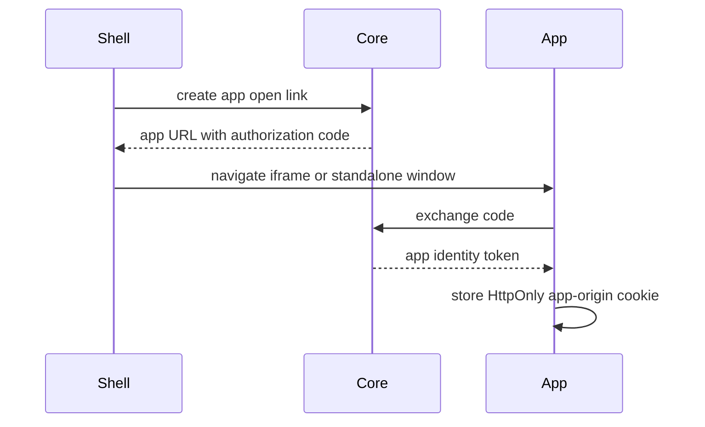

# Direct Origin Runtime App UI

## Description

Shell opens runtime app UIs from the app's own origin. Core issues a short-lived app authorization code, Shell navigates to the app entrypoint with that code, and the app exchanges it for an app-origin session cookie.

## Identity Flow

## App Requirements

- The app must define a public UI endpoint in `manifest.json`.
- The app should exchange `code` through `/api/auth/apps/token`.
- The app should revalidate its app identity token through `/api/auth/apps/revalidate`.
- The app should keep Host and app cookies separate.

## Demo App

The repository Demo App implements this flow with `/api/auth/app-code` and `/api/auth/identity`.
