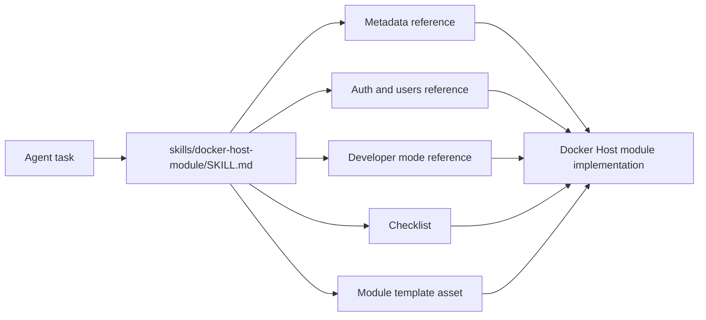

# Docker Host Module Skill

## Description

The repository ships a Codex skill for agents that implement Docker Host modules. The skill lives under `skills/docker-host-module` and packages the module workflow, compact references, and a minimal metadata template.

The skill helps agents:

- wrap an existing application as a Docker Host module;
- create new module metadata using the supported `schemaVersion: "0.2"` contract;
- add shell app UI metadata;
- integrate Host gateway identity and scoped user directory access;
- implement module-owned roles;
- distinguish module metadata from Host-owned service/API exposure and external ingress readiness;
- validate modules with the local developer-mode workflow before falling back to slower image rebuilds.

The skill is intentionally not a copy of the full documentation. `SKILL.md` is a short workflow guide, while `references/` contains focused topic documents that agents load only when needed.

For Host-facing module behavior, the skill points agents at the integrated developer target loop: run the module app locally, route it through Docker Host, seed Host-owned development users and assignments, and let the gateway issue the normal signed module identity token. Directly injecting fake module identity headers is not considered a valid Host integration check.

The skill also distinguishes the Host API origin from the Host lifecycle mode. Agents should use the manifest `host.mode` field or `docker-host dev --host-url` when validating modules against a Host process that is running directly from source instead of inside the installed Host container.



## Files

- `skills/docker-host-module/SKILL.md` - trigger metadata and core workflow.
- `skills/docker-host-module/agents/openai.yaml` - UI-facing skill metadata.
- `skills/docker-host-module/references/module-metadata.md` - compact metadata schema, hard validation constraints, install/update behavior, and unsupported metadata assumptions.
- `skills/docker-host-module/references/module-auth-and-users.md` - Host roles, gateway policies, identity modes, identity tokens, scoped directory, external providers, external ingress readiness, and module-owned roles.
- `skills/docker-host-module/references/module-dev-mode.md` - local developer target workflow, trusted-control-backed `metadata.dev.json` harness behavior, and developer-mode boundaries.
- `skills/docker-host-module/references/demo-module-patterns.md` - practical patterns from `modules/demo-module`.
- `skills/docker-host-module/references/module-implementation-checklist.md` - final implementation and validation checklist.
- `skills/docker-host-module/assets/module-template/metadata.json` - minimal valid metadata skeleton.

## Installation And Updates

The repository copy is usable by agents that receive this checkout as context.

Inside the Codex app, install it by asking Codex:

```text
Use $skill-installer to install the skill from alex-de-haas/docker-host at skills/docker-host-module.
```

The built-in Codex skill installer installs the GitHub path into `$CODEX_HOME/skills`. It is the preferred first-install path when working inside Codex.

For repeatable command-line updates, run:

```bash
curl -fsSL https://raw.githubusercontent.com/alex-de-haas/docker-host/main/scripts/install-docker-host-module-skill.sh | sh
```

The installer downloads `skills/docker-host-module` from GitHub and atomically installs it into:

```text
${CODEX_HOME:-$HOME/.codex}/skills/docker-host-module
```

Run the same command again to update the global skill. Restart Codex after installing or updating so the skill registry is reloaded.

The command-line installer is intentionally kept even though Codex has a built-in installer, because the built-in installer does not overwrite an existing skill directory. The script is the simple update path for Codex and for other agents or machines that do not have the Codex app helper available.

Install from a local checkout while developing the skill:

```bash
sh scripts/install-docker-host-module-skill.sh --source-dir skills/docker-host-module
```

Install a specific branch, tag, or commit:

```bash
curl -fsSL https://raw.githubusercontent.com/alex-de-haas/docker-host/main/scripts/install-docker-host-module-skill.sh | sh -s -- --ref main
```

For private forks, set `GITHUB_TOKEN` or `GH_TOKEN`, or pass `--repo OWNER/REPO`.

## Usage From Other Repositories

After installation and Codex restart, open any application repository and invoke the skill explicitly:

```text
Use $docker-host-module to wrap this app as a Docker Host module.
```

The skill may also trigger implicitly for module-related work, but explicit invocation is preferred when converting external application repositories.

## Maintenance

Keep the skill aligned with the source documentation:

- update `references/module-metadata.md` when `docs/features/module-metadata.md` changes;
- update `references/module-auth-and-users.md` when `docs/features/auth-gateway.md` or `docs/features/user-management.md` changes;
- update `references/module-dev-mode.md` when `docs/features/module-developer-mode.md` or `docs/features/module-development-harness.md` changes;
- update `references/demo-module-patterns.md` when `modules/demo-module` changes in a way agents should copy.
- update `references/module-implementation-checklist.md` when module validation, gateway publishing, or security review expectations change.

Run the skill validator after changes:

```bash
python3 "${CODEX_HOME:-$HOME/.codex}/skills/.system/skill-creator/scripts/quick_validate.py" skills/docker-host-module
```
