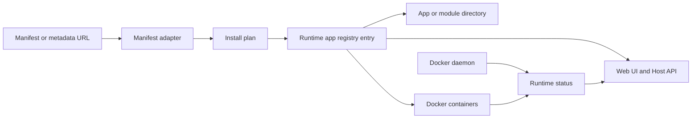

# Docker Host domain model

This document defines the Docker Host and Hosty compatibility domain model. It is the shared vocabulary for Host backend API, Web UI, CLI app/module commands, and persistent files.

## Scope

The implemented system is moving from a module-first model to a runtime app model. Docker containers remain an implementation detail managed by the Host, not the primary user-facing entity.

The domain model covers:

- Hosty system apps and runtime app summaries;
- app-oriented registry;
- installed module compatibility registry;
- Docker runtime status for installed modules;
- module start, stop, and restart actions;
- failed install retry and cleanup;
- installed module removal;
- module update planning, apply, and retry;
- persistent launch, app, backup, and module state files;
- settings, storage, and dependency contracts.

The domain model does not include:

- settings edit UI and APIs;
- storage configuration UI and APIs;
- module health checks beyond Docker daemon state;
- authentication and authorization details, which are covered by [Auth Gateway](auth-gateway.md).

## Core Entities



### App manifest and module metadata

An app manifest or legacy module metadata file is the JSON document downloaded from a URL and copied into the installed app/module directory.

Preferred app manifests use `manifest.json` terminology and `schemaVersion: "app.0.1"`. Legacy Docker module metadata with `schemaVersion: "0.2"` or `"0.3"` remains supported.

It defines:

- stable module identity: `id`, `name`, `version`;
- module-owned containers and Docker image references;
- dependency declarations;
- settings schema;
- storage declarations;
- module endpoints, container ports, and resource hints.

The metadata and manifest schema source of truth is [Module metadata files](module-metadata.md).

### Runtime app

A runtime app is a managed workload visible through the app registry. Legacy Docker modules are runtime apps through a compatibility adapter.

Runtime app summaries include:

- `kind`;
- `system`;
- `source`;
- `selectedRuntime`;
- `selectedChannel`;
- capabilities;
- browser entrypoint when the app has UI.

### App record

The local-first Core stores installed runtime app state under `apps/<app-id>/state.json`. The legacy Next compatibility layer can still project app-oriented records through root-level `apps.json`.

An app record owns the lifecycle and planning state for app-oriented workflows:

- selected runtime and selected channel;
- operation status, runtime state, last operation, and last error;
- manifest source and local manifest copy path;
- settings values, storage mappings, dependency contracts, and endpoint contracts;
- source repository state, managed checkout path, local override path, resolved ref, immutable commit, and update timestamp.

New Core lifecycle, source, identity, backup, and runtime switching operations should resolve app state from the app record. Legacy `modules.json` is only a compatibility source for already-installed legacy modules and explicit legacy imports.

### System app

A system app is Hosty-owned and supports the platform. Hosty Shell is currently synthesized as a non-removable system app with `id: "hosty.shell"`.

### Installed module

An installed module is a legacy module metadata document plus Host-owned persistent state.

The installed module record is stored in root-level `modules.json` and includes:

- `id`;
- `metadataUrl`;
- `metadataPath`;
- `containers[]` with container names, network aliases, and image references;
- install/update bookkeeping status;
- setting values, including write-only secret values;
- computed storage mappings;
- resolved dependency URLs;
- timestamps;
- last operation error.

Docker runtime status is not persisted in the installed module record. The Host reads it from Docker daemon when serving API responses.

`modules.json` can also contain legacy Host backend-owned settings that are not CLI launch settings. New app-oriented lifecycle writes do not create `modules.json`.

### Module directory

Each new app-oriented install has a directory under:

```text
~/.hosty/apps/<app-id>/
```

The directory contains:

- `state.json` - local-first Core app record for installed runtime app lifecycle and source state;
- `manifest.json` - local copy of the source manifest document;
- `data/` - primary app data directory when the app uses local persistent data.

Legacy installed modules can still have a directory under:

```text
~/.docker-host/modules/<module-id>/
```

or under the active data root:

```text
<hosty-data-root>/modules/<module-id>/
```

The legacy directory contains:

- `metadata.json` - local copy of the source metadata document;
- module-owned storage directories such as `settings/`, `data/`, `cache/`, or other metadata-declared paths.

There are no per-module `module-state.json`, `module-installation.json`, or `module-settings.json` files.

### Host launch configuration

The Host container launch configuration is stored in:

```text
~/.hosty/config/launch.env
```

The legacy `~/.docker-host/config/launch.env` remains readable when the legacy root is selected.

It owns Host container lifecycle settings, not module state:

- `HOST_IMAGE`;
- `HOST_CONTAINER_NAME`;
- `HOST_DATA_ROOT_HOST`;
- `HOST_DATA_ROOT_CONTAINER`;
- `HOST_UI_PORT`;
- `HOST_RESTART_POLICY`;
- `HOST_DOCKER_ENDPOINT`;
- `HOST_DOCKER_SOCKET`;
- `HOST_MODULE_NETWORK`.

The standalone `hosty` CLI reads this file for Host lifecycle commands. `docker-host` remains a deprecated compatibility alias. `HOST_DOCKER_ENDPOINT` is the CLI-side Docker Engine endpoint, such as `unix:///var/run/docker.sock` on macOS/Linux/WSL or `npipe:////./pipe/docker_engine` on native Windows. On Windows with Docker Desktop, WSL integration must be enabled for the WSL distro where the CLI runs so the Unix socket is available there. `HOST_DOCKER_SOCKET` is the socket path mounted into the Linux Host container and remains `/var/run/docker.sock`.

## Persistent Files

| Path | Owner | Responsibility |
| --- | --- | --- |
| `~/.hosty/config/launch.env` | CLI | Host container launch settings. |
| `~/.hosty/apps.json` | Host backend | Legacy Next compatibility registry with manifest source, selected runtime, selected channel, and timestamps. |
| `~/.hosty/apps/<app-id>/state.json` | Hosty Core | App-owned lifecycle, selected runtime, source state, settings, storage, dependency, endpoint, and error state. |
| `~/.hosty/apps/<app-id>/manifest.json` | Host backend | Local copy of downloaded app manifest. |
| `~/.hosty/apps/<app-id>/data/` | Host backend | Primary app data directory for new app-oriented installs. |
| `~/.hosty/backups/<app-id>/` | Host backend | ZIP app data backups and JSON backup metadata. |
| `~/.hosty/sources/<app-id>/` | Hosty Core | Managed source checkout/cache root for repository-backed runtime apps. |
| `~/.hosty/modules.json` | Host backend | Optional legacy installed module registry, persistent module state, and Host-owned settings for compatibility imports. |
| `~/.hosty/modules/<module-id>/metadata.json` | Host backend | Local copy of downloaded legacy module metadata. |
| `~/.hosty/modules/<module-id>/<storage-key>/` | Host backend | Legacy bind-mount target for module-owned persistent storage. |

The same layout can live under `~/.docker-host` when the legacy data root is selected.

The Host backend creates and validates the Host data root structure at startup. The CLI creates the initial Host data root and `launch.env` during bootstrap.

Private Host state files such as `apps.json`, existing `modules.json`, and `auth/state.json` are written with owner-only permissions. When the Host runs as root inside a container against a bind-mounted data root, it preserves those private permissions but synchronizes the file owner to the mounted data root owner after atomic writes so WSL and local editor access follow the data root ownership.

Initial `apps.json` shape:

```json
{
  "schemaVersion": "app-store.0.1",
  "apps": [
    {
      "id": "com.acme.reports",
      "manifestUrl": "https://apps.example/reports/manifest.json",
      "manifestPath": "apps/com.acme.reports/manifest.json",
      "selectedRuntime": "docker",
      "selectedChannel": "main",
      "installedAt": "2026-06-01T09:00:00Z",
      "updatedAt": "2026-06-01T09:00:00Z"
    }
  ],
  "updatedAt": "2026-06-01T09:00:00Z"
}
```

Initial legacy `modules.json` shape:

```json
{
  "schemaVersion": "0.2",
  "hostSettings": {},
  "modules": [
    {
      "id": "com.acme.reports",
      "metadataUrl": "https://modules.example/reports/metadata.json",
      "metadataPath": "modules/com.acme.reports/metadata.json",
      "metadataDigest": "sha256:...",
      "planDigest": "sha256:...",
      "containers": [
        {
          "key": "app",
          "containerName": "mod-com-acme-reports-app",
          "networkAlias": "mod-com-acme-reports-app",
          "image": {
            "repository": "ghcr.io/acme/reports-module",
            "tag": "1.0.0",
            "reference": "ghcr.io/acme/reports-module:1.0.0",
            "pullPolicy": "ifNotPresent"
          }
        }
      ],
      "operationStatus": "installed",
      "settings": {
        "REPORT_RETENTION_DAYS": 30
      },
      "storageMappings": {
        "data": {
          "key": "data",
          "container": "app",
          "containerPath": "/app/data",
          "hostPath": "/Users/example/.docker-host/modules/com.acme.reports/data",
          "required": true,
          "writable": true,
          "readOnly": false
        }
      },
      "externalMounts": [
        {
          "collectionKey": "libraries",
          "key": "main-media",
          "label": "Main media disk",
          "hostPath": "/mnt/media",
          "container": "app",
          "containerPath": "/storage/libraries/main-media",
          "access": "readWrite",
          "readOnly": false
        }
      ],
      "resolvedDependencies": [
        {
          "id": "com.acme.identity",
          "endpoint": "http",
          "targets": [
            {
              "container": "app",
              "type": "env",
              "name": "IDENTITY_BASE_URL"
            }
          ],
          "resolvedBaseUrl": "http://mod-com-acme-identity-app:8080"
        }
      ],
      "installedAt": "2026-05-13T09:00:00Z",
      "updatedAt": "2026-05-13T09:00:00Z",
      "lastError": null
    }
  ],
  "updatedAt": "2026-05-13T09:00:00Z"
}
```

App backup metadata shape:

```json
{
  "schemaVersion": "app-backup.0.1",
  "id": "2026-06-01T12-00-00Z_manual",
  "appId": "com.acme.reports",
  "reason": "manual",
  "createdAt": "2026-06-01T12:00:00Z",
  "dataPath": "/data/apps/com.acme.reports/data",
  "archivePath": "/data/backups/com.acme.reports/2026-06-01T12-00-00Z_manual.zip",
  "archiveDigest": "sha256:...",
  "archiveBytes": 12345,
  "fileCount": 8
}
```

Backups contain only the primary app `data/` directory. External mounts are not backed up by Hosty.

The Host backend creates an empty store automatically:

```json
{
  "schemaVersion": "0.2",
  "hostSettings": {},
  "modules": [],
  "updatedAt": "2026-05-13T09:00:00Z"
}
```

## Lifecycle States

The domain model separates persistent operation status from Docker runtime status.

### Persistent operation status

Persistent operation status is stored in app lifecycle state or a legacy module record and describes Host-managed module operations:

| Status | Meaning |
| --- | --- |
| `installed` | Module is installed and has no active or failed install/update operation. |
| `installing` | Install operation is in progress. |
| `updating` | Update operation is in progress. |
| `failed` | Last install/update/start preparation operation failed and needs explicit administrator action. |
| `removing` | Remove operation is in progress. This state is temporary and should return to `installed` with `lastError` if removal fails before the registry entry is deleted. |

The domain model does not include a disabled module state.

### Docker runtime status

Docker runtime status is read from Docker daemon for each installed module container. Module summaries also include an aggregate status derived from all module containers.

| Status | Meaning |
| --- | --- |
| `not_created` | Module is installed in registry, but no container exists. |
| `created` | Container exists but has not run. |
| `running` | Container is running. |
| `paused` | Container is paused. |
| `restarting` | Docker is restarting the container. |
| `exited` | Container stopped after running. |
| `dead` | Docker reports the container as dead. |
| `unknown` | Host could not determine container state. |

The MVP does not expose module health or readiness status. Future health support may use Docker healthcheck data or another unified model, but the current module API reports only Docker container states and an aggregate module runtime state.

## Settings

Module settings are declared by metadata and stored as values in app lifecycle state or a legacy module record.

Rules:

- every setting target is treated as an environment variable scoped to one container;
- setting values are stored as typed JSON values in app lifecycle state or a legacy module record;
- Docker environment variables are stringified only when Host creates a module container;
- secret values are write-only in API responses;
- API responses may expose whether a secret value is set, but never the raw value;
- settings changes outside install/update review are not supported.

## Storage Mappings

Storage declarations come from `manifest.json` or legacy `metadata.json`. Computed or configured mappings are stored in app lifecycle state or a legacy module record.

Rules:

- `storage.directories[].mount.type` supports `bind`;
- default module-owned bind paths are created under `~/.docker-host/modules/<module-id>/`;
- external storage paths can point outside the module directory when configured by an administrator;
- Host validates required mappings before container start;
- Docker daemon mount errors are surfaced to the administrator with operation context.

## Dependency Resolution

Required dependencies are resolved before starting a consumer module.

The Host:

- reads dependency metadata URLs from the consumer metadata;
- ensures required dependency modules are installed and started;
- derives Docker network aliases from dependency module ids and endpoint container keys;
- computes internal base URLs from dependency module endpoints;
- injects base URLs into requested consumer containers through environment variables.

Optional dependencies are not supported. Metadata with `dependencies[].required: false` is rejected as unsupported.

## Install And Update Plans

Install and update plans are reviewed descriptions of Host mutations before apply.

An install plan describes:

- metadata URL and resolved metadata;
- metadata digest for the root metadata source and plan digest for the canonical normalized plan used to detect changes between review and apply;
- Docker images to pull;
- module directory and metadata copy target;
- required storage directories and mappings;
- settings requiring defaults or administrator input;
- external mount collection requirements and any administrator-selected external mount mappings;
- dependency modules that must be installed or started;
- container names, network aliases, endpoints, ports, mounts, environment variables, and restart policy.

`metadataDigest` is the SHA-256 digest of the root metadata JSON bytes downloaded from the submitted metadata URL. `planDigest` is the SHA-256 digest of canonical JSON for the normalized plan, including the dependency tree and computed install decisions, but excluding timestamps and transient runtime/download details. Install apply should compare the reviewed `planDigest`, not rely on durable pending plan state.

The install plan endpoint requires Docker daemon read access for conflict checks, but it must not create or mutate Docker resources. Docker conflict observations, such as an already existing container name or unavailable Host-managed network, are reported alongside the plan/error response and are not included in `planDigest`. Install apply must repeat these Docker checks before any mutation.

An update plan describes:

- refreshed metadata source;
- refreshed metadata digest and update plan digest;
- image changes;
- settings schema changes;
- storage mapping changes;
- dependency changes;
- container replacement steps.

Docker Host does not rely on durable pending plan state. Install and update apply operations recompute the reviewed plan from source metadata and submitted administrator decisions, then compare the reviewed plan digest before mutating files, module state, images, or containers.

Install and update use optimistic fail-fast behavior. If an install or update fails after changes have started, Host records failure state and preserves created files, directories, images, and containers for diagnosis.

## Naming Contracts

Module ids are stable and recommended to use reverse-DNS format, for example:

```text
com.modulis.storage
```

Docker names derived by Host must be deterministic:

- module container name: `mod-<normalized-module-id>-<container-key>`;
- network alias: `mod-<normalized-module-id>-<container-key>`;
- normalized id: lowercase, with characters outside `a-z` and `0-9` replaced by `-`.

Example:

```text
com.modulis.storage + app -> mod-com-modulis-storage-app
```
