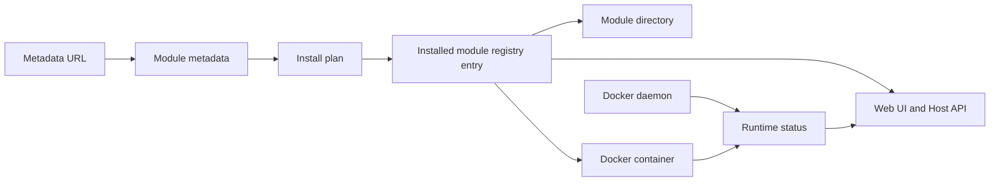

# Docker Host domain model

This document defines the Phase 0 domain model for the MVP rewrite. It is the shared vocabulary for Host backend API, Web UI, future CLI module commands, and persistent files.

## Scope

The MVP product model is module-first. Docker containers are an implementation detail managed by Docker Host, not the primary user-facing entity.

In scope for the first API slice:

- installed module registry;
- Docker runtime status for installed modules;
- module start, stop, and restart actions;
- persistent launch and module state files;
- domain contracts for later install, update, settings, storage, and dependency work.

Out of scope for the first API slice:

- module install and update execution;
- module remove flows;
- settings edit UI and APIs;
- storage configuration UI and APIs;
- module health checks beyond Docker daemon state;
- authentication and authorization.

## Core Entities



### Module metadata

Module metadata is the JSON document downloaded from a metadata URL and copied into the installed module directory as `metadata.json`.

It defines:

- stable module identity: `id`, `name`, `version`;
- Docker image reference;
- dependency declarations;
- settings schema;
- storage declarations;
- runtime ports and resource hints.

The metadata schema source of truth is [Module metadata files](module-metadata.md).

### Installed module

An installed module is a module metadata document plus Host-owned persistent state.

The installed module record is stored in root-level `modules.json` and includes:

- `id`;
- `metadataUrl`;
- `metadataPath`;
- `containerName`;
- `image`;
- install/update bookkeeping status;
- setting values, including write-only secret values;
- computed storage mappings;
- resolved dependency URLs;
- timestamps;
- last operation error.

Docker runtime status is not persisted in the installed module record. The Host reads it from Docker daemon when serving API responses.

`modules.json` is also the MVP location for any Host backend-owned settings that are not CLI launch settings. There is no separate `host-settings.json` file in the MVP.

### Module directory

Each installed module has a directory under:

```text
~/.docker-host/modules/<module-id>/
```

The directory contains:

- `metadata.json` - local copy of the source metadata document;
- module-owned storage directories such as `settings/`, `data/`, `cache/`, or other metadata-declared paths.

There are no per-module `module-state.json`, `module-installation.json`, or `module-settings.json` files in the MVP.

### Host launch configuration

The Host container launch configuration is stored in:

```text
~/.docker-host/config/launch.env
```

It owns Host container lifecycle settings, not module state:

- `HOST_IMAGE`;
- `HOST_CONTAINER_NAME`;
- `HOST_DATA_ROOT_HOST`;
- `HOST_DATA_ROOT_CONTAINER`;
- `HOST_UI_PORT`;
- `HOST_RESTART_POLICY`;
- `HOST_DOCKER_ENDPOINT`;
- `HOST_DOCKER_SOCKET`;
- `HOST_MODULE_NETWORK`.

The standalone `docker-host` CLI reads this file for Host lifecycle commands. `HOST_DOCKER_ENDPOINT` is the CLI-side Docker Engine endpoint, such as `unix:///var/run/docker.sock` on macOS/Linux/WSL or `npipe:////./pipe/docker_engine` on native Windows. `HOST_DOCKER_SOCKET` is the socket path mounted into the Linux Host container and remains `/var/run/docker.sock` in the MVP.

## Persistent Files

| Path | Owner | Responsibility |
| --- | --- | --- |
| `~/.docker-host/config/launch.env` | CLI | Host container launch settings. |
| `~/.docker-host/modules.json` | Host backend | Installed module registry, persistent module state, and MVP Host-owned settings. |
| `~/.docker-host/modules/<module-id>/metadata.json` | Host backend | Local copy of downloaded module metadata. |
| `~/.docker-host/modules/<module-id>/<storage-key>/` | Host backend | Default bind-mount target for module-owned persistent storage. |

The Host backend creates and validates the Host data root structure at startup. The CLI creates the initial Host data root and `launch.env` during bootstrap.

Initial `modules.json` shape:

```json
{
  "schemaVersion": "0.1",
  "hostSettings": {},
  "modules": [
    {
      "id": "com.acme.reports",
      "metadataUrl": "https://modules.example/reports/metadata.json",
      "metadataPath": "modules/com.acme.reports/metadata.json",
      "containerName": "mod-com-acme-reports",
      "image": {
        "repository": "ghcr.io/acme/reports-module",
        "tag": "1.0.0",
        "reference": "ghcr.io/acme/reports-module:1.0.0"
      },
      "operationStatus": "installed",
      "settings": {},
      "storageMappings": {},
      "resolvedDependencies": {},
      "installedAt": "2026-05-13T09:00:00Z",
      "updatedAt": "2026-05-13T09:00:00Z",
      "lastError": null
    }
  ],
  "updatedAt": "2026-05-13T09:00:00Z"
}
```

The Phase 3 backend creates an empty store automatically:

```json
{
  "schemaVersion": "0.1",
  "hostSettings": {},
  "modules": [],
  "updatedAt": "2026-05-13T09:00:00Z"
}
```

## Lifecycle States

The domain model separates persistent operation status from Docker runtime status.

### Persistent operation status

Persistent operation status is stored in `modules.json` and describes Host-managed module operations:

| Status | Meaning |
| --- | --- |
| `installed` | Module is installed and has no active or failed install/update operation. |
| `installing` | Install operation is in progress. |
| `updating` | Update operation is in progress. |
| `failed` | Last install/update/start preparation operation failed and needs explicit administrator action. |

The MVP does not include a disabled module state.

### Docker runtime status

Docker runtime status is read from Docker daemon for each installed module container:

| Status | Meaning |
| --- | --- |
| `not_created` | Module is installed in registry, but no container exists. |
| `created` | Container exists but has not run. |
| `running` | Container is running. |
| `paused` | Container is paused. |
| `restarting` | Docker is restarting the container. |
| `exited` | Container stopped after running. |
| `dead` | Docker reports the container as dead. |
| `unknown` | Host could not determine container state. |

The first implementation does not expose module health or readiness status. Future health support may use Docker healthcheck data or another unified model, but Phase 3 and the initial module API report only Docker container state.

## Settings

Module settings are declared by metadata and stored as values in `modules.json`.

MVP rules:

- every setting target is treated as an environment variable;
- secret values are write-only in API responses;
- API responses may expose whether a secret value is set, but never the raw value;
- settings changes are a later API slice.

## Storage Mappings

Storage declarations come from `metadata.json`. Computed or configured mappings are stored in `modules.json`.

MVP rules:

- `storage.directories[].mount.type` supports `bind`;
- default module-owned bind paths are created under `~/.docker-host/modules/<module-id>/`;
- external storage paths can point outside the module directory when configured by an administrator;
- Host validates required mappings before container start;
- Docker daemon mount errors are surfaced to the administrator with operation context.

## Dependency Resolution

Required dependencies are resolved before starting a consumer module.

The Host:

- reads dependency metadata URLs from the consumer metadata;
- ensures required dependency modules are installed and started;
- derives Docker network aliases from dependency module ids;
- computes internal base URLs from dependency runtime ports;
- injects base URLs into the consumer container through environment variables.

Optional dependencies are not implemented in the MVP. Metadata with `dependencies[].required: false` should be rejected as unsupported or deferred to a later feature slice.

## Install And Update Plans

Install and update plan execution is outside the first API slice, but the model is fixed for later implementation.

An install plan describes:

- metadata URL and resolved metadata;
- Docker image to pull;
- module directory and metadata copy target;
- required storage directories and mappings;
- settings requiring defaults or administrator input;
- dependency modules that must be installed or started;
- container name, network aliases, ports, mounts, environment variables, and restart policy.

An update plan describes:

- refreshed metadata source;
- image changes;
- settings schema changes;
- storage mapping changes;
- dependency changes;
- container replacement steps.

The first implementation uses optimistic fail-fast behavior. If an install or update fails after changes have started, Host records failure state and preserves created files, directories, images, and containers for diagnosis.

## Naming Contracts

Module ids are stable and recommended to use reverse-DNS format, for example:

```text
com.modulis.storage
```

Docker names derived by Host must be deterministic:

- module container name: `mod-<normalized-module-id>`;
- network alias: `mod-<normalized-module-id>`;
- normalized id: lowercase, with characters outside `a-z` and `0-9` replaced by `-`.

Example:

```text
com.modulis.storage -> mod-com-modulis-storage
```

## Open Questions

No Phase 0 domain model questions remain open. Later slices may reopen details for executable JSON Schema, generated OpenAPI, optional dependencies, external storage UX, and stable API version negotiation.
