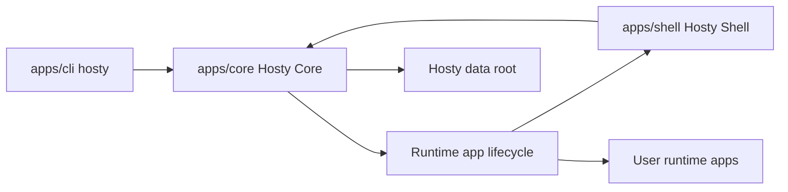

# Final Hosty architecture boundaries

This document records the implemented Hosty final architecture boundaries. It replaces the completed planning document as the source of truth for Core, Shell, CLI, runtime apps, backups, source state, and local command runtimes. Channel and Agent Bridge concepts are deferred architecture placeholders until the Core/Shell management experience is stable.

## Components

Hosty has three primary first-party components:

- `apps/core` - Hosty Core, a local-first ASP.NET Core Minimal API process. Core owns auth pages, public and local APIs, app state, runtime lifecycle, source state, channels, backups, logs, diagnostics, and policy.
- `apps/shell` - Hosty Shell, a Core-managed runtime app. Shell owns only the browser UI client and is installed, started, stopped, restarted, updated, logged, and health-checked through the same Core runtime lifecycle used by user apps.
- `apps/cli` - `hosty`, the bootstrap executable and local Core API client. The CLI installs or repairs Core, starts and stops Core, locates Core, updates bootstrap components, and delegates ordinary domain commands to Core APIs.

Runtime app fixtures and first-party example apps live in app-owned packages. The current first-party example is `apps/demo-app`.



## Core API ownership

Core owns the public and local API surface. API groups are organized around app-domain concepts, not legacy module naming:

- bootstrap, health, status, and local control discovery;
- auth pages, sessions, setup, recovery, logout, OIDC callback, trusted proxy, CSRF, and account switching;
- users, invitations, roles, disabled-user state, assignments, and audit records;
- app registry summaries for Shell and CLI;
- runtime app install, update, configure, remove, recovery, start, stop, restart, status, logs, backups, and restore;
- app manifest loading and validation;
- app settings, secrets references, storage mappings, dependency contracts, endpoint contracts, and app data directory resolution;
- source repository state, managed checkouts, and local source overrides;
- runtime profile switching plans and apply;
- deferred runtime app channel discovery and switching;
- deferred product channel discovery and coordinated CLI/Core/Shell updates.

Shell calls Core APIs through the configured Core origin. Shell must not contain Core-owned backend, auth, app lifecycle, or state mutation routes.

The CLI should call Core APIs for ordinary operations. It may keep recovery behavior only when Core is not installed, not running, or not reachable.

## Implemented Core APIs

Core exposes local control APIs under `/control/v1` and public browser/app APIs under `/api`:

- Core process: status, stop, health, local control discovery.
- App registry: authenticated, principal-filtered app summaries and app-native state under `apps/<app-id>/state.json`.
- Lifecycle: install, configure, start, stop, restart, update-plan, update, remove, logs. Browser Shell can call public start, stop, restart, logs, and backup endpoints; local control endpoints keep the complete lifecycle surface.
- Backups: list, manual backup, restore, delete, cleanup preview, and cleanup apply; update apply creates automatic pre-update backups. Browser Shell can use backup restore, delete, and cleanup routes with Core session, CSRF, and confirmation UX.
- Runtime switching: `switch-runtime/plan` and `switch-runtime` with plan digest review.
- Runtime app channels: channel list, `switch-channel/plan`, and `switch-channel` exist as low-level placeholders, but channel generation and Shell channel UI are deferred.
- Source state: managed checkout resolution, immutable commit storage, local source override set/clear.
- Identity helpers: sanitized user summaries, app-scoped identity token issuance, Shell/standalone open links.
- Auth: Core-owned session, CSRF, trusted proxy session, logout, app auth code, token exchange, and app session revalidation.

Control APIs require the local control secret from `core/run/control.json`. Browser lifecycle mutations require an active Core session, `host.admin`, and a matching `X-Hosty-CSRF` token.

## Shell runtime app contract

Hosty Shell is a first-party runtime app with its own manifest and Docker runtime profile. It is installed as the default Hosty-managed runtime app during Core bootstrap and autostarts by default.

Shell has the same lifecycle shape as other runtime apps:

- install;
- start;
- stop;
- restart;
- update;
- status;
- logs;
- selected channel;
- selected runtime profile.

The active Shell UI should hide its own self-stop action because stopping the UI from itself is confusing. Core APIs and CLI commands may still stop or restart Shell.

Core must remain manageable through CLI and local APIs when Shell is stopped, failed, or unavailable.

## CLI contract

The `hosty` CLI is a bootstrap and Core API client:

- `hosty start`, `hosty stop`, `hosty restart`, `hosty status`, and `hosty logs` operate on Hosty Core.
- `hosty core ...` exposes explicit Core process commands.
- `hosty apps ...` calls Core lifecycle APIs for runtime app management.
- `hosty users list` calls Core user summary APIs.
- `hosty apps identity` issues app-scoped identity through Core.
- `hosty apps open` asks Core for Shell or standalone app launch links.
- `hosty update` runs bootstrap CLI update first, then Core reachability and Shell update planning through Core APIs.
- `hosty update --list-channels` and `hosty update --channel <channel-id>` can read the local product channel index, but full product-channel publishing is deferred.

The legacy developer harness route is no longer exposed. Existing users are used for app identity helpers; deterministic development-user seeding is not part of the final workflow.

## Runtime adapters

Core includes two runtime adapters:

- Docker runtime adapter:
  - starts selected Docker runtime profile services;
  - injects settings, dependency URLs, assigned ports, Core origin, app id, service key, and `HOSTY_APP_DATA_DIR`;
  - binds the app data directory when the manifest declares data;
  - reads Docker logs.
- Local command runtime adapter:
  - launches local command services from a local source override, managed checkout, or app root fallback;
  - supervises process state in Core memory;
  - writes stdout/stderr logs under `apps/<app-id>/logs/`;
  - injects the same app data, settings, dependency URL, port, and Core identity/config environment as Docker runtimes.

Runtime switching uses reviewed plan digests. When the app has a primary data directory, switch apply creates a `pre-runtime-switch` backup before mutation. If a running app fails to start after switching, Core restores the previous selected runtime in app state, leaves the app stopped, records the error, and keeps the backup available for normal restore workflows.

## Source and channels

Runtime apps can declare one app-level source repository. Core stores source state as installation state:

- repository type and URL/path;
- resolved ref;
- immutable commit;
- managed checkout path under `sources/<app-id>/`;
- optional local source override path selected by an administrator.

Local source overrides are never written back to public app manifests.

Runtime app channel switching is a deferred feature. The low-level Core shape resolves a channel to a concrete manifest snapshot and reuses update planning/apply, but Shell UI, generated indexes, pull request channels, and remote manifest resolution are intentionally out of the current stabilization scope.

Product channels are described by `channels/product-channels.json` as a local placeholder. Generated product channels and coordinated CLI/Core/Shell rollout are deferred.

## Storage layout

The final Hosty data root uses app-native storage. The target layout is:

```text
<hosty-data-root>/
  core/
    config/
    auth/
    audit/
    run/
  apps/
    <app-id>/
      manifest.json
      state.json
      data/
  backups/
    <app-id>/
      <backup-id>.zip
      <backup-id>.json
  sources/
    <app-id>/
```

Core-owned state lives under `core/`. Runtime app state lives under `apps/<app-id>/`. Managed source checkouts live under `sources/<app-id>/`. App data backups live under `backups/<app-id>/`.

Legacy module stores are not part of the final architecture. Any required preservation from `modules.json`, `modules/<module-id>/`, or `metadata.json` should happen through explicit migration/import tooling rather than an ongoing compatibility runtime path.

## Backup policy

Backup rules are global in the current final plan:

- Core creates an automatic backup before runtime app update when the app has a primary data directory.
- Core keeps the last 5 automatic `pre-update`, `pre-restore`, `pre-runtime-switch`, and `scheduled` backups per app.
- Core keeps all manual backups until explicit deletion.
- Start, stop, restart, configure, and open operations do not create automatic backups.
- Runtime switch apply creates a `pre-runtime-switch` backup when the app has a primary data directory.
- Scheduled retention cleanup runs in Core. Age-based cleanup and per-app retention overrides are deferred.

Runtime app update planning does not mutate app data schemas. The runtime app owns its own data migration behavior when it starts after an update.

App removal should present separate choices for app runtime state, app data, backups, and source checkout or override state.

## Demo App

The first-party demo app lives under `apps/demo-app` and uses the `app.0.1` manifest contract. It has:

- Docker runtime profile;
- local command runtime profile;
- app-owned Dockerfile;
- app-owned package scripts;
- app-owned data directory support through `HOSTY_APP_DATA_DIR`.

The legacy `modules/demo-module` fixture has been retired. Demo App is the first-party demo contract.

## Legacy paths pending removal

The following paths and behaviors are current implementation details only. They remain valid while the final architecture is being built, but they are pending removal under the consolidated plan:

- `modules/<module-id>/` as a first-party app location;
- `modules.json` as a required lifecycle store;
- legacy module metadata as the first-party demo contract;
- separate dev metadata files;
- deterministic development user blocks;
- top-level developer harness commands;
- separate local target state and local-target control routes;
- deterministic development user seeding;
- browser development account seeding tied to the dev harness;
- Shell bundled into the same deployed Next.js app as Core APIs.

The replacement is an installed runtime app workflow: app manifests, source state, local source overrides, local command runtime profiles, existing Host users, app-scoped identity helpers, and normal Core lifecycle APIs.

## Open Questions And Answers

- Question: Should Agent Bridge live in this architecture document?
  Answer: Only as deferred context.
  Recommendation: Plan Agent Bridge after Shell management, auth, user management, backups, source state, pull request channels, and runtime validation are stable.

- Question: Should compatibility adapters remain after Core and Shell are split?
  Answer: No, not as a target architecture.
  Recommendation: Build explicit migration/import paths for preserved legacy data instead of adding permanent compatibility fallbacks.
