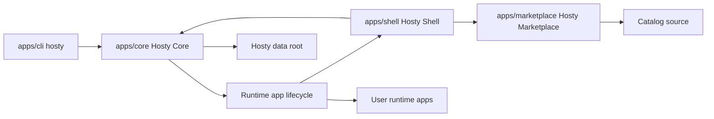

# Final Hosty architecture boundaries

Created: 2026-06-02
Updated: 2026-07-11

This document records the implemented Hosty architecture boundaries. It is the source of truth for Core, Shell, CLI, Marketplace, runtime apps, backups, source state, feeds, and local command runtimes. Agent Bridge concepts remain exploratory.

## Components

Hosty has four primary first-party components:

- `apps/core` - Hosty Core, a local-first ASP.NET Core Minimal API process. Core owns auth pages, public and local APIs, app state, runtime lifecycle, source state, followed-feed state, backups, logs, diagnostics, and policy.
- `apps/shell` - Hosty Shell, a Core-managed runtime app. Shell owns only the browser UI client and is installed, started, stopped, restarted, updated, logged, and health-checked through the same Core runtime lifecycle used by user apps.
- `apps/marketplace` - Hosty Marketplace, an optional Core-managed system runtime app. It owns its catalog source, catalog parsing, diagnostics, and storefront UI. It has no install or update authority.
- `apps/cli` - `hosty`, the bootstrap executable and local Core API client. The CLI installs or repairs Core, starts and stops Core, locates Core, updates bootstrap components, and delegates ordinary domain commands to Core APIs.

Runtime app fixtures and first-party example apps live in app-owned packages. The current first-party example is `apps/demo-app`.



## Core API ownership

Core owns the public and local API surface. API groups are organized around app-domain concepts:

- bootstrap, health, status, and local control discovery;
- auth pages, sessions, setup, recovery, logout, OIDC callback placeholder, trusted proxy session, and CSRF;
- users, invitations, roles, disabled-user state, assignments, and audit records;
- app registry summaries for Shell and CLI;
- runtime app install, update, configure, remove, recovery, start, stop, restart, status, logs, backups, and restore;
- app manifest loading and validation;
- app settings, secrets references, storage mappings, dependency contracts, endpoint contracts, and app data directory resolution;
- source repository state, managed checkouts, and local source overrides;
- runtime profile switching plans and apply;
- runtime-app repository feed loading, selection, digest-bound install, and followed-feed state.

Core does not own catalog source configuration, catalog parsing, catalog federation, Marketplace UI, or Marketplace compatibility routes. It treats a feed URL handed over by Shell as untrusted lifecycle input and validates the feed and selected manifest independently.

Shell calls Core APIs through the browser-facing Core public origin. Shell must not contain Core-owned backend, auth, app lifecycle, or state mutation routes. Runtime process-to-Core access uses `HOSTY_CORE_ORIGIN`; browser Shell access uses `HOSTY_CORE_PUBLIC_ORIGIN` or Core's localhost fallback, so Docker-only origins such as `host.docker.internal` never appear in Shell browser fetches or login links.

The CLI should call Core APIs for ordinary operations. It may keep recovery behavior only when Core is not installed, not running, or not reachable.

## Implemented Core APIs

Core exposes local control APIs under `/control/v1` and public browser/app APIs under `/api`:

- Core process: status, stop, health, local control discovery.
- App registry: authenticated, principal-filtered app summaries and app-native state under `apps/<app-id>/state.json`.
- Lifecycle: install, configure, start, stop, restart, update-plan, update, remove, logs. Browser Shell can call public start, stop, restart, logs, and backup endpoints; local control endpoints keep the complete lifecycle surface.
- Backups: list, manual backup, restore, delete, cleanup preview, and cleanup apply; update apply creates automatic pre-update backups. Browser Shell can use backup restore, delete, and cleanup routes with Core session, CSRF, and confirmation UX.
- Runtime switching: `switch-runtime/plan` and `switch-runtime` with plan digest review.
- Runtime app feeds: `POST /api/apps/install/feed/plan` and `POST /api/apps/install/feed` provide reviewed, digest-bound feed installation; `GET /api/apps/{appId}/feeds` and `POST /api/apps/{appId}/feed` read or change an installed app's repository-owned feed selection. Selecting a feed re-points future update resolution; any app change still uses the ordinary reviewed update plan/apply flow.
- Source state: managed checkout resolution, immutable commit storage, local source override set/clear.
- Identity helpers: sanitized user summaries, app-scoped identity token issuance, Shell/standalone open links.
- Auth: Core-owned session, CSRF, trusted proxy session, logout, app auth code, token exchange, and app session revalidation.

Control APIs require the local control secret from `core/run/control.json`. Browser lifecycle mutations require an active Core session, `host.admin`, and a matching `X-Hosty-CSRF` token.

## Shell runtime app contract

Hosty Shell is a first-party runtime app with its own manifest and Docker runtime profile. It is installed as the default Hosty-managed runtime app during Core bootstrap and uses the same installed-app autostart setting as other runtime apps. The default is enabled.

Runtime app autostart is owned by Core, not Docker. Docker runtime app containers are created with Docker restart disabled so Docker Desktop or the Docker daemon cannot independently restart runtime apps outside Core lifecycle ownership.

Shell has the same lifecycle shape as other runtime apps:

- install;
- configure app-level autostart;
- start;
- stop;
- restart;
- update;
- status;
- logs;
- selected repository-owned feed;
- selected runtime profile.

The active Shell UI should hide its own self-stop action because stopping the UI from itself is confusing. Core APIs and CLI commands may still stop or restart Shell.

Core must remain manageable through CLI and local APIs when Shell is stopped, failed, or unavailable.

## Marketplace System App Contract

Marketplace is optional discovery functionality. A non-empty `HOSTY_MARKETPLACE_MANIFEST_PATH` enables first-party bootstrap. First installation uses the manifest's default runtime; later reconciliation keeps the installed runtime and autostart choices. Core contains this explicit bootstrap descriptor but no Marketplace API client or catalog logic.

The app owns one HTTP(S) catalog source through its `HOSTY_MARKETPLACE_SOURCE_URL` manifest setting and exposes its storefront through the generic administrator system-app UI. An install action sends a bounded feed intent to Shell. Shell opens Core's generic feed review, and Core independently fetches and validates `feeds.json` and the selected manifest. Marketplace never receives lifecycle authority or installed-app state.

## CLI contract

The `hosty` CLI is a bootstrap and Core API client:

- `hosty start`, `hosty stop`, `hosty restart`, `hosty status`, and `hosty logs` operate on Hosty Core.
- `hosty start` and `hosty core start` use the installed Core executable under the Hosty data root by default, downloading it only when missing.
- `hosty core start --project <csproj-path>` is the explicit source-mode Core process command.
- `hosty apps ...` calls Core lifecycle APIs for runtime app management.
- `hosty users list` calls Core user summary APIs.
- `hosty apps identity` issues app-scoped identity through Core.
- `hosty apps open` asks Core for Shell or standalone app launch links.
- `hosty update` runs bootstrap CLI update first, then installs or replaces the managed Core executable, then performs Core reachability and Shell update planning through Core APIs when Core is running.
- `hosty update --list-channels` and `hosty update --channel <channel-id>` can read the local product channel index. No generated product-channel publishing workflow is part of the current release model.

The legacy developer harness route is no longer exposed. Existing users are used for app identity helpers; deterministic development-user seeding is not part of the final workflow.

The CLI has no catalog or Marketplace command. Catalog configuration is the Marketplace app's setting, while generic app lifecycle commands remain Core API clients.

## Runtime adapters

Core includes two runtime adapters:

- Docker runtime adapter:
  - starts selected Docker runtime profile services by shelling out to the `docker` CLI (`docker pull`/`run`/`stop`/`rm`), so it uses whatever daemon the `docker` command is configured to reach;
  - injects settings, dependency URLs, assigned ports, Core origin, app id, service key, and `HOSTY_APP_DATA_DIR`;
  - binds the app data directory when the manifest declares data;
  - reads Docker logs.
- Local command runtime adapter:
  - launches local command services from a local source override, local manifest worktree, or managed checkout;
  - supervises process state in Core memory;
  - writes stdout/stderr logs under `apps/<app-id>/logs/`;
  - injects the same app data, settings, dependency URL, port, and Core identity/config environment as Docker runtimes.

Runtime switching uses reviewed plan digests. When the app has a primary data directory, switch apply creates a `pre-runtime-switch` backup before mutation. If a running app fails to start after switching, Core restores the previous selected runtime in app state, leaves the app stopped, records the error, and keeps the backup available for normal restore workflows.

## Source And Feeds

Runtime apps can declare one app-level source repository. Core stores source state as installation state:

- repository type and URL/path;
- resolved ref;
- immutable commit;
- managed checkout path under `apps/<app-id>/source/`;
- optional local source override path selected by an administrator.

Local source overrides are never written back to public app manifests.

For `localCommand` runtimes, Core resolves the source root before runtime start. Local manifest file and app directory installs record a local worktree and do not clone source; remote manifest URL installs require an absolute clonable source repository and prepare the managed checkout under `apps/<app-id>/source/`.

Runtime apps may publish `app-feeds.0.1` in their own repository. Core stores the feed document URL, followed feed id, and last resolved manifest URL independently of Marketplace. Update planning re-resolves a followed feed before loading the candidate manifest. The Shell exposes feed selection, and actual app changes reuse reviewed update planning/apply. Direct manifest and folder installs remain feed-less. The removed `switch-channel` contract is not part of the system.

Product channels are described by `channels/product-channels.json` as a local placeholder that the CLI can read explicitly. There is no generated publishing workflow; the current Core entry identifies the release artifact family, not a source project path.

## Storage layout

The final Hosty data root uses app-native storage. The target layout is:

```text
<hosty-data-root>/
  core/
    config/
    auth/
    audit/
    run/
  apps/
    <app-id>/
      manifest.json
      state.json
      data/
  backups/
    <app-id>/
      <backup-id>.zip
      <backup-id>.json
  sources/
    <app-id>/
```

Core-owned state lives under `core/`. Runtime app state lives under `apps/<app-id>/`. Managed source checkouts live under `sources/<app-id>/`. App data backups live under `backups/<app-id>/`.

## Backup policy

Backup rules are global in the current final plan:

- Core creates an automatic backup before runtime app update when the app has a primary data directory.
- Core keeps the last 5 automatic `pre-update`, `pre-restore`, `pre-runtime-switch`, and `scheduled` backups per app.
- Core keeps all manual backups until explicit deletion.
- Start, stop, restart, configure, and open operations do not create automatic backups.
- Runtime switch apply creates a `pre-runtime-switch` backup when the app has a primary data directory.
- Scheduled retention cleanup runs in Core. Age-based cleanup and per-app retention overrides are tracked in [Backup Retention Extensions](../ideas/backup-retention-extensions.md).

Runtime app update planning does not mutate app data schemas. The runtime app owns its own data migration behavior when it starts after an update.

App removal should present separate choices for app runtime state, app data, backups, and source checkout or override state.

## Demo App

The first-party demo app lives under `apps/demo-app` and uses the `app.0.1` manifest contract. It has:

- Docker runtime profile;
- local command runtime profile;
- app-owned Dockerfile;
- app-owned package scripts;
- app-owned data directory support through `HOSTY_APP_DATA_DIR`.

Demo App is the first-party demo contract.

## Architecture Decisions

- Agent Bridge should appear here only as architecture context.
  Recommendation: keep detailed Agent Bridge concept work in [Agent Bridge Workflow](../ideas/agent-bridge-workflow.md).
