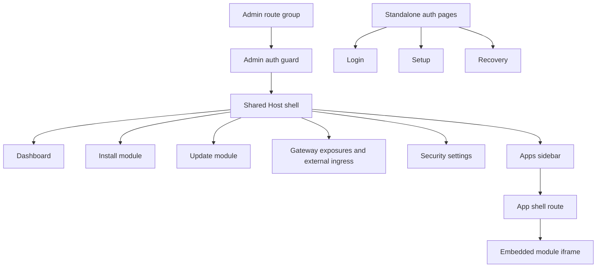

# Host App Shell

The Host Web UI uses an authenticated admin shell for protected Host pages. The shell is the foundation for the module app portal while preserving the existing Host backend APIs and module lifecycle workflows.

## Scope

Implemented Phase 1 behavior:

- protected admin pages live under a Next.js route group and keep their public URLs stable;
- `/`, `/modules/install`, `/modules/{moduleId}/update`, `/ingress`, and `/settings/security` render inside the shared shell;
- `/login`, `/setup`, and `/recovery` remain standalone pages outside the shell;
- the route group layout enforces the existing `host.admin` page guard;
- the shell owns the sidebar, mobile drawer, sticky topbar, account menu, logout action, and page action slot.

Implemented Phase 2 behavior:

- `GET /api/apps` returns app navigation data for the authenticated Host principal;
- `/api/apps` accepts any authenticated Host principal, not only `host.admin`;
- unauthenticated callers receive `401` and no app discovery data;
- app entries are built from explicit module `ui` metadata, installed module records, Host-owned module assignments, and runtime status;
- shell Apps do not support anonymous or `public` discovery;
- service/API gateway exposures are not inferred as shell Apps.

Implemented Phase 3 behavior:

- module metadata supports an optional shell-only `ui` contract;
- `ui.entrypoint` selects the public runtime port and default module UI path for shell embedding;
- `ui.navigation` provides optional nested app navigation without runtime route probing;
- invalid `ui` metadata is rejected by metadata validation;
- the demo module declares `ui` metadata and exposes stable `/`, `/people`, and `/settings` routes.

Implemented Phase 4 behavior:

- the Apps sidebar is populated from `/api/apps`;
- app entries can show nested navigation from `ui.navigation`;
- `/apps/{moduleId}` opens a Host-owned app page without proxying that path to module containers;
- the Host app page embeds module UIs in an iframe using `/api/apps/{moduleId}/embed?path=...`;
- the shell topbar remains Host-owned and shows app context, status, and refresh controls;
- module UIs cannot directly override the shell topbar;
- the embed route requires Host authentication, validates the selected shell App, proxies only the reserved embed path, injects module identity, strips Host-owned headers, and rewrites root-relative module links and assets through the reserved embed URL.

Implemented Phase 5 behavior:

- `/ingress` combines service/API gateway exposure management with external ingress readiness;
- administrators can create, edit, enable/disable, and delete gateway exposure records from the Web UI;
- the exposure form uses a narrow admin-only `/api/gateway/options` endpoint for installed module, public runtime port, active Host user, UI-entrypoint hint, and gateway domain choices;
- service/API exposures are visibly labeled as separate from shell Apps and excluded from Apps navigation;
- selecting a runtime port that is also `ui.entrypoint.portKey` shows a warning instead of publishing the module browser UI as a standalone public subdomain;
- `assignedUsersOnly` exposure editing updates module-wide Host access assignments;
- deleting an exposure removes linked external ingress readiness state;
- creating an exposure leaves readiness unmanaged until an administrator explicitly plans ingress.

## Navigation

The sidebar combines static Host management navigation with dynamic Apps navigation from `/api/apps`.

- Host:
  - Dashboard (`/`)
  - Gateway exposures (`/ingress`)
- Modules:
  - Installed modules (`/#installed-modules`)
  - Install module (`/modules/install`)
- Apps:
  - loading, error, and empty states when app registry data is unavailable or empty
  - one entry for each visible shell App
  - nested app navigation when `ui.navigation` is present
- Settings:
  - Security (`/settings/security`)

## Responsive Behavior

The shell uses a static sidebar on desktop (`lg` and wider). Below that breakpoint, navigation is hidden behind a drawer opened from the topbar. Selecting a drawer navigation item closes the drawer and navigates to the target route.

The topbar contains page title and description, a page-specific action slot, and the account dropdown. Long titles, descriptions, and account text truncate instead of causing horizontal page overflow.

For embedded module apps, the topbar remains Host-owned. The Host app route sets the app name, selected nested navigation label, status badge, and iframe refresh action. Module UIs may render their own internal headers inside the iframe, but they do not receive runtime control over the shell chrome. If module-provided topbar actions are needed later, they should be added through a new declarative metadata contract.

## Page Integration

The dashboard remains focused on installed module status, lifecycle actions, recovery dialogs, and links into install/update flows. Gateway exposure management and external ingress readiness live on the dedicated `/ingress` page and reuse the existing gateway and readiness APIs.

Install, update, and security pages keep their existing backend calls and form behavior. Their previous page headers were replaced by shell page metadata and topbar action slots.

## App Registry API

`GET /api/apps` returns a minimal, principal-filtered app registry for sidebar rendering and embedded app opening.

`host.admin` receives all shell-routable app entries, including unavailable entries with safe diagnostic status. `host.user` receives only available apps that are visible to all authenticated users or explicitly assigned to that user.

Shell App access modes are Host-owned:

- `allAuthenticated` - any signed-in Host user can discover the app;
- `assignedUsersOnly` - assigned Host users and `host.admin` can discover the app;
- no `public` or anonymous shell App mode exists.

The response intentionally returns same-origin Host paths, such as `/apps/{moduleId}` and reserved embedded URLs under `/api/apps/{moduleId}/embed`. It does not return Docker network aliases, container names, container ids, raw container URLs, public module UI domains, or service/API gateway exposure hostnames.

Modules appear in the app registry only when local metadata includes an explicit `ui` contract. `runtime.ports[].public` is still only a capability hint and does not create an app entry by itself.

## Embedded App Route

`/apps/{moduleId}` is shell state. It renders the Host shell around the selected module UI and uses the optional `path` query parameter to select nested module navigation, for example `/apps/com.acme.reports?path=%2Fpeople`.

The iframe uses the reserved embedded transport URL returned by `/api/apps`: `/api/apps/{moduleId}/embed?path=...`. This endpoint requires Host authentication and validates the current principal against the app registry before proxying to a module. It does not publish module UIs as standalone public hostnames and does not turn `/apps/{moduleId}` into a direct module proxy.

The embed transport rewrites root-relative links and assets in HTML/CSS responses back through the reserved embed URL so module pages can load common assets while remaining inside the Host shell. If a module response explicitly blocks framing with headers such as `X-Frame-Options: DENY` or `Content-Security-Policy: frame-ancestors 'none'`, the embed route returns a concise fallback page explaining that the module UI must support Host shell embedding.

## Module UI Metadata

The `ui` contract is shell-only. It describes how the Host can list and later embed a module UI; it does not publish a module UI hostname and does not create a service/API gateway exposure.

Supported fields:

- `ui.category` is optional and must be `Apps` when provided;
- `ui.icon` is optional and must be a non-empty lowercase icon key;
- `ui.entrypoint.portKey` must reference a `runtime.ports[]` item marked `public: true`;
- `ui.entrypoint.path` must be a same-origin absolute path beginning with `/`;
- `ui.navigation[]` is optional, preserves author-defined order, and requires unique same-origin absolute paths.

Missing `ui` metadata is valid. The module can still install and run, but it is not returned as a shell App. Malformed `ui` metadata is rejected during install/update planning, and app registry compatibility checks keep invalid installed metadata hidden from `host.user` while returning safe diagnostics to `host.admin`.

## Gateway Exposure UX

The `/ingress` admin page manages service/API gateway exposures and their external ingress readiness in one workflow.

Gateway exposures are Host-owned service/API publishing records. They contain:

- installed module id;
- public runtime port key;
- gateway hostname;
- exposure policy;
- module identity mode;
- enabled state.

When `HOST_GATEWAY_BASE_DOMAIN` is configured, the UI asks for a subdomain and previews the resulting full hostname. Without a base domain, administrators enter the full hostname directly.

The exposure form uses `/api/gateway/options` to load only the data needed by the form: installed modules with public runtime ports, UI-entrypoint hints, active Host users for assignment editing, and Host gateway domain settings. This avoids exposing raw Docker/container details through the client.

Exposure policy is the primary authorization control. Identity mode remains visible as an advanced control with defaults selected from the policy. Public exposures cannot use required identity mode.

For `assignedUsersOnly`, the editor updates module-wide Host assignments. Those assignments are shared by assigned-only service/API exposures and shell Apps for the same module.

Service/API exposure changes do not create shell Apps. If an administrator selects the same public runtime port used by `ui.entrypoint.portKey`, the form warns that browser UIs should remain inside the Host Apps shell.

External ingress readiness remains explicit. Creating an exposure does not create a readiness record automatically; administrators use the readiness section's Plan action. Disabling an exposure preserves readiness state, while deleting an exposure removes linked readiness records.

## Open Questions

- No Phase 1 shell foundation, Phase 2 app registry starter, Phase 3 module UI metadata contract, Phase 4 Apps sidebar/app host page, or Phase 5 gateway exposure management UX questions remain open.
- Later phases still need non-admin user portal behavior, developer mode integration, and full app portal browser smoke coverage.
