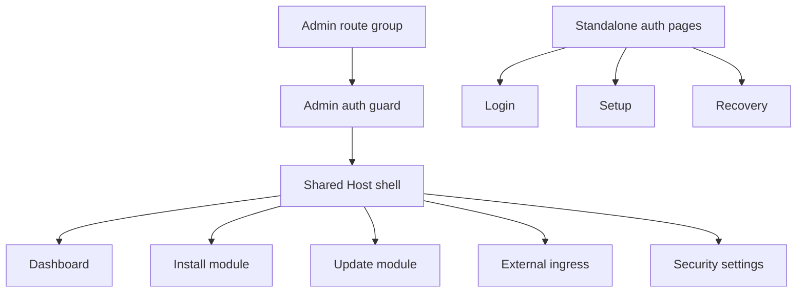

# Host App Shell

The Host Web UI uses an authenticated admin shell for protected Host pages. The shell is the foundation for the module app portal while preserving the existing Host backend APIs and module lifecycle workflows.

## Scope

Implemented Phase 1 behavior:

- protected admin pages live under a Next.js route group and keep their public URLs stable;
- `/`, `/modules/install`, `/modules/{moduleId}/update`, `/ingress`, and `/settings/security` render inside the shared shell;
- `/login`, `/setup`, and `/recovery` remain standalone pages outside the shell;
- the route group layout enforces the existing `host.admin` page guard;
- the shell owns the sidebar, mobile drawer, sticky topbar, account menu, logout action, and page action slot.

Implemented Phase 2 behavior:

- `GET /api/apps` returns app navigation data for the authenticated Host principal;
- `/api/apps` accepts any authenticated Host principal, not only `host.admin`;
- unauthenticated callers receive `401` and no app discovery data;
- app entries are built from explicit module `ui` metadata, installed module records, Host-owned module assignments, and runtime status;
- shell Apps do not support anonymous or `public` discovery;
- service/API gateway exposures are not inferred as shell Apps.

## Navigation

The current sidebar rendering remains static until the later Apps sidebar phase wires it to `/api/apps`.

- Host:
  - Dashboard (`/`)
  - External ingress (`/ingress`)
- Modules:
  - Installed modules (`/#installed-modules`)
  - Install module (`/modules/install`)
- Apps:
  - empty disabled state until the Apps sidebar consumes the app registry
- Settings:
  - Security (`/settings/security`)

## Responsive Behavior

The shell uses a static sidebar on desktop (`lg` and wider). Below that breakpoint, navigation is hidden behind a drawer opened from the topbar. Selecting a drawer navigation item closes the drawer and navigates to the target route.

The topbar contains page title and description, a page-specific action slot, and the account dropdown. Long titles, descriptions, and account text truncate instead of causing horizontal page overflow.

## Page Integration

The dashboard remains focused on installed module status, lifecycle actions, recovery dialogs, and links into install/update flows. External ingress readiness moved to the dedicated `/ingress` page and reuses the existing readiness panel and APIs.

Install, update, and security pages keep their existing backend calls and form behavior. Their previous page headers were replaced by shell page metadata and topbar action slots.

## App Registry API

`GET /api/apps` returns a minimal, principal-filtered app registry for future sidebar rendering and embedded app opening.

`host.admin` receives all shell-routable app entries, including unavailable entries with safe diagnostic status. `host.user` receives only available apps that are visible to all authenticated users or explicitly assigned to that user.

Shell App access modes are Host-owned:

- `allAuthenticated` - any signed-in Host user can discover the app;
- `assignedUsersOnly` - assigned Host users and `host.admin` can discover the app;
- no `public` or anonymous shell App mode exists.

The response intentionally returns same-origin Host paths, such as `/apps/{moduleId}` and reserved embedded URLs under `/api/apps/{moduleId}/embed`. It does not return Docker network aliases, container names, container ids, raw container URLs, public module UI domains, or service/API gateway exposure hostnames.

Modules appear in the app registry only when local metadata includes an explicit `ui` contract. `runtime.ports[].public` is still only a capability hint and does not create an app entry by itself.

## Open Questions

- No Phase 1 shell foundation or Phase 2 app registry starter questions remain open.
- Later phases still need the Apps sidebar, embedded app route, complete module UI metadata documentation, and non-admin user portal behavior.
