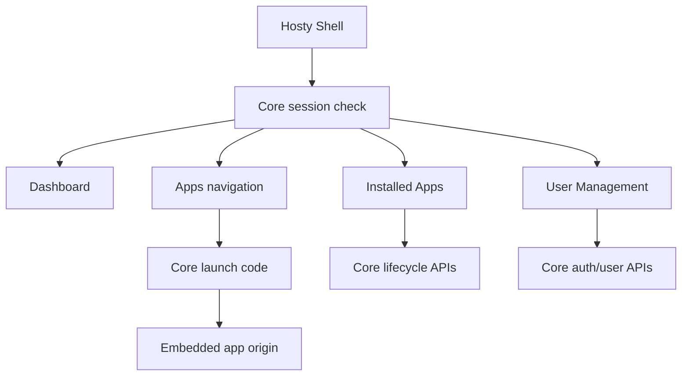

# Host App Shell

Hosty Shell is the Core-managed browser UI runtime app. It renders a single authenticated Shell surface backed by Hosty Core APIs; it does not own Core lifecycle logic and it does not reintroduce the retired combined Next.js Host package.

## Scope

The implemented Shell provides:

- Dashboard overview widgets for Core status and installed runtime apps;
- Installed Apps management for runtime app install, lifecycle, configuration, updates, logs, backups, restore, prune, and removal;
- User Management for local invitations, user role changes, disabling users, and app assignments;
- Apps navigation for app manifests that declare shell UI metadata;
- embedded app workspaces that open app-owned UI origins through Core-issued launch codes.

Shell uses Core session cookies and redirects unauthenticated users to Core-owned `/login`. Protected data comes from Core APIs such as `/api/core/status`, `/api/auth/session`, `/api/apps`, `/api/auth/users`, and `/api/apps/{appId}/...` lifecycle endpoints.

## Navigation

The Shell sidebar is a persistent desktop-style rail with an expanded and compact mode. The selected mode is stored in browser local storage.

- Host:
  - Dashboard
  - Installed Apps
  - User Management for `host.admin`
- Apps:
  - one entry for each non-system runtime app that exposes shell UI metadata
  - nested app links from manifest `ui.navigation`
  - loading, error, and empty states when app registry data is unavailable

Non-admin `host.user` principals can load Shell and use visible Apps. Administrative management views and app mutation controls are restricted to `host.admin`.

## Installed Apps

The Installed Apps view is the current management surface for runtime apps. It lists non-system apps from `GET /api/apps` and exposes actions according to Core state and app capabilities:

- start, stop, and restart;
- install from an `app.0.1` manifest URL or local manifest path;
- configure settings and autostart;
- plan and apply updates;
- inspect logs and health;
- create, restore, delete, and prune backups;
- remove an app, with optional backup deletion.

Hosty Shell hides destructive or self-disruptive actions that are not valid for the active Shell app. Core remains the source of truth for what operations are allowed.

## Embedded Apps

Apps appear in the Shell Apps navigation only when their installed manifest includes a `ui` contract. Public runtime endpoints alone do not create Shell navigation.

Shell opens app UIs through the app-owned origin returned by Core. For embedded workspaces, Shell requests `/api/apps/{appId}/launch-code` and loads the resulting redirect URI in an iframe. For standalone tabs, Shell uses `/api/apps/{appId}/open?redirectUri=...`.

The app receives a short-lived code and exchanges it with Core for app-scoped identity. Shell does not proxy app HTML, rewrite assets, or forward Hosty session cookies to the app origin.

## Deferred Gateway UX

The removed Legacy Host included `/ingress` and gateway exposure UI. That route tree no longer exists in the repository.

Gateway and external ingress readiness remain target architecture topics for service/API exposure publishing. Future work should implement them through Hosty Core or an explicit Core-managed gateway runtime. Until then, Shell documentation and UI should not present `/ingress`, `/api/gateway/*`, or `/api/ingress/*` as current implemented surfaces.
