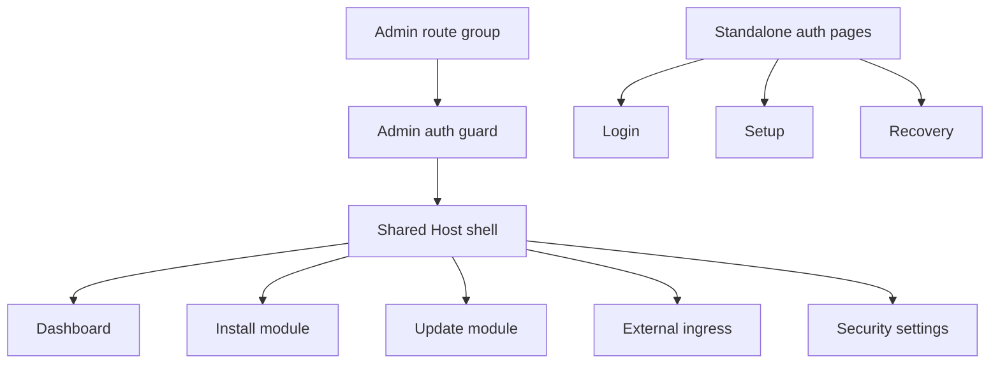

# Host App Shell

The Host Web UI uses an authenticated admin shell for protected Host pages. The shell is the foundation for the future module app portal while preserving the existing Host backend APIs and module lifecycle workflows.

## Scope

Implemented Phase 1 behavior:

- protected admin pages live under a Next.js route group and keep their public URLs stable;
- `/`, `/modules/install`, `/modules/{moduleId}/update`, `/ingress`, and `/settings/security` render inside the shared shell;
- `/login`, `/setup`, and `/recovery` remain standalone pages outside the shell;
- the route group layout enforces the existing `host.admin` page guard;
- the shell owns the sidebar, mobile drawer, sticky topbar, account menu, logout action, and page action slot.

## Navigation

The Phase 1 navigation is static and does not call a module app registry API.

- Host:
  - Dashboard (`/`)
  - External ingress (`/ingress`)
- Modules:
  - Installed modules (`/#installed-modules`)
  - Install module (`/modules/install`)
- Apps:
  - empty disabled state until the app registry exists
- Settings:
  - Security (`/settings/security`)

## Responsive Behavior

The shell uses a static sidebar on desktop (`lg` and wider). Below that breakpoint, navigation is hidden behind a drawer opened from the topbar. Selecting a drawer navigation item closes the drawer and navigates to the target route.

The topbar contains page title and description, a page-specific action slot, and the account dropdown. Long titles, descriptions, and account text truncate instead of causing horizontal page overflow.

## Page Integration

The dashboard remains focused on installed module status, lifecycle actions, recovery dialogs, and links into install/update flows. External ingress readiness moved to the dedicated `/ingress` page and reuses the existing readiness panel and APIs.

Install, update, and security pages keep their existing backend calls and form behavior. Their previous page headers were replaced by shell page metadata and topbar action slots.

## Open Questions

- No Phase 1 shell foundation questions remain open.
- Later phases still need the principal-aware app registry, module UI metadata contract, embedded app route, and non-admin user portal behavior.
