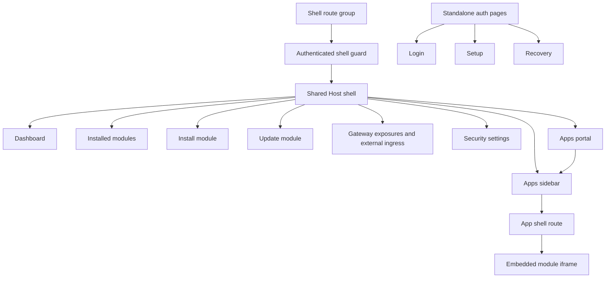

# Host App Shell

The Host Web UI uses an authenticated admin shell for protected Host pages. The shell is the foundation for the module app portal while preserving the existing Host backend APIs and module lifecycle workflows.

## Scope

Implemented Phase 1 behavior:

- protected admin pages live under a Next.js route group and keep their public URLs stable;
- `/`, `/modules`, `/modules/install`, `/modules/{moduleId}/update`, `/ingress`, and `/settings/security` render inside the shared shell;
- `/login`, `/setup`, and `/recovery` remain standalone pages outside the shell;
- the route group layout enforces the existing `host.admin` page guard;
- the shell owns the persistent sidebar, compact sidebar toggle, account menu, logout action, and app navigation chrome.

Implemented Phase 2 behavior:

- `GET /api/apps` returns app navigation data for the authenticated Host principal;
- `/api/apps` accepts any authenticated Host principal, not only `host.admin`;
- unauthenticated callers receive `401` and no app discovery data;
- app entries are built from explicit module `ui` metadata, installed module records, Host-owned module assignments, and runtime status;
- shell Apps do not support anonymous or `public` discovery;
- service/API gateway exposures are not inferred as shell Apps.

Implemented Phase 3 behavior:

- module metadata supports an optional shell-only `ui` contract;
- `ui.entrypoint` selects the public runtime port and default module UI path for shell embedding;
- `ui.navigation` provides optional nested app navigation without runtime route probing;
- invalid `ui` metadata is rejected by metadata validation;
- the demo module declares `ui` metadata and exposes stable `/`, `/people`, and `/settings` routes.

Implemented Phase 4 behavior:

- the Apps sidebar is populated from `/api/apps`;
- app entries can show nested navigation from `ui.navigation`;
- `/apps/{moduleId}` opens a Host-owned app page without proxying that path to module containers;
- the Host app page embeds module UIs in an iframe using `/api/apps/{moduleId}/embed?path=...`;
- the shell keeps Host-owned app navigation in the sidebar and shows app status/developer markers next to app entries;
- module UIs own their in-page headers, page actions, and internal navigation;
- the embed route requires Host authentication, validates the selected shell App, proxies only the reserved embed path, injects module identity, strips Host-owned headers, and rewrites root-relative module links and assets through the reserved embed URL.

Implemented Phase 5 behavior:

- `/ingress` combines service/API gateway exposure management with external ingress readiness;
- administrators can create, edit, enable/disable, and delete gateway exposure records from the Web UI;
- the exposure form uses a narrow admin-only `/api/gateway/options` endpoint for installed module, public runtime port, active Host user, UI-entrypoint hint, and gateway domain choices;
- service/API exposures are visibly labeled as separate from shell Apps and excluded from Apps navigation;
- selecting a runtime port that is also `ui.entrypoint.portKey` shows a warning instead of publishing the module browser UI as a standalone public subdomain;
- `assignedUsersOnly` exposure editing updates module-wide Host access assignments;
- deleting an exposure removes linked external ingress readiness state;
- creating an exposure leaves readiness unmanaged until an administrator explicitly plans ingress.

Implemented Phase 6 behavior:

- authenticated `host.user` principals can load the Host shell;
- `/apps` is the default non-admin portal view;
- non-admin users who open `/` are routed to `/apps`;
- the sidebar is filtered by role, so non-admin users see Apps and account actions only;
- Host management pages render an access-denied shell state for non-admin users;
- module lifecycle, install/update/remove, gateway exposure management, external ingress management, security settings, and other Host management APIs remain `host.admin` only;
- the Apps portal includes empty states for no assigned apps, apps unavailable, login required, and access denied.

Implemented Phase 7 behavior:

- enabled module developer targets can appear in `/api/apps` when `HOST_MODULE_DEV_MODE=enabled`;
- developer app entries are hidden when developer mode is disabled or the individual target is disabled;
- developer targets remain local-only state and do not create production gateway exposure records;
- developer app ids are qualified as `dev:{targetId}` while module identity still uses the target's `moduleId`;
- developer apps open through `/apps/dev/{targetId}` and the same-origin embed transport `/api/apps/dev/{targetId}/embed`;
- developer embed transport uses the target's local URL and path prefix while preserving Host authentication, module identity token behavior, Host-owned header stripping, and scoped module cookies;
- the Apps sidebar and Apps portal mark developer entries with a compact `Dev` badge or marker.

Implemented Phase 8 behavior:

- app registry tests cover construction, access filtering, unavailable runtime diagnostics, developer target inclusion, and response shapes that omit raw Docker or local developer target internals;
- `/api/apps` route tests cover unauthenticated rejection, authenticated `host.user` access, developer app entries, and assigned-only principal filtering;
- embed transport tests cover Host session cookie stripping, Host-owned header stripping, module identity token injection, scoped module cookies, root-relative content rewriting, and blocked iframe fallback HTML;
- existing gateway tests continue to cover WebSocket-compatible upgrade forwarding, identity injection, and Host session cookie stripping for service/API gateway traffic;
- rendered shell smoke coverage is tracked as a release verification checklist instead of introducing a new browser/e2e dependency in this hardening phase;
- durable shell, gateway, dashboard, and metadata behavior has been moved from the implementation plan into feature documentation.

## Navigation

The sidebar combines static Host management navigation with dynamic Apps navigation from `/api/apps`.

- Host:
  - Dashboard (`/`)
  - Gateway exposures (`/ingress`)
  - Installed modules (`/modules`)
  - Install module (`/modules/install`)
- Apps:
  - loading, error, and empty states when app registry data is unavailable or empty
  - one entry for each visible shell App
  - nested app navigation when `ui.navigation` is present
- Settings:
  - Security (`/settings/security`)

For `host.user`, the sidebar is reduced to Apps navigation plus the account menu. Host and Settings navigation are hidden because those workflows remain administrative.

The sidebar is always visible. Users can switch it between an expanded mode with labels and nested app navigation, and a compact mode that keeps only the primary icons visible. The selected mode is stored locally in the browser. The mobile drawer was removed with the topbar because navigation no longer disappears below the desktop breakpoint.

## Responsive Behavior

The shell uses a persistent sidebar at every viewport size. Expanded mode gives the Host and Apps navigation enough space for labels, nested entries, and account details. Compact mode narrows the sidebar to an icon rail for workflows that need more horizontal room.

The shared topbar has been removed. Host management pages render any needed title, description, and page actions inside their own page content. Embedded module apps receive the main content area without Host page chrome above the iframe, so each module remains responsible for its own headers and page-level actions.

For embedded module apps, the sidebar remains Host-owned. The Host app route uses the selected app and nested navigation state to highlight sidebar entries, while the module UI renders its own internal header, navigation, and actions inside the iframe. If module-provided global shell actions are needed later, they should be added through a new declarative metadata contract instead of giving modules direct runtime control over Host chrome.

Developer app entries use the same shell chrome and add a compact `Dev` marker next to the app entry. The marker identifies local developer targets without changing module access rules or production exposure state.

## Page Integration

The dashboard remains focused on Host overview widgets and links into the dedicated `/modules` management page. The current Installed modules widget owns its own refresh status and quick health summary. Installed module lifecycle actions, recovery dialogs, and links into install/update flows live on `/modules`. Gateway exposure management and external ingress readiness live on the dedicated `/ingress` page and reuse the existing gateway and readiness APIs.

Install, update, and security pages keep their existing backend calls and form behavior. Their page headers and actions now live inside the page content instead of the shared shell.

Non-admin users do not receive Host management pages. Opening `/`, `/ingress`, `/modules`, `/modules/install`, `/modules/{moduleId}/update`, or `/settings/security` as `host.user` keeps the authenticated shell but routes the user to `/apps` or renders an access-denied state. The underlying management APIs continue to require `host.admin`.

`/apps` is the default portal page for `host.user`. It renders the current principal's app registry entries, lets users open available apps, and shows clear empty states when no apps are assigned, app registry data is unavailable, or the session needs login again.

## App Registry API

`GET /api/apps` returns a minimal, principal-filtered app registry for sidebar rendering and embedded app opening.

`host.admin` receives all shell-routable app entries, including unavailable entries with safe diagnostic status. `host.user` receives only available apps that are visible to all authenticated users or explicitly assigned to that user.

Shell App access modes are Host-owned:

- `allAuthenticated` - any signed-in Host user can discover the app;
- `assignedUsersOnly` - assigned Host users and `host.admin` can discover the app;
- no `public` or anonymous shell App mode exists.

The response intentionally returns same-origin Host paths, such as `/apps/{moduleId}` and reserved embedded URLs under `/api/apps/{moduleId}/embed`. It does not return Docker network aliases, container names, container ids, raw container URLs, public module UI domains, or service/API gateway exposure hostnames.

Modules appear in the app registry only when local metadata includes an explicit `ui` contract. `runtime.ports[].public` is still only a capability hint and does not create an app entry by itself.

When module developer mode is enabled, `/api/apps` also reads enabled developer targets from local developer target state. A developer target appears as a shell App only when the target stores a valid shell app metadata snapshot. The response marks these entries with `source: "developer"` and `developerTargetId`, uses `/apps/dev/{targetId}` for shell navigation, and uses `/api/apps/dev/{targetId}/embed` for iframe transport.

Developer target visibility reuses the target exposure policy after Host authentication. `public` and `loginRequired` targets are visible to authenticated Host users. `assignedUsersOnly` targets use existing module access assignments. Anonymous shell App discovery is still not supported.

## Embedded App Route

`/apps/{moduleId}` is shell state. It renders the Host shell around the selected module UI and uses the optional `path` query parameter to select nested module navigation, for example `/apps/com.acme.reports?path=%2Fpeople`.

The iframe uses the reserved embedded transport URL returned by `/api/apps`: `/api/apps/{moduleId}/embed?path=...`. This endpoint requires Host authentication and validates the current principal against the app registry before proxying to a module. It does not publish module UIs as standalone public hostnames and does not turn `/apps/{moduleId}` into a direct module proxy.

The embed transport rewrites root-relative links and assets in HTML/CSS responses back through the reserved embed URL so module pages can load common assets while remaining inside the Host shell. If a module response explicitly blocks framing with headers such as `X-Frame-Options: DENY` or `Content-Security-Policy: frame-ancestors 'none'`, the embed route returns a concise fallback page explaining that the module UI must support Host shell embedding.

Developer embed transport follows the same same-origin pattern under `/api/apps/dev/{targetId}/embed`. It resolves the local target URL and path prefix from developer target state, forwards through the Host shell, applies module access rules, injects module identity according to the target identity mode, strips Host-owned headers, and scopes module cookies to the developer embed route.

## Verification And Hardening

Phase 8 keeps the implemented behavior stable rather than adding new product scope.

Automated coverage includes:

- app registry construction and access filtering for installed apps and developer apps;
- `/api/apps` route authentication, principal filtering, and response safety;
- embed transport header sanitization, Host session cookie stripping, module identity token claims, root-relative asset rewriting, scoped module cookies, and frame-blocked fallback rendering;
- gateway proxy behavior for HTTP and WebSocket-compatible upgrade requests, including Host-owned header stripping and module identity injection.

Rendered release smoke checks should cover:

- empty `/apps` state for an authenticated user with no visible apps;
- one visible app in the Apps portal and sidebar;
- nested app navigation from `ui.navigation`;
- expanded and compact persistent sidebar states;
- blocked iframe fallback when a module sends `X-Frame-Options: DENY` or `Content-Security-Policy: frame-ancestors 'none'`;
- admin sidebar versus user sidebar filtering.

Phase 8 decisions:

- **Question**: What is the boundary of Phase 8?
  **Answer**: Tests, verification, and documentation hardening.
  **Recommendation**: Do not add new product behavior except minimal fixes required by failed acceptance criteria.

- **Question**: Which checks block completion?
  **Answer**: Existing tests must pass, and Host shell changes should pass lint and production build.
  **Recommendation**: Use `npm run host:test`, `npm run host:lint`, and `npm run host:build` as the minimum gate. Run `npm run ci` before release handoff when CLI coverage is in scope.

- **Question**: Should UI smoke coverage be automated or manual?
  **Answer**: Use the existing Node test stack for stable behavior and browser smoke the rendered shell without adding a new dependency.
  **Recommendation**: Keep rendered smoke checks in the release checklist unless a broader e2e test strategy is introduced.

- **Question**: What route coverage is sufficient for `/api/apps`?
  **Answer**: Authentication, principal filtering, developer entry inclusion, unavailable diagnostics, and safe response shape.
  **Recommendation**: Assert that unauthenticated callers receive no discovery data, `host.user` receives only allowed apps, `host.admin` can diagnose unavailable apps, and response bodies do not leak local target or Docker internals.

- **Question**: How should WebSocket/SSE gateway behavior be verified?
  **Answer**: Keep focused gateway tests and a rendered release smoke expectation.
  **Recommendation**: Treat identity injection, Host cookie stripping, and upgrade/header forwarding as regression blockers.

- **Question**: What defines unchanged module identity token behavior?
  **Answer**: Tokens remain signed, module-scoped, and principal-scoped across gateway, installed app embed, and developer app embed paths.
  **Recommendation**: Verify issuer, audience, subject, and module access claims for authenticated proxy setup requests.

- **Question**: What cookie and header stripping checks are mandatory?
  **Answer**: Host session cookies and Host-owned spoofable headers must be stripped before module traffic is proxied.
  **Recommendation**: Treat this as a security blocker for gateway and embed transport. Module-owned cookies may pass through after Host session cookie removal.

- **Question**: What should happen to bugs found during hardening?
  **Answer**: Fix bugs that block Phase 8 acceptance criteria; defer unrelated enhancements.
  **Recommendation**: Record non-blocking follow-up ideas in `docs/todo.md` or a separate planning document.

## Module UI Metadata

The `ui` contract is shell-only. It describes how the Host can list and later embed a module UI; it does not publish a module UI hostname and does not create a service/API gateway exposure.

Supported fields:

- `ui.category` is optional and must be `Apps` when provided;
- `ui.icon` is optional and must be a non-empty lowercase icon key;
- `ui.entrypoint.portKey` must reference a `runtime.ports[]` item marked `public: true`;
- `ui.entrypoint.path` must be a same-origin absolute path beginning with `/`;
- `ui.navigation[]` is optional, preserves author-defined order, and requires unique same-origin absolute paths.

Missing `ui` metadata is valid. The module can still install and run, but it is not returned as a shell App. Malformed `ui` metadata is rejected during install/update planning, and app registry compatibility checks keep invalid installed metadata hidden from `host.user` while returning safe diagnostics to `host.admin`.

## Gateway Exposure UX

The `/ingress` admin page manages service/API gateway exposures and their external ingress readiness in one workflow.

Gateway exposures are Host-owned service/API publishing records. They contain:

- installed module id;
- public runtime port key;
- gateway hostname;
- exposure policy;
- module identity mode;
- enabled state.

When `HOST_GATEWAY_BASE_DOMAIN` is configured, the UI asks for a subdomain and previews the resulting full hostname. Without a base domain, administrators enter the full hostname directly.

The exposure form uses `/api/gateway/options` to load only the data needed by the form: installed modules with public runtime ports, UI-entrypoint hints, active Host users for assignment editing, and Host gateway domain settings. This avoids exposing raw Docker/container details through the client.

Exposure policy is the primary authorization control. Identity mode remains visible as an advanced control with defaults selected from the policy. Public exposures cannot use required identity mode.

For `assignedUsersOnly`, the editor updates module-wide Host assignments. Those assignments are shared by assigned-only service/API exposures and shell Apps for the same module.

Service/API exposure changes do not create shell Apps. If an administrator selects the same public runtime port used by `ui.entrypoint.portKey`, the form warns that browser UIs should remain inside the Host Apps shell.

External ingress readiness remains explicit. Creating an exposure does not create a readiness record automatically; administrators use the readiness section's Plan action. Disabling an exposure preserves readiness state, while deleting an exposure removes linked readiness records.

## Open Questions

- No Phase 1 shell foundation, Phase 2 app registry starter, Phase 3 module UI metadata contract, Phase 4 Apps sidebar/app host page, Phase 5 gateway exposure management UX, Phase 6 user portal behavior, Phase 7 developer mode integration, or Phase 8 verification questions remain open.
