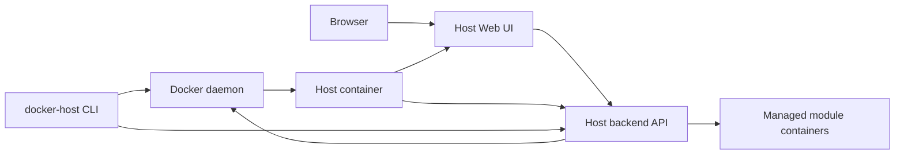

# Host launch model

Этот документ описывает черновую модель запуска самого Docker Host. Это отдельный вопрос от запуска модулей: сначала нужно надежно поднять Host, а уже через него управлять modules.

## Решение

Host должен иметь Web UI без альтернативы: через него администратор видит список модулей, Docker container status, настройки, storage mounts, обновления и установку новых модулей.

Production-like запуск Host должен быть container-first:

- Host распространяется и запускается как Docker image/container;
- первый запуск и lifecycle самого Host выполняет standalone CLI executable с командой `docker-host`;
- Web UI является основным интерфейсом ежедневного управления модулями;
- CLI может выполнять module operations, но через тот же Host backend API, что и Web UI;
- бизнес-логика установки и обновления модулей живет в Host backend, а не дублируется в CLI.

## Компоненты



### Host container

Host container запускает Web UI и backend API. Backend API содержит module management logic и работает с Docker daemon через mounted Docker socket.

Host container отвечает за:

- установку модулей из metadata URLs;
- lifecycle module containers;
- Docker daemon status модулей;
- settings и storage mappings;
- updates module images;
- отображение ошибок Docker operations.

### Web UI

Web UI - основной рабочий интерфейс администратора.

Через UI должны быть доступны:

- список модулей;
- Docker container statuses;
- добавление module metadata URL;
- установка, запуск, остановка, рестарт и удаление модулей;
- настройка settings;
- настройка module-owned storage и external storage mounts;
- просмотр логов;
- update modules.

В MVP Host не вводит module health checks или readiness probes. UI показывает только состояние контейнера, которое возвращает Docker daemon. Унифицированные module health checks должны быть отдельной future feature.

### `docker-host` CLI executable

CLI нужен в первую очередь для bootstrap и lifecycle самого Host container.

`docker-host` CLI должен распространяться как standalone executable без внешнего runtime. Базовая реализация: .NET self-contained single-file application с использованием Spectre.Console для terminal UI, prompts, status output, tables, progress indicators и командной структуры.

Это решение является обязательным для первой CLI implementation. CLI artifact должен запускаться без установленного .NET runtime на машине администратора.

Базовые команды:

```text
docker-host install
docker-host start
docker-host stop
docker-host restart
docker-host update
docker-host status
docker-host logs
docker-host open
docker-host config
```

Lifecycle-команды работают напрямую через Docker daemon, потому что Host API может быть еще не запущен или может быть сломан.

В первой CLI implementation lifecycle-команды будут обращаться к Docker daemon напрямую через Docker Engine API. CLI не должен запускать установленный Docker CLI executable для Host lifecycle operations.

Docker Engine communication должен быть изолирован в adapter layer, чтобы CLI commands не знали конкретные HTTP endpoint paths, request bodies и transport details.

CLI также может иметь команды управления модулями:

```text
docker-host modules list
docker-host modules add <metadata-url>
docker-host modules restart <module-id>
docker-host modules update <module-id>
docker-host modules logs <module-id>
```

Эти команды должны обращаться к Host backend API. Они не должны повторно реализовывать module installation logic внутри CLI.

## Quick install script

Для быстрой установки из терминала используется Unix `scripts/install.sh`. Это чистый shell bootstrap script, который скачивает latest development `docker-host` CLI executable из GitHub Release `cli-dev`, ставит его локально и подготавливает первый запуск Host container.

Пример установки:

```sh
curl -fsSL https://raw.githubusercontent.com/alex-de-haas/docker-host/main/scripts/install.sh | sh
```

Пример быстрого запуска:

```sh
curl -fsSL https://raw.githubusercontent.com/alex-de-haas/docker-host/main/scripts/install.sh | sh
docker-host start
docker-host open
```

Более осторожный вариант:

```sh
curl -fsSL https://raw.githubusercontent.com/alex-de-haas/docker-host/main/scripts/install.sh -o install.sh
sh install.sh
docker-host start
docker-host open
```

`install.sh` должен:

- проверить, что Docker установлен и daemon доступен через local Docker socket `/var/run/docker.sock`, или делегировать эту проверку установленному `docker-host` CLI;
- определить OS/architecture;
- скачать подходящий `docker-host` standalone executable artifact из GitHub Release `cli-dev`;
- положить executable в user-writable bin directory, например `~/.docker-host/bin/docker-host`;
- сделать файл executable;
- добавить `~/.docker-host/bin` в `PATH` или вывести точную команду, которую администратор должен добавить в shell profile;
- создать default Host data root `~/.docker-host`;
- подготовить launch configuration для Host container в `~/.docker-host/config/launch.env`;
- не дублировать module management logic;
- после установки вывести следующие команды и URL Web UI.

`install.sh` должен оставаться shell-only bootstrap layer for Unix-like systems. Сам `docker-host` CLI при этом не является shell script: это standalone executable, который не требует установленного .NET runtime, Node.js/npm или другого package manager.

На базовом этапе CLI implementation target:

- `net10.0` .NET self-contained single-file executable;
- project file `Haas.DockerHost.Cli.csproj`;
- root namespace `Haas.DockerHost.Cli`;
- published command name `docker-host` via project `AssemblyName` or release artifact rename;
- Spectre.Console для rich terminal output;
- cross-platform artifacts под поддерживаемые OS/architecture;
- test project created with the initial CLI scaffold;
- без зависимости от установленного runtime на машине администратора.

Recommended CLI layout:

```text
apps/
  cli/
    src/
      Haas.DockerHost.Cli/
        Haas.DockerHost.Cli.csproj
        Program.cs
        Commands/
        Configuration/
        Docker/
    tests/
      Haas.DockerHost.Cli.Tests/
        Haas.DockerHost.Cli.Tests.csproj
```

Docker Engine communication should be isolated inside the `Haas.DockerHost.Cli.Docker` namespace. The layer should have two levels:

- low-level Engine API transport: sends HTTP requests to Docker Engine over the configured local socket and returns structured status, headers, body and Docker error details;
- high-level Docker Engine adapter: exposes typed methods such as pull image, inspect container, create network, run Host container, start container, stop container, remove container and get logs.

CLI commands should not construct Docker Engine URLs or request bodies directly. Commands call the high-level adapter, while the adapter owns exact Docker Engine endpoints and structured JSON parsing for operations such as container inspect.

### Docker daemon access

CLI lifecycle commands должны управлять Host container через Docker daemon. В первой implementation поддерживается local Docker Unix socket:

```text
/var/run/docker.sock
```

CLI использует этот socket для lifecycle commands самого Host container. Host container получает доступ к Docker daemon через bind mount:

```text
/var/run/docker.sock:/var/run/docker.sock
```

`DOCKER_HOST` и non-standard Docker endpoints не входят в scope первой implementation. Их можно рассмотреть позже, если появится требование поддерживать нестандартные Docker daemon endpoints.

Для первой CLI implementation доступ к Docker daemon выполняется напрямую через Docker Engine API over local socket. Docker CLI executable не является runtime dependency для `docker-host` CLI.

Пример итоговой структуры после `install.sh`:

```text
~/.docker-host/
  bin/
    docker-host
  config/
    launch.env
  modules/
```

`~/.docker-host/config/launch.env` должен хранить параметры запуска самого Host container как shell-compatible env file: image reference, container name, UI port, Docker socket mount, data mount, `HOST_DATA_ROOT_HOST`, `HOST_DATA_ROOT_CONTAINER`, restart policy и другие значения, которые нужны `docker-host start/restart/update`.

Пример `launch.env`:

```env
HOST_IMAGE=ghcr.io/example/docker-host-manager:latest
HOST_CONTAINER_NAME=docker-host
HOST_DATA_ROOT_HOST=$HOME/.docker-host
HOST_DATA_ROOT_CONTAINER=/data
HOST_UI_PORT=auto
HOST_RESTART_POLICY=unless-stopped
HOST_DOCKER_SOCKET=/var/run/docker.sock
HOST_MODULE_NETWORK=docker-host-modules
```

CLI должен передавать в Host container оба значения data root:

- `HOST_DATA_ROOT_HOST` - path на host machine, который Docker daemon должен использовать как bind mount source для module containers;
- `HOST_DATA_ROOT_CONTAINER` - path внутри Host container, который Host backend использует для чтения и записи собственного state.

`HOST_IMAGE` должен по умолчанию указывать на Host image, публикуемый текущим repository workflow: `ghcr.io/<owner>/<repo>:latest`. Это значение должно быть переопределяемым через `docker-host config`.

Если `~/.docker-host/bin` не находится в `PATH`, install script должен напечатать инструкцию:

```sh
export PATH="$HOME/.docker-host/bin:$PATH"
```

Default install script не должен автоматически запускать Host container без явного согласия администратора. Для one-command сценария можно поддержать флаг или environment variable:

```sh
curl -fsSL https://raw.githubusercontent.com/alex-de-haas/docker-host/main/scripts/install.sh | sh -s -- --start
```

или:

```sh
DOCKER_HOST_INSTALL_START=1 curl -fsSL https://raw.githubusercontent.com/alex-de-haas/docker-host/main/scripts/install.sh | sh
```

При `--start` script может выполнить:

```text
docker-host install
docker-host start
docker-host open
```

`install.sh` должен быть тонким bootstrap layer. После установки все дальнейшие операции выполняет standalone executable `docker-host`.

## First launch flow

Первый запуск через CLI:

```text
docker-host install
docker-host start
docker-host open
```

`docker-host install` должен подготовить launch configuration:

- Docker access: local socket mount `/var/run/docker.sock:/var/run/docker.sock` for the Host container;
- Host image reference: default value bundled with CLI, override через `docker-host config`;
- Host data root: default `~/.docker-host` на машине администратора;
- Host container data mount: `~/.docker-host:/data`;
- Host container env: `HOST_DATA_ROOT_HOST=<host-data-root>` and `HOST_DATA_ROOT_CONTAINER=/data`;
- UI port mapping: CLI выбирает свободный host port по умолчанию, override через `docker-host config`;
- restart policy: default `unless-stopped`, override через `docker-host config`;
- container name: default `docker-host`, override через `docker-host config`;
- Host container должен быть подключен к shared module network;
- required environment variables: `HOST_DATA_ROOT_HOST=<host-data-root>` and `HOST_DATA_ROOT_CONTAINER=/data`.

Launch configuration должна храниться в:

```text
~/.docker-host/config/launch.env
```

CLI должен читать этот файл для `start`, `restart`, `update`, `status` и `logs`, чтобы повторно использовать одни и те же launch parameters.

Минимальный container launch contract:

```text
--name docker-host
--restart unless-stopped
-p <auto-selected-host-port>:3000
-v /var/run/docker.sock:/var/run/docker.sock
-v ~/.docker-host:/data
-e HOST_DATA_ROOT_HOST=~/.docker-host
-e HOST_DATA_ROOT_CONTAINER=/data
--network <shared-module-network>
<host-image-reference>
```

Все значения, кроме container-side data root `/data`, должны быть переопределяемы через `docker-host config`.

`docker-host start` создает или запускает Host container с сохраненной конфигурацией.

`docker-host open` открывает Web UI в браузере или печатает URL.

## Restart and update

`docker-host restart` должен перезапускать Host container без изменения module data.

`docker-host update` должен:

- обновить standalone CLI executable из rolling GitHub Release `cli-dev`;
- скачать matching CLI artifact для текущих OS/architecture;
- проверить `SHA256SUMS`, если checksum file доступен;
- заменить установленный `docker-host` binary безопасно: скачать во временный файл рядом с target executable, выставить permissions и затем заменить target;
- pull новой версии Host image;
- остановить текущий Host container;
- пересоздать Host container с теми же volumes, env vars, port mappings и restart policy;
- сохранить Host data root;
- показать понятную ошибку, если CLI artifact update или Docker operation failed.

`scripts/install.sh` используется для первой установки и также может быть повторно запущен как repair/reinstall path, но штатная update-команда обновляет и CLI, и Host container.

Обновление модулей должно выполняться отдельными module commands через Host backend API, например:

```text
docker-host modules update <module-id>
```

Host UI может позже получить кнопку self-update, но CLI должен оставаться recovery path, потому что UI недоступен во время recreate самого Host container.

## Shared API model

Web UI и CLI module commands должны использовать один Host backend API.

Это дает одну реализацию:

```text
Web UI -> Host backend API -> Docker daemon
CLI    -> Host backend API -> Docker daemon
```

CLI должен обращаться напрямую к Docker daemon только для lifecycle самого Host container: install, start, stop, restart, update, status, logs.

## Repository and release boundary

Host Web UI, backend API, Host Docker image definition and `docker-host` CLI should live in one monorepo, while being released as separate artifacts. The detailed repository layout, GitHub Actions path filters, and versioning model are described in [Repository and release model](repository-release-model.md).
