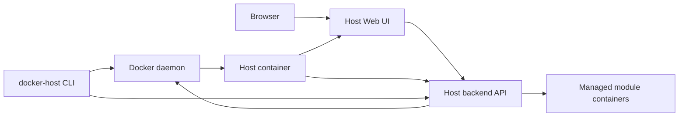

# Host launch model

Этот документ описывает черновую модель запуска самого Docker Host. Это отдельный вопрос от запуска модулей: сначала нужно надежно поднять Host, а уже через него управлять modules.

## Решение

Host должен иметь Web UI без альтернативы: через него администратор видит список модулей, health/status, настройки, storage mounts, обновления и установку новых модулей.

Production-like запуск Host должен быть container-first:

- Host распространяется и запускается как Docker image/container;
- первый запуск и lifecycle самого Host выполняет standalone CLI executable с командой `docker-host`;
- Web UI является основным интерфейсом ежедневного управления модулями;
- CLI может выполнять module operations, но через тот же Host backend API, что и Web UI;
- бизнес-логика установки и обновления модулей живет в Host backend, а не дублируется в CLI.

## Компоненты



### Host container

Host container запускает Web UI и backend API. Backend API содержит module management logic и работает с Docker daemon через mounted Docker socket.

Host container отвечает за:

- установку модулей из metadata URLs;
- lifecycle module containers;
- health/status модулей;
- settings и storage mappings;
- updates module images;
- отображение ошибок Docker operations.

### Web UI

Web UI - основной рабочий интерфейс администратора.

Через UI должны быть доступны:

- список модулей;
- статусы и healthchecks;
- добавление module metadata URL;
- установка, запуск, остановка, рестарт и удаление модулей;
- настройка settings;
- настройка module-owned storage и external storage mounts;
- просмотр логов;
- update modules.

### `docker-host` CLI executable

CLI нужен в первую очередь для bootstrap и lifecycle самого Host container.

`docker-host` CLI должен распространяться как standalone executable без внешнего runtime. Базовая реализация: .NET self-contained single-file application с использованием Spectre.Console для terminal UI, prompts, status output, tables, progress indicators и командной структуры.

Базовые команды:

```text
docker-host install
docker-host start
docker-host stop
docker-host restart
docker-host update
docker-host status
docker-host logs
docker-host open
docker-host config
```

Lifecycle-команды работают напрямую через Docker daemon, потому что Host API может быть еще не запущен или может быть сломан.

CLI также может иметь команды управления модулями:

```text
docker-host modules list
docker-host modules add <metadata-url>
docker-host modules restart <module-id>
docker-host modules update <module-id>
docker-host modules logs <module-id>
```

Эти команды должны обращаться к Host backend API. Они не должны повторно реализовывать module installation logic внутри CLI.

## Quick install script

Для быстрой установки из терминала можно использовать `install.sh`. Это чистый shell bootstrap script, который ставит `docker-host` CLI executable и подготавливает первый запуск Host container.

Пример быстрого запуска:

```sh
curl -fsSL https://docker-host.example.com/install.sh | sh
docker-host start
docker-host open
```

Более осторожный вариант:

```sh
curl -fsSL https://docker-host.example.com/install.sh -o install.sh
sh install.sh
docker-host start
docker-host open
```

`install.sh` должен:

- проверить, что Docker CLI установлен;
- проверить, что Docker daemon доступен через `/var/run/docker.sock`;
- определить OS/architecture;
- скачать подходящий `docker-host` standalone executable artifact;
- положить executable в user-writable bin directory, например `~/.docker-host/bin/docker-host`;
- сделать файл executable;
- добавить `~/.docker-host/bin` в `PATH` или вывести точную команду, которую администратор должен добавить в shell profile;
- создать default Host data root `~/.docker-host`;
- подготовить launch configuration для Host container в `~/.docker-host/config/launch.env`;
- не дублировать module management logic;
- после установки вывести следующие команды и URL Web UI.

`install.sh` должен оставаться shell-only bootstrap layer. Сам `docker-host` CLI при этом не является shell script: это standalone executable, который не требует установленного .NET runtime, Node.js/npm или другого package manager.

На базовом этапе CLI implementation target:

- .NET self-contained single-file executable;
- Spectre.Console для rich terminal output;
- cross-platform artifacts под поддерживаемые OS/architecture;
- без зависимости от установленного runtime на машине администратора.

Пример итоговой структуры после `install.sh`:

```text
~/.docker-host/
  bin/
    docker-host
  config/
    launch.env
  modules/
```

`~/.docker-host/config/launch.env` должен хранить параметры запуска самого Host container как shell-compatible env file: image reference, container name, UI port, Docker socket mount, data mount, `HOST_DATA_ROOT`, restart policy и другие значения, которые нужны `docker-host start/restart/update`.

Пример `launch.env`:

```env
HOST_IMAGE=ghcr.io/example/docker-host:latest
HOST_CONTAINER_NAME=docker-host
HOST_DATA_ROOT_HOST=$HOME/.docker-host
HOST_DATA_ROOT_CONTAINER=/data
HOST_UI_PORT=auto
HOST_RESTART_POLICY=unless-stopped
HOST_DOCKER_SOCKET=/var/run/docker.sock
HOST_MODULE_NETWORK=docker-host-modules
```

Если `~/.docker-host/bin` не находится в `PATH`, install script должен напечатать инструкцию:

```sh
export PATH="$HOME/.docker-host/bin:$PATH"
```

Default install script не должен автоматически запускать Host container без явного согласия администратора. Для one-command сценария можно поддержать флаг или environment variable:

```sh
curl -fsSL https://docker-host.example.com/install.sh | sh -s -- --start
```

или:

```sh
DOCKER_HOST_INSTALL_START=1 curl -fsSL https://docker-host.example.com/install.sh | sh
```

При `--start` script может выполнить:

```text
docker-host install
docker-host start
docker-host open
```

`install.sh` должен быть тонким bootstrap layer. После установки все дальнейшие операции выполняет standalone executable `docker-host`.

## First launch flow

Первый запуск через CLI:

```text
docker-host install
docker-host start
docker-host open
```

`docker-host install` должен подготовить launch configuration:

- Docker access: `/var/run/docker.sock:/var/run/docker.sock`;
- Host image reference: default value bundled with CLI, override через `docker-host config`;
- Host data root: default `~/.docker-host` на машине администратора;
- Host container data mount: `~/.docker-host:/data`;
- Host container env: `HOST_DATA_ROOT=/data`;
- UI port mapping: CLI выбирает свободный host port по умолчанию, override через `docker-host config`;
- restart policy: default `unless-stopped`, override через `docker-host config`;
- container name: default `docker-host`, override через `docker-host config`;
- Host container должен быть подключен к shared module network;
- required environment variables: `HOST_DATA_ROOT=/data`.

Launch configuration должна храниться в:

```text
~/.docker-host/config/launch.env
```

CLI должен читать этот файл для `start`, `restart`, `update`, `status` и `logs`, чтобы повторно использовать одни и те же launch parameters.

Минимальный container launch contract:

```text
--name docker-host
--restart unless-stopped
-p <auto-selected-host-port>:3000
-v /var/run/docker.sock:/var/run/docker.sock
-v ~/.docker-host:/data
-e HOST_DATA_ROOT=/data
--network <shared-module-network>
<host-image-reference>
```

Все значения, кроме container-side data root `/data`, должны быть переопределяемы через `docker-host config`.

`docker-host start` создает или запускает Host container с сохраненной конфигурацией.

`docker-host open` открывает Web UI в браузере или печатает URL.

## Restart and update

`docker-host restart` должен перезапускать Host container без изменения module data.

`docker-host update` должен:

- pull новой версии Host image;
- остановить текущий Host container;
- пересоздать container с теми же volumes, env vars, port mappings и restart policy;
- сохранить Host data root;
- показать понятную ошибку, если Docker operation failed.

Host UI может позже получить кнопку self-update, но CLI должен оставаться recovery path, потому что UI недоступен во время recreate самого Host container.

## Shared API model

Web UI и CLI module commands должны использовать один Host backend API.

Это дает одну реализацию:

```text
Web UI -> Host backend API -> Docker daemon
CLI    -> Host backend API -> Docker daemon
```

CLI должен обращаться напрямую к Docker daemon только для lifecycle самого Host container: install, start, stop, restart, update, status, logs.

## Repository and release boundary

Host Web UI, backend API, Host Docker image definition and `docker-host` CLI should live in one monorepo, while being released as separate artifacts. The detailed repository layout, GitHub Actions path filters, and versioning model are described in [Repository and release model](repository-release-model.md).
