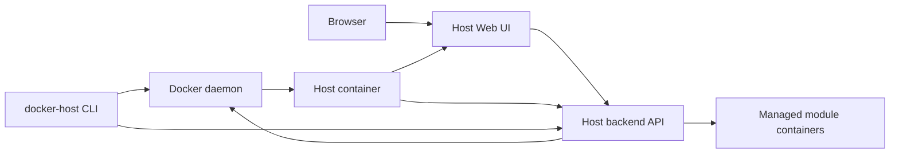

# Host launch model

This document describes the launch model for Docker Host itself. This is separate from launching modules: the Host must be started reliably first, then modules are managed through it.

## Decision

The Host must provide a Web UI as the primary management surface. Administrators use it to see the module list, Docker container status, settings, storage mounts, updates, and new module installation.

Production-like Host launch is container-first:

- the Host is distributed and run as a Docker image/container;
- initial launch and lifecycle management for the Host itself are handled by the standalone `docker-host` CLI executable;
- the Web UI is the main interface for daily module management;
- the CLI can perform module operations, but only through the same Host backend API as the Web UI;
- module installation and update business logic lives in the Host backend and is not duplicated in the CLI.

The standalone `docker-host` CLI is the reliable recovery path for Host container lifecycle operations: install, start, stop, restart, update, status, logs, open, and configuration. The module-management runtime works through the Host backend after the Host container is running, except for recovery flows that must work when the Host API is unavailable.

## Components



### Host container

The Host container runs the Web UI and backend API. The backend API contains module-management logic and talks to the Docker daemon through the mounted Docker socket.

The Host container is responsible for:

- installing modules from metadata URLs;
- module container lifecycle;
- Docker daemon status for modules;
- settings and storage mappings;
- module image updates;
- displaying Docker operation errors.

### Web UI

The Web UI is the primary administrator workspace.

The UI must expose:

- module list;
- Docker container statuses;
- adding a module metadata URL;
- installing, starting, stopping, restarting, and removing modules;
- settings configuration;
- module-owned storage and external storage mount configuration;
- log viewing;
- module updates.

The Host does not introduce module health checks or readiness probes. The UI shows only the container state returned by Docker daemon.

### `docker-host` CLI executable

The CLI is primarily for bootstrap and lifecycle management of the Host container itself.

The `docker-host` CLI must be distributed as a standalone executable without an external runtime. The baseline implementation is a .NET self-contained single-file application using Spectre.Console for terminal UI, prompts, status output, tables, progress indicators, and command structure.

The CLI artifact must run without an installed .NET runtime on the administrator's machine.

Baseline commands:

```text
docker-host install
docker-host uninstall
docker-host start
docker-host stop
docker-host restart
docker-host update
docker-host status
docker-host logs
docker-host open
docker-host config
docker-host auth
```

Lifecycle commands work directly through the Docker daemon because the Host API may not be running yet or may be broken. `docker-host stop` also reads the Host data-root module registry and stops known module containers before stopping the Host container.

Auth bootstrap and recovery commands also remain local-first. `docker-host auth setup-token` writes a one-time setup token hash into the Host data root so the first administrator can be created through `/setup` without relying on a pre-existing Host API session.

`docker-host uninstall` preserves the CLI executable itself but removes Host-managed runtime and local state: the Host container, known module containers, Host/module images when Docker allows it, the shared module network when it is no longer in use, launch configuration, and Host state under the data root. After that, `docker-host install` must recreate launch configuration and the baseline directory structure.

Lifecycle commands talk to Docker daemon directly through the Docker Engine API. The CLI must not invoke an installed Docker CLI executable for Host lifecycle operations. Direct module-container stop/remove behavior is limited to top-level recovery commands such as `stop` and `uninstall`; normal module lifecycle actions still go through the Host backend API.

Docker Engine communication must be isolated in an adapter layer so CLI commands do not know specific HTTP endpoint paths, request bodies, or transport details.

The CLI can also provide module-management commands:

```text
docker-host modules list
docker-host modules add <metadata-url>
docker-host modules restart <module-id>
docker-host modules update <module-id>
docker-host modules logs <module-id>
```

These commands must call the Host backend API. They must not reimplement module installation logic inside the CLI.

## Quick install script

Fast terminal installation uses the Unix `scripts/install.sh`. This is a pure shell bootstrap script that downloads the latest development `docker-host` CLI executable from the `cli-dev` GitHub Release, installs it locally, and prepares the first Host container launch.

Install example:

```sh
curl -fsSL https://raw.githubusercontent.com/alex-de-haas/docker-host/main/scripts/install.sh | sh
```

Quick-start example:

```sh
curl -fsSL https://raw.githubusercontent.com/alex-de-haas/docker-host/main/scripts/install.sh | sh
docker-host start
docker-host open
```

More cautious variant:

```sh
curl -fsSL https://raw.githubusercontent.com/alex-de-haas/docker-host/main/scripts/install.sh -o install.sh
sh install.sh
docker-host start
docker-host open
```

`install.sh` must:

- delegate local Docker endpoint and Linux-container-mode checks to the installed `docker-host` CLI;
- detect OS/architecture;
- download the matching standalone `docker-host` executable artifact from the `cli-dev` GitHub Release;
- verify `SHA256SUMS` when the checksum file is available and fail with a clear error if verification cannot be completed;
- place the executable in a user-writable bin directory, such as `~/.docker-host/bin/docker-host`;
- make the file executable;
- add `~/.docker-host/bin` to the shell profile for future terminal sessions, or print the exact command if the profile cannot be detected;
- call `docker-host install` to create the default Host data root `~/.docker-host` and prepare Host container launch configuration in `~/.docker-host/config/launch.env`;
- preserve existing `launch.env` values when the installer runs again;
- support scoped overrides for forks, installer tests, and custom shell profiles: `DOCKER_HOST_INSTALL_REPO`, `DOCKER_HOST_INSTALL_TAG`, `DOCKER_HOST_INSTALL_DIR`, `DOCKER_HOST_INSTALL_PROFILE`, `DOCKER_HOST_INSTALL_SKIP_PATH_UPDATE`, `DOCKER_HOST_INSTALL_START`;
- avoid duplicating module-management logic;
- print next commands and the Web UI URL after installation.

`install.sh` must remain a shell-only bootstrap layer for Unix-like systems. The `docker-host` CLI itself is not a shell script: it is a standalone executable that does not require an installed .NET runtime, Node.js/npm, or another package manager.

CLI implementation target:

- `net10.0` .NET self-contained single-file executable;
- project file `Haas.DockerHost.Cli.csproj`;
- root namespace `Haas.DockerHost.Cli`;
- published command name `docker-host` via project `AssemblyName` or release artifact rename;
- Spectre.Console for rich terminal output;
- cross-platform artifacts for supported OS/architecture combinations;
- test project created with the initial CLI scaffold;
- no dependency on an installed runtime on the administrator's machine.

Recommended CLI layout:

```text
apps/
  cli/
    src/
      Haas.DockerHost.Cli/
        Haas.DockerHost.Cli.csproj
        Program.cs
        Commands/
        Configuration/
        Docker/
    tests/
      Haas.DockerHost.Cli.Tests/
        Haas.DockerHost.Cli.Tests.csproj
```

Docker Engine communication should be isolated inside the `Haas.DockerHost.Cli.Docker` namespace. The layer should have two levels:

- Docker Engine API transport: connects to Docker Engine over the configured local endpoint and returns structured status, headers, body and Docker error details;
- high-level Docker Engine adapter: exposes typed methods such as pull image, inspect container, create network, run Host container, start container, stop container, remove container and get logs.

CLI commands should not construct Docker Engine URLs or request bodies directly. Commands call the high-level adapter, while the adapter owns exact Docker Engine endpoints and structured JSON parsing for operations such as container inspect.

Because the CLI is a .NET executable and must support both Unix sockets and Windows named pipes, Docker Engine integration should use `Docker.DotNet` or an equivalent Docker Engine API client that supports both transports. The CLI still must not shell out to the `docker` executable. If a library is used, keep it behind the Host-specific adapter so command code remains independent from library models.

### Docker daemon access

CLI lifecycle commands must manage the Host container through the Docker daemon. The local Host launch model supports these Docker endpoint forms:

```text
macOS/Linux/WSL: unix:///var/run/docker.sock
native Windows: npipe:////./pipe/docker_engine
```

Native Windows support targets Docker Desktop with the WSL 2 Linux engine. Windows containers mode is explicitly unsupported. If Docker reports `OSType != linux`, `docker-host install/start/status` should fail with a clear diagnostic that Docker Host requires Docker Desktop Linux containers.

The CLI uses `HOST_DOCKER_ENDPOINT` for lifecycle commands of the Host container itself. This is the endpoint on the administrator's machine that the CLI uses to talk to Docker Engine.

The Host container remains Linux-based and accesses the Docker daemon through the Unix socket path inside the Docker Desktop/Engine VM:

```text
/var/run/docker.sock:/var/run/docker.sock
```

`HOST_DOCKER_SOCKET` is the container-side socket path that the Host container sees as `/var/run/docker.sock`. It is separate from `HOST_DOCKER_ENDPOINT`: on native Windows the CLI endpoint is a named pipe, but the Host container socket mount still uses `/var/run/docker.sock`.

`DOCKER_HOST`, TCP, SSH, TLS, and non-standard Docker daemon endpoints are not supported by the local Host launch model.

CLI access to the Docker daemon is performed directly through the Docker Engine API over a local Unix socket or Windows named pipe. The Docker CLI executable is not a runtime dependency for the `docker-host` CLI.

Example final structure after `install.sh`:

```text
~/.docker-host/
  bin/
    docker-host
  config/
    launch.env
  modules/
```

`~/.docker-host/config/launch.env` must store Host container launch parameters as an env-style key/value file: image reference, container name, UI port, Docker endpoint, Docker socket mount, data mount, `HOST_DATA_ROOT_HOST`, `HOST_DATA_ROOT_CONTAINER`, restart policy, and other values needed by `docker-host start/restart/update`.

The file should stay shell-compatible for Unix values generated by `scripts/install.sh`, but the `docker-host` CLI owns parsing and writing. On Windows it must preserve platform-native paths such as `C:\Users\<user>\.docker-host` as raw values instead of applying Unix shell expansion rules.

The CLI writes a persistent `.docker-host-root.json` marker into the configured Host data root and passes its id to the Host container as `HOST_DATA_ROOT_MARKER`. The Host verifies that marker before it creates or mutates auth, audit, gateway, module, or control-discovery state. If the marker is missing or mismatched, Docker Host treats the data root as unavailable and returns a recovery error instead of creating an empty `auth/state.json` and showing first-administrator setup. This prevents Docker from silently using a transient empty bind-mount directory when a disk or network mount is not ready after a reboot. When `docker-host start` finds an already-running container with a data-root marker, it probes `/api/health`; if the running Host reports `data_root_unavailable`, the CLI stops and recreates the Host container so Docker rebinds `/data` after the real mount is available. If the marker file is missing from the configured host path, the CLI fails before creating a replacement marker and asks the administrator to verify the disk or mount.

Example `launch.env`:

```env
HOST_IMAGE=ghcr.io/example/docker-host-manager:latest
HOST_CONTAINER_NAME=docker-host
HOST_DATA_ROOT_HOST=$HOME/.docker-host
HOST_DATA_ROOT_CONTAINER=/data
HOST_UI_PORT=auto
HOST_BIND_ADDRESS=127.0.0.1
HOST_PUBLIC_ORIGIN=
HOST_GATEWAY_BASE_DOMAIN=
HOST_RESTART_POLICY=unless-stopped
HOST_DOCKER_ENDPOINT=unix:///var/run/docker.sock
HOST_DOCKER_SOCKET=/var/run/docker.sock
HOST_MODULE_NETWORK=docker-host-modules
```

On native Windows, `docker-host install` should persist a Windows-appropriate default:

```env
HOST_DOCKER_ENDPOINT=npipe:////./pipe/docker_engine
HOST_DOCKER_SOCKET=/var/run/docker.sock
```

`HOST_DATA_ROOT_HOST` should also be resolved to a platform-native absolute path during install, for example `C:\Users\<user>\.docker-host` on Windows.

The CLI must pass both data-root values into the Host container:

- `HOST_DATA_ROOT_HOST` - the path on the host machine that the Docker daemon must use as the bind mount source for module containers;
- `HOST_DATA_ROOT_CONTAINER` - the path inside the Host container that the Host backend uses to read and write its own state.

`HOST_IMAGE` should default to the Host image published by the current repository workflow: `ghcr.io/<owner>/<repo>:latest`. This value must be overrideable through `docker-host config`.

Gateway-related launch settings:

- `HOST_BIND_ADDRESS` defaults to `127.0.0.1`; administrators can set `0.0.0.0` when placing the Host behind external ingress.
- `HOST_PUBLIC_ORIGIN` is the canonical external Host UI origin, for example `https://host.example.com`.
- `HOST_GATEWAY_BASE_DOMAIN` is the parent domain for module subdomains, for example `example.com`.
- `HOST_INTERNAL_ORIGIN` defaults inside the Host container to `http://docker-host:3000`. The CLI injects that value and attaches the Host container to the shared module network with the stable `docker-host` alias so module containers can fetch Host-published metadata such as JWKS.

The CLI passes `HOST_BIND_ADDRESS` into the Host container as runtime metadata. Browser authentication uses it to distinguish loopback-only Docker port publishing from externally bound HTTP: local `http://localhost:<port>` sessions can receive non-`Secure` cookies when the Host is bound to `127.0.0.1`, while externally bound non-HTTPS origins are rejected before cookies are issued.

`docker-host config` must be a typed interface to known Host launch settings, not an arbitrary editor for `launch.env`.

Config command syntax:

```text
docker-host config list
docker-host config get HOST_IMAGE
docker-host config set HOST_IMAGE docker-host:dev
docker-host config set HOST_DATA_ROOT_HOST ~/.docker-host-dev
docker-host config set HOST_IMAGE=docker-host:dev
docker-host config reset HOST_IMAGE
```

`config list` prints all launch settings with current values. `config get <KEY>` prints one value. `config set <KEY> <VALUE>` and the convenience form `config set <KEY>=<VALUE>` write the value to `launch.env`. `config reset <KEY>` restores the setting to its default value.

The CLI must validate known keys before writing. Unknown keys must return a clear error. `HOST_UI_PORT` must accept `auto` or a valid TCP port number. `HOST_BIND_ADDRESS` must accept `127.0.0.1` or `0.0.0.0`. `HOST_PUBLIC_ORIGIN` must be an absolute `http`/`https` origin without a path. `HOST_GATEWAY_BASE_DOMAIN` must be a valid DNS name or an empty value. `HOST_DOCKER_ENDPOINT` must accept only supported local endpoints for the current platform: Unix socket on macOS/Linux/WSL or Docker Desktop named pipe on native Windows. `HOST_DATA_ROOT_CONTAINER` and `HOST_DOCKER_SOCKET` must remain `/data` and `/var/run/docker.sock` and must not be changed through the normal config flow.

If `~/.docker-host/bin` is not in `PATH`, the install script should add an idempotent PATH block to the shell profile. For `zsh`, it uses `~/.zshrc`; for `bash`, it uses the typical bash profile for the current platform; for `sh`, it uses `~/.profile`. If the profile cannot be detected or writing is disabled with `DOCKER_HOST_INSTALL_SKIP_PATH_UPDATE=1`, the script should print this instruction:

```sh
export PATH="$HOME/.docker-host/bin:$PATH"
```

`DOCKER_HOST_INSTALL_PROFILE` can explicitly set the profile path for custom shell setups.

The default install script must not automatically start the Host container without explicit administrator intent. For a one-command scenario, it can support a flag or environment variable:

```sh
curl -fsSL https://raw.githubusercontent.com/alex-de-haas/docker-host/main/scripts/install.sh | sh -s -- --start
```

or:

```sh
DOCKER_HOST_INSTALL_START=1 curl -fsSL https://raw.githubusercontent.com/alex-de-haas/docker-host/main/scripts/install.sh | sh
```

With `--start` or `DOCKER_HOST_INSTALL_START=1`, the script runs:

```text
docker-host install
docker-host start
docker-host open
```

`install.sh` must stay a thin bootstrap layer. After installation, all further operations are handled by the standalone `docker-host` executable.

## First launch flow

First launch through the CLI:

```text
docker-host install
docker-host start
docker-host open
```

`docker-host install` must check local Docker Engine reachability, verify that the daemon is running in Linux-container mode, and prepare launch configuration:

- Docker access: local CLI endpoint through `HOST_DOCKER_ENDPOINT`, with the Host container receiving `/var/run/docker.sock:/var/run/docker.sock`;
- Host image reference: default value bundled with the CLI, overrideable through `docker-host config`;
- Host data root: default `~/.docker-host` on the administrator's machine;
- Host container data mount: `~/.docker-host:/data`;
- Host container env: `HOST_DATA_ROOT_HOST=<host-data-root>` and `HOST_DATA_ROOT_CONTAINER=/data`;
- UI port mapping: CLI chooses a free host port by default, overrideable through `docker-host config`;
- restart policy: default `unless-stopped`, overrideable through `docker-host config`;
- container name: default `docker-host`, overrideable through `docker-host config`;
- Host container must be attached to the shared module network;
- required environment variables: `HOST_DATA_ROOT_HOST=<host-data-root>` and `HOST_DATA_ROOT_CONTAINER=/data`;
- Windows preflight: Docker Engine must be reachable through `npipe:////./pipe/docker_engine` and must report Linux container mode.

Launch configuration must be stored in:

```text
~/.docker-host/config/launch.env
```

The CLI must read this file for `start`, `restart`, `update`, `status`, and `logs` so the same launch parameters are reused.

Minimum container launch contract:

```text
--name docker-host
--restart unless-stopped
-p <auto-selected-host-port>:3000
-v /var/run/docker.sock:/var/run/docker.sock
-v ~/.docker-host:/data
-e HOST_DATA_ROOT_HOST=~/.docker-host
-e HOST_DATA_ROOT_CONTAINER=/data
--network <shared-module-network>
<host-image-reference>
```

All values except the container-side data root `/data` must be overrideable through `docker-host config`.

`docker-host start` creates or starts the Host container using the saved configuration.

`docker-host open` opens the Web UI in a browser or prints the URL.

For local validation without pushing an image, the CLI must support overriding `HOST_IMAGE` with a locally built image tag, for example `docker-host:dev`. The detailed dev/test flow is described in [Local development and testing](local-development.md).

## Restart and update

`docker-host restart` must restart the Host container without changing module data.

`docker-host update` must:

- update the standalone CLI executable from the rolling `cli-dev` GitHub Release;
- download the matching CLI artifact for the current OS/architecture;
- verify `SHA256SUMS` when the checksum file is available;
- compare the downloaded artifact with the current executable and explicitly report whether the CLI was updated or was already current;
- if the artifact differs, safely replace the installed `docker-host` binary by downloading to a temporary file next to the target executable, setting permissions, and then replacing the target;
- on Windows, rename the existing executable to a backup path before moving the downloaded executable into place;
- stop without relaunching the updated executable or performing Docker operations;
- recommend restarting the Host with `docker-host stop` and `docker-host start`;
- show a clear error if the CLI artifact update fails.

`docker-host start` owns Host image refresh. When starting a stopped or missing Host container, it checks the configured image reference, pulls registry-backed references, falls back to a locally cached image when the pull fails, and recreates the Host container when the configured tag points at a different local image id. Running Host containers are not changed by `docker-host start`; administrators can stop and start the Host when they want to adopt the newly pulled image.

`scripts/install.sh` is used for first installation and can also be rerun as a repair/reinstall path. The normal update command updates only the CLI; Host image adoption happens on the next Host start.

Module updates must be handled by separate module commands through the Host backend API, for example:

```text
docker-host modules update <module-id>
```

Self-update remains a CLI-owned flow because the UI is unavailable while the Host container itself is being recreated.

## Shared API model

The Web UI and CLI module commands must use one Host backend API.

This gives one implementation:

```text
Web UI -> Host backend API -> Docker daemon
CLI    -> Host backend API -> Docker daemon
```

The CLI must call the Docker daemon directly only for lifecycle operations of the Host container itself: install, start, stop, restart, update, status, and logs.

## Repository and release boundary

Host Web UI, backend API, Host Docker image definition and `docker-host` CLI should live in one monorepo, while being released as separate artifacts. The detailed repository layout, GitHub Actions path filters, and versioning model are described in [Repository and release model](repository-release-model.md).
