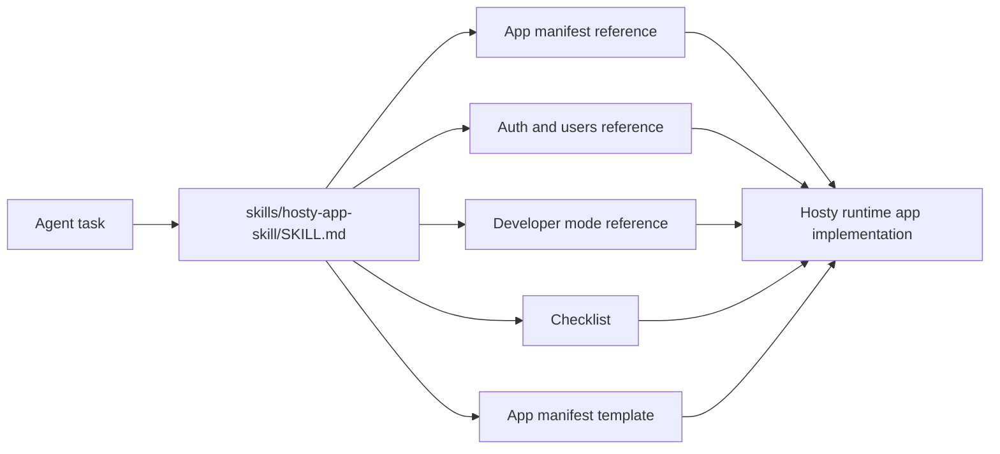

# Hosty App Skill

## Description

The repository ships a Codex skill for agents that implement Hosty runtime apps. The skill lives under `skills/hosty-app-skill` and packages the app workflow, compact references, and a minimal `app.0.1` manifest template.

The skill helps agents:

- wrap an existing application as a Hosty runtime app;
- create new `schemaVersion: "app.0.1"` manifests;
- migrate or update legacy Docker module metadata with `schemaVersion: "0.2"` or `"0.3"`;
- configure Docker runtime profiles and planned local command runtime profiles;
- declare optional source repository metadata;
- configure Hosty-managed app data directories and understand backup boundaries;
- add Shell UI metadata;
- integrate Hosty Core identity and scoped user directory access;
- implement app-owned roles;
- distinguish Shell UI access from gateway-protected service/API exposure;
- validate apps with the Hosty developer-mode workflow before falling back to slower image rebuilds.

The skill is intentionally not a copy of the full documentation. `SKILL.md` is a short workflow guide, while `references/` contains focused topic documents that agents load only when needed.

For Host-facing app behavior, the skill points agents at the integrated developer target loop: run the app locally, route it through Hosty, seed Hosty-owned development users and assignments, and let Hosty issue the normal signed app identity token. For direct local endpoint probes, agents can use `hosty dev identity --format token` to request a real Hosty-signed token from trusted control. Directly injecting fake identity headers is not considered a valid Hosty integration check.

The skill also distinguishes the Hosty Core API origin from Host lifecycle mode. Agents should configure `HOST_DEV_REPOSITORY_PATH` for a source-run Hosty Core, or use `hosty dev up --host-url` with a loopback URL when validating apps against an already running Host process instead of the installed Host container.



## Files

- `skills/hosty-app-skill/SKILL.md` - trigger metadata and core workflow.
- `skills/hosty-app-skill/agents/openai.yaml` - UI-facing skill metadata.
- `skills/hosty-app-skill/references/app-manifest.md` - compact app manifest, legacy metadata, runtime profile, install/update, storage, and backup guidance.
- `skills/hosty-app-skill/references/app-auth-and-users.md` - Hosty roles, Shell access, gateway policies, identity modes, identity tokens, scoped directory, external providers, third-party credentials, and app-owned roles.
- `skills/hosty-app-skill/references/app-dev-mode.md` - local developer target workflow, trusted-control-backed dev metadata behavior, and developer-mode boundaries.
- `skills/hosty-app-skill/references/demo-app-patterns.md` - practical patterns from `modules/demo-module`.
- `skills/hosty-app-skill/references/app-implementation-checklist.md` - final implementation and validation checklist.
- `skills/hosty-app-skill/assets/app-template/manifest.json` - minimal `app.0.1` manifest skeleton.

## Installation And Updates

The repository copy is usable by agents that receive this checkout as context.

Inside the Codex app, install it by asking Codex:

```text
Use $skill-installer to install the skill from alex-de-haas/docker-host at skills/hosty-app-skill.
```

The built-in Codex skill installer installs the GitHub path into `$CODEX_HOME/skills`. It is the preferred first-install path when working inside Codex.

For repeatable command-line updates, run:

```bash
curl -fsSL https://raw.githubusercontent.com/alex-de-haas/docker-host/main/scripts/install-hosty-app-skill.sh | sh
```

The installer downloads `skills/hosty-app-skill` from GitHub and atomically installs it into:

```text
${CODEX_HOME:-$HOME/.codex}/skills/hosty-app-skill
```

Run the same command again to update the global skill. Restart Codex after installing or updating so the skill registry is reloaded.

The command-line installer is intentionally kept even though Codex has a built-in installer, because the built-in installer does not overwrite an existing skill directory. The script is the simple update path for Codex and for other agents or machines that do not have the Codex app helper available.

Install from a local checkout while developing the skill:

```bash
sh scripts/install-hosty-app-skill.sh --source-dir skills/hosty-app-skill
```

Install a specific branch, tag, or commit:

```bash
curl -fsSL https://raw.githubusercontent.com/alex-de-haas/docker-host/main/scripts/install-hosty-app-skill.sh | sh -s -- --ref main
```

For private forks, set `GITHUB_TOKEN` or `GH_TOKEN`, or pass `--repo OWNER/REPO`.

## Usage From Other Repositories

After installation and Codex restart, open any application repository and invoke the skill explicitly:

```text
Use $hosty-app-skill to wrap this app as a Hosty runtime app.
```

The skill may also trigger implicitly for runtime-app-related work, but explicit invocation is preferred when converting external application repositories.

## Maintenance

Keep the skill aligned with the source documentation:

- update `references/app-manifest.md` when `docs/features/hosty-runtime-app-platform.md`, `docs/features/module-metadata.md`, or `apps/host/src/lib/app-manifest.ts` changes;
- update `references/app-auth-and-users.md` when `docs/features/auth-gateway.md` or `docs/features/user-management.md` changes;
- update `references/app-dev-mode.md` when `docs/features/module-developer-mode.md`, `docs/features/module-development-harness.md`, or `docs/features/cli-trusted-control-and-dev-metadata.md` changes;
- update `references/demo-app-patterns.md` when `modules/demo-module` changes in a way agents should copy;
- update `references/app-implementation-checklist.md` when app validation, gateway publishing, backup, or security review expectations change.

Run the skill validator after changes:

```bash
python3 "${CODEX_HOME:-$HOME/.codex}/skills/.system/skill-creator/scripts/quick_validate.py" skills/hosty-app-skill
```
