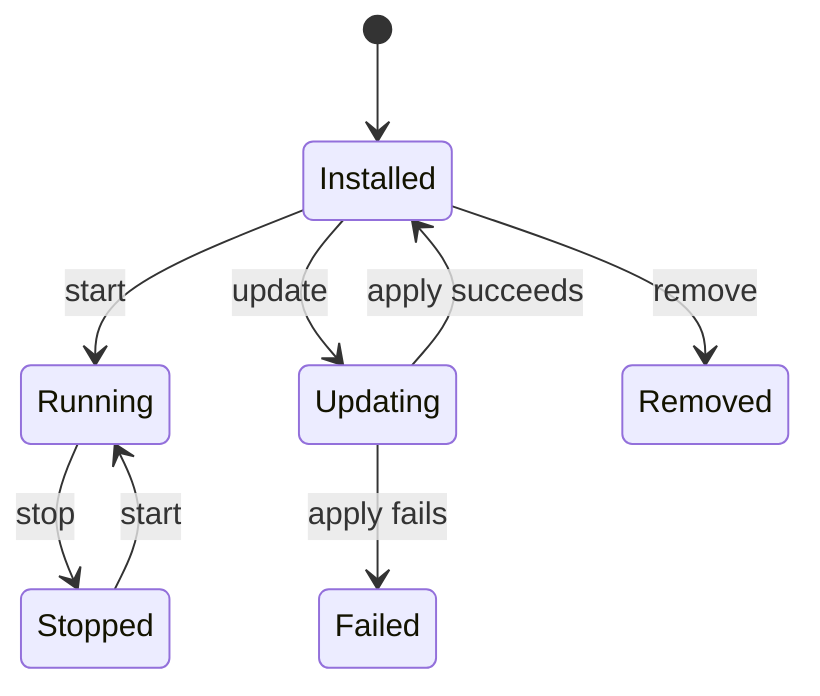

# Hosty Runtime App Platform

## Description

Hosty runs local and Docker-backed runtime apps under Core-managed lifecycle. The current platform centers on `app.0.1` manifests, app registry state, runtime profiles, source workflows, app auth, and app data backups.

## Implemented Platform

- `hosty` CLI bootstrap and Core control discovery.
- Core-managed Shell runtime app.
- Runtime app installation from `app.0.1` manifests.
- Docker and local command runtime profiles.
- Runtime profile switching with reviewed plans.
- Source checkout and local source override workflows.
- App auth code exchange and app-origin sessions.
- Scoped app directory through `HOSTY_APP_SERVICE_TOKEN`.
- Primary app data directory and app backup/restore workflows.

## App Lifecycle



## Runtime Environment

Core injects app environment into each service:

- `HOSTY_APP_ID`
- `HOSTY_APP_SERVICE_KEY`
- `HOSTY_APP_SERVICE_TOKEN`
- `HOSTY_CORE_ORIGIN`
- `HOSTY_APP_DATA_DIR`
- `HOSTY_PORT_{KEY}`
- `HOSTY_DEPENDENCY_{KEY}_URL`

## Local Demo App Workflow

```bash
hosty core start
hosty apps install apps/demo-app/manifest.json --runtime dev
hosty apps start com.haas.demo-app
```
