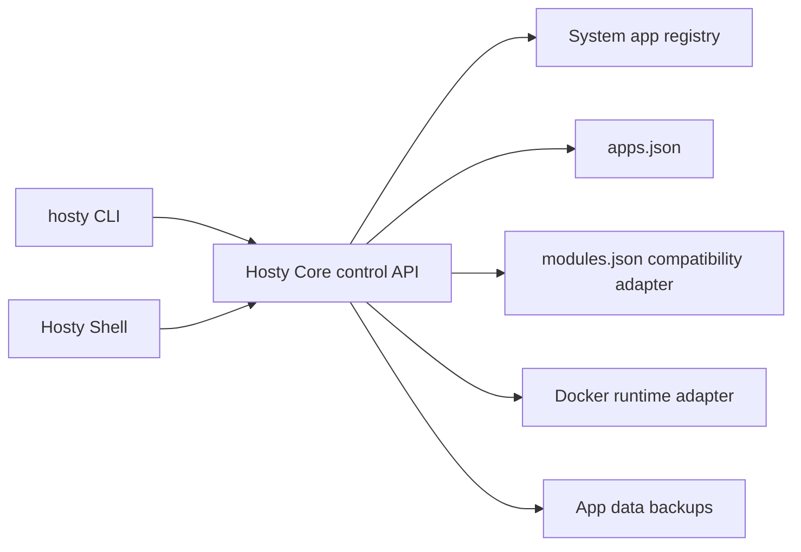

# Hosty runtime app platform

This document describes the implemented Hosty compatibility and runtime foundation that broadens Docker Host from Docker-only modules toward a Hosty Core, Shell, and runtime app model.

## Description

Hosty is the target product model for the current Docker Host implementation. The existing Docker module runtime remains supported, but new code and documentation should use these terms:

- **Hosty Core** - the backend API and orchestration process.
- **Hosty Shell** - the browser management UI client for Hosty Core.
- **System app** - a Hosty-owned app or service, initially Hosty Shell.
- **Runtime app** - an installed workload managed by Hosty, including legacy Docker modules.
- **Manifest** - the public contract name for app metadata. Legacy `metadata.json` remains a compatibility format.
- **Runtime profile** - the way an app runs, such as Docker image or local command.

The implementation is intentionally incremental. Docker remains the first production-oriented runtime adapter and many compatibility routes still use module-oriented names. The local-first Core stores app-owned state under `apps/<app-id>/state.json`; the legacy Next compatibility layer persists app-oriented records in `apps.json`. Legacy `modules.json` records remain readable for already-installed legacy modules and explicit compatibility imports, but app-only lifecycle reads and writes no longer create an empty `modules.json`.



## Data root selection

The preferred Hosty data root is:

```text
~/.hosty
```

The legacy data root remains:

```text
~/.docker-host
```

Selection rules:

- `HOSTY_HOME` overrides the CLI root.
- Legacy `DOCKER_HOST_HOME` is still accepted as a compatibility override.
- When no override is set, `~/.hosty` is used if it exists.
- If `~/.hosty` does not exist and `~/.docker-host` exists, the legacy root remains active.
- If neither exists, new installations create and use `~/.hosty`.
- If both roots exist, `~/.hosty` wins. Hosty does not merge state automatically.

The default `HOST_DATA_ROOT_HOST` follows the selected root. This lets existing installations keep working while new installations use Hosty naming.

## CLI naming

The preferred command is now:

```text
hosty
```

The managed CLI installer and self-update flow create or refresh both:

- `hosty` - preferred command;
- `docker-host` - deprecated compatibility alias.

The command surface is otherwise intentionally compatible. Existing commands such as lifecycle, config, auth, dev, and module management still work. New app-oriented commands prefer:

```text
hosty apps list
hosty apps install <manifest-url>
hosty apps backup <app-id>
hosty apps backups <app-id>
hosty apps restore <app-id> <backup-id>
```

The legacy command group remains:

```text
docker-host modules ...
hosty modules ...
```

`hosty apps` is the preferred app-management alias. `hosty modules` remains for legacy scripts and documentation during the migration window.

## App registry and compatibility stores

The target app layout for new app-oriented records is:

```text
<hosty-data-root>/
  apps.json
  apps/
    <app-id>/
      state.json
      manifest.json
      data/
  backups/
    <app-id>/
  sources/
    <app-id>/
```

The legacy layout remains readable:

```text
<hosty-data-root>/
  modules.json
  modules/
    <module-id>/
      metadata.json
```

Current implementation details:

- `apps.json` is created and maintained as the app-oriented registry.
- New app-oriented installs still use module-oriented lifecycle routes, but installed runtime state is written back into `apps.json`.
- `modules.json` remains a compatibility fallback for already-installed legacy module records and explicit legacy imports.
- App-only lifecycle reads and writes do not create or rewrite `modules.json`.
- App manifest copies are written to `apps/<app-id>/manifest.json`.
- Update planning and apply use the stored `selectedRuntime` when refreshing an app manifest, so a changed manifest default cannot silently switch the installed runtime profile.
- Legacy Docker metadata copies remain in `modules/<module-id>/metadata.json` for legacy module records.
- Records can contain both `manifestUrl` and legacy `metadataUrl`.
- Records can contain both `manifestPath` and legacy `metadataPath`.
- Compatibility code is isolated around root resolution, registry reading/writing, manifest path resolution, lifecycle state projection, and CLI aliases so it can be removed later.

Routine update does not migrate legacy physical data directories. Legacy modules discovered only from `modules.json` remain readable through the compatibility path. New first-party workflows use Demo App and `app.0.1` manifests.

## Runtime profile and lifecycle state

Runtime app manifests declare mutually exclusive runtime profiles. Hosty stores the selected runtime instead of reselecting the manifest default during update or runtime refresh. If a refreshed manifest no longer contains the installed selected runtime, planning fails with a validation error instead of silently switching the app.

The local-first Core app record owns the runtime lifecycle fields needed by ordinary app operations:

- local `manifestPath` pointing at the installed `apps/<app-id>/manifest.json` copy;
- remote `manifestUrl` when the app was installed from an absolute `http` or `https` manifest URL;
- selected runtime and selected channel;
- operation status, runtime state, last operation, and last error;
- `autostart`, an installed-app setting that controls whether Core starts the app during Core startup. It defaults to `true` on install and is stored in app state, not in Docker-specific runtime metadata;
- settings values, with secret values treated as write-only at API and UI boundaries;
- storage mappings and primary app data location;
- dependency contracts and resolved endpoint URLs;
- endpoint contracts and public/browser URLs;
- source state, including repository metadata, resolved ref, immutable commit, managed checkout path, local override path, and update timestamp.

Compatibility stores keep legacy modules readable while new app-oriented workflows move to app-owned state. New Core runtime app operations should resolve lifecycle state through the app record first and use legacy module records only when explicitly handling installed legacy modules.

## System apps and runtime apps

The app registry API now returns app summaries with the current Hosty app shape:

- `id`;
- `kind` - `system` or `runtime`;
- `system` - `true` for Hosty-owned system apps;
- `source` - `system` or `installed`;
- `moduleId`;
- `displayName`, `description`, `icon`, and `version`;
- `status` and `statusReason`;
- `accessMode` - currently `allAuthenticated` or `assignedUsersOnly`;
- `selectedRuntime`;
- `selectedChannel`;
- `autostart`;
- `capabilities`;
- `operationStatus`, `lastOperation`, and `runtimeState` for installed runtime apps when available;
- `entryPath`, `embeddedUrl`, `origin`, `originScope`, and `identityTokenUrl`;
- `navigation`.

Hosty Shell is synthesized as a system app:

```json
{
  "id": "hosty.shell",
  "kind": "system",
  "system": true,
  "source": "system",
  "displayName": "Hosty Shell",
  "version": "bundled",
  "selectedRuntime": "host-core",
  "capabilities": ["open", "update"]
}
```

The Apps portal and local control API separate system apps from runtime apps. System apps are non-removable and should not expose ordinary runtime app stop/remove actions.

Current system app behavior:

- `GET /control/v1/apps` includes Hosty Shell for local CLI/admin management.
- `GET /api/apps` includes Hosty Shell only for Host administrators.
- The Host sidebar excludes system apps so Host-owned management surfaces do not appear as user app navigation items.
- Host users see runtime apps allowed by app access policy, but not the Hosty Shell system app as a removable/manageable app.
- Hosty Shell currently has capabilities `open` and `update`.
- Runtime apps currently derive capabilities from installed module operation status. Installed apps expose actions such as `open`, `update`, `restart`, `stop`, `configure`, and `remove`; removing apps expose no actions.

Current access-summary behavior:

- Shell-embedded runtime apps expose `entryPath`, `embeddedUrl`, `origin`, `originScope`, and `identityTokenUrl`.
- Local-only app origins use `originScope: "local"` and become unavailable to non-loopback Shell requests.
- Public app origins use `originScope: "public"` when an endpoint public origin is configured during install/configure.
- Standalone auth redirect and gateway-protected availability summaries are not implemented yet. They are part of the future standalone/gateway access phase.

## Manifest compatibility

`manifestUrl` is the preferred request field for new installs. Legacy `metadataUrl` remains accepted.

Supported inputs:

- legacy Docker module metadata with `schemaVersion: "0.2"`;
- legacy Docker module metadata with `schemaVersion: "0.3"`;
- new app manifests with `schemaVersion: "app.0.1"`.

The first `app.0.1` implementation maps app manifests into the legacy Docker module runtime model before planning. This keeps install/update safety behavior while allowing new manifests to use app vocabulary.

Supported `app.0.1` fields in the compatibility adapter:

- `id`, `name`, `description`, `version`;
- optional `source` for Git metadata;
- optional `channelsUrl`;
- `runtimeProfiles` with `docker` and `localCommand` profiles;
- `services` with a runtime implementation for each declared runtime profile;
- `defaultRuntime`;
- `ui`;
- `data`;
- `storage`;
- `settings`;
- `dependencies` with `manifestUrl` or `metadataUrl`;
- `connections`;
- `endpoints`.

`runtimeProfiles[]` are mutually exclusive app-level ways to run the app. `services[]` are the runtime services that run together for the selected profile, such as `web`, `api`, and `worker`. The compatibility adapter selects `defaultRuntime` or the first/default profile, then maps every `services[].runtimes[defaultRuntime]` entry into canonical legacy `0.3` services before install/update planning.

Docker runtime profiles run through the Docker runtime adapter. Docker containers for runtime apps are created with Docker restart disabled; Core owns start, stop, restart, startup autostart, and shutdown stop behavior. Local command runtime profiles run through Core from a local source override, managed checkout, or app root fallback, and are intended for trusted local development or explicitly configured administrator workflows.

The earlier top-level `runtimes[]` shape is still accepted as a single-service compatibility path, but new `app.0.1` manifests should use `runtimeProfiles[]` and `services[]`.

Reserved `app.0.1` fields:

- `access`;
- `capabilities`.

These fields are accepted by the current parser so manifests can start using the target shape, but they do not yet change access policy or action availability. Current runtime app access is still derived from Host assignments, endpoint/public-origin state, and legacy module UI metadata. Current capabilities are generated by Hosty from app kind and installed operation status.

Storage and data behavior:

- `data.enabled: true` creates a primary `data` storage directory for Docker runtime services unless one is already declared.
- `data.targets[].service` selects which service receives the primary data mount.
- `data.targets[].containerPath` controls the Docker container path for the primary app data directory. The default is `/app/data`.
- The Docker runtime injects `HOSTY_APP_DATA_DIR` when a primary data mapping exists.
- For local command runtime profiles, Core injects `HOSTY_APP_DATA_DIR` when the profile declares a compatible primary data target. Runtime switching rejects an app with existing primary data when the target runtime cannot preserve that data mapping.

Example minimal app manifest:

```json
{
  "schemaVersion": "app.0.1",
  "id": "com.example.notes",
  "name": "Notes",
  "version": "1.2.3",
  "runtimeProfiles": [
    {
      "key": "docker",
      "type": "docker",
      "default": true
    }
  ],
  "services": [
    {
      "key": "app",
      "runtimes": {
        "docker": {
          "type": "docker",
          "image": "ghcr.io/example/notes:1.2.3",
          "ports": [
            {
              "key": "http",
              "containerPort": 3000,
              "protocol": "http",
              "public": true
            }
          ]
        }
      }
    }
  ],
  "endpoints": [
    {
      "key": "web",
      "service": "app",
      "port": "http",
      "public": true
    }
  ],
  "ui": {
    "entrypoint": {
      "endpoint": "web",
      "path": "/"
    }
  },
  "data": {
    "enabled": true,
    "targets": [
      {
        "runtime": "docker",
        "service": "app",
        "containerPath": "/app/data"
      }
    ]
  }
}
```

## App data directory

Each runtime app has its own primary data directory. For new app manifests, the target path is:

```text
<hosty-data-root>/apps/<app-id>/data/
```

For legacy modules, existing module-owned storage mappings remain valid. Hosty resolves the primary app data directory in this order:

- `apps/<app-id>/data/` when it exists;
- legacy installed storage mapping with key `data`;
- legacy installed storage mapping whose host path ends in `data`;
- otherwise the target `apps/<app-id>/data/` path.

The Docker runtime injects `HOSTY_APP_DATA_DIR` when a data storage mapping exists. External mounts and additional storage mappings are not treated as Hosty-managed app data.

## App data backups

Hosty creates ZIP backups for the primary app `data/` directory only. External mounts are intentionally excluded.

Backup layout:

```text
<hosty-data-root>/backups/<app-id>/
  2026-06-01T12-00-00Z_manual.zip
  2026-06-01T12-00-00Z_manual.json
```

Backup metadata includes:

- app id;
- backup id;
- reason;
- created time;
- live data path;
- archive path;
- archive digest;
- archive size;
- file count.

Implemented backup reasons:

- `pre-update`;
- `manual`;
- `pre-restore`;
- `pre-runtime-switch`;
- `scheduled`.

Current behavior:

- `module update` apply creates a `pre-update` backup when the app data directory exists.
- Runtime switch apply creates a `pre-runtime-switch` backup when the app data directory exists.
- Manual backup is available through `POST /control/v1/apps/{appId}/backups`.
- Backup listing is available through `GET /control/v1/apps/{appId}/backups`.
- Restore is available through `POST /control/v1/apps/{appId}/backups/{backupId}/restore`.
- Restore requires the runtime app to be stopped before Core replaces app data.
- Shell asks for restore confirmation and requests a `pre-restore` backup before restore. CLI restore can request the same behavior with `--pre-restore-backup`.
- Restore extracts the ZIP archive into the app data directory and fails before completing if archive extraction fails.
- Restore does not automatically restart the app.
- Core keeps the last 5 `pre-update`, `pre-restore`, `pre-runtime-switch`, and `scheduled` backups per app and keeps manual backups until explicit deletion.
- Backup cleanup preview and apply APIs are available through browser and trusted local control routes. Apply requires a current plan digest and verifies candidate paths and archive SHA-256 before deletion.
- Core runs scheduled retention cleanup for automatic-safe candidates. Archive-only candidates without metadata are exposed in previews and require explicit apply.
- Shell can list backups with retention status, create manual backups, restore stopped apps, delete one backup with confirmation, preview cleanup, and apply cleanup with confirmation.

CLI commands:

```text
hosty apps backup <app-id> [--reason <reason>]
hosty apps backup delete <app-id> <backup-id> --yes
hosty apps backups <app-id>
hosty apps backups prune-plan <app-id> [--format table|json]
hosty apps backups prune <app-id> --plan-digest <digest> --yes [--format table|json]
hosty apps restore <app-id> <backup-id> [--pre-restore-backup]
```

## Not implemented yet

The following concepts remain planned or deferred:

- generated product channel publishing, runtime app channel UI, pull request channels, and channel cleanup, deferred in [Update Channels](../planning/update-channels.md);
- standalone auth redirect hardening, optional gateway-protected app mode, and complete separate public origin validation, tracked in [App Auth And Origin Separation](../planning/app-auth-and-origin-separation.md);
- age-based backup retention and per-app retention overrides;
- legacy module data migration/import tooling beyond the retained compatibility reader and writer;
- agent bridge annotations, repository edits, and pull request channel promotion, deferred in [Agent Bridge Workflow](../planning/agent-bridge-workflow.md).
