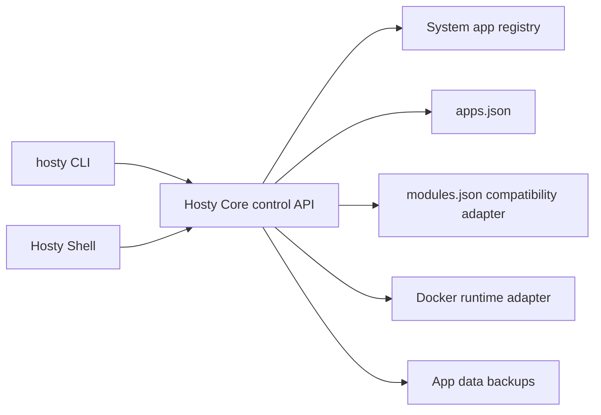

# Hosty runtime app platform

This document describes the implemented Hosty compatibility foundation that broadens Docker Host from Docker-only modules toward a Hosty Core, Shell, and runtime app model.

## Description

Hosty is the target product model for the current Docker Host implementation. The existing Docker module runtime remains supported, but new code and documentation should use these terms:

- **Hosty Core** - the backend API and orchestration process.
- **Hosty Shell** - the browser management UI client for Hosty Core.
- **System app** - a Hosty-owned app or service, initially Hosty Shell.
- **Runtime app** - an installed workload managed by Hosty, including legacy Docker modules.
- **Manifest** - the public contract name for app metadata. Legacy `metadata.json` remains a compatibility format.
- **Runtime profile** - the way an app runs, such as Docker image or local command.

The implementation is intentionally incremental. Docker remains the first runtime adapter and the legacy module engine still owns most lifecycle behavior. The app model is layered around it through compatibility adapters.



## Data root selection

The preferred Hosty data root is:

```text
~/.hosty
```

The legacy data root remains:

```text
~/.docker-host
```

Selection rules:

- `HOSTY_HOME` overrides the CLI root.
- Legacy `DOCKER_HOST_HOME` is still accepted as a compatibility override.
- When no override is set, `~/.hosty` is used if it exists.
- If `~/.hosty` does not exist and `~/.docker-host` exists, the legacy root remains active.
- If neither exists, new installations create and use `~/.hosty`.
- If both roots exist, `~/.hosty` wins. Hosty does not merge state automatically.

The default `HOST_DATA_ROOT_HOST` follows the selected root. This lets existing installations keep working while new installations use Hosty naming.

## CLI naming

The preferred command is now:

```text
hosty
```

The managed CLI installer and self-update flow create or refresh both:

- `hosty` - preferred command;
- `docker-host` - deprecated compatibility alias.

The command surface is otherwise intentionally compatible. Existing commands such as lifecycle, config, auth, dev, and module management still work. New app-oriented commands prefer:

```text
hosty apps list
hosty apps install <manifest-url>
hosty apps backup <app-id>
hosty apps backups <app-id>
hosty apps restore <app-id> <backup-id>
```

The legacy command group remains:

```text
docker-host modules ...
hosty modules ...
```

`hosty apps` is the preferred app-management alias. `hosty modules` remains for legacy scripts and documentation during the migration window.

## App registry and compatibility stores

The target app layout for new app-oriented records is:

```text
<hosty-data-root>/
  apps.json
  apps/
    <app-id>/
      manifest.json
      data/
  backups/
    <app-id>/
```

The legacy layout remains readable:

```text
<hosty-data-root>/
  modules.json
  modules/
    <module-id>/
      metadata.json
```

Current implementation details:

- `apps.json` is created and maintained as the app-oriented registry.
- New installs still use the legacy module lifecycle engine, but they also upsert an app record into `apps.json`.
- App manifest copies are written to `apps/<app-id>/manifest.json`.
- Legacy Docker metadata copies remain in `modules/<module-id>/metadata.json` for legacy module records.
- Records can contain both `manifestUrl` and legacy `metadataUrl`.
- Records can contain both `manifestPath` and legacy `metadataPath`.
- Compatibility code is isolated around root resolution, registry reading, manifest path resolution, and CLI aliases so it can be removed later.

Routine update does not migrate legacy data directories. Legacy modules discovered from `modules.json` continue updating in place through the legacy path.

## System apps and runtime apps

The app registry API now returns app summaries with the current Hosty app shape:

- `id`;
- `kind` - `system` or `runtime`;
- `system` - `true` for Hosty-owned system apps;
- `source` - `system`, `installed`, or `developer`;
- `moduleId`;
- `developerTargetId` for local developer targets;
- `displayName`, `description`, `icon`, and `version`;
- `status` and `statusReason`;
- `accessMode` - currently `allAuthenticated` or `assignedUsersOnly`;
- `selectedRuntime`;
- `selectedChannel`;
- `capabilities`;
- `operationStatus`, `lastOperation`, and `runtimeState` for installed runtime apps when available;
- `entryPath`, `embeddedUrl`, `origin`, `originScope`, and `identityTokenUrl`;
- `navigation`.

Hosty Shell is synthesized as a system app:

```json
{
  "id": "hosty.shell",
  "kind": "system",
  "system": true,
  "source": "system",
  "displayName": "Hosty Shell",
  "version": "bundled",
  "selectedRuntime": "host-core",
  "capabilities": ["open", "update"]
}
```

The Apps portal and local control API separate system apps from runtime apps. System apps are non-removable and should not expose ordinary runtime app stop/remove actions.

Current system app behavior:

- `GET /control/v1/apps` includes Hosty Shell for local CLI/admin management.
- `GET /api/apps` includes Hosty Shell only for Host administrators.
- Host users see runtime and developer apps allowed by app access policy, but not the Hosty Shell system app as a removable/manageable app.
- Hosty Shell currently has capabilities `open` and `update`.
- Runtime apps currently derive capabilities from installed module operation status. Installed apps expose actions such as `open`, `update`, `restart`, `stop`, `configure`, and `remove`; removing apps expose no actions.

Current access-summary behavior:

- Shell-embedded runtime apps expose `entryPath`, `embeddedUrl`, `origin`, `originScope`, and `identityTokenUrl`.
- Local-only app origins use `originScope: "local"` and become unavailable to non-loopback Shell requests.
- Public app origins use `originScope: "public"` when an endpoint public origin is configured during install/configure.
- Standalone auth redirect and gateway-protected availability summaries are not implemented yet. They are part of the future standalone/gateway access phase.

## Manifest compatibility

`manifestUrl` is the preferred request field for new installs. Legacy `metadataUrl` remains accepted.

Supported inputs:

- legacy Docker module metadata with `schemaVersion: "0.2"`;
- legacy Docker module metadata with `schemaVersion: "0.3"`;
- new app manifests with `schemaVersion: "app.0.1"`.

The first `app.0.1` implementation maps app manifests into the legacy Docker module runtime model before planning. This keeps install/update safety behavior while allowing new manifests to use app vocabulary.

Supported `app.0.1` fields in the compatibility adapter:

- `id`, `name`, `description`, `version`;
- optional `source` for Git metadata;
- optional `channelsUrl`;
- `runtimes` with `docker` and `localCommand` profiles;
- `defaultRuntime`;
- `ui`;
- `data`;
- `storage`;
- `settings`;
- `dependencies` with `manifestUrl` or `metadataUrl`;
- `endpoints`.

Docker runtime profiles can be installed through the existing Docker module engine. Local command runtime profiles can be parsed and normalized, but production local-process runtime execution is not implemented yet.

Reserved `app.0.1` fields:

- `access`;
- `capabilities`.

These fields are accepted by the current parser so manifests can start using the target shape, but they do not yet change access policy or action availability. Current runtime app access is still derived from Host assignments, endpoint/public-origin state, and legacy module UI metadata. Current capabilities are generated by Hosty from app kind and installed operation status.

Storage and data behavior:

- `data.enabled: true` creates a primary `data` storage directory for Docker runtime profiles unless one is already declared.
- `data.targets[].containerPath` controls the Docker container path for the primary app data directory. The default is `/app/data`.
- The Docker runtime injects `HOSTY_APP_DATA_DIR` when a primary data mapping exists.
- For local command runtime profiles, the manifest can declare data intent, but production local process execution and environment injection are future runtime-adapter work.

Example minimal app manifest:

```json
{
  "schemaVersion": "app.0.1",
  "id": "com.example.notes",
  "name": "Notes",
  "version": "1.2.3",
  "runtimes": [
    {
      "key": "docker",
      "type": "docker",
      "image": "ghcr.io/example/notes:1.2.3",
      "ports": [
        {
          "key": "http",
          "containerPort": 3000,
          "protocol": "http"
        }
      ]
    }
  ],
  "ui": {
    "entrypoint": "/"
  },
  "data": {
    "enabled": true,
    "targets": [
      {
        "runtime": "docker",
        "containerPath": "/app/data"
      }
    ]
  }
}
```

## App data directory

Each runtime app has its own primary data directory. For new app manifests, the target path is:

```text
<hosty-data-root>/apps/<app-id>/data/
```

For legacy modules, existing module-owned storage mappings remain valid. Hosty resolves the primary app data directory in this order:

- `apps/<app-id>/data/` when it exists;
- legacy installed storage mapping with key `data`;
- legacy installed storage mapping whose host path ends in `data`;
- otherwise the target `apps/<app-id>/data/` path.

The Docker runtime injects `HOSTY_APP_DATA_DIR` when a data storage mapping exists. External mounts and additional storage mappings are not treated as Hosty-managed app data.

## App data backups

Hosty creates ZIP backups for the primary app `data/` directory only. External mounts are intentionally excluded.

Backup layout:

```text
<hosty-data-root>/backups/<app-id>/
  2026-06-01T12-00-00Z_manual.zip
  2026-06-01T12-00-00Z_manual.json
```

Backup metadata includes:

- app id;
- backup id;
- reason;
- created time;
- live data path;
- archive path;
- archive digest;
- archive size;
- file count.

Implemented backup reasons:

- `pre-update`;
- `manual`;
- `pre-restore`;
- `pre-runtime-switch`;
- `scheduled`.

Current behavior:

- `module update` apply creates a `pre-update` backup when the app data directory exists.
- Manual backup is available through `POST /control/v1/apps/{appId}/backups`.
- Backup listing is available through `GET /control/v1/apps/{appId}/backups`.
- Restore is available through `POST /control/v1/apps/{appId}/backups/{backupId}/restore`.
- Restore requires `confirmed=true`.
- Restore stops the app first by default.
- Restore creates a `pre-restore` backup by default.
- Restore verifies archive digest and per-entry CRC before replacing data.
- Restore does not automatically restart the app.
- Current ZIP creation is in-memory and rejects app data above 256 MiB until a streaming archive writer is implemented.
- Automatic backup retention and backup deletion APIs are not implemented yet. Backups are retained until manual filesystem cleanup or a future retention feature removes them.

CLI commands:

```text
hosty apps backup <app-id>
hosty apps backups <app-id>
hosty apps restore <app-id> <backup-id>
```

## Not implemented yet

The following concepts remain planned, not implemented:

- product channel index download and `hosty update --channel`, tracked in [Update Channels](../planning/update-channels.md);
- runtime app channel discovery and switching, tracked in [Update Channels](../planning/update-channels.md);
- runtime profile switch planning, repository checkout/cache, and local command runtime supervision, tracked in [Runtime Profiles And Source Runtimes](../planning/runtime-profiles-and-source-runtimes.md);
- standalone auth redirect, optional gateway-protected app mode, and separate public origins for Hosty Core API and Hosty Shell, tracked in [App Auth And Origin Separation](../planning/app-auth-and-origin-separation.md);
- automatic backup retention and backup deletion APIs, tracked in [App Data Backup Retention](../planning/app-data-backup-retention.md);
- agent bridge annotations, repository edits, and pull request channel promotion, tracked in [Agent Bridge Workflow](../planning/agent-bridge-workflow.md).
