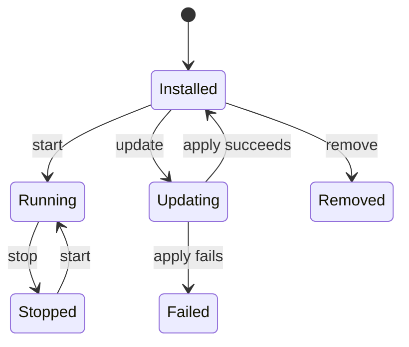

# Hosty Runtime App Platform

## Description

Hosty runs local and Docker-backed runtime apps under Core-managed lifecycle. The current platform centers on `app.0.1` manifests, app registry state, runtime profiles, source workflows, app auth, and app data backups.

## Implemented Platform

- `hosty` CLI bootstrap and Core control discovery.
- Core-managed Shell runtime app.
- Runtime app installation from `app.0.1` manifest URLs, local manifest files, or local app directories containing `manifest.json`.
- Docker and local command runtime profiles.
- Runtime profile switching with reviewed plans.
- Source checkout and local source override workflows.
- App auth code exchange and app-origin sessions.
- Scoped app directory through `HOSTY_APP_SERVICE_TOKEN`.
- Primary app data directory and app backup/restore workflows.
- Automatic local port assignment for runtime services that omit explicit host ports.

## App Lifecycle



## Runtime Environment

Core injects app environment into each service:

- `HOSTY_APP_ID`
- `HOSTY_APP_SERVICE_KEY`
- `HOSTY_APP_SERVICE_TOKEN`
- `HOSTY_CORE_PUBLIC_ORIGIN`
- `HOSTY_CORE_ORIGIN`
- `HOSTY_APP_DATA_DIR`
- `HOSTY_PORT_{KEY}`
- `HOSTY_DEPENDENCY_{KEY}_URL`

`HOSTY_CORE_PUBLIC_ORIGIN` is the browser-facing Core origin. `HOSTY_CORE_ORIGIN` is the runtime process-to-Core origin. For Docker services, `HOSTY_CORE_ORIGIN` is rewritten from loopback Core origins such as `http://localhost:7070` to the container-reachable `host.docker.internal` host while preserving the scheme and port. For local command services, `HOSTY_CORE_ORIGIN` uses Core's listen URL. Browser-facing app endpoint URLs still use the configured runtime public host, normally `localhost`.

For runtime services, Core assigns available host ports when `localPort` / `hostPort` are omitted, stores the resulting endpoint URLs, and reuses those stored ports on later start/restart operations. Single-port local command services also receive `PORT=<assigned-port>` unless the app explicitly configured `PORT`.

Local runtime URLs are published as `http://localhost:<assigned-port>`. Public UI/API exposure is configured after installation per public endpoint through the generated `HOSTY_PUBLIC_ORIGIN_{ENDPOINT_KEY}` app setting; empty means use the local `localhost` endpoint.

## First-Party App Images

The repository's own app images (`shell`, `marketplace`, `telemetry-ui`, `demo-app`) build on a base pinned by digest, and each ships the Next standalone bundle rather than a full `node_modules`. Ownership is stamped by `--chown` on each `COPY`; a recursive `chown` in the runner stage would rewrite every file's metadata and make overlayfs duplicate the whole bundle into an extra layer.

None of them runs its server as root. Core sets no `--user`, so the image decides:

- **Apps with no data mount** (`shell`, `telemetry-ui`) declare `USER node` and start directly.
- **Apps with a data mount** (`marketplace`, `demo-app`) start as root through `docker-entrypoint.sh`, then drop privileges with `gosu`.

The privileged step exists only to resolve which uid to run as. Core bind-mounts the app data directory from its own `apps/<id>/data` tree, owned by the user running Core — normally not root, since `hosty` installs under `$HOME`. The entrypoint therefore **adopts the mount's existing owner** rather than taking ownership of it: reassignment happens only when the directory is root-owned (a fresh volume, or a Core that genuinely runs as root), where nothing else holds a claim and root retains access regardless.

Chowning a Core-owned mount to the image's own uid would be wrong in a way that fails quietly: on any host whose Core uid is not the image's, Core loses write access to the tree it manages, and `CoreLifecycleService.TryDeleteDirectory` swallows the resulting `UnauthorizedAccessException` — "remove app with data" would report success while leaving the data on disk. Backups read the same tree.

Because the server may therefore run as an arbitrary uid, the Next image-optimizer cache directory in those two images is mode `1777` — sticky like `/tmp`, holding only derived, non-secret output.

## Local Demo App Workflow

```bash
hosty core start
hosty apps install apps/demo-app --runtime dev
hosty apps start com.haas.demo-app
```
