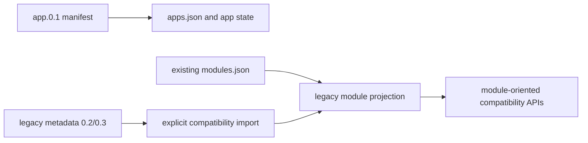

# Legacy Compatibility

## Description

The Stage 5 implementation retires the repository-local Demo Module fixture and makes Demo App the only first-party runtime app workflow. Hosty still keeps a compatibility boundary for existing installations and explicit legacy imports, but new first-party development should use `app.0.1` manifests and app-owned lifecycle state. Final Stage 5 closure still requires a successful published Demo App image smoke.

## Current Boundary

- `apps/demo-app/manifest.json` is the first-party demo manifest and should be used for local and published image workflow validation.
- `modules/demo-module` has been removed from the repository.
- The Demo Module image publishing workflow has been removed.
- The Demo App image publishing workflow is the only first-party demo image workflow and targets public pulls from `ghcr.io/alex-de-haas/demo-app:latest`.
- The Host dev fixture route for first-party install testing is `/fixtures/apps/demo-app`; it returns the Demo App `app.0.1` manifest and rewrites Docker image references to a local dev tag when fixtures are enabled.
- `modules.json` is no longer created or rewritten for app-only lifecycle reads and writes.
- Existing `modules.json` files remain readable as legacy compatibility input.
- Legacy module writes still update `modules.json` when a legacy module record exists, legacy host settings exist, or the file already exists.
- Schema `0.2` and `0.3` metadata validation remains supported for compatibility and migration scenarios, but there is no first-party active Demo Module package.

## Compatibility Rules

- Preserve existing installed legacy module records unless an explicit migration or removal flow handles them.
- Do not present legacy metadata as the preferred first-party app contract.
- Do not add new first-party package, CI, or release workflows under `modules/`.
- Use minimal inline fixtures in tests when schema `0.2` or `0.3` parser compatibility needs coverage.
- Use `apps.json`, app state, and `apps/<app-id>/manifest.json` for new runtime app lifecycle state.

## Open Questions And Recommendations

- Question: Should existing installations with legacy module records keep working?
  Answer: Yes. Existing `modules.json` records remain readable and writable through compatibility paths.
  Recommendation: Keep compatibility limited to existing records and explicit imports. Do not recreate a first-party legacy fixture.

- Question: Should legacy schema `0.3` metadata remain installable?
  Answer: Yes for compatibility and migration scenarios. It is not the preferred app authoring contract.
  Recommendation: Keep parser tests with minimal inline fixtures and document `app.0.1` as the active first-party workflow.
